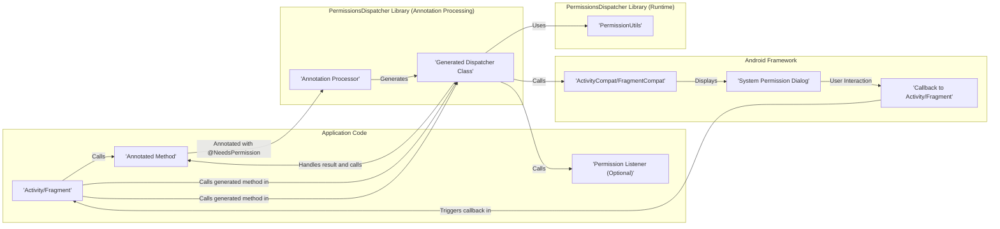

# Project Design Document: PermissionsDispatcher

**Version:** 1.1
**Date:** October 26, 2023
**Author:** AI Software Architect

## 1. Introduction

This document provides an enhanced design overview of the PermissionsDispatcher Android library, intended for use in threat modeling activities. It details the library's architecture, key components, and interaction patterns with the Android operating system and the application utilizing it. PermissionsDispatcher simplifies the management of Android runtime permissions by leveraging annotation processing to generate boilerplate code, thereby improving code readability and reducing manual implementation efforts.

## 2. Goals

*   Provide a clear and comprehensive description of the PermissionsDispatcher library's design and functionality.
*   Identify and elaborate on the core components and their specific responsibilities within the library.
*   Thoroughly describe the data flow and interaction sequences between the library, the host application, and the Android framework.
*   Offer sufficient technical detail to enable effective and targeted threat modeling exercises.

## 3. Non-Goals

*   Serve as a comprehensive code-level implementation guide or API reference.
*   Document every possible configuration option or obscure edge case.
*   Include performance benchmarks, optimization strategies, or detailed resource consumption analysis.

## 4. Architectural Overview

PermissionsDispatcher functions as a dual-faceted entity, comprising a compile-time annotation processor and a runtime library component. The fundamental principle involves using annotations to designate methods requiring specific runtime permissions. The annotation processor then automatically generates specialized "dispatcher" classes. These generated classes encapsulate the logic for checking permission states, initiating permission requests when necessary, and subsequently invoking the originally annotated methods or alternative methods based on the outcome of the permission request.

### 4.1. High-Level Architecture Diagram

### 4.2. Detailed Component Description

*   **Annotation Processor:** Executed during the application's compilation phase. It parses the application's source code, specifically looking for PermissionsDispatcher annotations such as `@NeedsPermission`, `@OnShowRationale`, `@OnPermissionDenied`, and `@OnNeverAskAgain`. Based on the presence and parameters of these annotations, it generates Java code for the corresponding dispatcher class. This generated code handles the permission request flow.
*   **Generated Dispatcher Class:**  A Java class automatically created by the annotation processor. This class acts as a proxy or intermediary. When a method annotated with `@NeedsPermission` is called, the call is redirected to the corresponding method in the dispatcher class. This class contains the logic to check if the required permissions are granted, and if not, to initiate the permission request process. The naming convention typically follows `<AnnotatedClassName>PermissionsDispatcher`.
*   **`PermissionUtils`:** A runtime utility class within the PermissionsDispatcher library. It provides static methods for checking the current permission state (granted or denied) for specific permissions. The generated dispatcher classes utilize these methods to determine whether to execute the annotated method directly or to request permissions first.
*   **Annotations:** These are the core mechanism for instructing the annotation processor.
    *   `@NeedsPermission(String... permissions)`: Applied to a method that requires one or more specified permissions. The annotation processor uses the provided permission strings to generate the permission checking and request logic.
    *   `@OnShowRationale(String... permissions)`:  Annotates a method that will be invoked if the system determines that a rationale for the requested permissions should be shown to the user before the actual permission dialog. This allows the application to explain why the permissions are necessary.
    *   `@OnPermissionDenied(String... permissions)`: Annotates a method that will be called if the user denies the permission request.
    *   `@OnNeverAskAgain(String... permissions)`: Annotates a method that will be called if the user denies the permission request and selects the "Never ask again" option.
*   **Permission Listener (Optional):** An interface that can be implemented by the Activity or Fragment to receive callbacks related to the permission request lifecycle. This provides a more structured way to handle permission results compared to relying solely on the annotated methods.

## 5. Data Flow and Interactions

The process of requesting and handling permissions using PermissionsDispatcher involves a specific sequence of interactions:

1. **Application Method Invocation:** The application code calls a method within an Activity or Fragment that has been annotated with `@NeedsPermission`.
2. **Redirection to Generated Dispatcher:** The call is intercepted and redirected to the corresponding method within the generated `<ClassName>PermissionsDispatcher` class.
3. **Permission State Check:** The dispatcher class utilizes the `PermissionUtils` class to check if all the permissions specified in the `@NeedsPermission` annotation are currently granted.
4. **Direct Method Execution (Permissions Granted):** If all required permissions are already granted, the dispatcher class directly invokes the original method annotated with `@NeedsPermission`.
5. **Initiate Permission Request (Permissions Not Granted):** If any of the required permissions are not granted, the dispatcher class initiates a permission request by calling `ActivityCompat.requestPermissions()` (for Activities) or `FragmentCompat.requestPermissions()` (for Fragments). This triggers the Android system's permission request flow.
6. **Rationale Display Logic (Optional):** If the Android system determines that a rationale should be presented to the user (e.g., the user has previously denied the permission), the method annotated with `@OnShowRationale` is invoked. The application can then display a custom explanation to the user.
7. **System Permission Dialog Display:** The Android operating system displays the standard permission request dialog to the user, prompting them to grant or deny the requested permissions.
8. **User Interaction and Callback:** The user interacts with the permission dialog, either granting or denying the permissions. This interaction results in a callback to the `onRequestPermissionsResult()` method of the Activity or Fragment.
9. **Dispatcher Result Handling:** The `onRequestPermissionsResult()` method in the Activity or Fragment is typically overridden to delegate the handling of the permission results back to the corresponding method within the generated dispatcher class.
10. **Outcome-Based Method Invocation:** Based on the results of the permission request (granted or denied), the dispatcher class invokes the appropriate annotated method:
    *   If all requested permissions are granted, the original method annotated with `@NeedsPermission` is executed.
    *   If any of the requested permissions are denied, the method annotated with `@OnPermissionDenied` is executed.
    *   If any of the requested permissions are denied with the "Never ask again" option selected, the method annotated with `@OnNeverAskAgain` is executed.
    *   If a `PermissionListener` is implemented, the corresponding methods within the listener are invoked to provide more granular feedback on the permission results.

## 6. Security Considerations (For Threat Modeling)

This section details potential security considerations relevant for threat modeling the PermissionsDispatcher library and applications utilizing it.

*   **Circumventing Permission Checks:** Attackers might attempt to bypass the PermissionsDispatcher's intended permission enforcement mechanisms. This could involve:
    *   **Direct Invocation of Annotated Methods:**  Bypassing the generated dispatcher and directly invoking methods annotated with `@NeedsPermission`, assuming the application logic within those methods doesn't perform its own permission checks.
    *   **Manipulation of Generated Code:** If the application is compromised, attackers could potentially modify the generated dispatcher classes to alter the permission checking logic or always return a "permissions granted" state.
    *   **Exploiting Android Framework Vulnerabilities:** While not directly a vulnerability in PermissionsDispatcher, weaknesses in the underlying Android permission framework could be exploited to grant permissions without user consent, thus circumventing the library's purpose.
*   **Data Handling in Callback Methods:** The methods annotated with `@OnShowRationale`, `@OnPermissionDenied`, and `@OnNeverAskAgain` might handle sensitive data or user input. Potential threats include:
    *   **Injection Attacks:** If these methods process external data without proper sanitization, they could be vulnerable to injection attacks (e.g., code injection if displaying HTML, SQL injection if interacting with a database).
    *   **Information Disclosure:**  Carelessly logging or displaying information within these methods could inadvertently expose sensitive data.
*   **Denial of Service through Repeated Permission Requests:** A malicious actor could potentially trigger repeated calls to methods requiring permissions, leading to a flood of system permission dialogs, effectively causing a denial of service to the user. This is more likely if the logic for requesting permissions is not properly rate-limited or controlled.
*   **Improper Error Handling and State Management:** If the application logic within the permission callback methods doesn't handle denied permissions gracefully, it could lead to unexpected application behavior or security vulnerabilities. For example:
    *   **Application Crashes:**  Attempting to access resources requiring a denied permission without proper checks could lead to crashes.
    *   **Security State Confusion:**  Inconsistent handling of permission states could lead to the application operating under incorrect assumptions about its access rights.
*   **Vulnerabilities in the Annotation Processing Mechanism:** Although less probable, vulnerabilities within the annotation processing framework itself could be exploited. This is a broader concern for any library relying on annotation processing.
*   **Dependency Chain Vulnerabilities:** PermissionsDispatcher might rely on other third-party libraries. Vulnerabilities in these dependencies could indirectly introduce security risks to applications using PermissionsDispatcher. It's crucial to keep dependencies updated.
*   **Side-Channel Information Leakage:** The timing of callbacks or the specific methods invoked based on permission outcomes could potentially leak information about the user's permission decisions, although this is a less likely and more complex attack vector.

## 7. Future Considerations

*   Exploring integration with more modern Android permission handling APIs and best practices.
*   Adding support for more granular control over permission request flows and custom permission dialogs.
*   Improving the robustness and security of the annotation processing logic.
*   Providing more comprehensive logging and debugging capabilities for permission-related issues.

This revised document provides a more detailed and nuanced understanding of the PermissionsDispatcher library's design, specifically tailored for threat modeling purposes. It highlights potential areas of security concern and encourages a proactive approach to identifying and mitigating risks associated with its use.