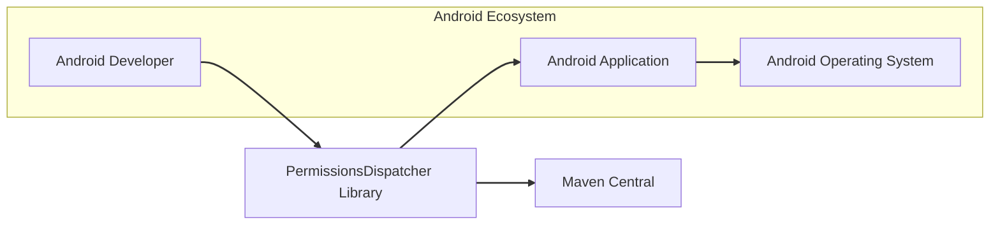
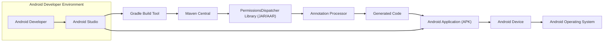
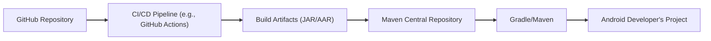

# BUSINESS POSTURE

This project, PermissionsDispatcher, is an Android library designed to simplify the process of requesting runtime permissions in Android applications.

- Business Priorities and Goals:
  - Simplify Android development by reducing boilerplate code related to runtime permissions.
  - Improve developer productivity by providing an easy-to-use and efficient way to handle permissions.
  - Enhance code readability and maintainability in Android projects dealing with permissions.
  - Reduce potential errors and inconsistencies in permission handling logic across different Android applications.

- Most Important Business Risks:
  - Risk of developer adoption failure if the library is not perceived as easy to use, reliable, or well-documented.
  - Risk of security vulnerabilities introduced by the library itself, potentially leading to permission bypass or misuse in applications using it.
  - Risk of compatibility issues with different Android versions or devices, leading to application crashes or unexpected behavior.
  - Risk of supply chain attacks if dependencies of the library are compromised, potentially injecting malicious code into applications using the library.

# SECURITY POSTURE

- Security Controls:
  - security control: Code hosted on GitHub, providing version control and transparency. (Implemented: GitHub Repository)
  - security control: Open-source project, allowing community review and contributions. (Implemented: Open Source Nature)
  - security control: Distributed via Maven Central, leveraging a widely used and trusted repository for dependency management. (Implemented: Maven Central Deployment)

- Accepted Risks:
  - accepted risk: Reliance on community contributions for security vulnerability identification and patching.
  - accepted risk: Potential for vulnerabilities in dependencies used by the library.
  - accepted risk: Risk of improper usage by developers integrating the library into their applications, leading to security issues in those applications (though not directly in the library itself).

- Recommended Security Controls:
  - security control: Implement automated dependency scanning to identify and address vulnerabilities in third-party libraries used by PermissionsDispatcher.
  - security control: Integrate static application security testing (SAST) tools into the build process to automatically detect potential code-level security flaws.
  - security control: Establish a clear process for reporting and handling security vulnerabilities, including a security policy and contact information.
  - security control: Conduct regular code reviews, focusing on security aspects, by experienced developers.
  - security control: Implement a secure build pipeline to ensure the integrity and authenticity of the released artifacts.

- Security Requirements:
  - Authentication: Not directly applicable to a library. PermissionsDispatcher itself does not handle user authentication. Applications using the library will manage their own authentication mechanisms.
  - Authorization: Not directly applicable to a library. PermissionsDispatcher simplifies Android permission requests, which are part of the Android OS authorization model. The library itself does not implement authorization logic.
  - Input Validation: Relevant for the library's API. Ensure that input parameters to the library's methods are validated to prevent unexpected behavior or potential vulnerabilities. This includes validating annotations and generated code parameters.
  - Cryptography: Not directly applicable to the core functionality of PermissionsDispatcher. If cryptography is used in future features or dependencies, it should be implemented securely following best practices.

# DESIGN

## C4 CONTEXT

- C4 Context Elements:
  - - Name: Android Developer
    - Type: Person
    - Description: Developers who build Android applications and use PermissionsDispatcher library to simplify permission handling.
    - Responsibilities: Integrate PermissionsDispatcher library into Android applications, use the library correctly to request and handle permissions.
    - Security controls: Responsible for securely using the library and implementing application-level security controls.

  - - Name: PermissionsDispatcher Library
    - Type: Software System
    - Description: An Android library that simplifies runtime permission requests using annotation processing.
    - Responsibilities: Generate code to handle Android runtime permissions, provide a simplified API for developers to request permissions.
    - Security controls: Code hosted on GitHub, open-source, distributed via Maven Central, recommended security controls as listed in SECURITY POSTURE section.

  - - Name: Android Application
    - Type: Software System
    - Description: Android applications that integrate and use the PermissionsDispatcher library.
    - Responsibilities: Utilize the generated code from PermissionsDispatcher to request and handle runtime permissions, implement application-specific logic related to permissions.
    - Security controls: Application-level security controls, including secure coding practices, input validation, authentication, authorization, and data protection.

  - - Name: Android Operating System
    - Type: Software System
    - Description: The underlying Android operating system that manages permissions and provides the runtime environment for Android applications.
    - Responsibilities: Enforce permission policies, manage runtime permissions, provide APIs for applications to request and check permissions.
    - Security controls: Operating system level security controls, including permission model, sandboxing, and security updates.

  - - Name: Maven Central
    - Type: Software System
    - Description: A central repository for Maven and Gradle dependencies, used to distribute the PermissionsDispatcher library.
    - Responsibilities: Host and distribute the PermissionsDispatcher library, ensure availability and integrity of the library.
    - Security controls: Repository level security controls, including access control, integrity checks, and vulnerability scanning.

## C4 CONTAINER

- C4 Container Elements:
  - - Name: Android Developer
    - Type: Person
    - Description: Developers who use Android Studio and Gradle to build Android applications with PermissionsDispatcher.
    - Responsibilities: Write application code, integrate PermissionsDispatcher, build and test applications.
    - Security controls: Secure development practices, code review, using trusted development tools.

  - - Name: Android Studio
    - Type: Development Tool
    - Description: The official Integrated Development Environment (IDE) for Android app development.
    - Responsibilities: Provide a development environment for writing, debugging, and building Android applications.
    - Security controls: IDE level security controls, plugin security, secure project management.

  - - Name: PermissionsDispatcher Library (JAR/AAR)
    - Type: Library
    - Description: The compiled PermissionsDispatcher library distributed as a JAR or AAR file.
    - Responsibilities: Provide annotation processing and runtime components for simplified permission handling.
    - Security controls: Code hosted on GitHub, open-source, distributed via Maven Central, recommended security controls as listed in SECURITY POSTURE section, build process security.

  - - Name: Annotation Processor
    - Type: Software Component
    - Description: The part of PermissionsDispatcher that processes annotations during compilation and generates permission handling code.
    - Responsibilities: Generate efficient and correct permission request code based on annotations.
    - Security controls: Input validation of annotations, secure code generation logic, SAST during build.

  - - Name: Generated Code
    - Type: Code Artifact
    - Description: The Java/Kotlin code generated by the Annotation Processor, included in the final Android application.
    - Responsibilities: Implement permission request logic within the application.
    - Security controls: Code review of generated code, SAST on the application code including generated parts.

  - - Name: Maven Central
    - Type: Artifact Repository
    - Description: Repository for hosting and distributing Java/Android libraries, including PermissionsDispatcher.
    - Responsibilities: Securely host and distribute the library, ensure integrity and availability.
    - Security controls: Repository security controls, access control, integrity checks, vulnerability scanning.

  - - Name: Gradle Build Tool
    - Type: Build Tool
    - Description: A build automation system used for Android projects, responsible for compiling, packaging, and deploying applications.
    - Responsibilities: Manage dependencies, compile code, run annotation processors, package the application.
    - Security controls: Build tool security, secure dependency management, build script security, integration with security scanning tools.

  - - Name: Android Application (APK)
    - Type: Application Package
    - Description: The final packaged Android application (APK file) that includes the PermissionsDispatcher library and generated code.
    - Responsibilities: Execute on Android devices, request and handle permissions at runtime.
    - Security controls: Application level security controls, runtime permission handling, secure coding practices.

  - - Name: Android Device
    - Type: Device
    - Description: Physical or virtual Android device where the application is installed and run.
    - Responsibilities: Execute the Android application, enforce OS level permissions.
    - Security controls: Device security controls, OS security, user permissions.

  - - Name: Android Operating System
    - Type: Operating System
    - Description: The Android OS running on the device, managing permissions and application execution.
    - Responsibilities: Manage runtime permissions, provide APIs for permission requests, enforce security policies.
    - Security controls: OS level security controls, permission model, sandboxing, security updates.

## DEPLOYMENT

PermissionsDispatcher library itself is not "deployed" in a traditional sense like a web application. It is distributed as a library to be included in other Android applications. The "deployment" context here refers to how the library is made available to Android developers for use in their projects.

Deployment Architecture: Library Distribution via Maven Central

- Deployment Elements:
  - - Name: GitHub Repository
    - Type: Code Repository
    - Description: Hosts the source code of the PermissionsDispatcher library.
    - Responsibilities: Version control, source code management, collaboration.
    - Security controls: Access control, branch protection, code review, vulnerability scanning (GitHub Security Features).

  - - Name: CI/CD Pipeline (e.g., GitHub Actions)
    - Type: Automation System
    - Description: Automates the build, test, and release process of the library.
    - Responsibilities: Build the library, run tests, package artifacts, publish to Maven Central.
    - Security controls: Secure pipeline configuration, access control, secret management, build environment security, artifact signing.

  - - Name: Build Artifacts (JAR/AAR)
    - Type: Software Artifact
    - Description: Compiled and packaged library files (JAR for Java, AAR for Android) ready for distribution.
    - Responsibilities: Contain the compiled library code.
    - Security controls: Artifact signing, integrity checks, storage security.

  - - Name: Maven Central Repository
    - Type: Artifact Repository
    - Description: Public repository for hosting and distributing Java/Android libraries.
    - Responsibilities: Host and distribute the library artifacts, ensure availability and integrity.
    - Security controls: Repository security controls, access control, integrity checks, vulnerability scanning.

  - - Name: Android Developer's Project
    - Type: Development Project
    - Description: Android application projects where developers integrate the PermissionsDispatcher library.
    - Responsibilities: Consume the library, integrate it into their applications.
    - Security controls: Project level security controls, dependency management, secure coding practices.

  - - Name: Gradle/Maven
    - Type: Dependency Management Tool
    - Description: Build and dependency management tools used by Android developers to include the library in their projects.
    - Responsibilities: Download and manage library dependencies, integrate them into the build process.
    - Security controls: Dependency management security, vulnerability scanning of dependencies, secure configuration.

## BUILD

- Build Elements:
  - - Name: Developer
    - Type: Person
    - Description: Developers who write and commit code changes to the PermissionsDispatcher project.
    - Responsibilities: Write code, commit changes, participate in code reviews.
    - Security controls: Secure coding practices, code review, access control to repository.

  - - Name: Code Changes (GitHub)
    - Type: Code Repository
    - Description: Code modifications pushed to the GitHub repository, triggering the build process.
    - Responsibilities: Store code changes, trigger CI/CD pipeline.
    - Security controls: Branch protection, access control, commit signing.

  - - Name: GitHub Actions Workflow
    - Type: CI/CD System
    - Description: Automated workflow defined in GitHub Actions to build, test, and release the library.
    - Responsibilities: Automate build process, run tests, perform security checks, publish artifacts.
    - Security controls: Secure workflow definition, access control, secret management, secure build environment.

  - - Name: Build Environment
    - Type: Compute Environment
    - Description: The environment where the build process is executed (e.g., GitHub Actions runners).
    - Responsibilities: Provide resources for building and testing the library.
    - Security controls: Secure build environment, hardened images, access control, isolation.

  - - Name: Code Compilation & Annotation Processing
    - Type: Build Step
    - Description: Compiling the Java/Kotlin code and running the annotation processor to generate code.
    - Responsibilities: Compile source code, generate permission handling code.
    - Security controls: Secure compiler and annotation processor, input validation during processing.

  - - Name: Testing (Unit & Integration)
    - Type: Build Step
    - Description: Running automated unit and integration tests to verify the functionality of the library.
    - Responsibilities: Ensure code quality and functionality, detect regressions.
    - Security controls: Secure testing environment, comprehensive test coverage, security-focused tests.

  - - Name: SAST & Dependency Scanning
    - Type: Security Check
    - Description: Static Application Security Testing (SAST) and dependency vulnerability scanning performed during the build.
    - Responsibilities: Identify potential code-level vulnerabilities and vulnerable dependencies.
    - Security controls: Integration of SAST tools, dependency scanning tools, automated reporting of findings.

  - - Name: Build Artifacts (JAR/AAR)
    - Type: Software Artifact
    - Description: Compiled and packaged library files resulting from the build process.
    - Responsibilities: Contain the compiled library code.
    - Security controls: Artifact integrity checks, secure storage.

  - - Name: Artifact Signing
    - Type: Security Step
    - Description: Signing the build artifacts to ensure authenticity and integrity.
    - Responsibilities: Provide assurance of artifact origin and prevent tampering.
    - Security controls: Secure key management, signing process integrity.

  - - Name: Maven Central Publishing
    - Type: Release Step
    - Description: Publishing the signed build artifacts to Maven Central repository.
    - Responsibilities: Make the library available to developers via Maven Central.
    - Security controls: Secure publishing process, access control to Maven Central, repository security.

  - - Name: Released Library
    - Type: Software Artifact
    - Description: The final released version of the PermissionsDispatcher library available on Maven Central.
    - Responsibilities: Provide a stable and secure library for developers to use.
    - Security controls: All security controls implemented throughout the build and release process.

# RISK ASSESSMENT

- Critical Business Processes:
  - Developer productivity and efficiency in Android application development related to permission handling.
  - Correct and consistent implementation of runtime permissions in Android applications using the library.
  - Maintaining the reputation and trust in the PermissionsDispatcher library as a reliable and secure solution.

- Data to Protect and Sensitivity:
  - Source code of the PermissionsDispatcher library (Intellectual Property): High sensitivity.
  - Build artifacts (JAR/AAR files): Medium sensitivity (integrity and availability are important).
  - Developer credentials and secrets used in the build and release process: High sensitivity.
  - Potential indirect impact on user data privacy if applications using the library mishandle permissions due to library flaws (though the library itself doesn't directly handle user data). Low to Medium indirect sensitivity.

# QUESTIONS & ASSUMPTIONS

- Questions:
  - What is the intended scope of security for this design document? Is it primarily focused on the library itself, or also on the applications that use it? (Assumption: Primarily focused on the library and its build/release process, with considerations for usage in applications).
  - Are there any specific compliance requirements or security standards that the PermissionsDispatcher project needs to adhere to? (Assumption: General secure development best practices and open-source community standards).
  - What is the expected level of security maturity of developers who will be using this library? (Assumption: Varied levels, library should be easy to use securely by developers with different security expertise).
  - Are there any specific threat actors or attack vectors that are of particular concern for this project? (Assumption: General threats to open-source libraries, including supply chain attacks, code vulnerabilities, and misuse).

- Assumptions:
  - BUSINESS POSTURE: The primary business goal is to provide a useful and reliable library that simplifies Android development and is widely adopted by the Android developer community.
  - SECURITY POSTURE: The project aims to follow secure development practices and release a library that is reasonably secure. Security is a priority, but balanced with usability and development effort.
  - DESIGN: The current architecture is based on standard Android library development and distribution practices using GitHub, Gradle, Maven Central, and CI/CD. The design is relatively simple and focused on providing a specific utility.