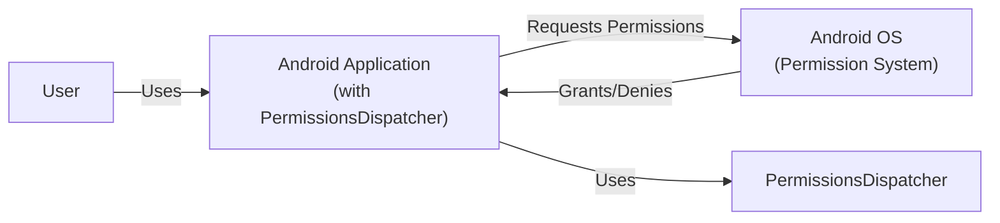
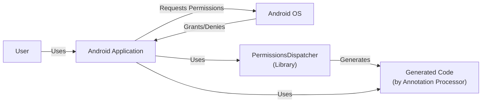
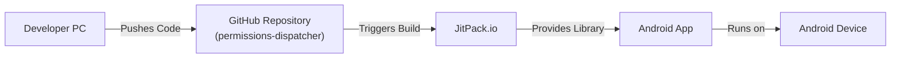
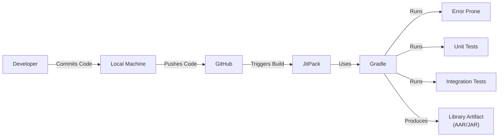

Okay, let's create a design document for the PermissionsDispatcher project.

# BUSINESS POSTURE

PermissionsDispatcher aims to simplify runtime permission handling in Android applications. The core business priorities are:

*   Reduce Developer Boilerplate: Minimize the amount of code developers need to write to handle runtime permissions, making development faster and less error-prone.
*   Improve Code Readability: Make permission handling logic easier to understand and maintain.
*   Enhance Application Stability: Reduce the risk of crashes and unexpected behavior related to permission handling.
*   Increase Developer Adoption: Become a widely used and trusted library for Android permission management.

Business Risks:

*   Security Vulnerabilities: Flaws in the library could lead to applications requesting and being granted permissions they shouldn't have, potentially exposing sensitive user data or functionality.
*   Compatibility Issues: The library might not work correctly with all Android versions or device configurations, leading to application malfunctions.
*   Maintenance Overhead: Keeping the library up-to-date with changes in the Android permission model and addressing user-reported issues could require significant effort.
*   Lack of Adoption: If developers don't find the library useful or trustworthy, it won't be widely used, diminishing its impact.
*   Reputation Damage: Security vulnerabilities or major bugs could damage the reputation of the library and its maintainers.

# SECURITY POSTURE

Existing Security Controls:

*   security control: Code Reviews: The project uses pull requests on GitHub, implying that code reviews are part of the development process. (Inferred from the GitHub repository structure).
*   security control: Static Analysis: The project includes configuration for Error Prone, a static analysis tool for Java. (Found in `build.gradle` and related files).
*   security control: Tests: The project has unit and integration tests. (Found in `library/src/test` and `sample`).
*   security control: Minimal Permissions: The library itself does not request any special permissions. (Inferred from the library's functionality).
*   security control: API Design: The library's API encourages developers to handle permission denials gracefully. (Inferred from the library's design).

Accepted Risks:

*   accepted risk: Reliance on Android Framework: The library's security fundamentally relies on the correct functioning of the Android runtime permission system.
*   accepted risk: Third-Party Dependencies: The library may have dependencies on other libraries, which could introduce their own security vulnerabilities.

Recommended Security Controls:

*   security control: Dynamic Analysis: Implement dynamic analysis (e.g., fuzzing) to test the library's behavior with unexpected inputs.
*   security control: Dependency Scanning: Regularly scan dependencies for known vulnerabilities.
*   security control: Security Audits: Conduct periodic security audits by independent experts.
*   security control: Supply Chain Security: Implement measures to ensure the integrity of the build and release process (e.g., signing releases).

Security Requirements:

*   Authentication: Not directly applicable, as the library deals with Android permissions, not user authentication.
*   Authorization: The library's primary function is to facilitate authorization (permission checks) within the Android framework. It should ensure that applications only request and receive the permissions they need.
*   Input Validation: The library should validate inputs to its API methods to prevent unexpected behavior or vulnerabilities. For example, it should check for null values or invalid permission names.
*   Cryptography: Not directly applicable, as the library doesn't handle sensitive data encryption.

# DESIGN

## C4 CONTEXT

Context Diagram Elements:

*   Element:
    *   Name: User
    *   Type: Person
    *   Description: The end-user of the Android application.
    *   Responsibilities: Interacts with the application, triggering actions that may require runtime permissions.
    *   Security controls: N/A (External to the system)

*   Element:
    *   Name: Android Application (with PermissionsDispatcher)
    *   Type: Software System
    *   Description: An Android application that uses the PermissionsDispatcher library to handle runtime permissions.
    *   Responsibilities: Provides functionality to the user, requests necessary permissions, handles permission results.
    *   Security controls: Implements PermissionsDispatcher for permission handling, follows secure coding practices.

*   Element:
    *   Name: Android OS (Permission System)
    *   Type: Software System
    *   Description: The Android operating system's built-in permission management system.
    *   Responsibilities: Enforces permission checks, displays permission dialogs to the user, manages granted permissions.
    *   Security controls: Android OS security mechanisms, sandboxing, permission model.

*   Element:
    *   Name: PermissionsDispatcher
    *   Type: Library
    *   Description: Library that simplifies permission handling.
    *   Responsibilities: Provides API for requesting permissions, generates boilerplate code.
    *   Security controls: Code Reviews, Static Analysis, Tests.

## C4 CONTAINER

Container Diagram Elements:

*   Element:
    *   Name: User
    *   Type: Person
    *   Description: The end-user of the Android application.
    *   Responsibilities: Interacts with the application.
    *   Security controls: N/A

*   Element:
    *   Name: Android Application
    *   Type: Mobile App
    *   Description: The Android application built by the developer using PermissionsDispatcher.
    *   Responsibilities: Provides application features, handles user interactions, requests permissions.
    *   Security controls: Secure coding practices, input validation, proper permission handling.

*   Element:
    *   Name: Android OS
    *   Type: Operating System
    *   Description: The Android operating system.
    *   Responsibilities: Manages system resources, enforces permissions, provides core services.
    *   Security controls: Android security model, sandboxing, permission enforcement.

*   Element:
    *   Name: PermissionsDispatcher (Library)
    *   Type: Library
    *   Description: The PermissionsDispatcher library code.
    *   Responsibilities: Provides annotations and runtime support for permission handling.
    *   Security controls: Code reviews, static analysis, unit tests.

*   Element:
    *   Name: Generated Code (by Annotation Processor)
    *   Type: Code
    *   Description: Code generated by the PermissionsDispatcher annotation processor.
    *   Responsibilities: Handles the boilerplate code for requesting permissions and handling results.
    *   Security controls: Inherits security controls from the PermissionsDispatcher library and the Android application.

## DEPLOYMENT

Possible Deployment Solutions:

1.  JitPack: Developers can include the library directly from JitPack in their `build.gradle` file.
2.  Maven Central: The library can be published to Maven Central, a common repository for Java libraries.
3.  Local Build: Developers can clone the repository and build the library locally.

Chosen Solution (JitPack):

Deployment Diagram Elements:

*   Element:
    *   Name: Developer PC
    *   Type: Workstation
    *   Description: The developer's computer used for coding and pushing changes to the repository.
    *   Responsibilities: Writing code, committing changes, pushing to GitHub.
    *   Security controls: Developer workstation security best practices.

*   Element:
    *   Name: GitHub Repository (permissions-dispatcher)
    *   Type: Code Repository
    *   Description: The Git repository hosted on GitHub containing the PermissionsDispatcher source code.
    *   Responsibilities: Version control, code storage, collaboration.
    *   Security controls: GitHub access controls, branch protection rules.

*   Element:
    *   Name: JitPack.io
    *   Type: Build Service / Repository
    *   Description: A build service and Maven repository that builds libraries directly from Git repositories.
    *   Responsibilities: Building the library from the GitHub repository, providing it as a dependency.
    *   Security controls: JitPack's internal security measures.

*   Element:
    *   Name: Android Device
    *   Type: Mobile Device
    *   Description: The physical Android device where the application is installed and run.
    *   Responsibilities: Running the Android application.
    *   Security controls: Android device security features.

*   Element:
    *   Name: Android App
    *   Type: Mobile Application
    *   Description: Application that uses PermissionsDispatcher.
    *   Responsibilities: Provides application features, handles user interactions, requests permissions.
    *   Security controls: Secure coding practices, input validation, proper permission handling.

## BUILD

Build Process Description:

1.  Developers write code and commit it to their local Git repository.
2.  Changes are pushed to the central GitHub repository.
3.  JitPack is configured to build the project on demand when a developer includes it as a dependency in their project.
4.  Gradle is used as the build tool.
5.  During the build process:
    *   Error Prone (static analysis) is run to identify potential bugs and code quality issues.
    *   Unit tests are executed to verify the correctness of individual components.
    *   Integration tests are run to test the interaction between different parts of the library.
6.  If all checks pass, Gradle produces the library artifact (AAR or JAR file).
7.  JitPack makes the artifact available for download.

Security Controls in Build Process:

*   security control: Static Analysis (Error Prone): Helps identify potential vulnerabilities and code quality issues early in the development process.
*   security control: Unit and Integration Tests: Ensure that the library functions as expected and help prevent regressions.
*   security control: Build Automation (Gradle): Provides a consistent and reproducible build process.
*   security control: Dependency Management (Gradle): Tracks and manages dependencies, allowing for easier identification and mitigation of vulnerable dependencies (although explicit scanning is recommended).

# RISK ASSESSMENT

Critical Business Processes:

*   Application Functionality: The library must enable applications to function correctly by obtaining necessary runtime permissions.
*   Developer Workflow: The library should integrate seamlessly into the developer's workflow, making permission handling easier, not harder.

Data Protection:

*   Sensitivity: The library itself does not directly handle sensitive user data. However, it plays a crucial role in enabling applications to access such data. Therefore, the *confidentiality* and *integrity* of permission requests and responses are paramount. Incorrect permission handling could lead to unauthorized access to sensitive data (contacts, location, storage, etc.) or functionality (camera, microphone).

# QUESTIONS & ASSUMPTIONS

Questions:

*   Are there any specific compliance requirements (e.g., GDPR, CCPA) that the library needs to consider?
*   What is the expected level of support and maintenance for the library?
*   Are there any plans to extend the library's functionality beyond basic permission handling?
*   What is the target audience for this library (beginner, intermediate, or advanced Android developers)?

Assumptions:

*   BUSINESS POSTURE: The primary goal is to simplify runtime permission handling for Android developers. The library is intended to be open-source and freely available.
*   SECURITY POSTURE: Developers using the library are responsible for implementing appropriate security measures within their own applications. The library is assumed to be used in conjunction with secure coding practices.
*   DESIGN: The library will be primarily distributed through JitPack. The build process will rely on Gradle and standard Android testing frameworks. The library's design prioritizes ease of use and minimal boilerplate.