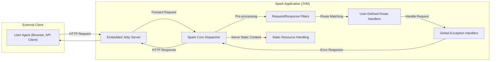
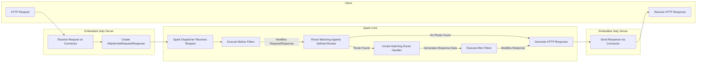

# Project Design Document: Spark Micro Web Framework

**Version:** 1.1
**Date:** October 26, 2023
**Author:** AI Software Architect

## 1. Introduction

This document provides an enhanced design overview of the Spark micro web framework (https://github.com/perwendel/spark). The purpose of this document is to clearly articulate the architecture, core components, and request processing flow within Spark, specifically to facilitate comprehensive threat modeling activities.

## 2. Goals

*   Deliver a refined and more detailed architectural description of the Spark framework.
*   Clearly identify and explain the responsibilities and interactions of key components.
*   Provide an in-depth description of the typical HTTP request lifecycle within Spark.
*   Explicitly highlight potential security vulnerabilities and attack surfaces to inform threat modeling.
*   Serve as a definitive reference document for security assessments and the development of mitigation strategies.

## 3. Non-Goals

*   In-depth, line-by-line code analysis of specific Spark functionalities.
*   Performance evaluation, benchmarking, or optimization recommendations.
*   Comparative analysis against alternative web frameworks or technologies.
*   Detailed instructions for deployment infrastructure or specific environment configurations.

## 4. High-Level Architecture

Spark employs a straightforward, single-process architecture within a Java Virtual Machine (JVM). It leverages an embedded Jetty web server to manage incoming HTTP requests.

*   **External Client:** Represents any external entity, such as a web browser or an API client, initiating communication with the Spark application via HTTP requests.
*   **Embedded Jetty Server:** The integrated web server within the Spark application. It listens on a designated port, accepts incoming HTTP connections, and manages request lifecycle.
*   **Spark Core Dispatcher:** The central component responsible for receiving requests from Jetty, managing the filter chain, performing route matching, and invoking the appropriate handler.
*   **User-Defined Route Handlers:**  Code blocks defined by the application developer that are associated with specific HTTP methods and URL paths. These handlers contain the core business logic for processing requests.
*   **Request/Response Filters:** Interceptors that execute before and after route handlers. They enable cross-cutting concerns like authentication, authorization, logging, and request/response manipulation.
*   **Global Exception Handlers:** Components that catch exceptions thrown during request processing, allowing for centralized error handling and custom error responses.
*   **Static Resource Handling:** Functionality to directly serve static files such as HTML, CSS, JavaScript, and images from a designated directory.

## 5. Component Design

This section provides a more detailed look at the key components within the Spark framework and their responsibilities.

*   **`spark.Spark` Class:**
    *   Serves as the primary entry point for configuring and launching a Spark application.
    *   Offers static methods to define routes (e.g., `get()`, `post()`), filters (`before()`, `after()`), exception handlers (`exception()`), and other application settings.
    *   Manages the lifecycle of the embedded Jetty server, including starting and stopping it.

*   **`Route` Interface and Concrete Implementations:**
    *   Represents a binding between an HTTP method, a URL path pattern, and a corresponding handler function.
    *   Concrete implementations (e.g., within Spark's internal structure) store the path, HTTP verb, and a reference to the code to be executed when the route is matched.

*   **`Filter` Interface and Concrete Implementations:**
    *   Enables the implementation of pre-processing and post-processing logic for requests.
    *   Implementations contain code that is executed either before a matching route handler is invoked (`before` filters) or after the handler has completed execution (`after` filters).
    *   Filters are executed in a specific order based on their declaration.

*   **`ExceptionHandler` Interface and Concrete Implementations:**
    *   Provides a mechanism for handling exceptions that occur during request processing.
    *   Implementations define the logic to be executed when a specific type of exception is thrown, allowing for custom error responses, logging, and other error handling tasks.

*   **`Request` and `Response` Objects:**
    *   Wrapper objects that provide a simplified and Spark-specific interface to the underlying Jetty `HttpServletRequest` and `HttpServletResponse` objects.
    *   Offer convenient methods for accessing request parameters, headers, and body, as well as for setting response status codes, headers, and body content.

*   **`TemplateEngine` Interface and Implementations (e.g., `VelocityTemplateEngine`, `FreemarkerTemplateEngine`):**
    *   Abstracts the process of rendering dynamic web content using various templating libraries.
    *   Allows developers to use different templating engines by implementing this interface, promoting flexibility and separation of concerns.

*   **Embedded Jetty Server Components:**
    *   **`Server`:** The core Jetty server instance responsible for managing connectors and handlers.
    *   **`Connector` (e.g., `ServerConnector`):**  Handles accepting incoming connections on a specific port and protocol (typically HTTP/1.1 or HTTP/2).
    *   **`Handler` (e.g., `ServletContextHandler`):** Processes incoming requests and dispatches them to the appropriate application logic. Spark's internal request handling integrates as a custom handler within Jetty.

## 6. Data Flow: Detailed Request Lifecycle

This section elaborates on the step-by-step flow of an HTTP request through the Spark application.

1. **HTTP Request:** An external client initiates an HTTP request targeting the Spark application.
2. **Receive Request on Connector:** Jetty's connector component receives the incoming request on the configured port.
3. **Create HttpServletRequest/Response:** Jetty creates standard `HttpServletRequest` and `HttpServletResponse` objects to represent the incoming request and the future response.
4. **Spark Dispatcher Receives Request:** Spark's core dispatcher receives control along with the `HttpServletRequest` and `HttpServletResponse` objects.
5. **Execute Before Filters:**  All registered "before" filters are executed sequentially. These filters can inspect or modify the request and response, perform authentication/authorization checks, or even halt further processing.
6. **Route Matching Against Defined Routes:** Spark attempts to match the request's HTTP method and URL path against the routes defined by the application developer.
7. **Invoke Matching Route Handler:** If a matching route is found, the associated route handler function is executed. This is where the application's core business logic resides. If no matching route is found, Spark typically proceeds to generate a "404 Not Found" response (handled in step I).
8. **Execute After Filters:** After the route handler has executed (or if no route was found), all registered "after" filters are executed in reverse order of their registration. These filters can further modify the response before it's sent to the client.
9. **Generate HTTP Response:** Based on the output of the route handler and any modifications by the "after" filters, Spark constructs the final HTTP response, including status code, headers, and body.
10. **Send Response via Connector:** Jetty's connector component sends the generated HTTP response back to the client.
11. **Receive HTTP Response:** The client receives the HTTP response from the Spark application.

*   **Exception Handling Flow:** If an exception is thrown during any stage within the Spark Core (filters or route handlers), the normal flow is interrupted. Spark's exception handling mechanism will then search for a matching `ExceptionHandler` based on the exception type. If a handler is found, it's invoked to generate an error response. If no specific handler is found, Jetty's default error handling will typically produce a generic error response.

## 7. Security Considerations and Potential Vulnerabilities

This section outlines potential security concerns and attack surfaces within the Spark framework, crucial for effective threat modeling.

*   **Input Validation Vulnerabilities:**
    *   **SQL Injection:** If user-provided input is directly incorporated into SQL queries without proper sanitization or parameterized queries.
    *   **Cross-Site Scripting (XSS):** If user input is reflected in HTML output without proper encoding, allowing malicious scripts to be injected and executed in other users' browsers.
    *   **Command Injection:** If user input is used to construct and execute system commands without proper sanitization.
    *   **Path Traversal:** If user input is used to construct file paths without validation, potentially allowing access to arbitrary files on the server.

*   **Authentication and Authorization Weaknesses:**
    *   **Missing Authentication:** Publicly accessible endpoints that should require authentication.
    *   **Weak Authentication Schemes:** Use of easily guessable credentials or insecure authentication protocols.
    *   **Inadequate Authorization:** Users having access to resources or functionalities beyond their intended privileges.
    *   **Session Management Issues:** Session fixation, session hijacking due to insecure session cookies, or predictable session IDs.

*   **Cross-Site Request Forgery (CSRF):**  Vulnerability allowing attackers to induce logged-in users to perform unintended actions on the web application.

*   **Security Header Misconfiguration:**
    *   **Missing `Content-Security-Policy` (CSP):**  Failure to restrict the sources from which the browser is allowed to load resources, increasing the risk of XSS.
    *   **Missing `Strict-Transport-Security` (HSTS):**  Not enforcing HTTPS connections, leaving users vulnerable to man-in-the-middle attacks.
    *   **Incorrect `X-Frame-Options`:** Allowing the application to be embedded in iframes on other domains, potentially leading to clickjacking attacks.

*   **Dependency Vulnerabilities:**  Using outdated or vulnerable versions of Spark dependencies (including Jetty and other libraries) that may contain known security flaws.

*   **Static Resource Exposure:**  Improper configuration allowing access to sensitive files or directories through static file handling.

*   **Verbose Error Handling:**  Displaying detailed error messages in production environments, potentially revealing sensitive information about the application's internal workings.

*   **Denial of Service (DoS) Attacks:**
    *   **Lack of Rate Limiting:**  Susceptibility to attacks that overwhelm the server with excessive requests.
    *   **Resource Exhaustion:**  Vulnerabilities that allow attackers to consume excessive server resources (CPU, memory, network).

*   **Template Engine Vulnerabilities (Server-Side Template Injection - SSTI):**  If user input is directly embedded into templates without proper sanitization, attackers can potentially execute arbitrary code on the server.

## 8. Deployment Considerations and Security Implications

The deployment environment significantly impacts the security posture of a Spark application.

*   **Standalone JAR Execution:**  Requires careful consideration of the underlying operating system and JVM security. Exposing the application directly to the internet without a reverse proxy can increase attack surface.
*   **Containerization (Docker):**  Offers isolation and consistency but requires securing the container image and the container runtime environment. Vulnerabilities in the base image or misconfigurations in the Dockerfile can introduce risks.
*   **Cloud Platforms (AWS, Azure, GCP):**  Leveraging cloud-provided security services (e.g., firewalls, load balancers, WAFs) is crucial. Proper configuration of network access controls and identity and access management (IAM) is essential.
*   **Reverse Proxies (Nginx, Apache):**  Recommended for production deployments to handle SSL termination, load balancing, and provide an additional layer of security by filtering malicious requests and implementing security headers.

## 9. Future Considerations

*   **Enhanced Security Guidance:**  Developing more comprehensive documentation and best practices for secure Spark application development.
*   **Security-Focused Middleware:**  Exploring the development or integration of built-in middleware components to address common security concerns (e.g., CSRF protection, security headers).
*   **Improved Dependency Management and Security Scanning:**  Providing tools or recommendations for managing dependencies and identifying potential vulnerabilities.
*   **Regular Security Audits:**  Encouraging and facilitating regular security audits of the Spark framework itself.

This improved design document provides a more detailed and security-focused overview of the Spark micro web framework, making it a more effective resource for threat modeling and security analysis.
