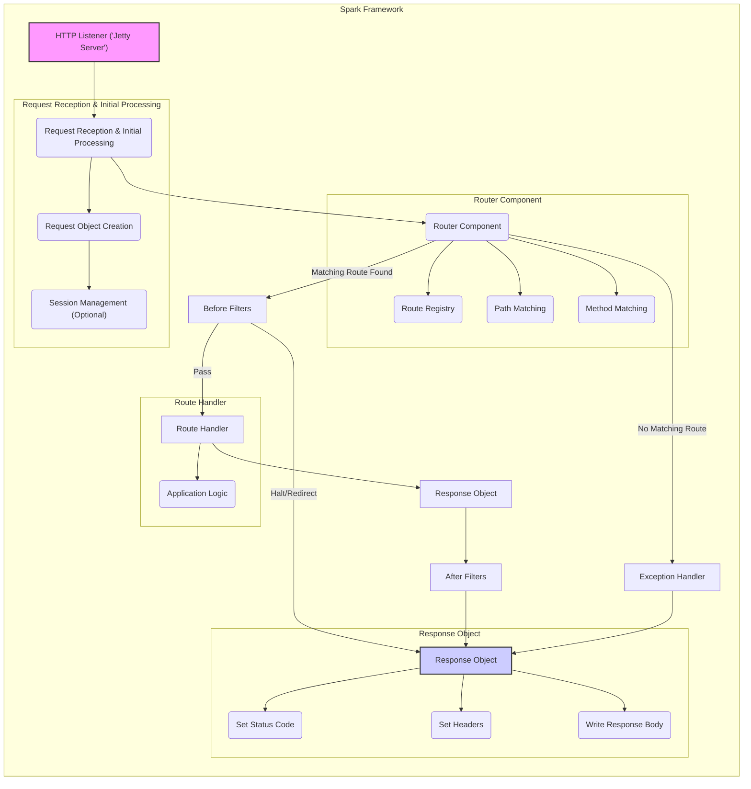

# Project Design Document: Spark Web Framework

**Version:** 1.1
**Date:** October 26, 2023
**Author:** AI Software Architect

## 1. Introduction

This document provides a detailed design overview of the Spark web framework (as found at [https://github.com/perwendel/spark](https://github.com/perwendel/spark)). This document aims to clearly articulate the architecture, components, and interactions within the framework. It will serve as a foundation for subsequent threat modeling activities to identify potential security vulnerabilities and risks. This revision includes more granular detail and expands on security considerations.

## 2. Goals

*   Provide a comprehensive and detailed description of the Spark framework's architecture and key components.
*   Illustrate the flow of requests and responses within the framework, including data transformations.
*   Identify the major interaction points and data flows, highlighting potential trust boundaries.
*   Establish a clear understanding of the system's boundaries, dependencies, and deployment options.
*   Serve as a robust basis for identifying potential threat vectors, attack surfaces, and security weaknesses.

## 3. Overview

Spark is a lightweight micro web framework for Java designed for rapid development of web applications and APIs. Inspired by Sinatra, it prioritizes simplicity and expressiveness. Spark handles the boilerplate of routing HTTP requests, allowing developers to focus on application logic. Its core functionality revolves around mapping routes to handlers and processing requests through a defined pipeline.

## 4. Architectural Design

Spark's architecture is centered around processing HTTP requests through a series of well-defined stages. Understanding these stages and the components involved is crucial for identifying potential security vulnerabilities.

### 4.1. Key Components

*   **HTTP Listener (Jetty Server):**  By default, Spark embeds a Jetty server. This component is responsible for:
    *   Accepting incoming TCP connections on a specified port.
    *   Handling the TLS handshake if HTTPS is configured.
    *   Parsing the raw HTTP request into a structured format.
*   **Request Reception and Initial Processing:** This stage within the Spark framework handles the initial processing of the HTTP request:
    *   **Request Object Creation:**  Creation of a `Request` object encapsulating details like headers, parameters, path, and body.
    *   **Session Management (Optional):** If sessions are enabled, the framework attempts to identify an existing session based on cookies or creates a new one.
*   **Router Component:** This component is responsible for mapping incoming requests to the appropriate handler:
    *   **Route Registry:**  Maintains a collection of defined routes (HTTP method and URI path) and their associated handlers and filters.
    *   **Path Matching:**  Compares the request URI against the registered routes, supporting exact matches and parameterized routes.
    *   **Method Matching:** Verifies that the request's HTTP method (GET, POST, PUT, DELETE, etc.) matches the route definition.
*   **Filter Chain:**  A sequence of interceptors that can be executed before and after the route handler:
    *   **Before Filters:** Executed before the handler. Used for tasks like authentication, authorization, request modification, and logging.
    *   **After Filters:** Executed after the handler. Used for tasks like response modification, adding headers, and logging.
*   **Route Handler:** The application-defined code block that processes the request and generates a response. It receives the `Request` and `Response` objects.
*   **Response Object:**  Provides methods for building the HTTP response:
    *   Setting HTTP status codes.
    *   Setting response headers (including security-related headers).
    *   Writing the response body (plain text, HTML, JSON, etc.).
*   **Exception Handler:**  A mechanism for catching and processing exceptions that occur during request processing. This can involve logging the error and returning a specific error response to the client.
*   **Static File Handler:**  Serves static content (e.g., CSS, JavaScript, images) from a designated directory.
*   **WebSocket Handler (Optional):** If WebSocket support is used, this component manages WebSocket connections and message handling.
*   **Template Engine Integration (Optional):**  Allows rendering dynamic content using template engines like Velocity, FreeMarker, or Thymeleaf.

### 4.2. Component Interactions and Data Flow

**Detailed Data Flow Description:**

1. A client initiates an HTTP request.
2. The **HTTP Listener ('Jetty Server')** accepts the incoming connection and receives the raw HTTP request.
3. The request is passed to **Request Reception & Initial Processing**.
    *   A **Request Object** is created, encapsulating the request details.
    *   **Session Management (Optional)** attempts to retrieve or create a session.
4. The **Router Component** receives the request object.
    *   The **Route Registry** is consulted to find matching routes.
    *   **Path Matching** compares the request URI with registered route paths.
    *   **Method Matching** verifies the HTTP method.
5. If **No Matching Route** is found, the request is directed to the **Exception Handler**.
6. If a **Matching Route Found**, the request proceeds to the **Before Filters**.
7. **Before Filters** are executed in order. They can access and modify the `Request` and `Response` objects. A filter can choose to halt the request processing or redirect the client.
8. If the before filters allow, the **Route Handler** associated with the matched route is executed.
    *   The **Application Logic** within the handler processes the request and interacts with data sources or other services.
9. The **Route Handler** uses the **Response Object** to construct the HTTP response.
    *   The **Status Code** is set.
    *   **Headers** are set (including security headers).
    *   The **Response Body** is written.
10. **After Filters** are executed in order. They can further modify the `Response` object or perform logging.
11. The **Response Object** is finalized, and the HTTP response is sent back to the client.
12. If an exception occurs during processing, the **Exception Handler** is invoked to manage the error and generate an appropriate response.

### 4.3. Deployment Considerations

Spark applications can be deployed in various ways, each with its own security implications:

*   **Standalone JAR with Embedded Jetty:** This is the simplest deployment method.
    *   **Pros:** Easy to deploy, self-contained.
    *   **Cons:**  Requires careful configuration of the embedded Jetty server for security (e.g., TLS configuration). Vulnerabilities in the embedded Jetty version can directly impact the application.
*   **WAR file deployed to a Servlet Container (e.g., Tomcat, WildFly):** This leverages the security features and management capabilities of the servlet container.
    *   **Pros:** Benefits from the container's security features (e.g., authentication, authorization, TLS termination). Centralized management.
    *   **Cons:** Requires understanding the security configuration of the specific servlet container. Potential for misconfiguration.
*   **Containerized Deployment (e.g., Docker):**  Packages the application and its dependencies into a container image.
    *   **Pros:** Consistent environment, easier scaling. Security depends on the base image and container configuration.
    *   **Cons:** Requires securing the container runtime environment and managing container image vulnerabilities.
*   **Cloud Platforms (e.g., AWS, Azure, GCP):** Deployment to cloud platforms offers various managed services and security features.
    *   **Pros:** Scalability, managed security services (e.g., firewalls, load balancers with TLS termination).
    *   **Cons:** Security relies on proper configuration of cloud services and understanding the shared responsibility model.

## 5. Security Considerations (Expanded)

This section expands on potential security considerations, providing more specific examples of threats and vulnerabilities.

*   **Injection Attacks:**
    *   **Cross-Site Scripting (XSS):** If user input is not properly sanitized before being included in HTML responses (within handlers or templates), attackers can inject malicious scripts.
    *   **SQL Injection:** If the application interacts with a database and user input is directly included in SQL queries without proper parameterization, attackers can execute arbitrary SQL commands.
    *   **Command Injection:** If the application executes external commands based on user input without proper sanitization, attackers can execute arbitrary system commands.
*   **Authentication and Authorization Vulnerabilities:**
    *   **Broken Authentication:** Weak password policies, insecure storage of credentials, or vulnerabilities in session management can lead to unauthorized access.
    *   **Broken Authorization:**  Insufficient checks to ensure users only access resources they are permitted to access. This can involve flaws in before filters or handler logic.
*   **Session Management Issues:**
    *   **Session Fixation:** Attackers can force a user to use a specific session ID, allowing them to hijack the session.
    *   **Session Hijacking:** Attackers can steal session IDs (e.g., through XSS or network sniffing) and impersonate users.
    *   **Insecure Session Cookies:**  Session cookies not marked as `HttpOnly` or `Secure` are vulnerable to client-side script access or transmission over insecure connections.
*   **Cross-Site Request Forgery (CSRF):** If the application does not properly validate the origin of requests, attackers can trick users into performing unintended actions on the application.
*   **Insecure Direct Object References (IDOR):**  Exposing internal object IDs without proper authorization checks can allow attackers to access resources they shouldn't.
*   **Security Misconfiguration:**
    *   **Exposed Error Messages:**  Detailed error messages revealing sensitive information about the application's internals.
    *   **Default Credentials:** Using default credentials for administrative interfaces or databases.
    *   **Missing Security Headers:**  Lack of security headers like `Content-Security-Policy`, `Strict-Transport-Security`, and `X-Frame-Options` can leave the application vulnerable to various attacks.
*   **Vulnerable Dependencies:** Using outdated or vulnerable versions of libraries like Jetty or template engines.
*   **Denial of Service (DoS):**  Vulnerabilities that allow attackers to overwhelm the application with requests, making it unavailable to legitimate users. This could involve exploiting slowloris attacks at the HTTP Listener level or resource exhaustion within handlers.
*   **WebSocket Security Issues:**
    *   **Lack of Input Validation on WebSocket Messages:** Similar to web requests, data received over WebSockets needs validation.
    *   **Cross-Site WebSocket Hijacking (CSWSH):**  Similar to CSRF, but for WebSocket connections.
    *   **Insecure WebSocket Handshake:**  Failure to properly validate the origin of WebSocket connections.

## 6. Dependencies

Spark relies on several key dependencies:

*   **org.eclipse.jetty.server:jetty-server:**  The core Jetty server component for handling HTTP requests. Security vulnerabilities in Jetty directly impact Spark applications using the embedded server.
*   **org.eclipse.jetty.servlet:jetty-servlet:**  Provides servlet support within Jetty.
*   **org.slf4j:slf4j-api:**  A logging facade. The actual logging implementation (e.g., logback, log4j) is a transitive dependency and also needs to be considered for security logging practices.
*   **Optional Dependencies:**  Depending on the features used, Spark applications might depend on:
    *   Template engines (e.g., org.apache.velocity:velocity, org.freemarker:freemarker, org.thymeleaf:thymeleaf). These can introduce vulnerabilities if not properly used or if the engine itself has flaws.
    *   JSON libraries (e.g., com.fasterxml.jackson.core:jackson-databind, com.google.code.gson:gson). Vulnerabilities in these libraries can lead to deserialization attacks.
    *   WebSocket libraries (if WebSocket support is used).

## 7. Future Considerations

*   Detailed analysis of the default configurations and security best practices for the embedded Jetty server.
*   Investigation of built-in security features or recommendations provided by the Spark framework itself.
*   Development of secure coding guidelines specific to Spark application development.
*   Regularly reviewing and updating dependencies to patch known vulnerabilities.
*   Performing penetration testing and security audits on Spark-based applications.

This improved design document provides a more detailed and comprehensive overview of the Spark web framework, specifically focusing on aspects relevant to security and threat modeling. The expanded descriptions of components, data flow, and security considerations will facilitate a more thorough analysis of potential vulnerabilities.