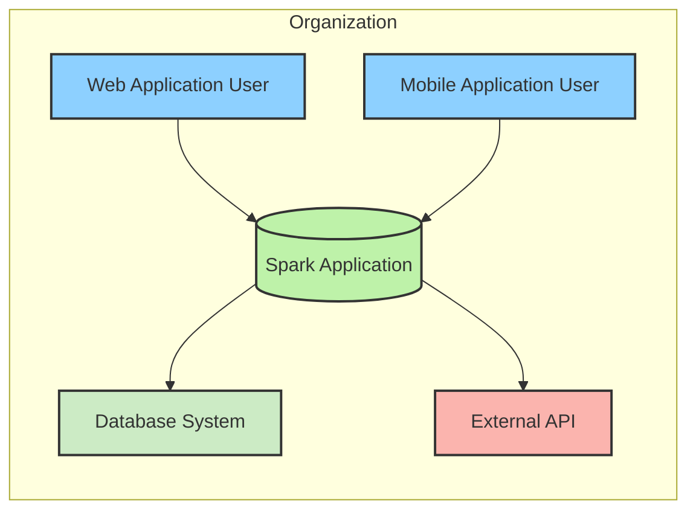
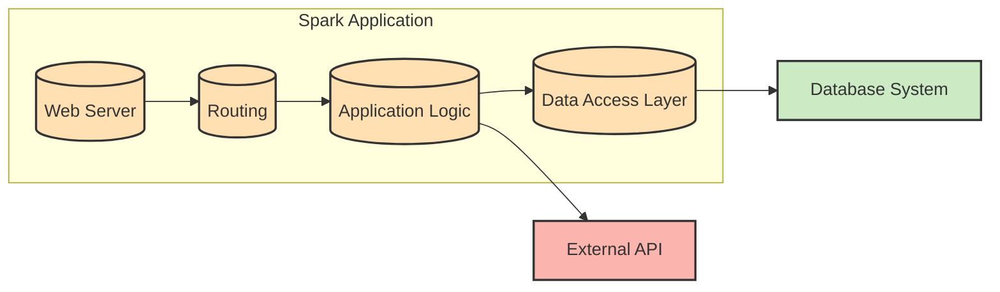
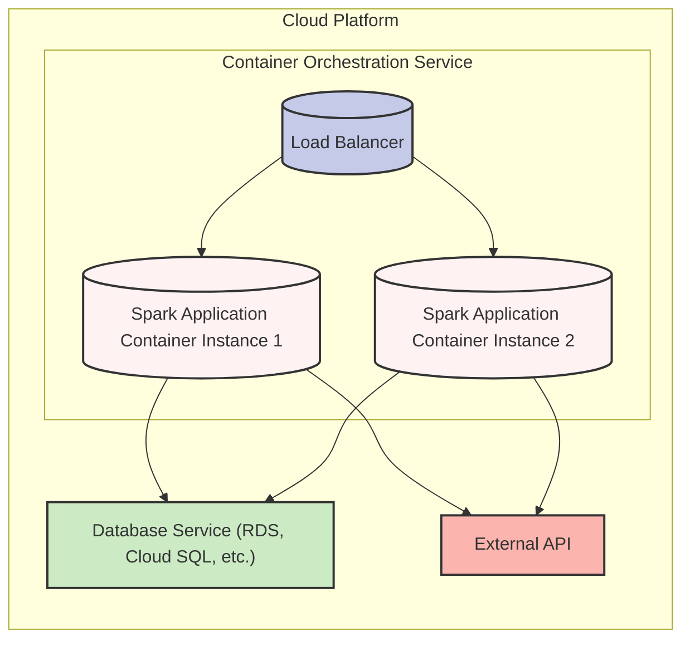

# BUSINESS POSTURE

Spark is a micro web framework for Java and Kotlin designed to simplify web application development. The primary business priority for adopting Spark is to accelerate the development and deployment of web applications and APIs. This is particularly valuable for projects requiring rapid prototyping, microservices architecture, or lightweight web interfaces. The goal is to enable developers to quickly build and deploy web applications with minimal boilerplate code and configuration.

Key business risks associated with using Spark include:

- Risk of vulnerabilities in applications built with Spark due to developer error or framework limitations.
- Risk of performance bottlenecks if Spark is not used efficiently or if applications are not properly optimized.
- Risk of maintainability issues if applications become overly complex or if the framework evolves in incompatible ways.
- Risk of security vulnerabilities in Spark framework itself, requiring timely updates and patches.

# SECURITY POSTURE

Existing security controls for projects using Spark will largely depend on the development practices and deployment environment of the organization using it.  Assuming a typical modern software development lifecycle:

- security control: Static Application Security Testing (SAST) might be used on application code built with Spark. Implementation location: CI/CD pipeline, developer workstations.
- security control: Dynamic Application Security Testing (DAST) might be used on deployed applications built with Spark. Implementation location: Staging and Production environments.
- security control: Dependency scanning might be used to identify vulnerable dependencies in application code. Implementation location: CI/CD pipeline, developer workstations.
- security control: Code reviews are likely performed for application code. Implementation location: Development process.
- security control: Access control lists (ACLs) and firewalls are likely in place in the deployment environment. Implementation location: Infrastructure layer (cloud provider, network devices).

Accepted risks:

- accepted risk:  Risk of zero-day vulnerabilities in Spark framework or its dependencies before patches are available.
- accepted risk:  Risk of misconfiguration of Spark applications leading to security vulnerabilities.
- accepted risk:  Risk of vulnerabilities introduced by third-party libraries used in Spark applications.
- accepted risk:  Risk of insufficient security awareness among developers leading to insecure coding practices.

Recommended security controls to implement:

- security control: Implement Software Composition Analysis (SCA) specifically for Spark framework and its dependencies to proactively identify and manage vulnerabilities.
- security control: Introduce security champions within development teams to promote secure coding practices and framework-specific security guidance.
- security control: Develop and enforce secure coding guidelines specific to Spark framework, addressing common pitfalls and best practices.
- security control: Implement regular security training for developers focusing on web application security and Spark framework specifics.

Security requirements for projects using Spark:

- Authentication:
  - Requirement: Applications should implement robust authentication mechanisms to verify user identity.
  - Requirement: Support for industry standard authentication protocols like OAuth 2.0, OpenID Connect, or SAML should be considered based on application needs.
  - Requirement: Secure storage of credentials and session management is essential.

- Authorization:
  - Requirement: Applications must implement fine-grained authorization to control user access to resources and functionalities.
  - Requirement: Role-Based Access Control (RBAC) or Attribute-Based Access Control (ABAC) should be considered for managing permissions.
  - Requirement: Authorization decisions should be consistently enforced throughout the application.

- Input Validation:
  - Requirement: All user inputs must be validated to prevent injection attacks (e.g., SQL injection, Cross-Site Scripting).
  - Requirement: Input validation should be performed on both client-side and server-side.
  - Requirement: Use of parameterized queries or ORM frameworks to mitigate SQL injection risks.
  - Requirement: Output encoding should be applied to prevent Cross-Site Scripting (XSS) vulnerabilities.

- Cryptography:
  - Requirement: Sensitive data at rest and in transit must be encrypted.
  - Requirement: Use of HTTPS for all communication to protect data in transit.
  - Requirement: Proper key management practices must be implemented for cryptographic keys.
  - Requirement: Consider using encryption for sensitive data stored in databases or configuration files.

# DESIGN

## C4 CONTEXT

Context Diagram Elements:

- Element:
  - Name: "Web Application User"
  - Type: Person
  - Description: Users accessing the Spark application through a web browser.
  - Responsibilities: Accessing application functionalities via web interface.
  - Security controls: Browser-based security controls, user authentication (handled by Spark Application).

- Element:
  - Name: "Mobile Application User"
  - Type: Person
  - Description: Users accessing the Spark application through a mobile application.
  - Responsibilities: Accessing application functionalities via mobile app interface.
  - Security controls: Mobile OS security controls, user authentication (handled by Spark Application), mobile app security best practices.

- Element:
  - Name: "Spark Application"
  - Type: Software System
  - Description: The web application built using the Spark framework. This is the system being designed.
  - Responsibilities: Handling user requests, processing business logic, interacting with database and external APIs, providing web and API interfaces.
  - Security controls: Authentication, authorization, input validation, output encoding, session management, error handling, logging, monitoring.

- Element:
  - Name: "Database System"
  - Type: Database System
  - Description: Persistent storage for the Spark application. Could be relational (e.g., PostgreSQL, MySQL) or NoSQL (e.g., MongoDB, Cassandra).
  - Responsibilities: Storing and retrieving application data, ensuring data integrity and availability.
  - Security controls: Database access controls, encryption at rest, encryption in transit, database auditing, backup and recovery.

- Element:
  - Name: "External API"
  - Type: External System
  - Description: External services or APIs that the Spark application integrates with. Could be payment gateways, third-party data providers, or other internal services.
  - Responsibilities: Providing external data or functionalities to the Spark application.
  - Security controls: API authentication and authorization (e.g., API keys, OAuth), secure communication (HTTPS), input validation of external data, rate limiting.

## C4 CONTAINER

Container Diagram Elements:

- Element:
  - Name: "Web Server"
  - Type: Container
  - Description:  Handles HTTP requests and responses. Could be embedded server provided by Spark or external server like Jetty or Tomcat.
  - Responsibilities:  Receiving HTTP requests, routing requests to application logic, serving static content, handling SSL/TLS termination.
  - Security controls:  HTTPS configuration, web server hardening, rate limiting, request filtering, web application firewall (WAF) in front of the web server.

- Element:
  - Name: "Application Logic"
  - Type: Container
  - Description:  Contains the core business logic of the application, implemented using Spark framework.
  - Responsibilities:  Implementing application functionalities, handling user requests, orchestrating data access, interacting with external APIs, enforcing business rules.
  - Security controls:  Input validation, authorization logic, secure coding practices, error handling, logging, monitoring, vulnerability scanning of application code.

- Element:
  - Name: "Routing"
  - Type: Container
  - Description:  Spark's routing mechanism that maps HTTP requests to specific handlers within the application logic.
  - Responsibilities:  Defining API endpoints, mapping URLs to application logic components, handling request parameters and headers.
  - Security controls:  Secure routing configuration, protection against route injection vulnerabilities, input validation of route parameters.

- Element:
  - Name: "Data Access Layer"
  - Type: Container
  - Description:  Abstracts database interactions from the application logic. Could use an ORM or direct database queries.
  - Responsibilities:  Data persistence, data retrieval, database connection management, data mapping.
  - Security controls:  Parameterized queries or ORM usage to prevent SQL injection, database connection security, data access authorization, input validation before database queries.

- Element:
  - Name: "Database System"
  - Type: Database System
  - Description: Persistent storage for the Spark application. (Same as in Context Diagram).
  - Responsibilities: Storing and retrieving application data, ensuring data integrity and availability. (Same as in Context Diagram).
  - Security controls: Database access controls, encryption at rest, encryption in transit, database auditing, backup and recovery. (Same as in Context Diagram).

- Element:
  - Name: "External API"
  - Type: External System
  - Description: External services or APIs that the Spark application integrates with. (Same as in Context Diagram).
  - Responsibilities: Providing external data or functionalities to the Spark application. (Same as in Context Diagram).
  - Security controls: API authentication and authorization (e.g., API keys, OAuth), secure communication (HTTPS), input validation of external data, rate limiting. (Same as in Context Diagram).

## DEPLOYMENT

Deployment Architecture: Docker Container on Cloud Platform (e.g., AWS ECS, Google Cloud Run, Azure Container Instances)

Deployment Diagram Elements:

- Element:
  - Name: "Load Balancer"
  - Type: Infrastructure
  - Description: Distributes incoming traffic across multiple instances of the Spark application containers.
  - Responsibilities: Traffic distribution, health checks, SSL/TLS termination, high availability.
  - Security controls:  SSL/TLS configuration, DDoS protection, rate limiting, access control lists (ACLs), web application firewall (WAF).

- Element:
  - Name: "Spark Application Container Instance 1 & 2"
  - Type: Container Instance
  - Description:  Running instances of the Docker containerized Spark application. Scaled horizontally for availability and performance.
  - Responsibilities:  Running the Spark application, processing requests, interacting with database and external APIs.
  - Security controls:  Container image security scanning, runtime security monitoring, resource isolation, least privilege container configuration, regular patching of container OS and libraries.

- Element:
  - Name: "Database Service (RDS, Cloud SQL, etc.)"
  - Type: Database Service
  - Description: Managed database service provided by the cloud platform.
  - Responsibilities:  Persistent data storage, database management, backups, high availability.
  - Security controls:  Database access controls (IAM), encryption at rest, encryption in transit, database auditing, vulnerability scanning, regular patching.

- Element:
  - Name: "External API"
  - Type: External System
  - Description: External services or APIs that the Spark application integrates with. (Same as in Context and Container Diagrams).
  - Responsibilities: Providing external data or functionalities to the Spark application. (Same as in Context and Container Diagrams).
  - Security controls: API authentication and authorization (e.g., API keys, OAuth), secure communication (HTTPS), input validation of external data, rate limiting. (Same as in Context and Container Diagrams).

## BUILD

```mermaid
flowchart LR
    A["Developer"]:::person --> B[("Code Repository (GitHub)")]:::code_repo
    B --> C[("CI/CD Pipeline (GitHub Actions)")]:::ci_cd
    C --> D[("Build Process (Maven/Gradle)")]:::build_tool
    D --> E[("Security Scanners (SAST, SCA)")]:::security_tool
    E --> F[("Container Image Registry")]:::container_registry
    F --> G[("Deployment Environment")]:::deployment_env

    classDef person fill:#8dd0ff,stroke:#333,stroke-width:2px
    classDef code_repo fill:#ccf2ff,stroke:#333,stroke-width:2px
    classDef ci_cd fill:#f0f0f0,stroke:#333,stroke-width:2px
    classDef build_tool fill:#e6e6fa,stroke:#333,stroke-width:2px
    classDef security_tool fill:#ffcccc,stroke:#333,stroke-width:2px
    classDef container_registry fill:#e0f7fa,stroke:#333,stroke-width:2px
    classDef deployment_env fill:#fef2f2,stroke:#333,stroke-width:2px
```

Build Process Description:

1. Developer commits code changes to the "Code Repository (GitHub)".
2. "CI/CD Pipeline (GitHub Actions)" is triggered upon code commit.
3. "Build Process (Maven/Gradle)" compiles the code, runs unit tests, and packages the application (e.g., creates a JAR file).
4. "Security Scanners (SAST, SCA)" are integrated into the pipeline to perform static analysis of the code and scan dependencies for vulnerabilities.
5. If security checks pass, the pipeline builds a Docker container image and pushes it to the "Container Image Registry".
6. The "Deployment Environment" pulls the latest container image from the registry for deployment.

Build Diagram Elements:

- Element:
  - Name: "Developer"
  - Type: Person
  - Description: Software developer writing and committing code for the Spark application.
  - Responsibilities: Writing secure code, performing local testing, committing code changes.
  - Security controls: Secure coding practices, code review, developer workstation security.

- Element:
  - Name: "Code Repository (GitHub)"
  - Type: Code Repository
  - Description:  Version control system hosting the source code of the Spark application.
  - Responsibilities:  Source code management, version control, collaboration.
  - Security controls:  Access control (authentication and authorization), branch protection, audit logging, vulnerability scanning of repository settings.

- Element:
  - Name: "CI/CD Pipeline (GitHub Actions)"
  - Type: CI/CD
  - Description:  Automated build, test, and deployment pipeline using GitHub Actions.
  - Responsibilities:  Automating build process, running tests, performing security scans, deploying application.
  - Security controls:  Secure pipeline configuration, access control to pipeline definitions and secrets, audit logging, secure storage of credentials, vulnerability scanning of pipeline components.

- Element:
  - Name: "Build Process (Maven/Gradle)"
  - Type: Build Tool
  - Description:  Build automation tools used to compile, test, and package the Spark application.
  - Responsibilities:  Code compilation, dependency management, unit testing, packaging.
  - Security controls:  Dependency management (vulnerability scanning, dependency lock files), build tool configuration security, secure plugin management.

- Element:
  - Name: "Security Scanners (SAST, SCA)"
  - Type: Security Tool
  - Description:  Static Application Security Testing (SAST) and Software Composition Analysis (SCA) tools integrated into the CI/CD pipeline.
  - Responsibilities:  Identifying security vulnerabilities in code and dependencies.
  - Security controls:  Regular updates of scanner rules and databases, secure configuration of scanners, vulnerability reporting and management.

- Element:
  - Name: "Container Image Registry"
  - Type: Container Registry
  - Description:  Repository for storing and managing Docker container images.
  - Responsibilities:  Storing container images, image versioning, image distribution.
  - Security controls:  Access control (authentication and authorization), vulnerability scanning of container images, image signing, audit logging.

- Element:
  - Name: "Deployment Environment"
  - Type: Deployment Environment
  - Description:  Target environment where the Spark application is deployed (e.g., Cloud Platform).
  - Responsibilities:  Running the application, providing infrastructure, ensuring availability and scalability.
  - Security controls:  Infrastructure security controls (as described in Deployment section), runtime security monitoring, incident response.

# RISK ASSESSMENT

Critical business processes protected by the Spark application depend on the specific application built.  Examples include:

- E-commerce transactions processing.
- User authentication and authorization.
- Data processing and analytics.
- Content delivery.
- API gateway functionalities.

Data being protected and its sensitivity also depends on the application. Examples of data types and sensitivity levels:

- User credentials (highly sensitive).
- Personal Identifiable Information (PII) (sensitive).
- Financial transaction data (highly sensitive).
- Application configuration data (sensitive).
- Business data (sensitivity depends on the nature of the data).
- Logs and audit trails (sensitive).

The sensitivity of data dictates the required security controls. Applications handling highly sensitive data will require stronger authentication, authorization, encryption, and monitoring compared to applications handling less sensitive data.

# QUESTIONS & ASSUMPTIONS

Questions:

- What is the specific business purpose of the Spark application being designed? (This document assumes a general web application scenario).
- What type of data will the application process and store? (Sensitivity level is assumed to vary).
- What are the specific regulatory compliance requirements for the application? (e.g., GDPR, HIPAA, PCI DSS).
- What is the organization's risk appetite? (This document assumes a moderate risk appetite).
- What is the expected scale and performance requirements of the application?
- What are the specific technologies and services used in the deployment environment? (This document assumes a cloud-based containerized deployment).

Assumptions:

- BUSINESS POSTURE: The primary business goal is rapid web application development and deployment. Security is a significant but not overriding concern.
- SECURITY POSTURE:  The organization has basic security controls in place (SAST, DAST, dependency scanning, code reviews). There is a need to enhance security posture with more proactive and framework-specific controls.
- DESIGN: The Spark application is designed as a typical three-tier web application with web server, application logic, and data storage. Deployment is assumed to be containerized on a cloud platform. Build process is automated using CI/CD and includes basic security checks.