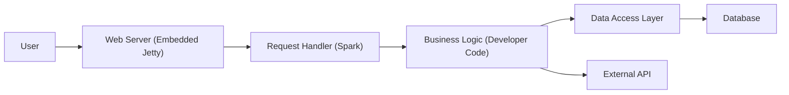
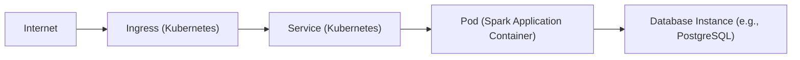
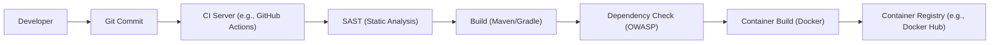

Okay, let's create a design document for the Spark Framework (https://github.com/perwendel/spark) with a focus on security and threat modeling preparation.

# BUSINESS POSTURE

Spark is a micro web framework for Java, designed for rapid development of web applications and APIs.  It prioritizes simplicity and ease of use over extensive features.  Given its nature, we can infer the following:

Priorities and Goals:

*   Enable rapid prototyping and development of web applications.
*   Provide a minimal, easy-to-learn framework for developers.
*   Offer sufficient functionality for creating RESTful APIs and simple web interfaces.
*   Minimize boilerplate code and configuration.

Business Risks:

*   Vulnerabilities in the framework itself could expose applications built with Spark to attacks (e.g., injection, cross-site scripting, etc.). This is the most critical risk.
*   Lack of built-in security features (compared to more comprehensive frameworks) might lead developers to overlook security best practices, increasing application vulnerability.
*   Performance bottlenecks under heavy load could impact application availability.
*   Limited community support (compared to larger frameworks) could hinder troubleshooting and vulnerability patching.
*   Dependence on third-party libraries (for features like templating, JSON parsing) introduces supply chain risks.

# SECURITY POSTURE

Existing Security Controls (based on the GitHub repository and common practices):

*   security control: The framework itself likely includes some basic input sanitization (though this needs verification in the code).  Location: Core Spark library.
*   security control: The documentation encourages the use of HTTPS. Location: Spark documentation.
*   security control: The framework supports setting HTTP headers, which can be used to implement security controls like HSTS, CSP, etc. Location: Spark documentation and API.
*   security control: The framework uses SLF4J for logging, allowing integration with various logging backends for security auditing. Location: Spark dependencies and documentation.
*   accepted risk: The framework is lightweight and doesn't include built-in features for authentication, authorization, or CSRF protection. Developers are expected to implement these themselves or use external libraries.
*   accepted risk: The framework's simplicity might lead to developers overlooking security best practices.
*   accepted risk: Limited built-in session management capabilities.

Recommended Security Controls (High Priority):

*   Implement robust input validation and output encoding throughout the framework to mitigate injection and XSS vulnerabilities.
*   Provide clear documentation and examples on how to implement secure authentication and authorization mechanisms.
*   Offer built-in or recommended libraries for CSRF protection.
*   Conduct regular security audits and penetration testing of the framework.
*   Establish a clear vulnerability reporting and patching process.
*   Implement a secure dependency management process to mitigate supply chain risks.

Security Requirements:

*   Authentication: The framework should provide mechanisms or guidance for integrating with authentication systems (e.g., OAuth 2.0, JWT, custom authentication).
*   Authorization: The framework should support role-based access control (RBAC) or other authorization models, or provide clear guidance on implementing them.
*   Input Validation: All user-supplied input (including request parameters, headers, and body) must be validated against strict whitelists.
*   Output Encoding: All output rendered to the user (HTML, JSON, etc.) must be properly encoded to prevent XSS attacks.
*   Cryptography: The framework should use secure cryptographic algorithms and libraries for any sensitive operations (e.g., password hashing, session management).
*   Session Management: If session management is used, it must be implemented securely, using strong session IDs, secure cookies, and appropriate timeouts.
*   Error Handling: Error messages should not reveal sensitive information about the application or its infrastructure.
*   Logging: Security-relevant events (e.g., authentication failures, authorization denials) should be logged for auditing purposes.

# DESIGN

## C4 CONTEXT

```mermaid
graph LR
    User["User"] --> SparkApplication["Spark Application"]
    SparkApplication --|> JavaApplication["Java Application"]
    SparkApplication --> Database["Database"]
    SparkApplication --> ExternalAPI["External API"]
    SparkApplication --> ThirdPartyLibs["Third-party Libraries"]

```

Element Descriptions:

*   Element:
    *   Name: User
    *   Type: Person
    *   Description: A user interacting with the Spark application through a web browser or other client.
    *   Responsibilities: Initiates requests, views responses.
    *   Security controls: Browser security features, user-provided security tools.

*   Element:
    *   Name: Spark Application
    *   Type: Software System
    *   Description: The web application built using the Spark framework.
    *   Responsibilities: Handles HTTP requests, processes data, interacts with other systems, renders responses.
    *   Security controls: Input validation, output encoding, authentication, authorization, session management (implemented by the developer using Spark and potentially other libraries).

*   Element:
    *   Name: Java Application
    *   Type: Software System
    *   Description: Spark application is a Java application.
    *   Responsibilities: Inherits all responsibilities from Spark Application.
    *   Security controls: Inherits all security controls from Spark Application.

*   Element:
    *   Name: Database
    *   Type: Software System
    *   Description: A database used by the Spark application to store data.
    *   Responsibilities: Stores and retrieves data.
    *   Security controls: Database access controls, encryption at rest, encryption in transit.

*   Element:
    *   Name: External API
    *   Type: Software System
    *   Description: Any external APIs that the Spark application interacts with.
    *   Responsibilities: Provides specific services or data.
    *   Security controls: API keys, authentication, authorization, rate limiting (implemented by the external API provider).

*   Element:
    *   Name: Third-party Libraries
    *   Type: Software System
    *   Description: External libraries used by the Spark application (e.g., for templating, JSON parsing, database access).
    *   Responsibilities: Provide specific functionalities.
    *   Security controls: Dependent on the specific library; regular updates and vulnerability scanning are crucial.

## C4 CONTAINER



Element Descriptions:

*   Element:
    *   Name: User
    *   Type: Person
    *   Description: A user interacting with the Spark application.
    *   Responsibilities: Initiates requests, views responses.
    *   Security controls: Browser security features, user-provided security tools.

*   Element:
    *   Name: Web Server (Embedded Jetty)
    *   Type: Container: Java Web Server
    *   Description: An embedded Jetty web server that handles incoming HTTP requests.
    *   Responsibilities: Receives requests, forwards them to the Spark request handler, sends responses.
    *   Security controls: TLS configuration, HTTP header configuration, potentially a web application firewall (WAF) if deployed separately.

*   Element:
    *   Name: Request Handler (Spark)
    *   Type: Container: Java Component
    *   Description: The core Spark framework component that routes requests to the appropriate handlers.
    *   Responsibilities: Matches requests to routes, invokes handler methods, manages filters.
    *   Security controls: Input validation (should be enforced here), routing logic.

*   Element:
    *   Name: Business Logic (Developer Code)
    *   Type: Container: Java Component
    *   Description: The application-specific code written by the developer.
    *   Responsibilities: Implements the application's core functionality, interacts with data access and external APIs.
    *   Security controls: Authentication, authorization, input validation, output encoding, secure coding practices.

*   Element:
    *   Name: Data Access Layer
    *   Type: Container: Java Component
    *   Description: A layer that abstracts database interactions.
    *   Responsibilities: Executes database queries, maps data to objects.
    *   Security controls: Parameterized queries (to prevent SQL injection), secure connection configuration.

*   Element:
    *   Name: Database
    *   Type: Container: Database
    *   Description: The database used by the application.
    *   Responsibilities: Stores and retrieves data.
    *   Security controls: Database access controls, encryption at rest, encryption in transit.

*   Element:
    *   Name: External API
    *   Type: Container: External System
    *   Description: Any external APIs used by the application.
    *   Responsibilities: Provides specific services or data.
    *   Security controls: API keys, authentication, authorization, rate limiting (implemented by the external API provider).

## DEPLOYMENT

Possible Deployment Solutions:

1.  Standalone JAR: Package the Spark application as a self-contained executable JAR with an embedded Jetty server.  This is the simplest approach.
2.  Cloud Platform (PaaS): Deploy the JAR to a Platform-as-a-Service provider like Heroku, AWS Elastic Beanstalk, Google App Engine, etc.
3.  Containerization (Docker): Package the application and its dependencies into a Docker container and deploy it to a container orchestration platform like Kubernetes or Docker Swarm.
4.  Traditional Web Server: Deploy the application as a WAR file to a standalone web server like Tomcat or Jetty.

Chosen Solution (Containerization with Kubernetes):



Element Descriptions:

*   Element:
    *   Name: Internet
    *   Type: External
    *   Description: The public internet.
    *   Responsibilities: Source of incoming requests.
    *   Security controls: Network firewalls, intrusion detection/prevention systems.

*   Element:
    *   Name: Ingress (Kubernetes)
    *   Type: Infrastructure Node
    *   Description: A Kubernetes Ingress controller that manages external access to the service.
    *   Responsibilities: Routes traffic to the appropriate service, terminates TLS.
    *   Security controls: TLS configuration, potentially a web application firewall (WAF).

*   Element:
    *   Name: Service (Kubernetes)
    *   Type: Infrastructure Node
    *   Description: A Kubernetes Service that provides a stable endpoint for accessing the application pods.
    *   Responsibilities: Load balances traffic across pods.
    *   Security controls: Network policies (restricting traffic between services).

*   Element:
    *   Name: Pod (Spark Application Container)
    *   Type: Container Instance
    *   Description: A Kubernetes Pod running the Docker container containing the Spark application.
    *   Responsibilities: Executes the application code.
    *   Security controls: Container security context (e.g., running as a non-root user), resource limits, network policies.

*   Element:
    *   Name: Database Instance (e.g., PostgreSQL)
    *   Type: Database Instance
    *   Description: A managed database instance (e.g., a cloud-hosted PostgreSQL database).
    *   Responsibilities: Stores and retrieves data.
    *   Security controls: Database access controls, encryption at rest, encryption in transit, firewall rules.

## BUILD


Build Process Description:

1.  Developer commits code to a Git repository.
2.  A CI server (e.g., GitHub Actions, Jenkins) is triggered by the commit.
3.  The CI server runs a SAST (Static Application Security Testing) tool (e.g., FindBugs, SpotBugs, SonarQube) to analyze the code for potential vulnerabilities.
4.  The CI server builds the application using a build tool like Maven or Gradle.
5.  A dependency check tool (e.g., OWASP Dependency-Check) is run to identify any known vulnerabilities in the application's dependencies.
6.  The application is packaged into a Docker container.
7.  The Docker container is pushed to a container registry (e.g., Docker Hub, Amazon ECR, Google Container Registry).

Security Controls:

*   SAST: Identifies potential vulnerabilities in the source code.
*   Dependency Check: Identifies vulnerable dependencies.
*   Container Image Scanning: Scans the Docker container for vulnerabilities.
*   Signed Commits: Ensures that only authorized code is committed to the repository.
*   Least Privilege: The CI server should have only the necessary permissions to build and push the application.
*   Build Artifact Signing: The final build artifact (JAR or container image) can be signed to ensure its integrity.

# RISK ASSESSMENT

Critical Business Processes:

*   User registration and authentication (if applicable).
*   Data processing and storage (depending on the application's purpose).
*   API endpoints serving critical functionality.
*   Any processes involving financial transactions or sensitive user data.

Data to Protect and Sensitivity:

*   User credentials (passwords, API keys): Highly sensitive.
*   Personally Identifiable Information (PII): Sensitive, subject to regulations like GDPR, CCPA.
*   Financial data: Highly sensitive, subject to regulations like PCI DSS.
*   Application data (depending on the application's purpose): Varies in sensitivity.
*   Configuration data (database credentials, API keys): Highly sensitive.

# QUESTIONS & ASSUMPTIONS

Questions:

*   What specific templating engine is used (if any), and what are its security implications?
*   What are the expected traffic patterns and load requirements?
*   Are there any specific regulatory compliance requirements (e.g., GDPR, HIPAA, PCI DSS)?
*   What is the process for handling user-reported security vulnerabilities?
*   What is the existing logging and monitoring infrastructure?
*   What is the exact version of Jetty used?
*   Are there any plans to integrate with existing authentication/authorization systems?

Assumptions:

*   BUSINESS POSTURE: The primary goal is rapid development and ease of use, with security being a secondary (but still important) consideration.
*   SECURITY POSTURE: Developers are expected to have a basic understanding of web security principles and implement appropriate security controls in their applications.
*   DESIGN: The application uses an embedded Jetty server and follows a standard MVC (Model-View-Controller) architecture. The database is a relational database (e.g., PostgreSQL, MySQL). External APIs are accessed using standard HTTP client libraries. The deployment environment is a Kubernetes cluster. The build process uses a CI/CD pipeline.