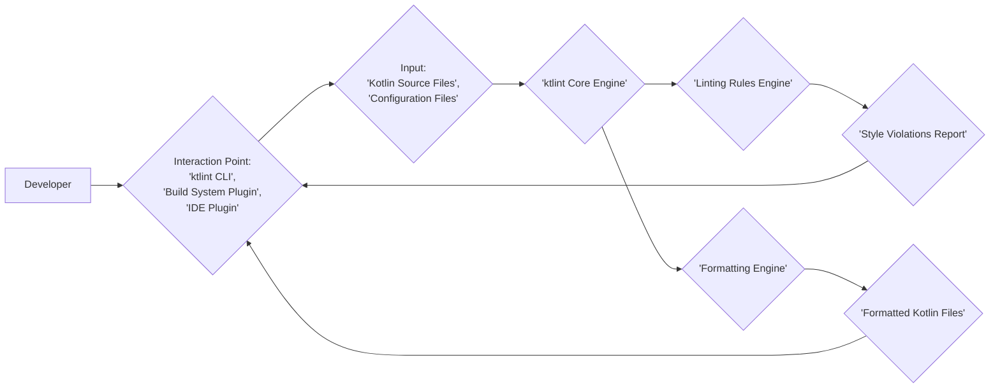
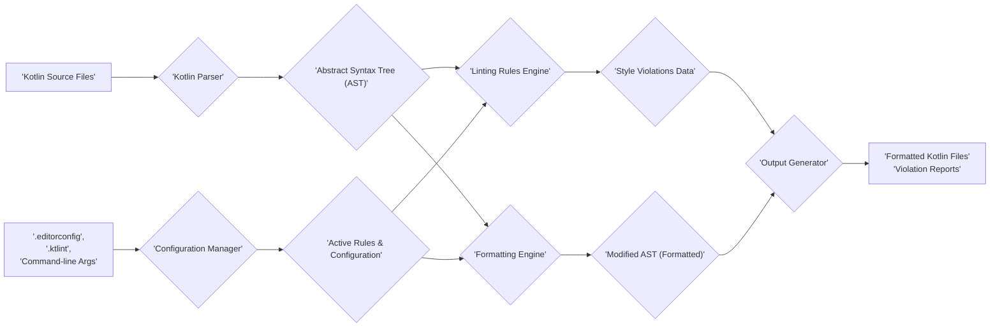

## Project Design Document: ktlint - v2.0

**1. Introduction**

This document provides a comprehensive architectural blueprint of ktlint, a widely adopted static analysis tool for Kotlin code. ktlint automates the enforcement of coding style guidelines and identifies potential code quality issues, contributing to more consistent and maintainable codebases. This design document is specifically crafted to facilitate thorough threat modeling by clearly outlining ktlint's structure, components, and data interactions. It serves as a foundational resource for understanding potential attack surfaces and security vulnerabilities.

**2. Goals**

* Clearly articulate the internal architecture and operational flow of ktlint.
* Precisely define the roles and responsibilities of each key component within ktlint.
* Illustrate the movement and transformation of data throughout the ktlint process.
* Identify and categorize potential security considerations relevant for subsequent threat analysis.

**3. Non-Goals**

* This document will not delve into the intricate implementation details of individual ktlint rules or their specific logic.
* It will not provide a historical account of ktlint's development, including specific version histories or release notes.
* This document is not intended to be a complete security assessment or a fully realized threat model for ktlint.

**4. High-Level Architecture**

ktlint primarily functions as a command-line tool, offering a direct interface for users. It also seamlessly integrates with popular build automation systems like Gradle and Maven, enabling automated code analysis within development workflows. Furthermore, ktlint can be integrated into Integrated Development Environments (IDEs) to provide real-time feedback to developers. The core function remains consistent across these deployment methods: processing Kotlin source code to identify style violations and optionally reformat the code.

**5. Component Architecture**

ktlint's internal structure is composed of several distinct components, each with specific responsibilities:

* **Interaction Handler ('CLI', 'Build System Plugin', 'IDE Plugin'):** This component serves as the entry point, receiving user commands, build lifecycle events, or IDE actions. It's responsible for parsing input parameters and delegating tasks to the core engine.
* **Input Resolver:** This component is responsible for locating and accessing the Kotlin source files targeted for analysis, based on the paths provided by the Interaction Handler or project configurations.
* **Configuration Manager:** This component loads and interprets configuration settings from various sources, including `.editorconfig` files, `.ktlint` files, and potentially command-line arguments. It determines the active set of linting rules and their specific configurations.
* **ktlint Core Engine:** This is the central orchestrator of the ktlint process. It manages the flow of execution, coordinating the parsing, linting, and formatting stages.
* **Kotlin Parser (Leveraging Kotlin Compiler):** ktlint utilizes the Kotlin compiler infrastructure to parse the input Kotlin source code into a structured representation, typically an Abstract Syntax Tree (AST). This AST serves as the basis for subsequent analysis.
* **Linting Rules Engine:** This component houses and executes the collection of predefined linting rules. Each rule examines the AST to identify deviations from the configured coding style and potential code quality issues.
* **Formatting Engine:** This component is responsible for applying automatic code formatting changes to the AST based on the active formatting rules. It modifies the AST to adhere to the defined style guidelines.
* **Output Generator:** This component takes the results of the linting and formatting processes and generates reports of style violations (including file, line number, and description) or writes the automatically formatted code back to the respective files.
* **Dependency Manager:** ktlint relies on external libraries, including the Kotlin compiler and various utility libraries. This component manages these dependencies.

**6. Data Flow**

The flow of data within ktlint can be described as follows:

1. **Input Acquisition:** The process begins when a developer interacts with ktlint through the CLI, a build system plugin, or an IDE plugin, providing paths to Kotlin source files and potentially configuration files.
2. **File Location:** The Input Resolver identifies the specified Kotlin files based on the provided input.
3. **Configuration Loading and Merging:** The Configuration Manager loads configuration settings from relevant files and merges them to determine the final set of active rules and their parameters.
4. **Parsing to AST:** The Kotlin Parser processes the source code, transforming it into an Abstract Syntax Tree (AST), a structured representation of the code.
5. **Linting Analysis:** The ktlint Core Engine iterates through the enabled Linting Rules. Each rule analyzes the AST to detect style violations and potential code quality issues. Identified violations are collected.
6. **Formatting Application (Conditional):** If formatting is enabled, the Formatting Engine modifies the AST according to the configured formatting rules.
7. **Output Generation:**
    * **Linting Report:** If only linting is performed, the Output Generator creates a report detailing the identified style violations, including their location and descriptions.
    * **Formatted Code Output:** If formatting is enabled, the Output Generator writes the modified source code (based on the updated AST) back to the original files or a specified output location.
8. **Result Reporting:** The Interaction Handler presents the generated reports or indicates the success or failure of the formatting process to the developer or the build system.

**7. Security Considerations (For Threat Modeling)**

When considering the security aspects of ktlint for threat modeling, the following areas warrant attention:

* **Input Validation Vulnerabilities:**
    * **Maliciously Crafted Kotlin Code:** Could specially crafted Kotlin code exploit vulnerabilities within the Kotlin Parser or the Linting Rules Engine, potentially leading to denial-of-service, arbitrary code execution within the ktlint process, or other unexpected behavior?
    * **Configuration Injection Attacks:** Could malicious content embedded within configuration files (e.g., `.editorconfig`, `.ktlint`) be leveraged to manipulate ktlint's behavior, potentially bypassing security checks or causing unintended actions?
* **Dependency Management Risks:**
    * **Exploitable Dependencies:** ktlint relies on external libraries. Are these dependencies actively maintained and free from known security vulnerabilities? A compromised dependency could introduce vulnerabilities into ktlint itself.
    * **Dependency Confusion/Substitution:** Could an attacker potentially substitute legitimate dependencies with malicious ones during the build or deployment process?
* **Linting Rule Execution Issues:**
    * **Resource Exhaustion through Complex Rules:** Could overly complex or inefficiently implemented linting rules be exploited to cause denial-of-service by consuming excessive resources (CPU, memory)?
    * **Rule Logic Bypass:** Are there scenarios where carefully crafted code could bypass the intended logic of certain linting rules, potentially masking vulnerabilities?
* **Output Handling and Information Disclosure:**
    * **Sensitive Information Leakage in Reports:** Could error messages or violation reports inadvertently expose sensitive information about the codebase, internal paths, or the execution environment?
* **Build System Integration Security:**
    * **Compromised Build Scripts:** If ktlint is integrated into a build system, could a compromised build script manipulate ktlint's execution, potentially leading to the introduction of malicious code or the exfiltration of sensitive data?
* **Supply Chain Security Concerns:**
    * **Compromised Distribution Channels:** How is the integrity of ktlint releases ensured? Could an attacker compromise the distribution channels and distribute a tampered version of ktlint containing malicious code?

**8. Deployment Scenarios**

ktlint is commonly deployed in these scenarios:

* **Direct Command-Line Execution:** Developers invoke ktlint directly from their terminals to analyze or format individual files or entire projects. This is often used for ad-hoc checks and local development.
* **Integration with Build Automation Tools (Gradle, Maven):** ktlint is integrated as a plugin within build scripts. This ensures that code style checks are automatically performed as part of the build process, enforcing consistency across the project.
* **Integration with Integrated Development Environments (IDEs):** IDE plugins for ktlint provide real-time feedback to developers as they write code, highlighting style violations and offering quick fixes. This allows for immediate correction of style issues.

**9. Future Considerations**

As ktlint continues to evolve, potential future features and changes could introduce new security considerations:

* **Support for Custom or Third-Party Rules:** Allowing users to define or integrate custom linting rules could introduce risks if these rules are not thoroughly vetted for security vulnerabilities or malicious intent.
* **Remote Configuration Management:** If ktlint introduces the ability to fetch configuration settings from remote sources, the security and integrity of those remote sources become critical.
* **Integration with Cloud-Based CI/CD Pipelines:** As ktlint is increasingly used in cloud-based CI/CD pipelines, securing the interaction and data exchange within these environments will be important.

This revised design document provides a more detailed and structured overview of ktlint's architecture, intended to be a valuable resource for conducting comprehensive threat modeling activities. The identified components, data flow, and security considerations offer a solid foundation for understanding potential vulnerabilities and developing appropriate mitigation strategies.
