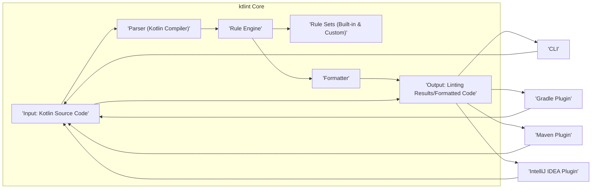
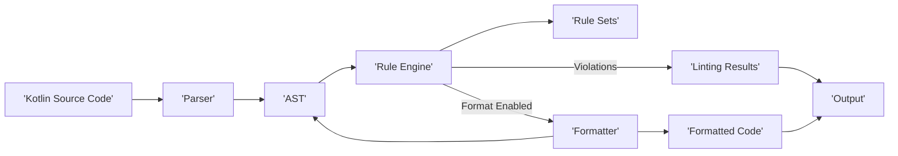

# Project Design Document: ktlint (Improved)

**Version:** 1.1
**Date:** October 26, 2023
**Prepared By:** [Your Name/Team Name]

## 1. Introduction

This document provides a detailed design overview of the ktlint project, an anti-bikeshedding Kotlin linter with built-in formatter. This document is specifically tailored to serve as a foundation for threat modeling activities by clearly outlining the project's architecture, components, data flow, and potential attack surfaces.

## 2. Project Overview

ktlint is a static code analysis tool for Kotlin. It enforces a consistent coding style by checking code against a set of pre-defined rules and provides automatic formatting capabilities to fix violations. The primary goal is to maintain a uniform code style across a codebase, minimizing subjective formatting debates and enhancing code readability and maintainability. This document focuses on aspects relevant to security and potential vulnerabilities.

## 3. Goals and Objectives

*   Enforce consistent Kotlin code style across projects.
*   Provide automated code formatting to adhere to defined style rules.
*   Integrate seamlessly with developer workflows via build tools (Gradle, Maven), command-line interface, and IDE plugins.
*   Offer extensibility through custom rule sets, allowing for project-specific style enforcement.
*   Minimize configuration overhead to encourage adoption.
*   **Security Objective:** Ensure the integrity of the linting and formatting process and prevent malicious code execution or information disclosure through ktlint.

## 4. Target Audience

*   Kotlin developers using ktlint for code quality and style enforcement.
*   Security engineers performing threat modeling and security assessments of projects utilizing ktlint.
*   DevOps engineers integrating ktlint into CI/CD pipelines.
*   Maintainers and contributors to the ktlint project itself.

## 5. Architecture Overview

ktlint's architecture revolves around a central linting and formatting engine that processes Kotlin source code. It exposes various integration points for user interaction and automation. Understanding these entry points is crucial for identifying potential attack vectors.

## 6. Components

*   **Input (Kotlin Source Code):** The Kotlin code to be analyzed. This is a primary entry point and potential source of malicious input if not handled carefully. Sources include:
    *   Files read from the local file system.
    *   Code piped through standard input.
    *   Code provided by the IDE plugin.
    *   Code provided by build tool plugins.
*   **Parser (Kotlin Compiler):** ktlint utilizes the Kotlin compiler's parsing functionality to generate an Abstract Syntax Tree (AST). This component is generally considered trusted, but vulnerabilities in the compiler could indirectly impact ktlint.
*   **Rule Engine:**  The core logic that iterates through the AST and applies the configured rules. This engine interprets the rules and determines if violations exist.
*   **Rule Sets (Built-in & Custom):** Collections of rules defining the coding style. Custom rule sets represent a significant potential attack surface as they involve executing user-provided code.
    *   **Built-in Rules:**  Rules maintained within the ktlint project.
    *   **Custom Rules:** Rules provided by users, loaded from the classpath or specified locations. These could contain malicious logic.
*   **Formatter:**  Modifies the AST to automatically correct style violations. Bugs in the formatter could potentially lead to code corruption.
*   **Output (Linting Results/Formatted Code):** The results of the analysis, including violations and/or the formatted code. Output destinations include:
    *   Standard output/error streams.
    *   Files written to the local file system.
    *   IDE interface.
    *   Build tool logs.
*   **CLI (Command Line Interface):** Allows direct execution of ktlint. Arguments and file paths provided through the CLI need careful handling to prevent command injection or path traversal vulnerabilities.
*   **Gradle Plugin:** Integrates ktlint into Gradle builds. Configuration and dependencies introduced through the Gradle plugin should be considered for potential supply chain risks.
*   **Maven Plugin:** Integrates ktlint into Maven builds. Similar security considerations apply as with the Gradle plugin.
*   **IntelliJ IDEA Plugin:** Provides real-time linting and formatting within the IDE. Interaction with the IDE's file system and execution environment needs to be secure.

## 7. Data Flow

The flow of data through ktlint involves processing the input code, applying rules, and generating output. Understanding this flow helps identify points where data could be intercepted or manipulated.

1. **Input Acquisition:** Kotlin source code is received via one of the integration points.
2. **Parsing:** The Kotlin Compiler parses the input into an AST.
3. **Rule Application:** The Rule Engine uses the configured Rule Sets to analyze the AST.
4. **Violation Detection:** The Rule Engine identifies style violations.
5. **Formatting (Optional):** If enabled, the Formatter modifies the AST to fix violations.
6. **Output Generation:** Linting results or formatted code is generated.
7. **Output Delivery:** The output is delivered to the user through the relevant integration point.

## 8. Key Interactions and Potential Attack Surfaces

*   **User Interaction (CLI, IDE, Build Tools):**
    *   **Attack Surface:**  Command injection through maliciously crafted file paths or arguments in the CLI. Exposure to malicious code through project configurations in build tools. Vulnerabilities in the IDE plugin could be exploited.
    *   **Data Flow:** User input flows into ktlint to specify files, configurations, and trigger actions.
*   **Kotlin Compiler Interaction:**
    *   **Attack Surface:** While ktlint relies on the compiler, vulnerabilities in the compiler itself could be indirectly leveraged. ktlint's handling of compiler errors is important.
    *   **Data Flow:** ktlint passes source code to the compiler and receives the AST.
*   **File System Interaction (Reading Source, Writing Output):**
    *   **Attack Surface:** Path traversal vulnerabilities could allow ktlint to read or write files outside the intended project directory. Writing to arbitrary locations could be exploited.
    *   **Data Flow:** ktlint reads source files and writes formatted code or reports to the file system.
*   **Rule Set Loading (Custom Rules):**
    *   **Attack Surface:** Loading and executing arbitrary code from custom rule sets is a significant risk. Malicious rule sets could execute arbitrary commands, leak information, or disrupt the system.
    *   **Data Flow:** ktlint loads and executes code from user-provided rule sets.
*   **Build Tool Plugin Interaction (Gradle/Maven):**
    *   **Attack Surface:**  Vulnerabilities in the plugins themselves or in the build tool environment could be exploited. Malicious dependencies introduced through build scripts could affect ktlint's operation.
    *   **Data Flow:** ktlint integrates into the build lifecycle, receiving configuration and accessing project files.
*   **IDE Plugin Interaction (IntelliJ IDEA):**
    *   **Attack Surface:**  Vulnerabilities in the IDE plugin could allow access to IDE resources or the underlying operating system.
    *   **Data Flow:** The plugin interacts with the IDE's editor, file system, and potentially other IDE services.

## 9. Deployment Model and Security Implications

ktlint is deployed in various contexts, each with its own security considerations:

*   **Local Development:**  Risks are generally contained to the developer's machine. However, malicious custom rules could still compromise the local environment.
*   **Continuous Integration (CI):**  Compromised CI environments could use malicious ktlint configurations or rule sets to inject vulnerabilities into the codebase or leak secrets.
*   **Pre-commit Hooks:**  Malicious hooks could be introduced, potentially bypassing security checks or modifying code unexpectedly.

## 10. Security Considerations (Detailed)

*   **Malicious Custom Rule Sets:**  The ability to load and execute arbitrary code through custom rule sets is the most significant security concern. Mitigation strategies should focus on sandboxing, code signing, or restricting the capabilities of custom rules.
*   **Input Validation and Sanitization:** While the Kotlin compiler handles parsing, ktlint should handle potential compiler errors gracefully and avoid exposing sensitive information in error messages. Care should be taken when processing file paths and other user-provided input.
*   **Path Traversal Vulnerabilities:**  Ensure that file access is restricted to the intended project directory to prevent reading or writing arbitrary files.
*   **Command Injection:**  Carefully sanitize any input used in shell commands or external process execution, especially within custom rules or integrations.
*   **Dependency Management:**  Regularly audit and update ktlint's dependencies, including the Kotlin compiler, to address known vulnerabilities. Employ tools for dependency scanning and vulnerability management.
*   **Information Disclosure:**  Avoid logging or displaying sensitive information in error messages or output.
*   **Supply Chain Security:**  Verify the integrity of ktlint releases and plugins to prevent the introduction of compromised versions.
*   **Denial of Service:**  While less likely, consider potential scenarios where processing extremely large or malformed code could lead to resource exhaustion.

## 11. Assumptions and Constraints

*   The Kotlin compiler is assumed to be a generally secure component, but ktlint should be resilient to potential compiler errors.
*   ktlint operates on source code and does not analyze compiled bytecode directly.
*   The security of the environment in which ktlint is executed (developer machine, CI server) plays a significant role in overall security.

## 12. Future Considerations and Security Implications

*   **Enhanced Rule Sandboxing:** Implementing stricter sandboxing for custom rule execution to limit their access to system resources.
*   **Rule Signing and Verification:**  Allowing users to verify the authenticity and integrity of rule sets.
*   **Static Analysis of Rule Sets:**  Performing static analysis on custom rule sets to detect potentially malicious code.
*   **Integration with Security Scanning Tools:**  Providing integration points for security scanners to analyze ktlint configurations and rule sets.

This improved design document provides a more detailed and security-focused overview of the ktlint project, laying a solid foundation for comprehensive threat modeling. The identified components, data flows, and potential attack surfaces will be crucial in understanding and mitigating potential security risks.
