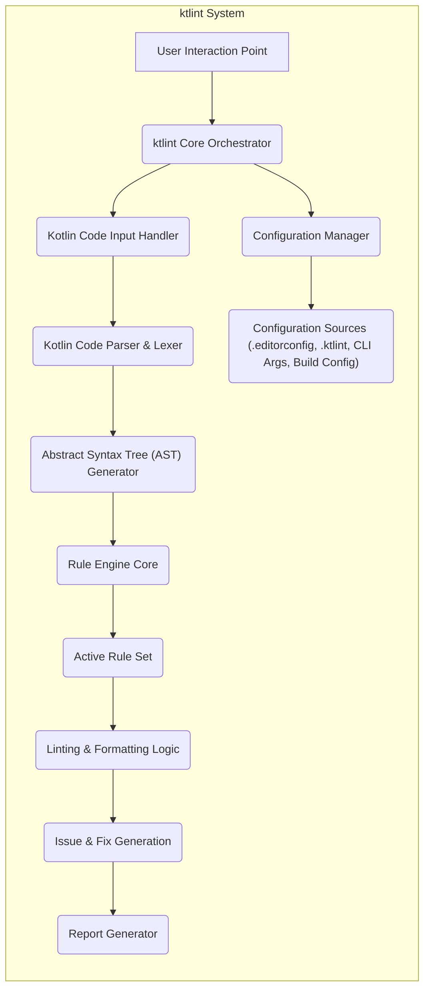

# Project Design Document: ktlint

**Version:** 1.1
**Date:** October 26, 2023
**Author:** AI Software Architect

## 1. Introduction

This document provides an enhanced and more detailed design overview of the ktlint project, a popular Kotlin linter and formatter. This revised document aims to provide an even clearer articulation of the architecture, components, and data flow within ktlint, specifically tailored for effective threat modeling activities. A thorough understanding of the system's design is paramount for identifying potential security vulnerabilities and designing appropriate mitigation strategies.

## 2. Goals and Non-Goals

**Goals:**

* Provide a comprehensive and detailed architectural overview of ktlint, suitable for security analysis.
* Clearly identify key components, their specific responsibilities, and their interactions with each other.
* Describe the data flow within the system with a focus on potential security-relevant data transformations and access points.
* Outline the different modes of operation and integration points, highlighting their unique security considerations.
* Serve as a robust and informative basis for future threat modeling exercises, enabling the identification of potential attack vectors and vulnerabilities.

**Non-Goals:**

* Provide a detailed, line-by-line code-level implementation guide.
* Document every single class or function within the ktlint codebase.
* Include performance benchmarks, optimization strategies, or resource utilization metrics.
* Cover the historical evolution of ktlint's development or provide specific release notes and changelogs.

## 3. High-Level Architecture

ktlint functions primarily as a command-line tool but is designed for seamless integration into various development workflows. Its core function is to analyze Kotlin source code against a configurable set of rules, identifying style violations and potential issues.

## 4. Detailed Architecture and Components

ktlint's architecture comprises several distinct components, each with specific responsibilities:

* **User Interaction Point:** This represents the various ways users initiate ktlint's execution.
    * **Command-Line Interface (CLI):** Users directly invoke the `ktlint` executable with specific commands, flags, and target files/directories. This involves parsing command-line arguments.
    * **Build Tool Integration (Gradle, Maven):** ktlint is triggered as part of the software build process through dedicated plugins. These plugins manage ktlint's execution and integrate its results into the build report.
    * **Editor Integration (IntelliJ IDEA, etc.):** ktlint operates in the background or on explicit user action within the IDE, providing real-time feedback and formatting capabilities. Editor plugins handle communication with the ktlint core.

* **ktlint Core Orchestrator:** This central component manages the overall linting and formatting process. It:
    * Receives the initial request and determines the execution context.
    * Delegates tasks to other components.
    * Manages the lifecycle of the linting process.
    * Handles error conditions and exceptions.

* **Kotlin Code Input Handler:** This component is responsible for receiving and preparing the Kotlin code for analysis. It:
    * Reads source code from files specified by the user or build system.
    * Potentially handles input streams or code snippets provided directly.
    * May perform initial filtering or preprocessing of the input.

* **Kotlin Code Parser & Lexer:** ktlint utilizes a robust Kotlin parser (likely leveraging components from the Kotlin compiler) to:
    * Lexically analyze the input code, breaking it down into tokens.
    * Parse the token stream to create a structured representation of the code.

* **Abstract Syntax Tree (AST) Generator:** This component transforms the parsed code into an Abstract Syntax Tree (AST). The AST:
    * Represents the hierarchical structure of the Kotlin code.
    * Provides a standardized and easily traversable representation for rule evaluation.

* **Rule Engine Core:** This is the heart of the linting process. It:
    * Manages the loading and execution of linting rules.
    * Iterates through the AST, applying each rule to relevant nodes.
    * Collects violations and formatting suggestions.

* **Active Rule Set:** This component represents the collection of linting rules that are currently enabled for execution. Rules can be:
    * **Built-in Rules:** Provided and maintained by the ktlint project.
    * **Custom Rules:** Developed by users and loaded into ktlint. These can be provided as JAR files or through other extension mechanisms.

* **Linting & Formatting Logic:** This encompasses the actual implementation of each linting rule. Rules:
    * Examine specific patterns and structures within the AST.
    * Identify code style violations, potential bugs, or areas for improvement.
    * May provide automatic fixes to resolve identified issues.

* **Issue & Fix Generation:** This component is responsible for:
    * Creating structured representations of linting violations (issues).
    * Generating suggested fixes for identified issues, where applicable.
    * Categorizing issues by severity and type.

* **Report Generator:** This component formats and outputs the linting results in various formats. It:
    * Consumes the generated issues and fixes.
    * Produces reports in formats like plain text, Checkstyle XML, JSON, or directly to the console.
    * Handles different levels of verbosity and detail in the reports.

* **Configuration Manager:** This component handles the loading and management of ktlint's configuration. It:
    * Reads configuration settings from multiple sources, prioritizing them appropriately.
    * Provides access to configuration values for other components.

* **Configuration Sources:** These are the various locations from which ktlint loads its configuration.
    * **`.editorconfig` files:** Used for basic code style settings that are often shared across different tools.
    * **`.ktlint` files:** ktlint-specific configuration files for enabling/disabling rules, setting severity levels, and configuring rule parameters.
    * **Command-line arguments:** Flags and options passed directly to the `ktlint` command.
    * **Build tool configuration:** Settings defined within Gradle or Maven build scripts.

## 5. Data Flow

The data flow within ktlint depends on the invocation method. Here's a breakdown:

**5.1. Command-Line Interface (CLI) Data Flow:**

**5.2. Build Tool Integration (Gradle/Maven) Data Flow:**

**5.3. Editor Integration Data Flow:**

## 6. Security Considerations (Detailed)

This section expands on potential security concerns, providing more specific examples and potential attack vectors relevant for threat modeling.

* **Configuration Injection Vulnerabilities:**
    * **Malicious `.editorconfig` or `.ktlint` files:** An attacker could introduce specially crafted configuration files that, when processed by ktlint, could lead to unexpected behavior. This could involve disabling critical rules, enabling overly permissive rules, or potentially influencing the execution of custom rules.
    * **Build Script Manipulation:** In build tool integrations, an attacker with control over the build script could modify ktlint's configuration or dependencies to introduce malicious rules or alter its behavior.

* **Code Injection (Indirect) through Crafted Kotlin Code:**
    * **Exploiting Parser Vulnerabilities:** While ktlint doesn't execute the analyzed code, vulnerabilities in the underlying Kotlin parser could be exploited with carefully crafted Kotlin code. This could lead to denial-of-service attacks by causing the parser to crash or consume excessive resources.
    * **Triggering Unexpected Behavior in Custom Rules:** Maliciously crafted Kotlin code could be designed to trigger vulnerabilities or unintended logic within custom linting rules, potentially leading to information disclosure or other security issues.

* **Dependency Management and Supply Chain Risks:**
    * **Vulnerable Dependencies:** ktlint relies on external libraries. If these dependencies have known vulnerabilities, they could be exploited if not properly managed and updated.
    * **Compromised Dependencies:** An attacker could potentially compromise a dependency used by ktlint, introducing malicious code that would be executed when ktlint runs.

* **Supply Chain Security of ktlint Distribution:**
    * **Compromised Release Artifacts:** If the official ktlint release artifacts are compromised, users downloading and using them would be exposed to malicious code.
    * **Unofficial or Modified Distributions:** Users obtaining ktlint from untrusted sources risk using modified versions that may contain malware or backdoors.

* **Information Disclosure:**
    * **Verbose Error Messages:** Detailed error messages generated by ktlint could inadvertently reveal sensitive information about the codebase structure, file paths, or internal configurations.
    * **Detailed Reports:** Highly verbose reports might expose code snippets or patterns that could be valuable to an attacker.

* **Security Risks Associated with Custom Rules:**
    * **Malicious Custom Rules:** Users can provide custom linting rules, which are essentially code executed by ktlint. If a user provides a malicious custom rule, it could perform arbitrary actions, including accessing the file system, network, or other resources accessible to the ktlint process.
    * **Vulnerabilities in Custom Rules:** Even unintentionally, poorly written custom rules could contain vulnerabilities that could be exploited.

* **File System Access Security:**
    * **Unauthorized File Access:** If ktlint is run with elevated privileges or has access to sensitive directories, vulnerabilities could allow an attacker to read or modify files they shouldn't have access to.
    * **Path Traversal Vulnerabilities:** If ktlint doesn't properly sanitize file paths provided as input, an attacker could potentially use path traversal techniques to access files outside the intended project directory.

## 7. Deployment

ktlint is deployed and utilized in several common scenarios, each with its own security implications:

* **Standalone Command-Line Tool:**
    * **Deployment:** Downloaded as a JAR file or executable and run directly from the command line.
    * **Security Considerations:** The security of this deployment depends on the source of the download and the permissions under which it is executed. It's crucial to download ktlint from the official repository or trusted sources.

* **Build Tool Plugin (Gradle/Maven):**
    * **Deployment:** Integrated into the build process by adding dependencies to the build script. The build tool manages the download and execution of ktlint.
    * **Security Considerations:** The security relies on the integrity of the build tool's dependency resolution mechanism and the trustworthiness of the repositories from which ktlint and its dependencies are downloaded. Compromised repositories could lead to the injection of malicious dependencies.

* **Editor Plugin (IntelliJ IDEA, etc.):**
    * **Deployment:** Installed as a plugin within the IDE. The IDE manages the plugin's lifecycle and execution.
    * **Security Considerations:** The security depends on the IDE's plugin security model and the trustworthiness of the plugin repository. Malicious plugins could potentially compromise the IDE and the user's system.

## 8. Future Considerations (Security-Focused)

This section outlines potential future enhancements with a strong focus on improving the security posture of ktlint.

* **Enhanced Custom Rule Security Model:**
    * **Sandboxing for Custom Rules:** Implementing a sandboxing mechanism to isolate the execution of custom rules, limiting their access to system resources and preventing them from causing harm.
    * **Stricter Custom Rule API:**  Developing a more restrictive and secure API for custom rule development, reducing the potential for malicious code injection or unintended side effects.
    * **Code Signing for Custom Rules:** Requiring custom rules to be digitally signed by trusted developers to ensure their integrity and authenticity.

* **Improved Configuration Validation and Sanitization:**
    * **Schema Validation for Configuration Files:** Implementing schema validation for `.editorconfig` and `.ktlint` files to prevent the loading of malformed or malicious configurations.
    * **Input Sanitization:**  Thoroughly sanitizing all input, including file paths and configuration values, to prevent path traversal or other injection attacks.

* **Regular Security Audits and Penetration Testing:**
    * **Proactive Security Assessments:** Conducting regular security audits and penetration testing to identify potential vulnerabilities in the ktlint codebase and its dependencies.

* **Secure Dependency Management Practices:**
    * **Dependency Scanning:** Implementing automated tools to scan dependencies for known vulnerabilities and alert developers to potential risks.
    * **Dependency Pinning:**  Pinning dependency versions to prevent unexpected updates that might introduce vulnerabilities.
    * **Software Bill of Materials (SBOM):** Generating and maintaining an SBOM to provide transparency into the components used by ktlint.

* **Enhanced Error Handling and Reporting:**
    * **Security-Aware Error Messages:**  Reviewing and revising error messages to avoid disclosing sensitive information.
    * **Configurable Reporting Verbosity:** Allowing users to control the level of detail in reports to minimize potential information leakage.

* **Strengthening Supply Chain Security:**
    * **Secure Release Processes:** Implementing secure release processes, including code signing and verification of release artifacts.
    * **Transparency and Provenance:** Providing clear information about the origin and build process of ktlint releases.

By focusing on these security considerations and future enhancements, the ktlint project can further strengthen its security posture and provide a safer and more reliable tool for Kotlin developers.