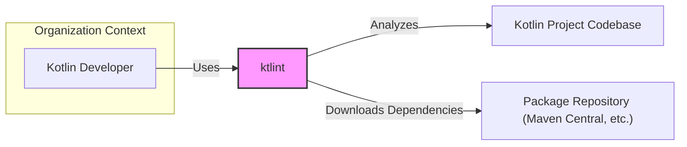
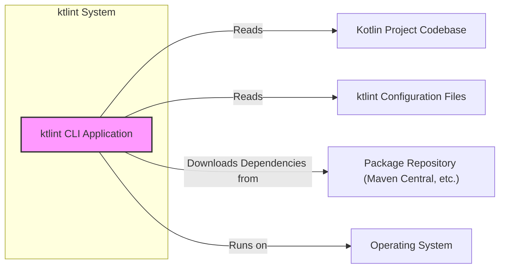
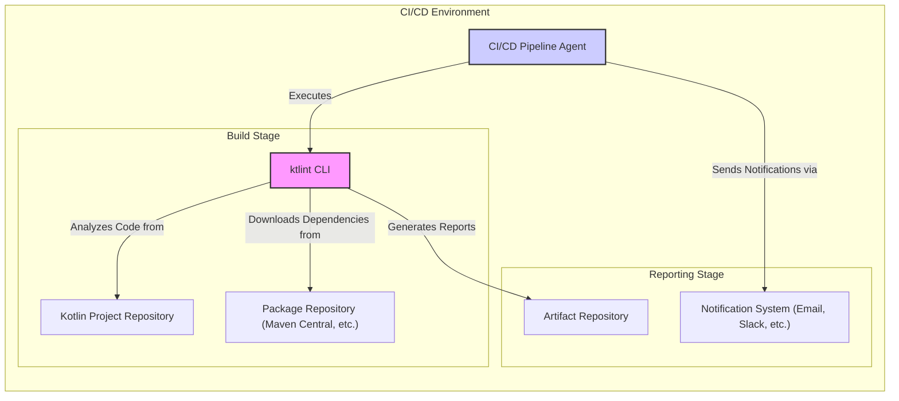
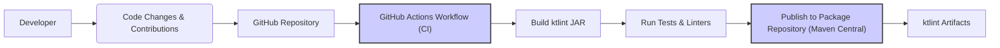

# BUSINESS POSTURE

The ktlint project is a static code analysis tool for Kotlin. It is primarily focused on ensuring code style consistency and identifying potential code quality issues in Kotlin projects.

- Business Priorities:
  - Maintainability of Kotlin codebases.
  - Code style consistency across projects and teams.
  - Improved code quality and reduced technical debt.
  - Developer productivity by automating code style checks and formatting.

- Business Risks:
  - Inconsistent code style leading to reduced readability and increased maintenance costs.
  - Code quality issues potentially leading to bugs and security vulnerabilities in Kotlin applications.
  - Increased development time due to manual code style checks and formatting.
  - Difficulty onboarding new developers to projects with inconsistent code styles.

# SECURITY POSTURE

- Existing Security Controls:
  - security control: GitHub repository access control (implemented by GitHub).
  - security control: Open source project with community review (implemented by GitHub and community).
  - accepted risk: Reliance on community contributions for security vulnerability identification and patching.
  - accepted risk: Potential vulnerabilities in dependencies used by ktlint.

- Recommended Security Controls:
  - security control: Dependency scanning to identify vulnerabilities in ktlint's dependencies.
  - security control: Static Application Security Testing (SAST) to scan ktlint's codebase for potential vulnerabilities.
  - security control: Code review process for all contributions to ktlint, focusing on security aspects.
  - security control: Security awareness training for ktlint maintainers and contributors.

- Security Requirements:
  - Authentication:
    - Requirement: Authentication is required for contributors to the ktlint project to ensure accountability and control over code changes (implemented by GitHub).
  - Authorization:
    - Requirement: Authorization is required to control access to the ktlint repository and its resources, ensuring only authorized individuals can modify the codebase or release artifacts (implemented by GitHub).
  - Input Validation:
    - Requirement: ktlint needs to validate input Kotlin code to prevent crashes or unexpected behavior when processing malformed or malicious code. This is especially important for custom rule definitions and configurations.
  - Cryptography:
    - Requirement: Cryptography is not a primary requirement for ktlint's core functionality. However, if ktlint were to implement features like secure configuration storage or communication, cryptographic measures would be necessary. For now, it's not a direct requirement.

# DESIGN

## C4 CONTEXT

- Context Diagram Elements:
  - Element:
    - Name: Kotlin Developer
    - Type: Person
    - Description: Software developers who write Kotlin code and use ktlint to ensure code quality and style consistency.
    - Responsibilities: Writes Kotlin code, uses ktlint to check and format code, configures ktlint rules.
    - Security controls: User authentication to developer workstations, code review processes.
  - Element:
    - Name: ktlint
    - Type: Software System
    - Description: A static code analysis tool for Kotlin that checks for code style issues and can automatically format code.
    - Responsibilities: Analyzes Kotlin code for style violations, formats Kotlin code, provides reports on code style issues, extensible rule set.
    - Security controls: Input validation of Kotlin code, dependency scanning, SAST during development.
  - Element:
    - Name: Kotlin Project Codebase
    - Type: Software System
    - Description: The Kotlin codebase being analyzed by ktlint. This could be a local file system or a version control repository.
    - Responsibilities: Contains the Kotlin source code to be analyzed, stores ktlint configuration files (e.g., .editorconfig, .ktlint).
    - Security controls: Access control to the codebase repository, code review processes, secure coding practices.
  - Element:
    - Name: Package Repository (Maven Central, etc.)
    - Type: External System
    - Description: Public or private repositories where ktlint and its dependencies are hosted and downloaded from.
    - Responsibilities: Hosts ktlint artifacts and its dependencies, provides access for downloading packages.
    - Security controls: Package signing, vulnerability scanning of hosted packages (repository provider responsibility).

## C4 CONTAINER

- Container Diagram Elements:
  - Element:
    - Name: ktlint CLI Application
    - Type: Application
    - Description: The command-line interface application of ktlint, written in Kotlin and distributed as a JAR file or executable.
    - Responsibilities: Parses command-line arguments, loads ktlint configuration, analyzes Kotlin code files, applies formatting rules, generates reports, interacts with the operating system.
    - Security controls: Input validation of command-line arguments and configuration files, dependency scanning, SAST, secure file handling, principle of least privilege for OS access.
  - Element:
    - Name: Kotlin Project Codebase
    - Type: Data Store
    - Description: The file system location where the Kotlin project's source code is stored.
    - Responsibilities: Stores Kotlin source code files, provides access to ktlint for analysis.
    - Security controls: File system permissions, access control lists, data loss prevention measures.
  - Element:
    - Name: ktlint Configuration Files
    - Type: Data Store
    - Description: Configuration files (e.g., .editorconfig, .ktlint) that define ktlint's behavior and rules.
    - Responsibilities: Stores ktlint configuration settings, allows customization of ktlint's behavior.
    - Security controls: File system permissions, input validation of configuration parameters, secure storage of sensitive configuration data (if any).
  - Element:
    - Name: Package Repository (Maven Central, etc.)
    - Type: External System
    - Description: Public or private repositories from which ktlint downloads its dependencies during runtime or build time.
    - Responsibilities: Hosts ktlint dependencies, provides access for downloading dependencies.
    - Security controls: Package signing, vulnerability scanning of hosted packages (repository provider responsibility).
  - Element:
    - Name: Operating System
    - Type: Infrastructure
    - Description: The operating system environment where ktlint CLI application is executed (e.g., Linux, macOS, Windows).
    - Responsibilities: Provides runtime environment for ktlint, manages system resources, handles file system operations.
    - Security controls: Operating system hardening, access control, security patching, anti-malware software.

## DEPLOYMENT

ktlint is primarily deployed in two main contexts:

1.  Developer's Local Machine: Developers download and run ktlint directly on their workstations to check and format code locally.
2.  CI/CD Pipelines: ktlint is integrated into CI/CD pipelines to automatically check code style and quality as part of the build process.

We will focus on the CI/CD Pipeline deployment scenario.

- Deployment Diagram Elements:
  - Element:
    - Name: CI/CD Pipeline Agent
    - Type: Infrastructure
    - Description: The server or virtual machine that executes the CI/CD pipeline stages, including running ktlint.
    - Responsibilities: Executes pipeline stages, manages build environment, orchestrates tasks, interacts with other CI/CD components.
    - Security controls: Secure configuration of CI/CD agent, access control, regular patching, network segmentation.
  - Element:
    - Name: ktlint CLI
    - Type: Application
    - Description: The ktlint command-line interface application, deployed within the CI/CD pipeline environment.
    - Responsibilities: Analyzes Kotlin code from the project repository, generates reports on code style violations, exits with appropriate status codes to indicate success or failure.
    - Security controls: Same as in Container Diagram - Input validation, dependency scanning, SAST.
  - Element:
    - Name: Kotlin Project Repository
    - Type: Data Store
    - Description: The version control repository (e.g., Git) where the Kotlin project's source code is stored and accessed by the CI/CD pipeline.
    - Responsibilities: Stores Kotlin source code, provides access to the CI/CD pipeline for code analysis.
    - Security controls: Repository access control, branch protection, audit logging, secure communication protocols (HTTPS, SSH).
  - Element:
    - Name: Package Repository (Maven Central, etc.)
    - Type: External System
    - Description: Public or private repositories from which ktlint and its dependencies are downloaded during the CI/CD build process.
    - Responsibilities: Hosts ktlint artifacts and dependencies, provides access for downloading packages.
    - Security controls: Package signing, vulnerability scanning of hosted packages (repository provider responsibility).
  - Element:
    - Name: Artifact Repository
    - Type: Data Store
    - Description: A repository where ktlint reports and other build artifacts are stored after the CI/CD pipeline execution.
    - Responsibilities: Stores ktlint reports, provides access to reports for developers and stakeholders.
    - Security controls: Access control to the artifact repository, secure storage of reports, data retention policies.
  - Element:
    - Name: Notification System (Email, Slack, etc.)
    - Type: External System
    - Description: A system used to send notifications about ktlint analysis results and CI/CD pipeline status to developers and stakeholders.
    - Responsibilities: Sends notifications, delivers reports or links to reports.
    - Security controls: Secure communication channels (HTTPS), access control to notification system, protection of sensitive information in notifications.

## BUILD

- Build Process Elements:
  - Element:
    - Name: Developer
    - Type: Person
    - Description: Software developers who contribute code changes to the ktlint project.
    - Responsibilities: Writes code, submits pull requests, participates in code reviews.
    - Security controls: Developer workstation security, secure coding practices, authentication to GitHub.
  - Element:
    - Name: Code Changes & Contributions
    - Type: Data
    - Description: Source code changes submitted by developers, typically via pull requests.
    - Responsibilities: Represents code modifications, triggers the build process.
    - Security controls: Code review process, static analysis on code changes, branch protection in Git.
  - Element:
    - Name: GitHub Repository
    - Type: Code Repository
    - Description: The GitHub repository hosting the ktlint source code.
    - Responsibilities: Stores source code, manages version control, triggers CI workflows.
    - Security controls: Repository access control, branch protection, audit logging, vulnerability scanning of repository infrastructure.
  - Element:
    - Name: GitHub Actions Workflow (CI)
    - Type: CI/CD System
    - Description: Automated CI workflow defined in GitHub Actions to build, test, and publish ktlint.
    - Responsibilities: Automates build process, runs tests, performs static analysis, publishes artifacts.
    - Security controls: Secure configuration of CI workflows, secret management, access control to CI environment, build isolation.
  - Element:
    - Name: Build ktlint JAR
    - Type: Build Process
    - Description: The step in the CI workflow that compiles the Kotlin code and packages it into a JAR file.
    - Responsibilities: Compiles Kotlin code, packages JAR artifact.
    - Security controls: Dependency management, build environment security, input validation during build.
  - Element:
    - Name: Run Tests & Linters
    - Type: Quality Assurance
    - Description: Automated tests and linters (including ktlint itself) are executed to verify code quality and functionality.
    - Responsibilities: Executes unit tests, runs static analysis tools, verifies code style.
    - Security controls: Test case coverage, SAST integration, linting rules enforcement.
  - Element:
    - Name: Publish to Package Repository (Maven Central)
    - Type: Release Process
    - Description: The step in the CI workflow that publishes the built ktlint JAR artifact to a package repository like Maven Central.
    - Responsibilities: Publishes artifacts, signs artifacts, manages release process.
    - Security controls: Secure credentials management for publishing, artifact signing, access control to package repository.
  - Element:
    - Name: ktlint Artifacts
    - Type: Software Artifacts
    - Description: The final ktlint JAR files and associated artifacts published to the package repository.
    - Responsibilities: Distributable ktlint binaries, used by end-users.
    - Security controls: Artifact signing, vulnerability scanning of published artifacts, secure storage in package repository.

# RISK ASSESSMENT

- Critical Business Processes:
  - Maintaining code quality and style consistency in Kotlin projects that use ktlint.
  - Ensuring the integrity and availability of the ktlint tool itself for the Kotlin development community.

- Data to Protect and Sensitivity:
  - Kotlin Source Code: Sensitivity - Medium. While generally not highly sensitive in open-source projects, it represents intellectual property and potential vulnerabilities if code quality is poor.
  - ktlint Configuration Files: Sensitivity - Low to Medium. May contain project-specific style rules or configurations that could be considered project-specific knowledge.
  - ktlint Artifacts (JAR files): Sensitivity - Medium. Integrity and authenticity are important to prevent supply chain attacks.
  - ktlint Reports: Sensitivity - Low. Contain information about code style issues, generally not sensitive.

# QUESTIONS & ASSUMPTIONS

- Questions:
  - What is the primary target audience for this design document? Is it for ktlint maintainers, users, or security auditors?
  - Are there any specific security concerns or threat scenarios that are of particular interest?
  - What is the risk appetite of the organization or individuals using ktlint?
  - Are there any specific compliance requirements that ktlint needs to adhere to?

- Assumptions:
  - The primary goal is to improve the security posture of the ktlint project and projects that use ktlint.
  - The focus is on common security best practices for open-source software and CI/CD pipelines.
  - The user is interested in understanding the security aspects of ktlint for threat modeling purposes.
  - ktlint is intended to be used in a variety of environments, from individual developer workstations to large enterprise CI/CD pipelines.