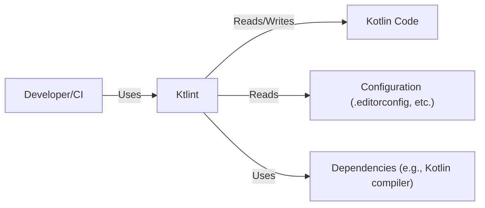
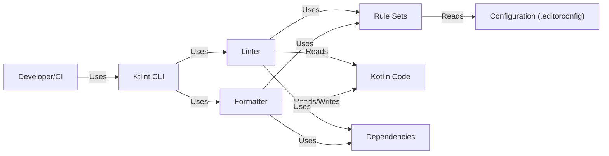
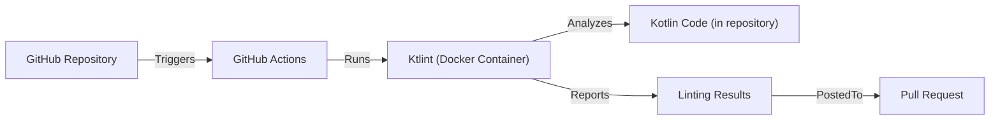
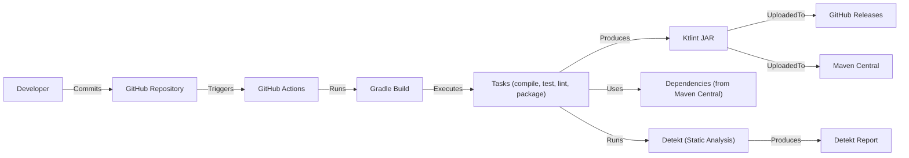

# Project Design Document: Ktlint

## BUSINESS POSTURE

Ktlint is a linter and formatter for Kotlin code. It aims to enforce a consistent coding style and reduce the cognitive load for developers by automating style enforcement.

Priorities:

*   Improve code quality and consistency across Kotlin projects.
*   Reduce time spent on code style debates and manual formatting.
*   Integrate seamlessly into developer workflows (IDE, build tools, CI/CD).
*   Provide clear and actionable feedback to developers.
*   Be highly configurable to accommodate different coding style preferences.
*   Maintainability and extensibility of Ktlint itself.

Goals:

*   Become a widely adopted standard tool for Kotlin code style enforcement.
*   Reduce bugs and improve readability by enforcing best practices.
*   Enable teams to focus on functionality rather than formatting.

Business Risks:

*   Inconsistent or incorrect linting rules could lead to frustration and decreased productivity.
*   Poor performance could slow down development workflows.
*   Lack of support for new Kotlin language features could limit adoption.
*   Lack of configuration options could make it difficult to adapt to existing project styles.
*   Lack of community engagement and contributions could lead to stagnation.
*   Security vulnerabilities in dependencies or in the linter itself could be exploited.

## SECURITY POSTURE

Existing Security Controls:

*   security control: Dependency management: Uses Gradle for dependency management, allowing for version control and vulnerability scanning. (build.gradle.kts)
*   security control: Code analysis: Uses Detekt for static analysis to identify potential code quality issues and security vulnerabilities. (build.gradle.kts)
*   security control: Testing: Extensive test suite to ensure correctness and prevent regressions. (src/test/kotlin)
*   security control: Continuous Integration: GitHub Actions are used for CI, running tests and checks on every pull request. (.github/workflows)
*   security control: Code Reviews: All changes are reviewed before merging. (GitHub pull requests)
*   security control: Signed Commits: Some contributors use signed commits. (git log)
*   security control: SLSA Level 1: Build process is automated.

Accepted Risks:

*   accepted risk: Reliance on third-party dependencies: Ktlint depends on external libraries, which could introduce vulnerabilities.
*   accepted risk: Limited scope of static analysis: Static analysis tools may not catch all potential security issues.
*   accepted risk: No formal security audits: While code reviews and testing are performed, no dedicated security audits are mentioned.
*   accepted risk: No fuzzing: No fuzzing is mentioned.
*   accepted risk: No SAST: No SAST is mentioned.
*   accepted risk: No DAST: No DAST is mentioned.
*   accepted risk: No IAST: No IAST is mentioned.
*   accepted risk: No RASP: No RASP is mentioned.

Recommended Security Controls:

*   security control: Implement SAST (Static Application Security Testing) scanning in the CI pipeline.
*   security control: Implement SCA (Software Composition Analysis) to identify and track dependencies and their known vulnerabilities.
*   security control: Regularly update dependencies to address known vulnerabilities.
*   security control: Consider implementing fuzzing to test for unexpected inputs and edge cases.
*   security control: Consider performing periodic security audits.
*   security control: Implement SLSA Level 3.

Security Requirements:

*   Authentication: Not applicable (Ktlint is a command-line tool and does not require authentication).
*   Authorization: Not applicable (Ktlint operates on local files and does not interact with external services requiring authorization).
*   Input Validation:
    *   Ktlint itself parses Kotlin code, which inherently involves input validation.
    *   Configuration files (if used) should be validated to prevent injection of malicious rules or settings.
*   Cryptography: Not directly applicable, but if Ktlint were to handle sensitive data (e.g., API keys in configuration), secure storage and encryption should be used. This is not the case in the current project.

## DESIGN

### C4 CONTEXT

Element Description:

*   Element:
    *   Name: Developer/CI
    *   Type: User
    *   Description: Developers or CI systems that use Ktlint to lint and format Kotlin code.
    *   Responsibilities: Running Ktlint, integrating it into workflows, and reviewing/applying its suggestions.
    *   Security controls: Code reviews, secure coding practices.

*   Element:
    *   Name: Ktlint
    *   Type: System
    *   Description: The Kotlin linter and formatter.
    *   Responsibilities: Parsing Kotlin code, applying linting rules, formatting code, reporting violations.
    *   Security controls: Input validation (of Kotlin code and configuration), dependency management, static analysis, testing.

*   Element:
    *   Name: Kotlin Code
    *   Type: Data
    *   Description: The Kotlin source code files that Ktlint processes.
    *   Responsibilities: N/A (passive data).
    *   Security controls: Secure coding practices, code reviews.

*   Element:
    *   Name: Configuration
    *   Type: Data
    *   Description: Configuration files (e.g., .editorconfig) that customize Ktlint's behavior.
    *   Responsibilities: N/A (passive data).
    *   Security controls: Input validation of configuration files.

*   Element:
    *   Name: Dependencies
    *   Type: External System
    *   Description: External libraries that Ktlint depends on, such as the Kotlin compiler.
    *   Responsibilities: Providing functionality required by Ktlint.
    *   Security controls: Dependency management, vulnerability scanning.

### C4 CONTAINER

Element Description:

*   Element:
    *   Name: Developer/CI
    *   Type: User
    *   Description: Developers or CI systems that use Ktlint to lint and format Kotlin code.
    *   Responsibilities: Running Ktlint, integrating it into workflows, and reviewing/applying its suggestions.
    *   Security controls: Code reviews, secure coding practices.

*   Element:
    *   Name: Ktlint CLI
    *   Type: Container (Command-line tool)
    *   Description: The command-line interface for Ktlint.
    *   Responsibilities: Parsing command-line arguments, invoking the linter and formatter, reporting results.
    *   Security controls: Input validation (of command-line arguments).

*   Element:
    *   Name: Linter
    *   Type: Container (Component)
    *   Description: The core linting engine.
    *   Responsibilities: Parsing Kotlin code, applying linting rules, reporting violations.
    *   Security controls: Input validation (of Kotlin code), static analysis.

*   Element:
    *   Name: Formatter
    *   Type: Container (Component)
    *   Description: The code formatting engine.
    *   Responsibilities: Automatically fixing style violations and formatting code.
    *   Security controls: Input validation (of Kotlin code).

*   Element:
    *   Name: Rule Sets
    *   Type: Container (Component)
    *   Description: A collection of rules that define the coding style.
    *   Responsibilities: Providing the rules for linting and formatting.
    *   Security controls: Rule validation, testing.

*   Element:
    *   Name: Configuration
    *   Type: Data
    *   Description: Configuration files (e.g., .editorconfig) that customize Ktlint's behavior.
    *   Responsibilities: N/A (passive data).
    *   Security controls: Input validation of configuration files.

*   Element:
    *   Name: Kotlin Code
    *   Type: Data
    *   Description: The Kotlin source code files that Ktlint processes.
    *   Responsibilities: N/A (passive data).
    *   Security controls: Secure coding practices, code reviews.

*   Element:
    *   Name: Dependencies
    *   Type: External System
    *   Description: External libraries that Ktlint depends on, such as the Kotlin compiler.
    *   Responsibilities: Providing functionality required by Ktlint.
    *   Security controls: Dependency management, vulnerability scanning.

### DEPLOYMENT

Ktlint is distributed as a standalone JAR file and can be deployed in several ways:

1.  **Manual Download:** Users can download the JAR file from the GitHub releases page.
2.  **Build Tool Integration:** Ktlint can be integrated into build tools like Gradle, Maven, and Ant.
3.  **IDE Integration:** Plugins are available for IDEs like IntelliJ IDEA and Android Studio.
4.  **CI/CD Integration:** Ktlint can be run as part of a CI/CD pipeline (e.g., using GitHub Actions).

Chosen Deployment (CI/CD with GitHub Actions):

Element Description:

*   Element:
    *   Name: GitHub Repository
    *   Type: Code Repository
    *   Description: The repository containing the Kotlin code.
    *   Responsibilities: Storing the code, triggering CI/CD workflows.
    *   Security controls: Access controls, branch protection rules.

*   Element:
    *   Name: GitHub Actions
    *   Type: CI/CD Platform
    *   Description: The CI/CD platform used to run Ktlint.
    *   Responsibilities: Orchestrating the workflow, running Ktlint in a container.
    *   Security controls: Secure configuration of workflows, access controls.

*   Element:
    *   Name: Ktlint (Docker Container)
    *   Type: Container
    *   Description: A Docker container containing Ktlint and its dependencies.
    *   Responsibilities: Running Ktlint on the Kotlin code.
    *   Security controls: Using a trusted base image, minimizing container size, regular updates.

*   Element:
    *   Name: Kotlin Code (in repository)
    *   Type: Data
    *   Description: The Kotlin source code files within the repository.
    *   Responsibilities: N/A (passive data).
    *   Security controls: Secure coding practices, code reviews.

*   Element:
    *   Name: Linting Results
    *   Type: Data
    *   Description: The results of the Ktlint analysis.
    *   Responsibilities: N/A (passive data).
    *   Security controls: N/A.

*   Element:
    *   Name: Pull Request
    *   Type: Collaboration Tool
    *   Description: The GitHub pull request where linting results are reported.
    *   Responsibilities: Facilitating code review and discussion.
    *   Security controls: Access controls, branch protection rules.

### BUILD

The Ktlint build process is automated using Gradle and GitHub Actions.

Security Controls in Build Process:

*   security control: Dependency Management: Gradle manages dependencies, allowing for version pinning and vulnerability scanning (using tools like OWASP Dependency-Check).
*   security control: Static Analysis: Detekt is used for static analysis to identify potential code quality issues and security vulnerabilities.
*   security control: Automated Testing: Extensive unit and integration tests are run as part of the build process.
*   security control: CI/CD: GitHub Actions automates the build, test, and release process, ensuring consistency and reducing manual errors.
*   security control: Code Reviews: All code changes are reviewed before merging.
*   security control: Signed Releases: Releases could be signed to ensure authenticity and integrity (not explicitly mentioned, but a recommended practice).

## RISK ASSESSMENT

Critical Business Processes:

*   Maintaining code quality and consistency across Kotlin projects.
*   Reducing developer time spent on style debates and manual formatting.
*   Ensuring the reliability and maintainability of Ktlint itself.

Data to Protect:

*   Kotlin source code (sensitivity varies depending on the project).  While Ktlint itself doesn't handle *sensitive* data like passwords or API keys, the *code* it analyzes might. The sensitivity of the code is therefore inherited.
*   Configuration files (low sensitivity, but could be used for malicious configuration).
*   Ktlint's own codebase (medium sensitivity, as vulnerabilities could be exploited).

## QUESTIONS & ASSUMPTIONS

Questions:

*   Are there any specific compliance requirements (e.g., coding standards) that Ktlint needs to adhere to?
*   What is the expected scale of usage (number of users, projects, lines of code)?
*   Are there any plans to extend Ktlint to support other languages or features beyond Kotlin linting and formatting?
*   What is the process for reporting and addressing security vulnerabilities in Ktlint?
*   Are there any specific performance requirements or limitations?

Assumptions:

*   BUSINESS POSTURE: The primary goal is to improve Kotlin code quality and developer productivity.
*   SECURITY POSTURE: Security is important, but not the absolute highest priority (compared to, say, a financial application).  A reasonable level of security is expected, but not extreme measures.
*   DESIGN: Ktlint is designed to be a flexible and extensible tool that can be integrated into various development workflows. The design reflects this, with modular components and clear separation of concerns. The provided diagrams are accurate representations of the system's architecture.