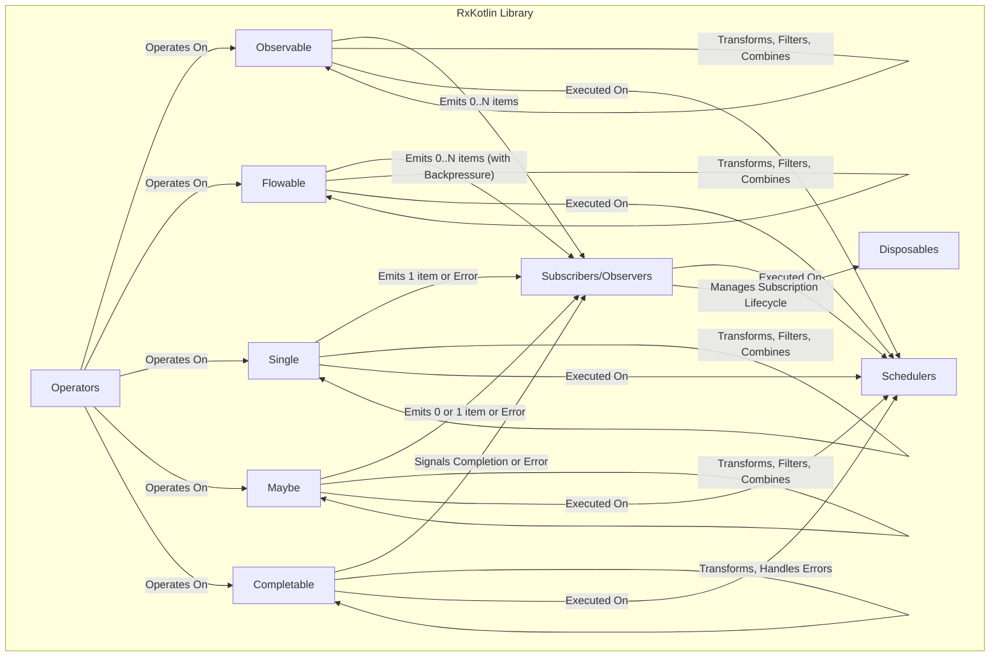
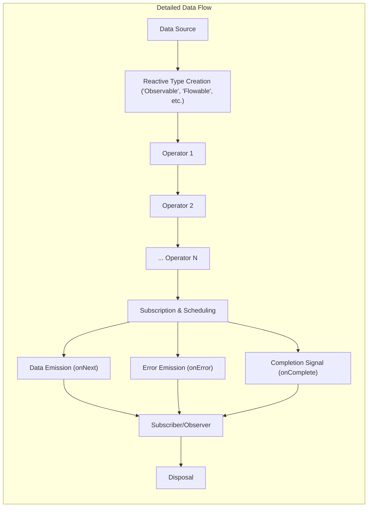

# Project Design Document: RxKotlin

**Version:** 1.1
**Date:** October 26, 2023
**Author:** AI Software Architect

## 1. Introduction

This document provides an enhanced design overview of the RxKotlin project, a library for composing asynchronous and event-based programs using observable sequences for the Kotlin programming language. This revised document aims to provide a more detailed and nuanced understanding of the project's architecture, components, and data flow, specifically tailored for threat modeling activities.

### 1.1. Purpose

The primary purpose of this document is to:

*   Provide a more in-depth description of the architecture and key components of the RxKotlin library, emphasizing aspects relevant to security.
*   Elaborate on the data flow and interactions within the library, highlighting potential points of vulnerability.
*   Identify specific areas of interest for security analysis and threat modeling, offering concrete examples.
*   Present a clear, concise, and technically accurate overview for security engineers, developers, and other stakeholders involved in assessing the security posture of systems using RxKotlin.

### 1.2. Scope

This document covers the core functionalities and design principles of the RxKotlin library as represented in the provided GitHub repository. It focuses on the library's internal structure, how it enables reactive programming paradigms, and its interaction with the underlying RxJava library. This revision provides more detail on specific components and their potential security implications. It does not cover specific applications built using RxKotlin or the intricate implementation details of the Java Virtual Machine (JVM), but it acknowledges their influence.

### 1.3. Audience

This document is intended for:

*   Security engineers responsible for threat modeling, security assessments, and penetration testing of applications using RxKotlin.
*   Software developers working with or integrating RxKotlin who need to understand its security implications.
*   Software architects designing systems that incorporate RxKotlin and need to consider its security characteristics.

## 2. Overview

RxKotlin is a Kotlin library that facilitates reactive programming by providing abstractions for asynchronous data streams and events. It acts as a set of Kotlin-friendly extensions and wrappers around the robust and mature RxJava library. This means understanding RxKotlin's security also requires understanding aspects of RxJava.

Key concepts in RxKotlin, crucial for understanding potential security implications, include:

*   **Observables, Flowables, Singles, Maybes, Completables:** These represent different types of asynchronous data streams with varying emission patterns and backpressure handling capabilities. Their misuse can lead to resource exhaustion or data leaks.
*   **Operators:** These functions manipulate data streams. Malicious or poorly designed operators can introduce vulnerabilities or expose sensitive information.
*   **Subscribers/Observers:** These consume data from the streams. Improper handling of errors or data within subscribers can lead to security issues.
*   **Schedulers:** These control the threading and execution context. Incorrect scheduler usage can lead to concurrency issues and race conditions.
*   **Disposables:** Managing these is crucial for preventing resource leaks, which can be a security concern in the long run.

## 3. Architectural Design

RxKotlin's architecture is fundamentally tied to RxJava, extending its functionality with Kotlin's features. Understanding the interaction between these two libraries is essential for a comprehensive security analysis.

### 3.1. Key Components

*   **`Observable<T>`:** Represents a stream of zero or more emitted items, potentially terminating with a completion or error signal. Without proper backpressure handling, unbounded `Observable` sources can lead to `OutOfMemoryError`.
*   **`Flowable<T>`:** Similar to `Observable`, but designed with built-in backpressure mechanisms to prevent overwhelming subscribers. Understanding the chosen backpressure strategy is important for preventing denial-of-service scenarios.
*   **`Single<T>`:** Represents a stream that will emit exactly one item or an error. Error handling for `Single` results is critical to prevent information disclosure.
*   **`Maybe<T>`:** Represents a stream that may emit zero or one item, or an error. Handling the "empty" case securely is important to avoid unexpected behavior.
*   **`Completable`:** Represents a stream that will complete successfully or with an error, emitting no items. Error handling is crucial for signaling failures securely.
*   **Operators:** A rich set of extension functions on the reactive types that enable complex data stream manipulations. Custom operators or misuse of standard operators can introduce vulnerabilities. Examples include:
    *   `map`:  Transforming data, potential for introducing vulnerabilities if transformations are not secure.
    *   `filter`:  Filtering data, ensuring sensitive data isn't inadvertently passed through.
    *   `flatMap`:  Asynchronously transforming and merging streams, complex concurrency considerations.
    *   `merge`, `zip`, `combineLatest`: Combining streams, potential for timing-related vulnerabilities or data corruption if not handled carefully.
*   **Schedulers:** Define the execution context for operations. Security implications arise from:
    *   `Schedulers.computation()`: For CPU-bound tasks, potential for resource exhaustion if misused.
    *   `Schedulers.io()`: For I/O-bound operations, managing thread pools and potential for blocking issues.
    *   `Schedulers.newThread()`: Creating new threads, overhead and potential for uncontrolled thread creation.
    *   `Schedulers.trampoline()`: Executing tasks sequentially on the current thread, potential for blocking the main thread.
    *   `Schedulers.single()`: A single, reusable thread, potential for bottlenecks and sequential processing vulnerabilities.
    *   `AndroidSchedulers.mainThread()` (Android specific): Operations on the UI thread, avoiding long-running tasks that can lead to ANR (Application Not Responding) errors.
*   **Subscribers/Observers:** Implement interfaces to react to stream events. Security considerations include:
    *   Proper error handling to prevent information leaks.
    *   Secure storage or transmission of received data.
    *   Prevention of denial-of-service by handling potentially large volumes of data.
*   **Disposables:** Represent the lifecycle of a subscription. Failure to dispose of subscriptions can lead to memory leaks and resource exhaustion, indirectly impacting security.

### 3.2. Component Diagram

### 3.3. Data Flow

The data flow in RxKotlin is characterized by asynchronous streams of data processed through a series of operators. Understanding this flow is crucial for identifying potential points of interception, manipulation, or leakage.

1. **Data Source:** Data originates from various sources, including:
    *   Local variables or data structures.
    *   User input events.
    *   Network responses.
    *   Database queries.
    *   Sensor data.
    *   External APIs. *Security Note:* Untrusted external sources are prime candidates for malicious data injection.
2. **Observable Creation:** The source data is encapsulated into one of the reactive types (`Observable`, `Flowable`, etc.). The choice of reactive type impacts backpressure handling and error propagation.
3. **Operator Pipeline:** Data flows through a sequence of operators, each performing a specific transformation or manipulation. *Security Note:* Each operator in the pipeline is a potential point for introducing vulnerabilities if not implemented or used correctly.
4. **Subscription and Scheduling:** A `Subscriber` attaches to the end of the observable pipeline, and the `Scheduler` determines the execution context for the operations. *Security Note:* Incorrect scheduling can lead to concurrency issues and race conditions, especially when dealing with shared mutable state.
5. **Data Emission and Processing:** Data items are emitted by the source and processed by each operator in the pipeline before reaching the subscriber.
6. **Error Handling:** Errors occurring at any point in the pipeline are typically propagated downstream to the subscriber's `onError` handler. *Security Note:*  Insufficient or overly verbose error handling can leak sensitive information.
7. **Completion:** The observable sequence may complete, signaling the end of the data stream.
8. **Disposal:** The subscription can be explicitly disposed of to release resources and stop the flow of data. *Security Note:* Failure to dispose of resources can lead to leaks and potential denial-of-service.

### 3.4. Data Flow Diagram

## 4. Security Considerations

RxKotlin, while providing powerful asynchronous capabilities, introduces several security considerations that developers must be aware of:

*   **Data Exposure in Streams:** Sensitive data flowing through observable streams is vulnerable if not handled with care.
    *   *Example:*  Passing unencrypted personally identifiable information (PII) through a stream that might be logged or monitored.
    *   *Mitigation:* Encrypt sensitive data before it enters the stream and decrypt it only when necessary. Use appropriate data masking techniques.
*   **Error Handling and Information Disclosure:**  Exceptions and error messages propagated through `onError` can inadvertently leak sensitive information.
    *   *Example:*  Database connection strings or internal system paths being included in error messages.
    *   *Mitigation:* Implement robust error handling that logs detailed error information securely (not to end-users) and provides generic, safe error messages to the subscriber.
*   **Resource Exhaustion and Denial of Service:**  Unbounded or rapidly emitting observables, especially without proper backpressure handling (using `Observable` instead of `Flowable` when needed), can lead to resource exhaustion.
    *   *Example:*  An observable emitting events faster than the subscriber can process them, leading to memory buildup.
    *   *Mitigation:* Use `Flowable` with appropriate backpressure strategies (e.g., `BUFFER`, `DROP`, `LATEST`) when dealing with potentially high-volume streams. Implement timeouts and circuit breakers.
*   **Concurrency Issues and Race Conditions:** Improper use of schedulers or shared mutable state within observable pipelines can lead to race conditions and data corruption.
    *   *Example:* Multiple subscribers modifying shared state concurrently without proper synchronization.
    *   *Mitigation:*  Favor immutable data structures. Use appropriate synchronization mechanisms when shared mutable state is necessary. Carefully choose schedulers to avoid unintended concurrency issues.
*   **Dependency Vulnerabilities (RxJava):** RxKotlin relies heavily on RxJava. Vulnerabilities in RxJava directly impact RxKotlin applications.
    *   *Mitigation:* Regularly update RxJava to the latest stable version to patch known vulnerabilities. Monitor security advisories for RxJava.
*   **Unintended Side Effects in Operators:** Custom operators or operators with side effects need careful review to ensure they don't introduce security flaws.
    *   *Example:* A custom operator that makes an external API call without proper authentication or authorization.
    *   *Mitigation:* Thoroughly test and review custom operators. Avoid side effects within operators if possible, or carefully manage them.
*   **Replay Attacks:** If observable streams are used to process security-critical events, consider the potential for replay attacks.
    *   *Example:* Replaying a "transfer funds" event.
    *   *Mitigation:* Implement mechanisms to detect and prevent replay attacks, such as using nonces or timestamps.
*   **Scheduler Manipulation (Less Common but Possible):** While less likely in typical application code, malicious code could potentially manipulate schedulers to cause denial-of-service or timing-related attacks.
    *   *Mitigation:*  Restrict access to scheduler configuration and ensure that the application's dependencies are trusted.

## 5. Dependencies

RxKotlin's security posture is intertwined with its dependencies:

*   **RxJava (io.reactivex.rxjava3:rxjava3):**  The core reactive library. Security vulnerabilities in RxJava are a direct concern for RxKotlin users. *Actionable Item for Threat Modeling:* Review the known vulnerabilities for the specific version of RxJava used by the target application.
*   **Kotlin Standard Library (org.jetbrains.kotlin:kotlin-stdlib):** The fundamental Kotlin library. While generally considered secure, vulnerabilities in the Kotlin standard library could indirectly affect RxKotlin applications. *Actionable Item for Threat Modeling:* Ensure the Kotlin standard library is up-to-date.

## 6. Deployment Considerations

The security implications of RxKotlin vary depending on the deployment environment:

*   **Backend Services:**
    *   *Security Concerns:* Exposure of sensitive data in asynchronous processing, potential for resource exhaustion due to uncontrolled streams, concurrency issues in multi-threaded environments.
    *   *Mitigation:* Implement secure data handling practices, use `Flowable` with appropriate backpressure, carefully manage schedulers and thread pools, implement robust error handling and logging.
*   **Mobile Applications (Android):**
    *   *Security Concerns:* Data leaks from background tasks, potential for denial-of-service on resource-constrained devices, concurrency issues on the main thread leading to ANRs.
    *   *Mitigation:* Avoid long-running operations on the main thread, use appropriate schedulers for background tasks, be mindful of battery and resource usage, securely store and transmit data.
*   **Desktop Applications:**
    *   *Security Concerns:* Similar to backend services, but potentially with a local user interface that could be vulnerable to manipulation.
    *   *Mitigation:* Follow secure coding practices for desktop applications, protect sensitive data stored locally, and validate user input.

## 7. Future Considerations

*   **Ongoing Security Audits:** Regular security audits of both RxKotlin and its underlying RxJava dependency are crucial to identify and address emerging vulnerabilities.
*   **Secure Coding Guidelines:**  Developing and promoting secure coding guidelines specifically for RxKotlin can help developers avoid common security pitfalls.
*   **Integration with Security Scanning Tools:**  Ensuring that static and dynamic analysis tools can effectively analyze code using RxKotlin is important for automated vulnerability detection.

## 8. Conclusion

This enhanced design document provides a more detailed and security-focused overview of the RxKotlin library. By understanding its architecture, data flow, and potential security considerations, security engineers and developers can more effectively identify and mitigate risks associated with its use. This document serves as a valuable resource for conducting thorough threat modeling and building more secure applications leveraging the power of reactive programming with RxKotlin.