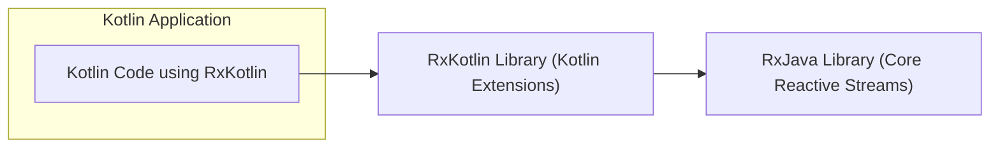
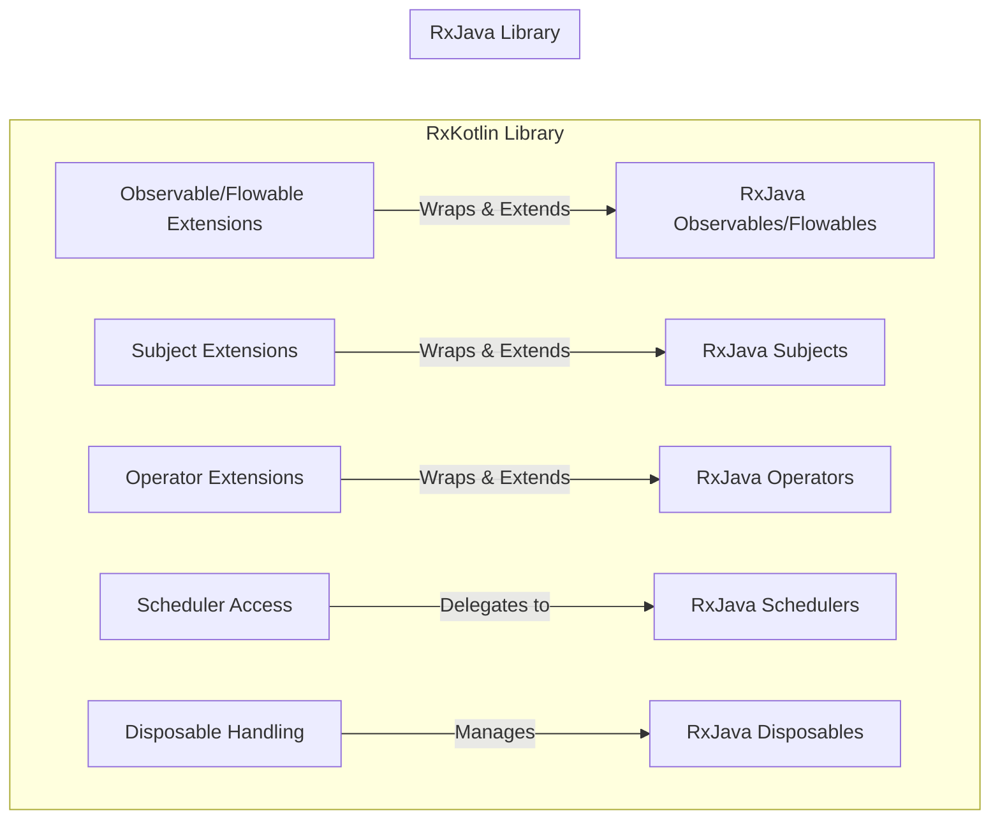
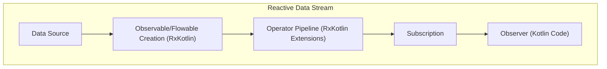

# Project Design Document: RxKotlin

**Version:** 1.1
**Date:** October 26, 2023
**Author:** AI Software Architect

## 1. Introduction

This document provides an enhanced architectural design overview of the RxKotlin project, a Kotlin library providing Reactive Extensions for asynchronous programming. This detailed design serves as a robust foundation for subsequent threat modeling activities, clearly outlining the system's components, data flow, and key interactions with a specific focus on potential security implications.

## 2. Goals and Objectives

The primary goal of RxKotlin is to offer a highly usable and idiomatic Kotlin API for Reactive Programming, seamlessly integrating with and extending the capabilities of RxJava. Key objectives include:

*   Providing intuitive Kotlin extension functions for core RxJava types like `Observable`, `Flowable`, and `Single`.
*   Simplifying the implementation of asynchronous and event-driven logic in Kotlin applications.
*   Offering a functional and declarative paradigm for managing complex data streams and event sequences.
*   Ensuring strong compatibility and smooth interoperability with the underlying RxJava library.
*   Minimizing the learning curve for Kotlin developers familiar with reactive programming concepts.

## 3. System Architecture

RxKotlin functions primarily as a library deeply embedded within other Kotlin applications. It does not operate as a standalone service or application. Its architectural design centers around providing Kotlin-specific extensions and convenient wrappers around the established core concepts of RxJava.

### 3.1. High-Level Architecture

*   **Kotlin Application:** The encompassing application that leverages the RxKotlin library to implement reactive programming patterns. This is the primary context where RxKotlin operates.
*   **RxKotlin Library (Kotlin Extensions):** The central focus of this design document. It provides Kotlin-specific syntactic sugar, extension functions, and utilities that build upon RxJava.
*   **RxJava Library (Core Reactive Streams):** The foundational Java library providing the core Reactive Streams implementation, upon which RxKotlin is built.

### 3.2. Component-Level Architecture

The fundamental components of RxKotlin directly mirror and extend the established concepts within the Reactive Extensions framework. RxKotlin provides Kotlin-idiomatic ways to interact with these core building blocks.

*   **Observable/Flowable Extensions:** Kotlin extension functions that enhance the creation, manipulation, and consumption of asynchronous data streams (`Observable` for regular streams, `Flowable` for backpressure support). These extensions provide a more Kotlin-friendly API over RxJava's counterparts.
*   **Subject Extensions:** Kotlin wrappers and extensions for RxJava's `Subject` types (e.g., `PublishSubject`, `BehaviorSubject`, `ReplaySubject`). Subjects act as both an `Observable` and an `Observer`, facilitating multicasting and dynamic event handling.
*   **Operator Extensions:** A rich set of Kotlin extension functions corresponding to RxJava's operators (e.g., `map`, `filter`, `flatMap`, `debounce`). These operators enable declarative and functional transformations of data streams.
*   **Scheduler Access:** RxKotlin provides mechanisms to access and utilize RxJava's `Scheduler` implementations. Schedulers control the execution context (thread) on which Observables emit items and Observers receive them.
*   **Disposable Handling:** RxKotlin facilitates the management of resources associated with subscriptions through `Disposable` objects. Proper disposal is crucial to prevent memory leaks and resource exhaustion.

## 4. Data Flow

The flow of data within an application utilizing RxKotlin adheres to the principles of Reactive Streams:

*   **Source:** Data originates from diverse sources within the Kotlin application (e.g., network calls, user interactions, sensor readings, database queries).
*   **Observable/Flowable Creation:** The source data is encapsulated within an `Observable` (for streams without backpressure concerns) or a `Flowable` (for streams requiring backpressure management). RxKotlin provides convenient ways to create these reactive streams.
*   **Operator Pipeline:** The `Observable` or `Flowable` then passes through a sequence of operators. Each operator performs a specific transformation, filtering, combination, or manipulation of the data stream.
*   **Subscription and Observation:** An `Observer` subscribes to the final `Observable` or `Flowable` in the pipeline. The `Observer` then reacts to the emitted data items, error signals, or completion signals.
*   **Scheduler Context:** The execution of operators and the delivery of items to the `Observer` can be controlled by specifying `Scheduler` instances, dictating the threads on which these operations occur.

*   **Data Source:** The origin point of the data stream within the application.
*   **Observable/Flowable Creation (RxKotlin):**  The process of wrapping the data source into a reactive stream using RxKotlin's extension functions.
*   **Operator Pipeline (RxKotlin Extensions):** A chain of operators applied to the data stream using RxKotlin's convenient syntax.
*   **Subscription:** The act of an `Observer` connecting to the `Observable`/`Flowable` to begin receiving data.
*   **Observer (Kotlin Code):** The component within the Kotlin application that consumes and reacts to the data emitted by the reactive stream.

## 5. Key Components and Interactions

This section provides a more detailed look at the key components within the RxKotlin library and how they interact with each other and the underlying RxJava library.

*   **Observable/Flowable Extension Functions:**
    *   Provide Kotlin-specific syntax for creating `Observable` and `Flowable` instances from various sources (e.g., collections, callbacks, suspending functions).
    *   Offer extension functions that mirror RxJava's creation methods but with improved Kotlin integration (e.g., using Kotlin lambdas).
    *   Example: `listOf(1, 2, 3).toObservable()` creates an `Observable` emitting the numbers 1, 2, and 3.
*   **Subject Extension Functions:**
    *   Simplify the creation and usage of different `Subject` types, allowing for flexible event broadcasting and state management.
    *   Provide Kotlin-friendly ways to emit items to a `Subject` and subscribe to it.
    *   Example: `val subject = PublishSubject.create<Int>(); subject.onNext(42)` emits the value 42 to subscribers of the `subject`.
*   **Operator Extension Functions:**
    *   Offer a comprehensive set of extension functions for transforming, filtering, combining, and manipulating data streams.
    *   Enable a fluent and readable style for chaining operators.
    *   Example: `observable.filter { it > 10 }.map { it * 2 }` filters values greater than 10 and then multiplies them by 2.
*   **Scheduler Management and Integration:**
    *   RxKotlin seamlessly integrates with RxJava's `Scheduler` concept, allowing developers to control the threading context of reactive operations.
    *   Provides extension functions for specifying schedulers for different parts of the reactive pipeline (e.g., `subscribeOn`, `observeOn`).
    *   Example: `observable.subscribeOn(Schedulers.io()).observeOn(AndroidSchedulers.mainThread()).subscribe { ... }` performs the subscription on an I/O thread and observes results on the main thread (Android example).
*   **Disposable Handling Mechanisms:**
    *   RxKotlin leverages RxJava's `Disposable` interface for managing the lifecycle of subscriptions.
    *   Provides Kotlin-idiomatic ways to dispose of subscriptions, preventing resource leaks.
    *   Example: Storing a `Disposable` and calling `dispose()` on it when the subscription is no longer needed.

## 6. Security Considerations (for Threat Modeling)

While RxKotlin itself is a library and doesn't introduce direct security vulnerabilities in the same way a standalone application might, its usage can significantly impact the security posture of the applications that depend on it. Threat modeling should carefully consider the following aspects:

*   **Unintended Data Exposure through Side Effects in Operators:** Operators that perform side effects (e.g., logging sensitive information, writing to a file without proper permissions, making external API calls with sensitive data in the URI) can inadvertently expose sensitive data if not implemented and used with security in mind.
    *   **Example Threat:** A `doOnNext` operator logging user credentials.
*   **Information Disclosure through Error Handling:** Improper or overly verbose error handling within reactive streams can leak sensitive information through exception messages or stack traces, potentially revealing internal system details to attackers.
    *   **Example Threat:** Catching an exception and logging its full stack trace, which might contain file paths or database connection strings.
*   **Denial of Service (DoS) through Resource Exhaustion:** Unbounded or poorly managed reactive streams, especially those dealing with external data sources or user input, can lead to resource exhaustion (CPU, memory, network) and result in denial-of-service conditions.
    *   **Example Threat:** An `Observable` processing an unbounded stream of user-generated events without proper backpressure handling, leading to memory exhaustion.
*   **Concurrency Vulnerabilities (Race Conditions, Deadlocks):** Incorrect or unsafe use of Schedulers and concurrent operators can introduce race conditions, deadlocks, and other concurrency-related vulnerabilities, potentially leading to inconsistent state or unexpected behavior.
    *   **Example Threat:** Multiple threads updating shared state within a reactive stream without proper synchronization.
*   **Dependency Chain Vulnerabilities:** As RxKotlin depends on RxJava, vulnerabilities present in RxJava can indirectly affect applications using RxKotlin. Maintaining up-to-date dependencies is crucial for mitigating this risk.
    *   **Example Threat:** A known security flaw in a specific version of RxJava that RxKotlin depends on.
*   **Injection Attacks through Unvalidated Input:** If reactive streams process user input or data from external, untrusted sources without proper validation and sanitization, applications become susceptible to various injection attacks (e.g., SQL injection if the data is used in database queries).
    *   **Example Threat:** Using user input directly in a `filter` operator that constructs a database query.
*   **Backpressure Handling Failures Leading to Data Loss or Instability:** Incorrect or absent backpressure handling in `Flowable` streams can lead to data loss or application instability when the producer emits data faster than the consumer can process it. This can have security implications if critical data is lost.
    *   **Example Threat:** Dropping events in a security audit log due to backpressure issues.
*   **Timing Attacks:** In certain scenarios, the timing of events within a reactive stream could be exploited to infer sensitive information.
    *   **Example Threat:** Observing the time it takes for a reactive stream to process a login attempt to differentiate between valid and invalid usernames.

## 7. Deployment Considerations

RxKotlin is deployed as a library dependency within Kotlin applications. The deployment process typically involves:

*   **Declaring the RxKotlin dependency** in the project's build configuration file (e.g., `build.gradle.kts` for Gradle projects).
*   **Ensuring version compatibility** between RxKotlin, Kotlin, and the underlying RxJava library.
*   **Packaging the application** along with its dependencies into an executable artifact (e.g., a JAR file for JVM applications, an APK for Android applications).
*   **Deploying the packaged application** to the target environment (e.g., a server, a mobile device).

## 8. Technologies Used

*   **Kotlin:** The primary programming language for RxKotlin and the applications that use it.
*   **RxJava:** The foundational Reactive Extensions library for the JVM, providing the core reactive types and operators.
*   **Gradle or Maven:** Common build tools used for managing project dependencies, including RxKotlin.

## 9. Future Considerations

*   Exploring deeper integration with Kotlin Coroutines to provide more seamless interoperability between reactive streams and coroutine-based asynchronous code.
*   Developing more Kotlin-specific operators and utilities that leverage Kotlin's language features for enhanced expressiveness and safety.
*   Continuously improving documentation, providing more comprehensive examples, and addressing common usage patterns and potential pitfalls.
*   Monitoring the evolution of RxJava and adapting RxKotlin to leverage new features and improvements in the underlying library.

This enhanced design document provides a more detailed and security-focused overview of the RxKotlin project's architecture. By thoroughly understanding the components, data flow, potential security considerations, and deployment aspects, security professionals can conduct more effective threat modeling and implement appropriate security measures to mitigate potential risks associated with the use of RxKotlin in applications.