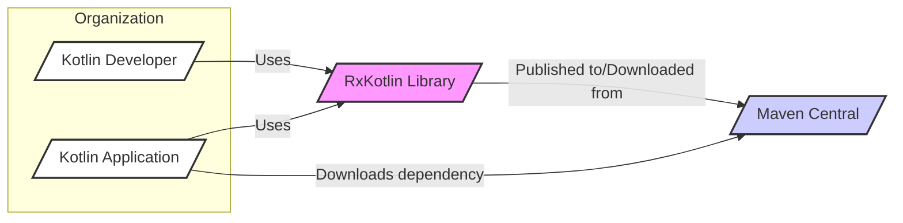
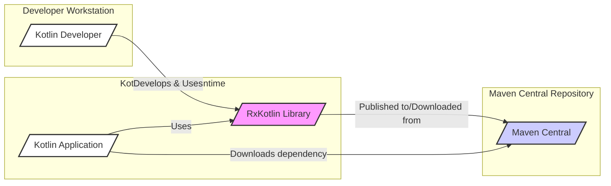
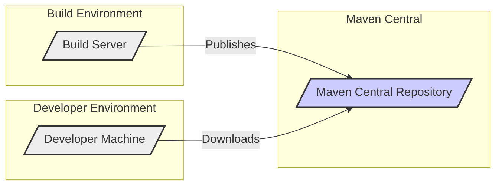
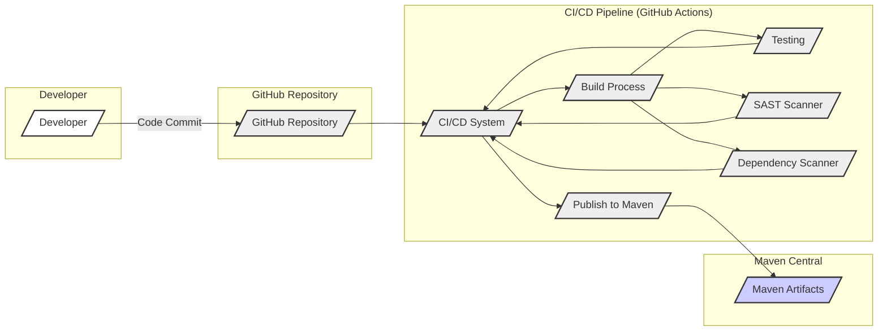

# BUSINESS POSTURE

This project, RxKotlin, provides a Kotlin language binding for ReactiveX (Reactive Extensions). ReactiveX is a library for composing asynchronous and event-based programs by using observable sequences. The primary business goal of RxKotlin is to simplify the development of asynchronous and reactive applications in Kotlin, enabling developers to write more efficient, responsive, and maintainable code.

Business priorities addressed by RxKotlin include:

- Improving application responsiveness and user experience by enabling non-blocking operations and efficient handling of asynchronous events.
- Simplifying complex asynchronous logic through declarative operators and reactive streams.
- Enhancing code maintainability and readability by providing a structured approach to asynchronous programming.
- Increasing developer productivity by offering a well-defined and widely adopted reactive programming paradigm.
- Enabling the development of scalable and resilient applications capable of handling high volumes of data and events.

Key business risks associated with using RxKotlin include:

- Dependency risk: Reliance on an external library introduces a dependency that needs to be maintained and updated. Bugs or vulnerabilities in RxKotlin could impact applications using it.
- Learning curve: Reactive programming concepts can be complex, potentially requiring developer training and time to adopt effectively.
- Performance overhead: While designed for efficiency, improper use of reactive programming or RxKotlin operators could introduce performance bottlenecks.
- Compatibility issues:  Potential compatibility issues with other libraries or frameworks used in conjunction with RxKotlin.
- Security vulnerabilities: Although less direct for a library, vulnerabilities in RxKotlin itself could be exploited if not properly addressed.

# SECURITY POSTURE

Existing security controls:

- security control: Open Source project with public code repository on GitHub. This allows for community review and scrutiny of the codebase. (Implemented: GitHub Repository)
- security control: Unit and integration tests. These tests help ensure the library functions as expected and reduce the likelihood of bugs, including security-related bugs. (Implemented: Project's test suite)
- security control: Reliance on ReactiveX core library. RxKotlin is a binding for ReactiveX, inheriting some of the maturity and scrutiny of the core ReactiveX project. (Implemented: Dependency on ReactiveX)
- accepted risk:  Vulnerability in dependencies. RxKotlin depends on other libraries, and vulnerabilities in those dependencies could indirectly affect RxKotlin.
- accepted risk:  Community-driven security. Security relies on the open-source community to identify and report vulnerabilities. Response time to security issues may vary.

Recommended security controls:

- security control: Dependency scanning. Implement automated dependency scanning to identify known vulnerabilities in RxKotlin's dependencies.
- security control: Static Application Security Testing (SAST). Integrate SAST tools into the development process to automatically analyze the RxKotlin codebase for potential security flaws.
- security control: Security vulnerability reporting process. Establish a clear process for security researchers and users to report potential vulnerabilities in RxKotlin.
- security control: Regular security audits. Conduct periodic security audits of the RxKotlin codebase by security experts.

Security requirements:

- Authentication: Not directly applicable to a library. Authentication is the responsibility of applications using RxKotlin.
- Authorization: Not directly applicable to a library. Authorization is the responsibility of applications using RxKotlin.
- Input validation: While RxKotlin itself doesn't directly handle user input, applications using RxKotlin must perform input validation on data streams processed by RxKotlin to prevent injection attacks and other input-related vulnerabilities.
- Cryptography: RxKotlin itself does not implement cryptographic functions. If applications using RxKotlin require cryptography, they should use established and secure cryptographic libraries. RxKotlin should not introduce any weaknesses that could undermine the security of cryptographic operations performed by consuming applications.

# DESIGN

## C4 CONTEXT

Context Diagram Elements:

- Element:
    - Name: Kotlin Developer
    - Type: Person
    - Description: Software developers who use RxKotlin to build Kotlin applications.
    - Responsibilities:  Utilize RxKotlin library to implement reactive and asynchronous logic in Kotlin applications. Integrate RxKotlin into their projects.
    - Security controls:  Responsible for using RxKotlin securely and correctly in their applications.  Following secure coding practices when using reactive programming.

- Element:
    - Name: Kotlin Application
    - Type: Software System
    - Description: Applications built using the Kotlin programming language that incorporate the RxKotlin library.
    - Responsibilities:  Provide business functionality to end-users. Utilize RxKotlin for managing asynchronous operations, event streams, and reactive components.
    - Security controls: Implement application-level security controls, including authentication, authorization, input validation, and secure data handling.  Ensure secure integration with RxKotlin and other dependencies.

- Element:
    - Name: RxKotlin Library
    - Type: Software System
    - Description:  A Kotlin library providing Reactive Extensions for composing asynchronous and event-based programs.
    - Responsibilities: Provide reactive programming primitives and operators for Kotlin developers.  Function correctly and efficiently as a library dependency.
    - Security controls: Undergo security testing and code review.  Maintain secure development practices.  Publish signed and verified releases.

- Element:
    - Name: Maven Central
    - Type: External System
    - Description: A central repository for Java and Kotlin libraries, used for distributing and managing RxKotlin library.
    - Responsibilities: Host and distribute RxKotlin library artifacts. Provide a reliable and accessible repository for dependency management.
    - Security controls: Implement security measures to protect the repository from unauthorized access and tampering.  Provide secure download mechanisms (HTTPS).

## C4 CONTAINER

Container Diagram Elements:

- Element:
    - Name: Kotlin Developer
    - Type: Person
    - Description: Software developers who develop and use RxKotlin.
    - Responsibilities: Develop and contribute to RxKotlin library. Use RxKotlin in Kotlin applications.
    - Security controls: Secure development practices on their workstations. Code review contributions to RxKotlin.

- Element:
    - Name: RxKotlin Library
    - Type: Container (Library)
    - Description: The RxKotlin library itself, containing Kotlin code implementing Reactive Extensions.
    - Responsibilities: Provide reactive programming functionality.  Be a secure and reliable library.
    - Security controls: Code reviews, static analysis, dependency scanning, security testing, secure build and release process.

- Element:
    - Name: Kotlin Application
    - Type: Container (Application)
    - Description:  A Kotlin application that depends on and uses the RxKotlin library.
    - Responsibilities:  Utilize RxKotlin for reactive programming within the application. Implement application-specific logic.
    - Security controls: Application-level security controls (authentication, authorization, input validation, etc.). Securely integrate and use RxKotlin.

- Element:
    - Name: Maven Central
    - Type: External System (Repository)
    - Description:  The Maven Central repository hosting the RxKotlin library.
    - Responsibilities:  Distribute RxKotlin library artifacts. Ensure availability and integrity of the library.
    - Security controls: Repository security controls, access control, secure artifact storage and delivery.

## DEPLOYMENT

Deployment Architecture: Library Distribution

RxKotlin is a library, so its "deployment" is primarily about its distribution to developers for inclusion in their applications. The main deployment environment is Maven Central.

Deployment Diagram Elements:

- Element:
    - Name: Build Server
    - Type: Infrastructure (Server)
    - Description:  A server used for building, testing, and publishing the RxKotlin library.  Could be a CI/CD system like GitHub Actions, Jenkins, or similar.
    - Responsibilities: Automate the build process. Run tests and security checks. Publish release artifacts to Maven Central.
    - Security controls: Secure build environment. Access control to build server. Secure credentials management for publishing. Build process security checks (SAST, dependency scanning).

- Element:
    - Name: Maven Central Repository
    - Type: Infrastructure (Repository)
    - Description: The Maven Central repository where RxKotlin library artifacts are hosted.
    - Responsibilities: Store and distribute RxKotlin artifacts. Provide access to developers for downloading the library.
    - Security controls: Repository security measures. Access control. Integrity checks of artifacts. Secure download protocols (HTTPS).

- Element:
    - Name: Developer Machine
    - Type: Infrastructure (Workstation)
    - Description:  Developer's local machine where they develop Kotlin applications and download RxKotlin dependencies.
    - Responsibilities:  Download RxKotlin library from Maven Central. Integrate RxKotlin into Kotlin projects.
    - Security controls:  Developer workstation security. Secure dependency management tools (e.g., Gradle, Maven).

## BUILD

Build Process: Automated CI/CD Pipeline

RxKotlin likely uses an automated build process, potentially GitHub Actions, to build, test, and publish the library.

Build Process Security Controls:

- Supply Chain Security:
    - Control: Secure code repository (GitHub). Access control and audit logs for code changes.
    - Control: Secure CI/CD pipeline (GitHub Actions or similar).  Restrict access to pipeline configuration and secrets.
    - Control: Dependency management. Use dependency management tools (Gradle) to manage and track dependencies.
    - Control: Dependency scanning. Automated scanning of dependencies for known vulnerabilities during the build process.
- Build Automation:
    - Control: Automated build process using CI/CD. Reduces manual steps and potential for errors.
    - Control: Infrastructure as Code (IaC) for build environment configuration (if applicable).
- Security Checks during Build:
    - Control: Static Application Security Testing (SAST). Automated SAST tools integrated into the build pipeline to detect potential code-level vulnerabilities.
    - Control: Unit and integration tests. Automated tests to verify functionality and reduce bugs.
    - Control: Code linters and formatters. Enforce code quality and consistency, which can indirectly improve security.
    - Control: Software Composition Analysis (SCA) / Dependency Scanning. Identify vulnerable dependencies.
- Artifact Signing and Verification:
    - Control: Sign release artifacts (JAR files) with a digital signature.
    - Control: Publish checksums (SHA-256) of artifacts for integrity verification.
    - Control: Secure publishing to Maven Central using appropriate credentials and protocols.

# RISK ASSESSMENT

Critical business processes protected:

- Development of responsive and efficient Kotlin applications.
- Simplification of asynchronous programming in Kotlin.
- Improved maintainability and readability of Kotlin code dealing with asynchronous operations.
- Faster development cycles for reactive applications in Kotlin.

Data being protected and sensitivity:

- RxKotlin library code itself: Sensitivity is high, as vulnerabilities in the library could impact many applications using it. Integrity and availability of the code are crucial.
- Build and release artifacts (JAR files): Sensitivity is high. Integrity and authenticity of release artifacts are critical to prevent supply chain attacks.
- Developer credentials and secrets used in the build process: Sensitivity is very high. Compromise could lead to unauthorized code changes or malicious releases.
- Metadata about the library (version numbers, dependencies): Sensitivity is low to medium. Integrity is important for dependency management.

# QUESTIONS & ASSUMPTIONS

Questions:

- What is the specific risk appetite of the organization using this design document? (Startup vs. Fortune 500)
- Are there any specific compliance requirements that RxKotlin needs to adhere to (e.g., security certifications)?
- What is the expected usage scale and performance requirements for applications using RxKotlin?
- Are there any specific security incidents or concerns related to reactive programming or similar libraries that need to be considered?
- What is the current level of security maturity of the development and build processes for RxKotlin?

Assumptions:

- RxKotlin is intended to be a widely used open-source library.
- Security and code quality are important considerations for the RxKotlin project.
- Standard open-source development practices are generally followed.
- The build and release process is automated using a CI/CD system.
- Maven Central is the primary distribution channel for RxKotlin.
- Applications using RxKotlin are responsible for their own application-level security controls.