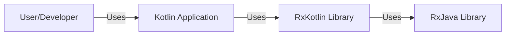
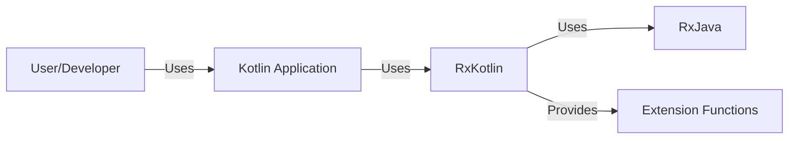
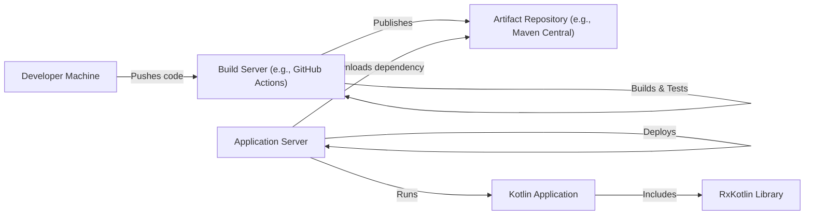
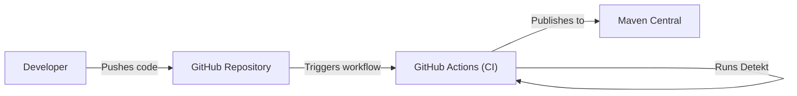

Okay, let's create a design document for the RxKotlin project.

# BUSINESS POSTURE

RxKotlin is a lightweight library that adds convenient extension functions to RxJava, making it more Kotlin-friendly.  It's not a standalone application but a utility library intended to improve the developer experience when using RxJava within Kotlin projects.

Priorities:

*   Ease of Use:  Make reactive programming with RxJava in Kotlin more idiomatic and concise.
*   Interoperability: Seamlessly integrate with existing RxJava codebases.
*   Maintainability:  Keep the library small, well-tested, and easy to update.
*   Community Adoption: Encourage widespread use within the Kotlin/RxJava community.

Goals:

*   Reduce boilerplate code when using RxJava in Kotlin.
*   Provide Kotlin-specific extensions that leverage language features (e.g., extension functions, null safety, coroutines).
*   Improve the readability and maintainability of reactive code.

Business Risks:

*   Low Adoption: If developers don't find the library useful or prefer alternative solutions (like Kotlin Flows), the project may become obsolete.
*   Compatibility Issues:  Changes in RxJava or Kotlin could break compatibility, requiring significant maintenance effort.
*   Lack of Maintenance:  If the project is not actively maintained, bugs and security vulnerabilities may go unaddressed.
*   Security Vulnerabilities: While a library itself might have limited attack surface, vulnerabilities in its dependencies (RxJava) or misuse of the library in a larger application could lead to security issues.

# SECURITY POSTURE

RxKotlin, as a library, has a relatively small attack surface.  It primarily provides extension functions and doesn't directly handle user input, network communication, or persistent data.  The security posture largely depends on how it's used within a larger application and the security of its dependencies.

Existing Security Controls:

*   security control: Dependency Management: The project uses Gradle for dependency management, specifying versions of RxJava and other libraries. (build.gradle.kts)
*   security control: Testing:  The project includes a suite of unit tests to ensure functionality and prevent regressions. (src/test/kotlin)
*   security control: Code Reviews: Contributions are likely subject to code reviews before being merged, although this is not explicitly stated in the repository, it is a standard practice.
*   security control: Static Analysis: The project uses Detekt for static analysis to identify potential code quality and security issues. (.github/workflows/detekt.yml)
*   security control: Continuous Integration: GitHub Actions are used for continuous integration, running tests and static analysis on every push and pull request. (.github/workflows)

Accepted Risks:

*   accepted risk: Reliance on RxJava Security: The security of RxKotlin fundamentally depends on the security of RxJava. Any vulnerabilities in RxJava could potentially impact applications using RxKotlin.
*   accepted risk: Limited Direct Security Features:  RxKotlin itself doesn't implement specific security features like input validation or encryption, as these are typically handled by the application using the library.

Recommended Security Controls:

*   security control: Dependency Scanning: Implement automated dependency scanning (e.g., using tools like Snyk or Dependabot) to identify and address known vulnerabilities in RxJava and other dependencies.
*   security control: Fuzz Testing: Consider adding fuzz testing to the test suite to identify potential edge cases and vulnerabilities that might not be caught by unit tests.

Security Requirements:

*   Authentication: Not directly applicable to RxKotlin, as it's a library, not an application. Authentication should be handled by the application using the library.
*   Authorization: Not directly applicable to RxKotlin. Authorization should be handled by the application using the library.
*   Input Validation: Not directly applicable to RxKotlin in most cases. However, if RxKotlin is used to process user-provided data streams, the application using it *must* perform appropriate input validation.
*   Cryptography: Not directly applicable to RxKotlin. If cryptographic operations are needed, they should be handled by the application using the library or dedicated cryptographic libraries.
*   Data Sensitivity: RxKotlin itself does not handle sensitive data. The application using RxKotlin is responsible for identifying and protecting sensitive data appropriately.

# DESIGN

## C4 CONTEXT

Element Descriptions:

*   Element:
    *   Name: User/Developer
    *   Type: Person
    *   Description: A developer who uses RxKotlin in their Kotlin application.
    *   Responsibilities: Writes and maintains the Kotlin application code that utilizes RxKotlin.
    *   Security controls: N/A (External to the library)

*   Element:
    *   Name: Kotlin Application
    *   Type: Software System
    *   Description: A Kotlin application that uses RxKotlin for reactive programming.
    *   Responsibilities: Implements the application's business logic, handles user input, and interacts with external systems.
    *   Security controls: Implements application-level security controls (authentication, authorization, input validation, etc.).

*   Element:
    *   Name: RxKotlin Library
    *   Type: Library
    *   Description: Provides Kotlin-friendly extensions for RxJava.
    *   Responsibilities: Extends RxJava functionality with Kotlin-specific features.
    *   Security controls: Dependency Management, Testing, Code Reviews, Static Analysis, Continuous Integration.

*   Element:
    *   Name: RxJava Library
    *   Type: Library
    *   Description: The core reactive programming library (RxJava).
    *   Responsibilities: Provides the fundamental building blocks for reactive programming.
    *   Security controls: Relies on its own security practices and community vigilance.

## C4 CONTAINER

Since RxKotlin is a library, the container diagram is essentially an extension of the context diagram. It doesn't have separate deployable units.

Element Descriptions:

*   Element:
    *   Name: User/Developer
    *   Type: Person
    *   Description: A developer who uses RxKotlin in their Kotlin application.
    *   Responsibilities: Writes and maintains the Kotlin application code that utilizes RxKotlin.
    *   Security controls: N/A (External to the library)

*   Element:
    *   Name: Kotlin Application
    *   Type: Software System
    *   Description: A Kotlin application that uses RxKotlin for reactive programming.
    *   Responsibilities: Implements the application's business logic, handles user input, and interacts with external systems.
    *   Security controls: Implements application-level security controls (authentication, authorization, input validation, etc.).

*   Element:
    *   Name: RxKotlin
    *   Type: Library
    *   Description: Provides Kotlin-friendly extensions for RxJava.
    *   Responsibilities: Extends RxJava functionality with Kotlin-specific features.
    *   Security controls: Dependency Management, Testing, Code Reviews, Static Analysis, Continuous Integration.

*   Element:
    *   Name: RxJava
    *   Type: Library
    *   Description: The core reactive programming library (RxJava).
    *   Responsibilities: Provides the fundamental building blocks for reactive programming.
    *   Security controls: Relies on its own security practices and community vigilance.

*   Element:
    *   Name: Extension Functions
    *   Type: Code
    *   Description: Kotlin extension functions that enhance RxJava functionality.
    *   Responsibilities: Provide convenient and idiomatic ways to use RxJava in Kotlin.
    *   Security controls: Code Reviews, Static Analysis, Testing.

## DEPLOYMENT

RxKotlin is typically deployed as a library dependency within a Kotlin application.  It's not deployed as a standalone service.  The deployment process involves including the RxKotlin artifact in the project's build configuration (e.g., using Gradle or Maven).

Possible Deployment Solutions:

1.  **Gradle Dependency:** The most common approach is to add RxKotlin as a dependency in the `build.gradle.kts` file.
2.  **Maven Dependency:**  Alternatively, if the project uses Maven, RxKotlin can be added as a dependency in the `pom.xml` file.
3.  **Manual JAR Inclusion:**  Less common, but possible, is to manually download the RxKotlin JAR file and include it in the project's classpath.

Chosen Solution (Gradle):

Element Descriptions:

*   Element:
    *   Name: Developer Machine
    *   Type: Infrastructure Node
    *   Description: The developer's local machine where code is written and tested.
    *   Responsibilities: Code development, local testing.
    *   Security controls: Local development environment security practices.

*   Element:
    *   Name: Build Server (e.g., GitHub Actions)
    *   Type: Infrastructure Node
    *   Description: A server that automates the build, test, and packaging process.
    *   Responsibilities: Building the project, running tests, publishing artifacts.
    *   Security controls: Secure build environment, access controls, secrets management.

*   Element:
    *   Name: Artifact Repository (e.g., Maven Central)
    *   Type: Infrastructure Node
    *   Description: A repository that stores compiled libraries and artifacts.
    *   Responsibilities: Storing and serving artifacts.
    *   Security controls: Access controls, integrity checks.

*   Element:
    *   Name: Application Server
    *   Type: Infrastructure Node
    *   Description: Server where application is deployed.
    *   Responsibilities: Host and run application.
    *   Security controls: Server hardening, network security, access controls.

*   Element:
    *   Name: Kotlin Application
    *   Type: Software System
    *   Description: A Kotlin application that uses RxKotlin for reactive programming.
    *   Responsibilities: Implements the application's business logic, handles user input, and interacts with external systems.
    *   Security controls: Implements application-level security controls (authentication, authorization, input validation, etc.).

*   Element:
    *   Name: RxKotlin Library
    *   Type: Library
    *   Description: Provides Kotlin-friendly extensions for RxJava.
    *   Responsibilities: Extends RxJava functionality with Kotlin-specific features.
    *   Security controls: Dependency Management, Testing, Code Reviews, Static Analysis, Continuous Integration.

## BUILD

The RxKotlin project uses Gradle as its build system and GitHub Actions for continuous integration.

Build Process Description:

1.  **Code Push:** A developer pushes code changes to the RxKotlin repository on GitHub.
2.  **Workflow Trigger:** The push triggers a GitHub Actions workflow (defined in `.github/workflows`).
3.  **Checkout Code:** The workflow checks out the latest code from the repository.
4.  **Gradle Build:** The workflow executes the Gradle build script (`build.gradle.kts`). This compiles the code, runs unit tests, and packages the library.
5.  **Tests:** Unit tests are executed as part of the Gradle build.
6.  **Detekt:** Detekt static analysis tool is executed to check code quality and potential security issues.
7.  **Publish:** If the build and tests are successful, the workflow publishes the compiled RxKotlin library (JAR file) to Maven Central, making it available for other projects to use.

Security Controls in Build Process:

*   security control: Continuous Integration (GitHub Actions): Automates the build and testing process, ensuring that every code change is verified.
*   security control: Static Analysis (Detekt): Helps identify potential code quality and security issues before they are merged.
*   security control: Dependency Management (Gradle):  Manages dependencies and their versions, reducing the risk of using outdated or vulnerable libraries (although further scanning is recommended).
*   security control: Testing (JUnit, Mockk):  Automated tests help ensure the correctness and stability of the code, reducing the likelihood of bugs and vulnerabilities.

# RISK ASSESSMENT

Critical Business Processes:

*   The primary business process is providing a reliable and efficient library for reactive programming in Kotlin.  Disruptions to this process would impact developers using the library.

Data:

*   RxKotlin itself does not handle or store any sensitive data. It operates on data streams provided by the application using it.  Therefore, the sensitivity of the data depends entirely on the application.

# QUESTIONS & ASSUMPTIONS

Questions:

*   Are there any specific performance requirements or limitations for RxKotlin?
*   What is the expected release cadence for new versions of RxKotlin?
*   What is the process for reporting and addressing security vulnerabilities in RxKotlin?
*   Are there any plans to integrate with other reactive libraries or frameworks besides RxJava?

Assumptions:

*   BUSINESS POSTURE: The primary goal is to enhance the developer experience with RxJava in Kotlin, not to create a completely new reactive framework.
*   SECURITY POSTURE: The security of RxKotlin is heavily reliant on the security of RxJava and the application using it.
*   DESIGN: The library will remain relatively small and focused on providing extension functions, rather than implementing complex features.
*   DESIGN: Developers using RxKotlin are responsible for implementing appropriate security measures in their applications.