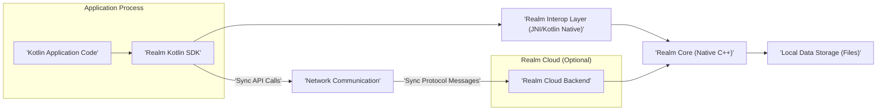

# Project Design Document: Realm Kotlin

**Version:** 1.1
**Date:** October 26, 2023
**Prepared By:** AI Software Architect

## 1. Introduction

This document provides a detailed architectural design of the Realm Kotlin SDK, based on the public repository available at [https://github.com/realm/realm-kotlin](https://github.com/realm/realm-kotlin). This document aims to provide a comprehensive understanding of the system's components, interactions, and data flow, which will serve as the foundation for subsequent threat modeling activities.

### 1.1. Purpose

The primary purpose of this document is to outline the design of Realm Kotlin to facilitate threat modeling. It will detail the key components, their responsibilities, and how they interact, enabling security professionals to identify potential vulnerabilities and attack vectors. This document will serve as a reference point for understanding the system's boundaries, trust zones, and data pathways.

### 1.2. Scope

This document covers the architectural design of the Realm Kotlin SDK, focusing on the core functionalities related to data persistence, querying, and synchronization. It includes the interaction between the Kotlin SDK and the underlying native Realm Core. The scope includes both local-only usage and scenarios involving Realm Sync. It does not delve into the specifics of the Realm Cloud backend infrastructure's internal implementation but considers it as an external entity. Low-level details of the native Realm Core library's internal algorithms are also outside the scope, except where they directly impact the Kotlin SDK's interface and security.

### 1.3. Target Audience

This document is intended for:

* Security engineers and architects involved in threat modeling, security assessments, and penetration testing.
* Developers working with Realm Kotlin who need a deeper understanding of its architecture for secure development practices.
* DevOps engineers responsible for deploying, configuring, and monitoring applications using Realm Kotlin.

## 2. Overview

Realm Kotlin is a Kotlin Multiplatform Mobile (KMM) SDK that provides a developer-friendly interface for interacting with the Realm database. It allows developers to build reactive mobile and desktop applications with seamless data persistence and optional synchronization capabilities. The SDK abstracts away the complexities of database management, offering a simple and efficient way to manage application data with features like schema management, querying, and transactions.

### 2.1. Key Features

* **Local Data Persistence:** Provides a robust, embedded database for storing application data directly on the device.
* **Schema Definition with Kotlin:** Allows defining data structures and relationships using standard Kotlin classes, providing type safety and clarity.
* **Reactive Data Access:** Supports asynchronous queries and data change notifications, enabling reactive UI patterns.
* **Optional Realm Sync:** Enables real-time, bidirectional data synchronization between devices and a backend Realm Cloud, facilitating collaborative and multi-device applications.
* **Kotlin Multiplatform Support:**  Allows developers to use a single codebase for data access logic across Android, iOS, and other supported platforms.
* **Database Encryption:** Offers options for encrypting the local Realm database at rest, protecting sensitive data on the device.
* **ACID Transactions:** Ensures data consistency and reliability through atomic, consistent, isolated, and durable transactions.

## 3. Architectural Design

The Realm Kotlin SDK architecture involves several layers and components working together. Understanding these components and their interactions is crucial for identifying potential security vulnerabilities.

### 3.1. High-Level Architecture Diagram

### 3.2. Component Description

* **Kotlin Application Code:** This represents the application-specific code written by developers that utilizes the Realm Kotlin SDK to interact with the database. This code defines the application's data model and business logic related to data persistence and manipulation.
* **Realm Kotlin SDK:** This is the primary public API that developers interact with. It provides Kotlin-idiomatic interfaces for defining Realm schemas, creating and managing Realm instances, performing CRUD operations (Create, Read, Update, Delete), executing queries, and handling data synchronization.
* **Realm Interop Layer (JNI/Kotlin Native):** This layer acts as a crucial bridge between the Kotlin code of the SDK and the native C++ Realm Core library. On Android, it primarily uses the Java Native Interface (JNI). On other platforms like iOS, it utilizes Kotlin/Native interop mechanisms. This layer handles the marshalling of data and function calls between the different language environments.
* **Realm Core (Native C++):** This is the core database engine of Realm, written in C++. It is responsible for the low-level management of the database, including data storage, indexing, query processing, transaction management, and ensuring data integrity. It directly interacts with the file system for local persistence.
* **Local Data Storage (Files):** This represents the persistent storage mechanism on the device where the Realm database files are physically stored. These files contain the application's data and metadata managed by Realm Core. The format of these files is specific to Realm.
* **Realm Cloud Backend (Optional):** This is the backend service provided by Realm that facilitates the optional data synchronization feature. It manages user authentication, authorization, and the merging of data changes between different devices. It is considered an external trusted entity in the context of the local application.
* **Network Communication:** This component handles all network-related activities for the Realm Kotlin SDK when using Realm Sync. It is responsible for establishing secure connections, sending and receiving data packets according to the Realm Sync protocol. This typically involves using platform-specific networking APIs.
* **Sync API Calls:** These are the specific methods and functions within the Realm Kotlin SDK that are used to initiate and manage the synchronization process with Realm Cloud.
* **Sync Protocol Messages:** These are the structured messages exchanged between the Realm Kotlin SDK and the Realm Cloud Backend to synchronize data changes. The specifics of this protocol are internal to Realm.

### 3.3. Data Flow

Understanding how data flows through the Realm Kotlin architecture is essential for identifying potential points of vulnerability.

* **Local Data Operations (Without Sync):**
    1. The Kotlin application code initiates a data operation (e.g., creating a new object, querying for data, updating an existing object) by calling methods on the `Realm` instance provided by the Realm Kotlin SDK.
    2. The Realm Kotlin SDK receives the request and translates it into a corresponding call to the Realm Interop Layer. This involves converting Kotlin objects and data types into a format understandable by the native layer.
    3. The Interop Layer invokes the appropriate function in the native Realm Core library.
    4. Realm Core performs the requested operation on the local data storage files. This might involve reading data from disk, writing new data, updating existing data, or performing query operations.
    5. The results of the operation are passed back through the Interop Layer to the Realm Kotlin SDK.
    6. The Realm Kotlin SDK converts the results back into Kotlin objects and returns them to the application code.

* **Synchronized Data Operations (With Sync):**
    1. Local data operations are performed as described above.
    2. In addition to persisting changes locally, the Realm Kotlin SDK's Sync component tracks these changes.
    3. Periodically, or when triggered by specific events, the Sync API within the SDK initiates communication with the Realm Cloud Backend via the Network Communication component.
    4. Changes made locally are packaged into "Sync Protocol Messages" and sent to the Realm Cloud Backend.
    5. The Realm Cloud Backend receives these changes, authenticates and authorizes the user, and then applies the changes to the shared data.
    6. The Realm Cloud Backend also sends updates about changes made by other synchronized devices back to the application.
    7. The Network Communication component receives these incoming "Sync Protocol Messages."
    8. The Realm Kotlin SDK processes these messages and applies the remote changes to the local Realm database, ensuring data consistency across devices. This may trigger data change notifications, updating the application's UI.

### 3.4. Key Interactions and Trust Boundaries

* **Application Code <-> Realm Kotlin SDK:** This is the primary interaction point for developers. The SDK is generally considered a trusted component, but vulnerabilities within the SDK could be exploited by malicious application code.
* **Realm Kotlin SDK <-> Realm Interop Layer:** This interaction involves crossing the language barrier between Kotlin and native code. Security concerns here include potential memory corruption issues or vulnerabilities in the interop mechanisms.
* **Realm Interop Layer <-> Realm Core:** This is a direct function call interface within the application process. The security of this interaction relies on the integrity of both the interop layer and the Realm Core library.
* **Realm Core <-> Local Data Storage:** This interaction involves direct file system access. Security concerns include unauthorized access to the database files and the integrity of the stored data. The local storage is within the device's trust boundary.
* **Realm Kotlin SDK <-> Network Communication:** This interaction involves sending data over the network. Security concerns include ensuring secure communication channels (e.g., TLS), proper authentication and authorization, and protection against man-in-the-middle attacks. The network is an untrusted zone.
* **Network Communication <-> Realm Cloud Backend:** This interaction occurs over the internet and is subject to network security threats. The security of this interaction relies on the security of the Realm Cloud Backend and the communication protocol.
* **Realm Cloud Backend <-> Realm Core (Backend):** The Realm Cloud Backend likely uses its own instance of Realm Core to manage the synchronized data. The security of this interaction is managed by the Realm Cloud infrastructure.

## 4. Security Considerations (For Threat Modeling)

This section outlines potential security concerns and attack vectors that should be considered during threat modeling.

* **Local Data Storage Security:**
    * **Encryption at Rest:** If database encryption is enabled, the strength of the encryption algorithm and the security of the key management process are critical. Weak encryption or compromised keys could lead to data breaches.
    * **File System Permissions:** Incorrect file system permissions on the device could allow malicious applications or users to access the Realm database files directly, bypassing the SDK's security mechanisms.
    * **Data Remnants:**  Consider the risk of sensitive data remaining on the device after deletion or uninstallation. Secure deletion practices should be evaluated.
    * **Backup and Restore:**  The security of database backups needs to be considered. Are backups encrypted? Who has access to them?

* **Realm Sync Security:**
    * **Authentication and Authorization:** The mechanisms used to authenticate users with Realm Cloud and authorize their access to specific data are critical. Weak authentication or authorization schemes could lead to unauthorized data access or manipulation.
    * **Data in Transit Protection:**  Ensure that all communication between the SDK and Realm Cloud is encrypted using strong cryptographic protocols like TLS to prevent eavesdropping and man-in-the-middle attacks.
    * **Server-Side Security of Realm Cloud:**  The security of the Realm Cloud infrastructure itself is paramount. Vulnerabilities in the backend could compromise the data of all users. This is largely outside the direct control of the application developer but should be considered in the overall threat model.
    * **Sync Protocol Security:**  The design and implementation of the Realm Sync protocol should be analyzed for potential vulnerabilities that could be exploited to compromise data integrity or availability.
    * **Conflict Resolution:**  The mechanisms used to resolve data conflicts during synchronization should be secure and prevent malicious actors from injecting incorrect data.

* **SDK and Interop Layer Security:**
    * **Memory Safety Vulnerabilities:**  Bugs in the native Realm Core or the interop layer could lead to memory corruption vulnerabilities (e.g., buffer overflows) that could be exploited for arbitrary code execution.
    * **Input Validation Failures:**  The SDK should properly validate all input data to prevent injection attacks (e.g., SQL injection-like attacks, although Realm uses its own query language).
    * **Dependency Vulnerabilities:**  The security of the Realm Kotlin SDK depends on the security of its dependencies. Regularly updating dependencies and scanning for vulnerabilities is crucial.
    * **Side-Channel Attacks:** Consider potential side-channel attacks that might leak information, although these are generally more difficult to exploit in this context.

* **Application-Level Security (Using Realm Kotlin):**
    * **Secure Coding Practices:** Developers must follow secure coding practices when using the Realm Kotlin SDK to avoid introducing vulnerabilities (e.g., improper handling of sensitive data, insecure query construction).
    * **Key Management (Encryption):** If local encryption is used, the application is responsible for securely storing and managing the encryption keys. Poor key management is a significant risk.
    * **Data Exposure through Application Logic:**  Vulnerabilities in the application's business logic could inadvertently expose sensitive data stored in Realm.

## 5. Dependencies

The Realm Kotlin SDK relies on the following key dependencies:

* **Realm Core (Native C++ Library):**  Provides the core database functionality.
* **Kotlin Standard Library:** Essential for Kotlin development.
* **Kotlin Coroutines:** Used for asynchronous operations and managing concurrency.
* **Platform-Specific Native Libraries:**  Required for interoperation with the underlying operating system (e.g., JNI on Android, Kotlin/Native libraries on iOS).
* **Networking Libraries:**  Used for communication with Realm Cloud (e.g., OkHttp on Android, platform-specific networking APIs on iOS).
* **Serialization Libraries:** Potentially used for serializing and deserializing data for network communication.

## 6. Deployment

The Realm Kotlin SDK is typically deployed as a library integrated directly into the application package.

* **Mobile Applications (Android/iOS):** The SDK is included as a dependency in the application's build configuration (e.g., `build.gradle` for Android, `Podfile` or Swift Package Manager manifest for iOS). The Realm database files are stored within the application's private data directory on the device.
* **Desktop Applications:** The SDK can be integrated into desktop applications built with Kotlin/JVM or Kotlin/Native, with the database files stored in a location accessible by the application.

When using Realm Sync, the application also requires network connectivity to communicate with the remote Realm Cloud service. The deployment of the Realm Cloud backend is managed by Realm.

## 7. Future Considerations

Potential future changes or enhancements that could impact the architecture and security include:

* **Evolution of Realm Core:**  New features or changes in the underlying Realm Core library may introduce new security considerations or require updates to the Kotlin SDK.
* **Modifications to the Sync Protocol:**  Changes to the Realm Sync protocol could affect the security of data synchronization.
* **Expansion of Platform Support:** Supporting new platforms might introduce new platform-specific security challenges.
* **Introduction of New Security Features:** Future versions of the SDK might include enhanced security features, such as more granular access control or improved encryption options.
* **Changes in Dependency Landscape:** Updates or changes to the dependencies of the SDK could have security implications.

This document provides a detailed architectural overview of Realm Kotlin, serving as a crucial input for the threat modeling process. By understanding the components, data flow, and potential security considerations outlined here, security professionals can effectively identify and mitigate potential risks associated with using Realm Kotlin in applications.