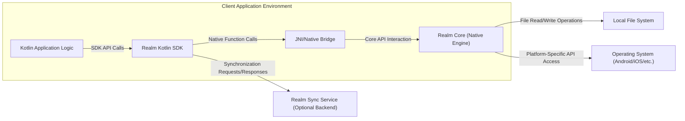
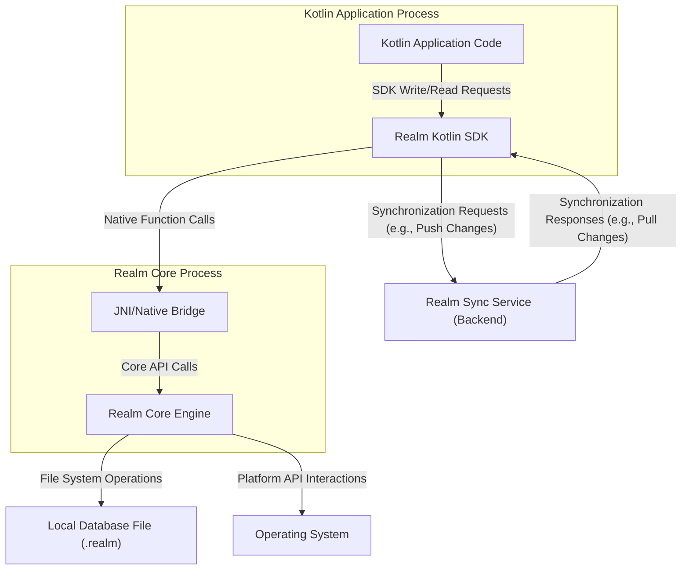

# Project Design Document: Realm Kotlin (Improved)

**Version:** 1.1
**Date:** October 26, 2023
**Author:** Gemini (AI Language Model)

## 1. Introduction

This document provides an enhanced design overview of the Realm Kotlin project, a mobile database solution. This detailed design is specifically intended to facilitate thorough threat modeling. Realm Kotlin's primary objective is to offer a developer-centric, high-performance, and secure local data management solution for applications built with Kotlin, with a particular focus on Android and Kotlin Multiplatform Mobile (KMM) environments.

## 2. Goals and Objectives

*   To furnish a dependable and efficient mechanism for local data persistence in Kotlin applications.
*   To present an intuitive and developer-friendly API for seamless database interaction.
*   To facilitate straightforward data synchronization between devices and a designated backend service (e.g., Realm Cloud, MongoDB Atlas Device Sync).
*   To guarantee the integrity and consistency of stored data.
*   To incorporate robust mechanisms for data encryption, ensuring secure data handling practices.
*   To fully support Kotlin Multiplatform, enabling significant code reuse across diverse platforms.

## 3. Target Audience

*   Mobile application developers utilizing Kotlin and the KMM framework.
*   Backend engineers responsible for integrating with Realm's data synchronization features.
*   Security engineers tasked with performing threat modeling and security assessments of systems incorporating Realm Kotlin.
*   Quality assurance engineers involved in the testing and validation of the project and its integrations.

## 4. High-Level Architecture

*   **Kotlin Application Logic:** The custom application code developed by engineers, which directly interacts with the Realm Kotlin SDK to manage data.
*   **Realm Kotlin SDK:** The Kotlin library that exposes the API for interacting with the underlying Realm database. This includes functionalities for defining data models, performing queries, and managing data lifecycle events.
*   **Realm Core (Native Engine):** The core C++ database engine responsible for the fundamental database operations, including data storage, indexing, query processing, and transaction management.
*   **JNI/Native Bridge:** The interface (Java Native Interface on Android, similar mechanisms on other platforms) that enables communication between the Kotlin SDK (running on the JVM/Native) and the native Realm Core library. This involves marshalling data and function calls across language boundaries.
*   **Operating System (Android/iOS/etc.):** The underlying operating system providing essential services such as file system access, network connectivity, and security features.
*   **Local File System:** The persistent storage on the device where the Realm database files are physically stored.
*   **Realm Sync Service (Optional Backend):** An optional backend service (such as MongoDB Realm or a self-hosted solution) that facilitates data synchronization between different instances of the Realm database across multiple devices.

## 5. Key Components

*   **Realm Database File (.realm):**
    *   The primary persistent storage unit for all data managed by Realm.
    *   Typically a single file residing on the device's local file system.
    *   Can potentially house multiple isolated "Realms" within the same file, offering logical separation of data.
    *   Subject to operating system-level file permissions.
*   **Realm Object Model (Kotlin Classes):**
    *   Defines the structure and schema of the data stored within the Realm database using standard Kotlin classes.
    *   Utilizes annotations or specific class inheritance to map Kotlin objects to Realm's internal data representation.
    *   Changes to the object model may require schema migrations.
*   **Realm API (Kotlin SDK):**
    *   Provides a comprehensive set of methods for performing Create, Read, Update, and Delete (CRUD) operations on Realm objects.
    *   Offers powerful query capabilities for efficiently filtering and retrieving data based on various criteria.
    *   Supports transactional operations to ensure data consistency and atomicity.
    *   Includes mechanisms for observing data changes through change listeners and reactive streams.
*   **Realm Core Binding Layer (JNI/Native Interface):**
    *   Acts as the crucial intermediary layer between the high-level Kotlin SDK and the low-level native Realm Core library.
    *   Handles the complex process of marshaling data structures and translating function calls between the Kotlin environment and the C++ engine.
    *   Performance of this layer is critical for overall SDK efficiency.
*   **Encryption Module (Optional, via Realm Configuration):**
    *   Provides the capability to encrypt the Realm database file at rest, protecting sensitive data when the device is powered off or locked.
    *   Typically employs AES-256 encryption with a user-provided 64-byte encryption key.
    *   The security of the encryption relies heavily on the secure generation, storage, and management of this encryption key.
*   **Synchronization Module (Optional, via Realm Sync SDK):**
    *   Manages the complex process of synchronizing data between the local Realm database and a remote Realm Sync service.
    *   Handles network communication, conflict resolution strategies, and data versioning to maintain consistency across devices.
    *   Involves authentication and authorization procedures to ensure only authorized users and devices can access and modify data.

## 6. Data Flow (Detailed)

*   **Local Data Read Operation:**
    *   The Kotlin application initiates a data read request through the Realm Kotlin SDK API.
    *   The SDK translates this request into a series of native function calls via the JNI/Native Bridge.
    *   The Realm Core Engine receives these calls and interacts with the local database file on the file system to retrieve the requested data.
    *   The retrieved data flows back through the JNI/Native Bridge to the SDK and finally to the application.
*   **Local Data Write Operation:**
    *   The Kotlin application initiates a data write operation (create, update, delete) through the Realm Kotlin SDK API.
    *   The SDK translates this request into native function calls.
    *   The Realm Core Engine executes the write operation, potentially involving transactions to ensure atomicity and consistency, and updates the local database file.
    *   Changes are persisted to the file system.
*   **Synchronization Data Flow (Outbound - Client to Server):**
    *   The Realm Kotlin SDK, when configured for synchronization, monitors changes made to the local Realm database.
    *   These changes are packaged and sent as synchronization requests to the configured Realm Sync Service over a network connection (typically HTTPS/TLS).
    *   The request includes authentication information to verify the client's identity.
*   **Synchronization Data Flow (Inbound - Server to Client):**
    *   The Realm Kotlin SDK periodically polls or maintains a persistent connection with the Realm Sync Service to check for updates.
    *   The Sync Service sends synchronization responses containing changes made by other clients or backend processes.
    *   The SDK receives these changes, resolves any potential conflicts, and applies them to the local Realm database.

## 7. Security Considerations (Detailed)

*   **Data at Rest Encryption:**
    *   **Threat:** Unauthorized access to the database file when the device is lost, stolen, or compromised.
    *   **Mitigation:** Utilizing Realm's built-in encryption feature with a strong, securely stored encryption key. The key should *never* be hardcoded. Consider using platform-specific secure storage mechanisms (e.g., Android Keystore, iOS Keychain).
    *   **Considerations:** The strength of the encryption is directly tied to the strength and secrecy of the encryption key. Key management is paramount.
*   **Data in Transit Encryption (for Synchronization):**
    *   **Threat:** Interception of sensitive data during transmission between the client and the Realm Sync Service.
    *   **Mitigation:** Realm Sync relies on secure communication protocols like HTTPS/TLS to encrypt all data exchanged over the network. Ensure proper TLS configuration and certificate validation.
    *   **Considerations:** Weak TLS configurations or compromised certificates can undermine this protection.
*   **Authentication and Authorization (for Synchronization):**
    *   **Threat:** Unauthorized access to backend data or the ability for malicious clients to modify data.
    *   **Mitigation:** Realm Sync employs various authentication methods (e.g., email/password, API keys, custom authentication providers) to verify the identity of users and devices. Authorization rules define what data each authenticated user/device can access and modify.
    *   **Considerations:** Weak authentication mechanisms or overly permissive authorization rules can create significant security vulnerabilities.
*   **Secure Key Management (for Encryption):**
    *   **Threat:** Exposure of the encryption key, rendering data at rest encryption ineffective.
    *   **Mitigation:** Employing platform-specific secure storage mechanisms (Android Keystore, iOS Keychain) to protect the encryption key. Consider using hardware-backed key storage where available. Avoid storing keys in shared preferences or application code.
    *   **Considerations:**  The security of the key management system is critical. Vulnerabilities in the key storage mechanism can compromise the entire encryption scheme.
*   **Input Validation and Data Integrity:**
    *   **Threat:** Malicious or malformed data being written to the database, potentially leading to application crashes or data corruption.
    *   **Mitigation:** While Realm's schema enforcement provides some level of validation, applications should implement additional input validation logic before writing data to the database. Realm's transactional nature helps ensure data integrity by preventing partial writes.
    *   **Considerations:** Relying solely on schema enforcement may not be sufficient to prevent all forms of data-related attacks.
*   **Access Control (within the application):**
    *   **Threat:** Unauthorized components within the application accessing or modifying sensitive data.
    *   **Mitigation:** Implement proper access control mechanisms within the application logic to restrict data access based on user roles or application components. Follow the principle of least privilege.
    *   **Considerations:** This requires careful design and implementation within the application's codebase.
*   **Code Obfuscation and Tamper Detection:**
    *   **Threat:** Reverse engineering of the application to extract sensitive information or modify application logic related to Realm.
    *   **Mitigation:** Employ code obfuscation techniques to make the application code harder to understand and reverse engineer. Implement tamper detection mechanisms to detect unauthorized modifications to the application.
    *   **Considerations:** While these techniques can raise the bar for attackers, they are not foolproof.
*   **Vulnerability Management (SDK and Core):**
    *   **Threat:** Exploitation of known vulnerabilities in the Realm Kotlin SDK or the underlying Realm Core library.
    *   **Mitigation:** Regularly update the Realm Kotlin SDK and ensure that the underlying Realm Core library is also up-to-date to patch any known security vulnerabilities. Subscribe to security advisories and release notes.
    *   **Considerations:**  Failing to keep dependencies up-to-date can leave applications vulnerable to known exploits.
*   **Schema Migrations:**
    *   **Threat:** Data loss or corruption during schema migrations if not handled correctly.
    *   **Mitigation:** Implement robust schema migration strategies and thoroughly test migrations before deploying them to production. Consider using Realm's migration API features.
    *   **Considerations:**  Poorly implemented migrations can lead to data inconsistencies or application crashes.

## 8. Assumptions and Constraints

*   Developers integrating Realm Kotlin will adhere to secure coding practices and best practices for key management.
*   The underlying operating system provides a baseline level of security for file system access and process isolation.
*   When utilizing the synchronization feature, the Realm Sync Service is assumed to be a trusted and securely configured service.
*   The security of the core database functionalities is primarily the responsibility of the native Realm Core library.
*   This design document focuses on the core Realm Kotlin library and its interactions within the client environment and with the optional sync service. It does not encompass the design of specific applications built using Realm Kotlin.

## 9. Future Considerations

*   Enhanced integration with hardware-backed key storage mechanisms for encryption keys across more platforms.
*   More granular and flexible access control mechanisms directly within the Realm database, potentially at the object or field level.
*   Advanced auditing capabilities for tracking data access and modifications within the local Realm database.
*   Support for more modern and robust encryption algorithms and cryptographic libraries.
*   Improved tooling and monitoring capabilities for managing and observing the state of synchronized Realms in real-time.
*   Exploration of secure multi-party computation or homomorphic encryption techniques for specific use cases requiring enhanced data privacy during synchronization.

This improved design document provides a more detailed and security-focused overview of the Realm Kotlin project. It serves as a solid foundation for conducting comprehensive threat modeling activities, enabling the identification of potential security vulnerabilities and the development of appropriate mitigation strategies.
