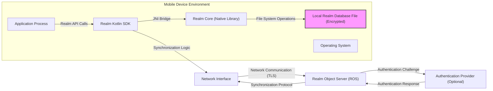
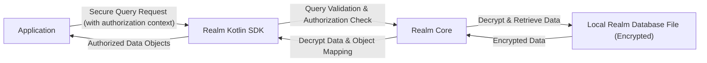
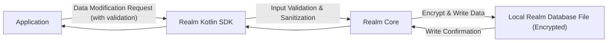
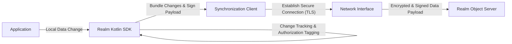
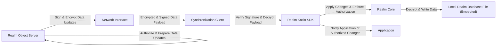

## Project Design Document: Realm Kotlin (Improved)

**1. Introduction**

This document provides an enhanced and more detailed design overview of the Realm Kotlin SDK. It elaborates on the key components, architecture, and data flow within the system, with a specific focus on aspects relevant to threat modeling. This document serves as a robust foundation for identifying and mitigating potential security vulnerabilities.

**1.1. Purpose**

The primary purpose of this document is to provide a clear, comprehensive, and security-focused description of the Realm Kotlin SDK's design. This will significantly aid in:

* **Deep Understanding of System Architecture:** Providing both high-level and granular views of components and their intricate interactions, emphasizing security boundaries.
* **Proactive Identification of Security Risks:** Serving as a detailed blueprint for threat modeling exercises, enabling the discovery of potential vulnerabilities and attack vectors.
* **Streamlined Onboarding for Security and Development Teams:** Offering a centralized and authoritative resource for understanding the system's design and security posture.
* **Informed Architectural Discussions and Decision-Making:** Providing a common and detailed reference point for architectural discussions, particularly those with security implications.

**1.2. Scope**

This document comprehensively covers the design of the Realm Kotlin SDK, with a strong emphasis on its core functionalities and interactions with other components from a security perspective. The scope includes:

* The Realm Kotlin SDK library itself, including its internal modules and APIs.
* The detailed interaction with the underlying Realm Core, focusing on the security boundary.
* Synchronization mechanisms with the Realm Object Server (ROS), including the protocol and data exchange.
* Local data storage and management, with a focus on security controls and potential vulnerabilities.
* Querying and data manipulation, considering potential injection risks and access control.
* The initial setup and configuration of the Realm Kotlin SDK.

This document explicitly excludes:

* The intricate internal implementation details of Realm Core's storage engine and query processing.
* The detailed architecture, deployment, and operational aspects of the Realm Object Server infrastructure.
* Specific application code that utilizes the Realm Kotlin SDK, although general usage patterns are considered.
* The design of Realm SDKs for other platforms (e.g., Realm Java, Realm Swift), unless directly relevant to understanding cross-platform interactions.

**1.3. Target Audience**

This document is primarily intended for:

* Security engineers, architects, and penetration testers involved in threat modeling and security assessments.
* Software developers working on the Realm Kotlin SDK itself or building applications that utilize it.
* Product managers and stakeholders who require a deep technical understanding of the system's architecture and security implications.
* DevOps engineers responsible for deploying and maintaining applications using Realm Kotlin.

**2. Overview**

Realm Kotlin is a modern mobile database solution that offers a reactive and object-oriented approach to data management. It empowers developers to define data models using idiomatic Kotlin classes and interact with the database through an intuitive and type-safe API. A central feature of Realm is its robust capability for seamless, real-time data synchronization between devices and a backend service, the Realm Object Server. This synchronization aspect introduces specific security considerations that are addressed throughout this document.

**Key Features:**

* **Efficient Local Data Persistence:** Provides a high-performance and efficient mechanism for storing and retrieving data locally on the device, with considerations for data protection.
* **Reactive Data Model:** Enables applications to react to data changes in real-time through observable collections and live objects, requiring careful management of data access and updates.
* **Robust Synchronization Capabilities:** Facilitates seamless and automatic data synchronization between client devices and the Realm Object Server, introducing complexities around authentication, authorization, and data integrity.
* **Intuitive Object-Oriented API:** Offers a natural and developer-friendly way to interact with data using Kotlin objects, reducing the likelihood of common database interaction errors but requiring careful schema management.
* **Automatic Schema Management:** Manages the database schema evolution based on the defined Kotlin data models, which needs to be handled securely to prevent unintended data access or corruption.
* **Powerful Querying Engine:** Provides a flexible and expressive query language for retrieving specific data, requiring attention to potential injection vulnerabilities if queries are constructed from untrusted input.

**3. System Architecture**

The Realm Kotlin SDK operates within a multi-component architecture. Understanding the interactions between these components is crucial for identifying potential threat vectors. The following diagram illustrates the detailed architecture:

**3.1. Components:**

* **Application Process:** The isolated process in which the Kotlin application utilizing the Realm Kotlin SDK runs. This process has its own memory space and permissions.
* **Realm Kotlin SDK:** The primary Kotlin library that exposes the API for interacting with Realm. It handles object mapping, query construction, transaction management, and synchronization logic.
* **Realm Core (Native Library):** A highly optimized, cross-platform C++ library responsible for the core database functionalities, including storage engine, query execution, and transaction management. The Kotlin SDK interacts with Realm Core through the Java Native Interface (JNI).
* **Local Realm Database File (Encrypted):** The persistent storage file on the device's file system where the Realm database is stored. This file should be encrypted at rest to protect sensitive data.
* **Operating System:** The underlying mobile operating system (e.g., Android, iOS) that provides file system access, network capabilities, and security features.
* **Network Interface:** The component responsible for establishing and managing network connections, used for communication with the Realm Object Server.
* **Realm Object Server (ROS):** The backend server responsible for managing user authentication, authorization, data synchronization, and conflict resolution across multiple devices.
* **Authentication Provider (Optional):** An external service (e.g., Identity Provider) that the Realm Object Server may integrate with for user authentication.

**3.2. Component Interactions (Security Focused):**

* **Secure Data Access:** The Application interacts with the Realm Kotlin SDK, which enforces schema constraints and performs basic input validation before passing requests to Realm Core. Realm Core then interacts with the encrypted local database file, relying on OS-level file permissions for access control.
* **Synchronization Security:**
    * The Realm Kotlin SDK initiates secure communication with the Realm Object Server over TLS/SSL, ensuring confidentiality and integrity of data in transit.
    * Authentication credentials are exchanged with the Realm Object Server (potentially involving an external Authentication Provider) to verify the user's identity.
    * The Realm Object Server enforces authorization rules to determine which data the authenticated user can access and modify.
    * The synchronization protocol itself needs to be resilient against replay attacks and data tampering.
* **Local Data Protection:** The local Realm database file should be encrypted using strong encryption algorithms. The encryption keys need to be managed securely, ideally leveraging platform-specific key management systems provided by the operating system.
* **JNI Boundary:** The interaction between the Kotlin SDK and the native Realm Core through JNI represents a potential security boundary. Care must be taken to ensure that data passed across this boundary is validated and sanitized to prevent vulnerabilities in the native code.

**4. Data Flow (Security Perspective)**

This section details the data flow for critical operations, highlighting security considerations at each stage.

**4.1. Secure Local Data Read:**

* The Application initiates a data read operation with an associated authorization context.
* The Realm Kotlin SDK validates the query and checks if the user has the necessary permissions.
* Realm Core decrypts and retrieves the requested data from the encrypted local database file.
* The decrypted data is mapped to Kotlin objects.
* Only authorized data objects are returned to the Application.

**4.2. Secure Local Data Write:**

* The Application sends a data modification request, which should include client-side validation.
* The Realm Kotlin SDK performs further input validation and sanitization to prevent data corruption or injection attacks.
* Realm Core encrypts the data before writing it to the local database file.

**4.3. Secure Synchronization Process (Client to Server):**

* The Application makes changes to the local Realm database.
* The Realm Kotlin SDK tracks these changes and associates them with the user's authorization context.
* The synchronization client bundles the changes, signs the payload to ensure integrity and non-repudiation, and encrypts it.
* A secure connection is established with the Realm Object Server, and the encrypted and signed payload is transmitted.

**4.4. Secure Synchronization Process (Server to Client):**

* The Realm Object Server authorizes the data updates for the specific client.
* The server signs and encrypts the data updates.
* The client's synchronization component receives the payload, verifies the signature, and decrypts it.
* The Realm Kotlin SDK applies the changes to the local database, enforcing authorization rules to ensure the client only receives data it is permitted to access.
* The Application is notified of the authorized data changes.

**5. Security Considerations (Detailed)**

This section provides a more detailed breakdown of potential security considerations and potential mitigation strategies.

* **Data at Rest Encryption Vulnerabilities:**
    * **Threat:** Lack of encryption or weak encryption algorithms could expose sensitive data if the device is lost or compromised.
    * **Mitigation:** Utilize strong, platform-recommended encryption algorithms for the local Realm database file. Leverage OS-level key management systems (e.g., Android Keystore, iOS Keychain). Ensure encryption is enabled by default or enforced.
* **Data in Transit Encryption Weaknesses:**
    * **Threat:** Using insecure protocols (e.g., plain HTTP) or outdated TLS versions could allow eavesdropping or man-in-the-middle attacks.
    * **Mitigation:** Enforce the use of TLS 1.2 or higher for all communication with the Realm Object Server. Implement certificate pinning to prevent MITM attacks.
* **Authentication and Authorization Flaws:**
    * **Threat:** Weak or missing authentication mechanisms could allow unauthorized access to data. Insufficient authorization controls could lead to data breaches or privilege escalation.
    * **Mitigation:** Implement strong authentication mechanisms (e.g., OAuth 2.0, JWT). Enforce robust authorization rules on the Realm Object Server to control data access based on user roles and permissions. Regularly review and update authorization policies.
* **Input Validation and Injection Attacks:**
    * **Threat:** Failure to validate and sanitize user input could lead to injection attacks (e.g., NoSQL injection) that could compromise the database.
    * **Mitigation:** Implement strict input validation on both the client and server sides. Use parameterized queries or prepared statements to prevent injection attacks. Sanitize data before storing it in the database.
* **Access Control Deficiencies:**
    * **Threat:** Insufficient control over who can access and modify data can lead to unauthorized data manipulation or disclosure.
    * **Mitigation:** Implement granular access control mechanisms on the Realm Object Server. Follow the principle of least privilege. Regularly audit access logs.
* **Dependency Management Risks:**
    * **Threat:** Vulnerabilities in third-party libraries used by the Realm Kotlin SDK or Realm Core could be exploited.
    * **Mitigation:** Maintain an up-to-date inventory of all dependencies. Regularly scan dependencies for known vulnerabilities. Apply security patches promptly.
* **Local Data Security Breaches:**
    * **Threat:** Other applications on the device with sufficient permissions could potentially access the local Realm database file if not properly protected.
    * **Mitigation:** Rely on OS-level file permissions to restrict access to the database file. Consider additional layers of protection if the OS security model is insufficient.
* **Synchronization Protocol Vulnerabilities:**
    * **Threat:** Weaknesses in the synchronization protocol could allow attackers to tamper with data in transit or replay synchronization messages.
    * **Mitigation:** Ensure the synchronization protocol includes mechanisms for message integrity (e.g., digital signatures) and protection against replay attacks (e.g., nonces, timestamps).
* **Logging and Monitoring Gaps:**
    * **Threat:** Insufficient logging and monitoring can hinder the detection and response to security incidents.
    * **Mitigation:** Implement comprehensive logging of security-relevant events (e.g., authentication attempts, authorization failures, data access). Implement real-time monitoring and alerting for suspicious activity.

**6. Assumptions and Constraints (Security Focused)**

* **Secure Device Posture:** The security model assumes a reasonable level of security on the user's device, including an up-to-date operating system and protection against malware.
* **Secure Realm Object Server Infrastructure:** The security of the Realm Kotlin SDK heavily relies on the secure configuration and operation of the Realm Object Server infrastructure.
* **Secure Key Management:**  It is assumed that encryption keys for the local database are managed securely using platform-provided mechanisms.
* **Developer Adherence to Security Best Practices:** The design assumes that developers using the SDK follow secure coding practices and are aware of potential security risks.

**7. Threat Landscape (High-Level)**

This section provides a high-level overview of potential threat categories relevant to the Realm Kotlin SDK.

* **Data Breaches:** Unauthorized access to sensitive data stored locally or on the server.
* **Authentication and Authorization Bypass:** Gaining access to data or functionality without proper authentication or authorization.
* **Man-in-the-Middle Attacks:** Intercepting and potentially manipulating communication between the client and the server.
* **Replay Attacks:** Reusing captured synchronization messages to perform unauthorized actions.
* **Data Tampering:** Modifying data in transit or at rest without authorization.
* **Denial of Service:** Preventing legitimate users from accessing the application or data.
* **Local Data Exploitation:** Gaining unauthorized access to the local database file.
* **Injection Attacks:** Exploiting vulnerabilities in data processing to execute malicious code or access unauthorized data.

**8. Future Considerations (Security Enhancements)**

* **End-to-End Encryption (E2EE):** Implementing E2EE to ensure that only the client application can decrypt the data, even the server cannot access the raw data.
* **Enhanced Local Data Protection Mechanisms:** Exploring more advanced techniques for protecting the local database file, such as hardware-backed encryption or secure enclaves.
* **Multi-Factor Authentication (MFA) Support:** Adding support for MFA to enhance user authentication security.
* **Client-Side Data Integrity Checks:** Implementing mechanisms to verify the integrity of local data and detect tampering.
* **Regular Security Audits and Penetration Testing:** Conducting periodic security assessments to identify and address potential vulnerabilities.

This improved document provides a more detailed and security-focused design overview of the Realm Kotlin SDK. It serves as a valuable resource for threat modeling and understanding the security implications of using this technology.