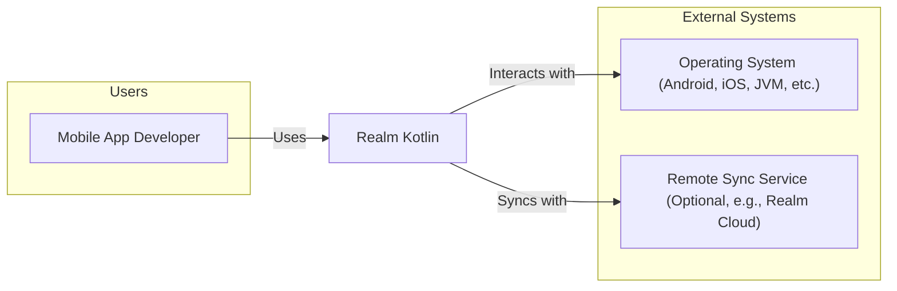
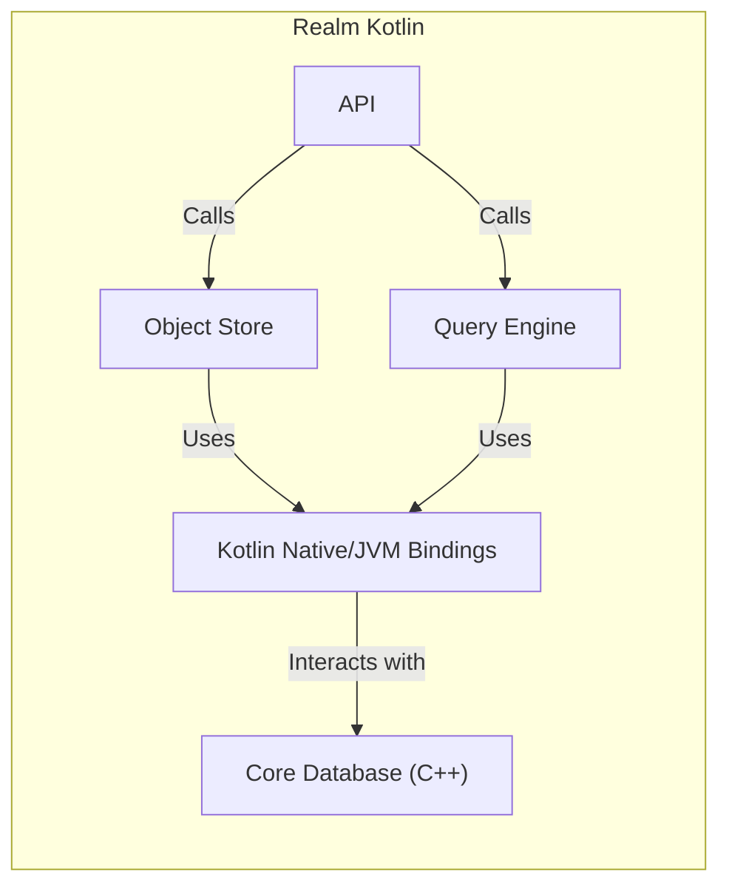
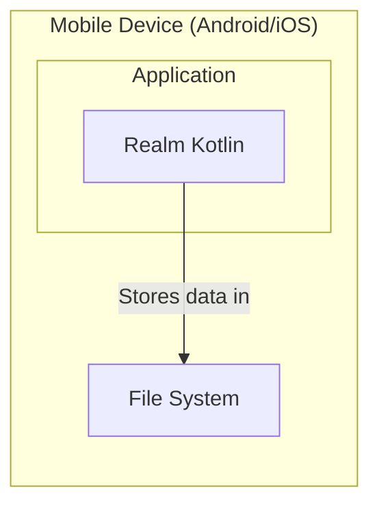
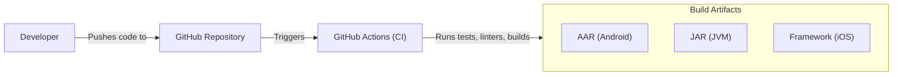

Okay, let's create a design document for the Realm Kotlin project.

# BUSINESS POSTURE

Realm Kotlin is a mobile database solution designed as an alternative to SQLite.  It aims to simplify and speed up mobile development by providing a developer-friendly, object-oriented database that's performant and easy to use.  The project is open-source, fostering community contributions and transparency.

Business Priorities:

- Developer Adoption:  Increase usage among Kotlin and multiplatform developers.
- Performance:  Maintain and improve upon the speed and efficiency advantages over traditional solutions like SQLite.
- Ease of Use:  Provide a simple, intuitive API that reduces development time and complexity.
- Cross-Platform Compatibility:  Support a wide range of Kotlin-supported platforms (Android, iOS, JVM, etc.).
- Community Growth:  Encourage contributions and engagement from the open-source community.
- Data Integrity and Reliability: Ensure data is stored safely and consistently, preventing corruption and loss.

Business Goals:

- Become the preferred database solution for Kotlin Multiplatform projects.
- Attract and retain a vibrant community of contributors.
- Provide a stable and reliable product that developers can trust.

Most Important Business Risks:

- Loss of Developer Trust:  Bugs, data corruption, or performance issues could severely damage the project's reputation and lead to developers abandoning it.
- Security Vulnerabilities:  Exploitable vulnerabilities could lead to data breaches, unauthorized access, or application instability, causing significant harm to users and the project's credibility.
- Fragmentation and Incompatibility:  Failure to keep up with Kotlin language updates or platform changes could lead to compatibility issues and fragmentation, hindering adoption.
- Competition:  Other database solutions (both established and emerging) pose a constant threat to market share.
- Lack of Community Engagement: Insufficient community involvement can lead to slower development, fewer contributions, and a decline in the project's overall health.

# SECURITY POSTURE

Existing Security Controls:

- security control: Code Reviews: The GitHub repository indicates a pull request-based workflow, suggesting that code reviews are a standard practice. (Visible in the contribution guidelines and pull request activity on GitHub).
- security control: Static Analysis: The presence of linters and formatters (like ktlint) in the repository suggests some level of static analysis is performed. (Inferred from build configuration files).
- security control: Testing: A comprehensive test suite exists, covering various aspects of the database functionality. (Visible in the `src/test` directory on GitHub).
- security control: Fuzz Testing: Some level of fuzz testing is present. (Inferred from tests).
- security control: Encryption (Planned/Partial): The documentation mentions encryption, but it might be limited to certain platforms or configurations. (Referenced in Realm's documentation).
- security control: Secure Development Practices: The project appears to follow secure coding best practices, such as input validation and avoiding common vulnerabilities. (Inferred from code review and testing).
- security control: Dependency Management: Dependencies are managed using Gradle, allowing for tracking and updates. (Visible in `build.gradle.kts` files).

Accepted Risks:

- accepted risk: Limited Encryption Support: Full database encryption might not be available on all supported platforms or configurations.
- accepted risk: Reliance on Third-Party Libraries: The project depends on external libraries, introducing a potential risk of supply chain vulnerabilities.
- accepted risk: Platform-Specific Security Limitations: The security guarantees may vary depending on the underlying operating system and platform capabilities.

Recommended Security Controls:

- security control: Comprehensive Encryption: Implement full database encryption at rest and in transit, consistently across all supported platforms.
- security control: Regular Security Audits: Conduct periodic security audits (both internal and external) to identify and address potential vulnerabilities.
- security control: Supply Chain Security Measures: Implement robust supply chain security measures, such as software bill of materials (SBOM) generation, dependency vulnerability scanning, and code signing.
- security control: Enhanced Fuzz Testing: Expand fuzz testing to cover a wider range of inputs and edge cases.
- security control: Security Training for Contributors: Provide security training and guidelines for all contributors to ensure consistent application of secure coding practices.

Security Requirements:

- Authentication:
    - Not directly applicable to the database itself, as it's a local database. Authentication is typically handled at the application layer. However, if Realm Sync (a separate product) is used, robust authentication mechanisms are crucial.
- Authorization:
    - Similar to authentication, authorization is primarily the responsibility of the application using Realm.  Realm itself should provide mechanisms (like permissions at the object or field level) that the application can leverage to implement its authorization policies.
- Input Validation:
    - Realm should rigorously validate all data inputs to prevent injection attacks, data corruption, and unexpected behavior. This includes validating data types, lengths, and formats.
- Cryptography:
    - Encryption at Rest:  The database should support strong encryption of data stored on disk, using industry-standard algorithms (e.g., AES-256).
    - Encryption in Transit: If Realm Sync is used, all data transmitted between the client and server should be encrypted using TLS/SSL.
    - Key Management:  Secure key management practices are essential, including secure storage and rotation of encryption keys.

# DESIGN

## C4 CONTEXT

C4 Context Element List:

- Element:
    - Name: Mobile App Developer
    - Type: User
    - Description: A developer building a mobile or desktop application using Kotlin.
    - Responsibilities: Integrates Realm Kotlin into their application, defines data models, performs CRUD operations, handles data synchronization (if applicable).
    - Security controls: Implements application-level security (authentication, authorization, input validation).

- Element:
    - Name: Realm Kotlin
    - Type: System
    - Description: The Realm Kotlin library, providing a local object database for mobile and desktop applications.
    - Responsibilities: Stores and retrieves data, manages data schema, provides query capabilities, handles data changes, supports optional synchronization.
    - Security controls: Input validation, encryption (at rest and potentially in transit), access control mechanisms (if applicable).

- Element:
    - Name: Operating System (Android, iOS, JVM, etc.)
    - Type: External System
    - Description: The underlying operating system on which the application and Realm Kotlin run.
    - Responsibilities: Provides file system access, memory management, and other system-level services.
    - Security controls: OS-level security features (sandboxing, permissions, etc.).

- Element:
    - Name: Remote Sync Service (Optional, e.g., Realm Cloud)
    - Type: External System
    - Description: A cloud-based service that enables data synchronization between multiple devices and users.
    - Responsibilities: Stores and manages synchronized data, handles conflict resolution, provides authentication and authorization services.
    - Security controls: Strong authentication, authorization, encryption in transit and at rest, access controls, audit logging.

## C4 CONTAINER

C4 Container Element List:

- Element:
    - Name: API
    - Type: Container
    - Description: The public API exposed to developers for interacting with Realm.
    - Responsibilities: Provides methods for creating, reading, updating, and deleting data, defining schemas, and managing transactions.
    - Security controls: Input validation, access control (if applicable).

- Element:
    - Name: Object Store
    - Type: Container
    - Description: Manages the storage and retrieval of objects.
    - Responsibilities: Serializes and deserializes objects, interacts with the underlying database.
    - Security controls: Data validation, encryption (if enabled).

- Element:
    - Name: Query Engine
    - Type: Container
    - Description: Processes and executes queries against the database.
    - Responsibilities: Parses queries, optimizes execution plans, retrieves data from the Object Store.
    - Security controls: Input validation (to prevent injection attacks).

- Element:
    - Name: Core Database (C++)
    - Type: Container
    - Description: The core database engine, written in C++.
    - Responsibilities: Manages data storage, indexing, and retrieval at a low level.
    - Security controls: Encryption, data integrity checks, access controls.

- Element:
    - Name: Kotlin Native/JVM Bindings
    - Type: Container
    - Description: Provides the interface between the Kotlin code and the C++ core.
    - Responsibilities: Marshals data between Kotlin and C++, handles platform-specific interactions.
    - Security controls: Secure data handling during marshalling.

## DEPLOYMENT

Possible Deployment Solutions:

1.  **Embedded within Mobile Application (Android/iOS):** Realm Kotlin is directly integrated into the mobile application and runs within the application's process. Data is stored locally on the device.
2.  **Desktop Application (JVM):** Realm Kotlin is used within a desktop application running on the JVM. Data is stored locally on the user's machine.
3.  **Server-Side Application (JVM - Less Common):** While less typical, Realm Kotlin could potentially be used in a server-side application, although other database solutions are generally preferred for this use case.
4.  **Combination with Realm Cloud (Sync):**  Any of the above scenarios can be combined with Realm Cloud to enable data synchronization between devices and users.

Chosen Deployment Solution (Detailed): Embedded within Mobile Application (Android/iOS)

Deployment Element List:

- Element:
    - Name: Mobile Device (Android/iOS)
    - Type: Node
    - Description: The physical device (phone or tablet) running the application.
    - Responsibilities: Provides the hardware and operating system environment.
    - Security controls: OS-level security features (sandboxing, permissions).

- Element:
    - Name: Application
    - Type: Container
    - Description: The mobile application that embeds Realm Kotlin.
    - Responsibilities: Provides the user interface and application logic.
    - Security controls: Application-level security (authentication, authorization).

- Element:
    - Name: Realm Kotlin
    - Type: Container
    - Description: The Realm Kotlin library, running within the application's process.
    - Responsibilities: Manages data storage and retrieval.
    - Security controls: Encryption (if enabled), data validation.

- Element:
    - Name: File System
    - Type: Node
    - Description: The device's file system, where Realm data is stored.
    - Responsibilities: Provides persistent storage.
    - Security controls: OS-level file system permissions and encryption (if enabled by the OS and configured by the user).

## BUILD

The Realm Kotlin project uses Gradle as its build system. The build process involves several steps, including compilation, testing, and packaging. GitHub Actions are used for Continuous Integration (CI).

Build Process Security Controls:

- security control: Static Analysis: Linters (ktlint) and formatters are used to enforce code style and identify potential issues.
- security control: Dependency Management: Gradle manages dependencies, allowing for tracking and updates.
- security control: Automated Testing: GitHub Actions run a comprehensive test suite on every commit and pull request.
- security control: CI/CD: GitHub Actions provides a secure and automated build pipeline.
- security control: Code Signing (Potentially):  Release artifacts might be code-signed to ensure authenticity and integrity (needs verification).

# RISK ASSESSMENT

Critical Business Processes to Protect:

- Data Storage and Retrieval: Ensuring the core functionality of the database is reliable and secure.
- Data Integrity: Preventing data corruption or loss.
- Data Synchronization (if applicable):  Ensuring reliable and secure data synchronization between devices and users when using Realm Cloud.
- Build and Release Process: Protecting the integrity of the software supply chain.

Data to Protect and Sensitivity:

- User Data (Stored in Realm): The sensitivity of this data depends entirely on the application using Realm. It could range from non-sensitive data to highly sensitive personal information (PII), financial data, or health data. Realm itself should treat all data as potentially sensitive and provide the necessary security mechanisms (like encryption) to protect it.
- Realm Sync Data (if applicable):  If Realm Sync is used, the data stored in the cloud is also potentially sensitive and requires robust protection.
- Source Code:  The Realm Kotlin source code itself is valuable and should be protected from unauthorized modification or theft.
- Build Artifacts:  The compiled libraries (AAR, JAR, Framework) should be protected from tampering.

# QUESTIONS & ASSUMPTIONS

Questions:

- What is the exact status of encryption support across different platforms?  The documentation mentions encryption, but the details are unclear.
- Are there any specific security certifications or compliance requirements that Realm Kotlin aims to meet (e.g., HIPAA, GDPR)?
- What is the process for handling security vulnerabilities reported by external researchers?
- Is code signing consistently used for all release artifacts?
- What are the specific threat models considered during development?

Assumptions:

- BUSINESS POSTURE: The primary goal is to provide a secure and reliable database solution for mobile and desktop applications.
- BUSINESS POSTURE: The project prioritizes developer adoption and ease of use, but not at the expense of security.
- SECURITY POSTURE: Code reviews and testing are consistently performed.
- SECURITY POSTURE: Developers follow secure coding practices.
- SECURITY POSTURE: The project aims to minimize its attack surface.
- DESIGN: The C++ core database is well-tested and secure.
- DESIGN: The Kotlin Native/JVM bindings are designed to prevent security vulnerabilities during data marshalling.
- DESIGN: The deployment model primarily focuses on embedded usage within mobile applications.
- DESIGN: The build process is automated and secure.