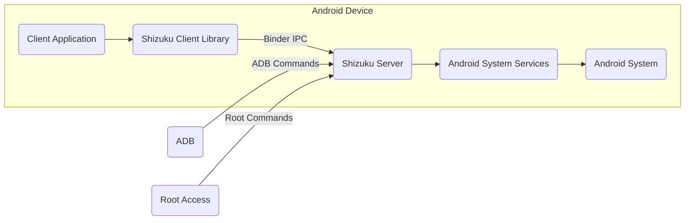
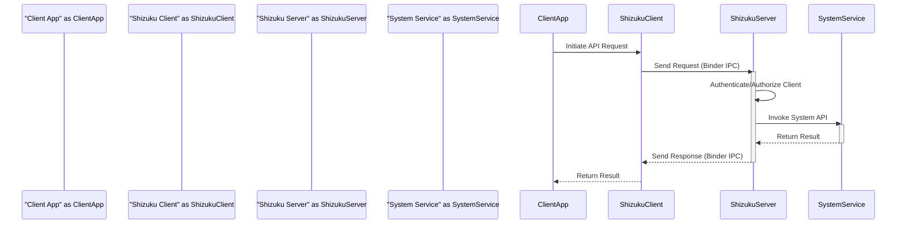

# Project Design Document: Shizuku

**Version:** 1.1
**Date:** October 26, 2023
**Prepared By:** Gemini (AI Language Model)

## 1. Introduction

This document provides an enhanced and detailed design overview of the Shizuku project, an Android application that empowers unprivileged applications to access system-level APIs by leveraging a process with elevated privileges. This document meticulously articulates the architecture, components, and interactions within the Shizuku system, serving as a robust foundation for subsequent activities, most notably threat modeling. A clear understanding of the system's structure and functionality is paramount for identifying potential security vulnerabilities.

### 1.1. Purpose

The primary purpose of this document is to provide a sufficiently detailed design description of the Shizuku project to effectively facilitate threat modeling. It comprehensively outlines the constituent components, their interrelationships, and the intricate data flow within the system.

### 1.2. Scope

This document encompasses the core architecture and functionalities of the Shizuku application, specifically focusing on:

*   The Shizuku server process, operating with elevated privileges.
*   The Shizuku client library, seamlessly integrated into client applications.
*   The communication protocols and mechanisms employed between clients and the server.
*   The distinct methods available for initiating and managing the Shizuku server.

This document explicitly excludes:

*   The specific implementation details of the myriad system APIs accessible through Shizuku.
*   The user interface elements of the Shizuku application, primarily used for server management and configuration.
*   Detailed, line-by-line code-level explanations and implementation specifics.

### 1.3. Target Audience

This document is specifically intended for:

*   Security architects and engineers tasked with the responsibility of performing comprehensive threat modeling on the Shizuku project.
*   Software developers actively working on or planning to integrate with the Shizuku project.
*   Technical individuals seeking a thorough and in-depth understanding of the Shizuku system's design principles and implementation.

## 2. System Overview

Shizuku's core functionality lies in enabling Android applications lacking inherent root privileges to interact with privileged Android system APIs. This is ingeniously achieved by operating a server process endowed with elevated permissions, acquired either through the Android Debug Bridge (ADB) or direct root access. Client applications then communicate with this privileged server via the standardized Android Interface Definition Language (AIDL) and the Binder Inter-Process Communication (IPC) mechanism.

The fundamental concept involves delegating the execution of operations requiring elevated privileges to the Shizuku server, which inherently possesses the necessary permissions. Client applications formulate requests and transmit them to the server, which subsequently executes the requested operation on their behalf and returns the corresponding result.

## 3. System Architecture

The Shizuku system is architecturally composed of the following essential components:

*   **Shizuku Server:** This is the central and most critical component, operating with elevated privileges. Its primary responsibilities include:
    *   Receiving incoming requests originating from client applications.
    *   Implementing robust authentication and authorization mechanisms to validate client requests.
    *   Executing the requested system API calls on behalf of the client.
    *   Packaging and transmitting the results back to the originating client application.
*   **Shizuku Client Library (API):** This library serves as the interface for applications intending to leverage Shizuku's capabilities. It provides a structured API for:
    *   Establishing and managing a secure connection with the Shizuku server.
    *   Constructing and dispatching requests to the server in a defined format.
    *   Receiving and processing responses transmitted from the server.
*   **Android System Services:** These are the privileged system-level components within the Android operating system whose APIs are the target of access through Shizuku. Examples include services managing network connectivity, device settings, and package installations.
*   **ADB (Android Debug Bridge):** This command-line tool facilitates communication with an Android device, and in the context of Shizuku, it serves as one of the primary methods for initiating the Shizuku server with the necessary elevated privileges.
*   **Root Access (Superuser):** This represents the highest level of privilege within the Android system. It provides an alternative method for starting the Shizuku server, granting it the required permissions directly.

### 3.1. Component Diagram

### 3.2. Component Descriptions

*   **Client Application:** Any Android application that integrates the Shizuku Client Library to gain access to privileged system APIs without requiring root permissions itself.
*   **Shizuku Client Library:** A well-defined library that offers a user-friendly interface for client applications to seamlessly interact with the Shizuku Server. It abstracts away the underlying complexities of Binder IPC.
*   **Shizuku Server:** A persistent Android service meticulously designed to run with elevated privileges. It acts as a secure intermediary, bridging the gap between unprivileged applications and the protected Android system APIs.
*   **Android System Services:**  Essential background processes integral to the Android OS, responsible for managing a wide array of system functionalities, including but not limited to Wi-Fi management, Bluetooth control, and package management.
*   **Android System:** The foundational operating system providing the runtime environment and core functionalities for all components within the Shizuku ecosystem.
*   **ADB:** A versatile command-line tool that enables developers to communicate with an Android device. In Shizuku's context, it's used to execute commands that initiate the Shizuku Server with elevated privileges.
*   **Root Access:** The privileged access level granting unrestricted control over the Android system, allowing the Shizuku Server to be launched with the necessary permissions when ADB is not feasible or desired.

## 4. Data Flow

The typical sequence of events involved in accessing a privileged API through Shizuku unfolds as follows:

1. The **Client Application** initiates a request to interact with a specific privileged system API. This could be triggered by user interaction or internal application logic.
2. The **Client Application** utilizes the **Shizuku Client Library** to construct and format a request destined for the **Shizuku Server**. This communication occurs via the efficient Binder IPC mechanism. The request encapsulates details about the intended API call and its associated parameters.
3. The **Shizuku Server** attentively receives the incoming request.
4. The **Shizuku Server** performs critical authentication and authorization checks to verify the legitimacy of the requesting client application. This often involves verifying the application's package name and potentially other identifying attributes.
5. Upon successful authentication and authorization, the **Shizuku Server** proceeds to invoke the corresponding **Android System Service** API, passing along the parameters received from the client.
6. The targeted **Android System Service** diligently processes the received request, performing the requested operation.
7. The **Android System Service** generates a response containing the result of the operation and transmits it back to the **Shizuku Server**.
8. The **Shizuku Server** receives the response from the System Service.
9. The **Shizuku Server** then packages and transmits the result back to the **Shizuku Client Library** using Binder IPC.
10. The **Shizuku Client Library** receives the response and delivers it back to the originating **Client Application**, completing the request cycle.

### 4.1. Data Flow Diagram

## 5. Security Considerations (Preliminary)

This section highlights initial security considerations derived from the system's architectural design. A subsequent, more in-depth threat model will expand upon these foundational points.

*   **Authentication and Authorization Vulnerabilities:** Insufficient or flawed authentication and authorization mechanisms within the Shizuku Server could allow malicious applications to masquerade as legitimate clients and gain unauthorized access to privileged APIs.
*   **Data Integrity Compromise:** The absence of robust data integrity checks on the data exchanged between the client application and the server could enable attackers to tamper with requests or responses, leading to unpredictable or malicious outcomes.
*   **Privilege Escalation Risks:** Given that the Shizuku Server operates with elevated privileges, any vulnerabilities within its code could be exploited by attackers to escalate their privileges and gain control over the entire Android system.
*   **Injection Attack Vectors:** The Shizuku Server must meticulously sanitize and validate all input received from client applications. Failure to do so could expose the system to various injection attacks when invoking system APIs, potentially leading to arbitrary code execution.
*   **Denial of Service (DoS) Attacks:** The Shizuku Server is a critical component. A successful Denial-of-Service attack targeting the server could render legitimate applications unable to access privileged APIs, impacting functionality and user experience.
*   **Insecure Server Startup:** The procedures for initiating the Shizuku Server with elevated privileges, whether via ADB or root access, must be inherently secure. Vulnerabilities in these processes could allow unauthorized entities to gain control from the outset.
*   **Information Disclosure:**  Care must be taken to prevent the Shizuku Server from inadvertently disclosing sensitive information from privileged APIs to unauthorized client applications.
*   **Replay Attacks:** Mechanisms should be in place to prevent attackers from intercepting and replaying valid requests to the Shizuku Server to perform unauthorized actions.

## 6. Deployment

The Shizuku Server must be successfully started before client applications can effectively utilize its services. Two primary methods are available for initiating the server:

*   **ADB (Android Debug Bridge) Deployment:**
    *   The user establishes a connection between their Android device and a computer system with ADB tools correctly configured and installed.
    *   The user executes a specific sequence of ADB commands on the connected computer. These commands instruct the Android system to launch the Shizuku Server process with the necessary elevated permissions.
    *   This deployment method generally necessitates that the Android device is operating in developer mode with USB debugging enabled.
*   **Root Access (Superuser) Deployment:**
    *   If the Android device has been rooted, the Shizuku application can directly request superuser permissions from the operating system.
    *   Upon granting root permissions, the Shizuku application can autonomously start the Shizuku Server process with the required elevated privileges, eliminating the need for an external computer and ADB commands.
    *   This method provides a more integrated and user-friendly experience but inherently requires the device to be rooted, which has its own security implications.

The Shizuku Client Library is typically distributed and integrated into client applications as a software dependency, often through package management systems like Gradle in Android development.

## 7. Threat Model Scope

The subsequent threat modeling exercise, informed by this design document, will primarily focus on the following aspects of the Shizuku system:

*   **Communication Channels:** The security of the Binder IPC communication between client applications and the Shizuku Server.
*   **Shizuku Server Logic:** Potential vulnerabilities within the Shizuku Server's code that handles requests, authentication, authorization, and API invocations.
*   **Authentication and Authorization Mechanisms:** The effectiveness and robustness of the methods used to verify client identities and permissions.
*   **Data Handling:** How the Shizuku Server processes and handles sensitive data passed between clients and system services.
*   **Deployment Procedures:** The security implications of the different methods used to start the Shizuku Server.
*   **Interaction with System Services:** Potential risks associated with the Shizuku Server's interaction with various Android System Services.

## 8. Future Considerations

*   **Enhanced Permission Granularity:** Implementing finer-grained control mechanisms to precisely define which applications can access specific system APIs through Shizuku, enhancing security and limiting potential misuse.
*   **Comprehensive Auditing and Logging:** Integrating detailed logging of all requests processed and actions performed by the Shizuku Server. This would provide valuable insights for security monitoring, incident response, and debugging.
*   **Secure Communication Enhancements:** Exploring and implementing encryption protocols to secure the communication channel between client applications and the Shizuku Server, protecting sensitive data in transit.
*   **Simplified and Secure Setup Procedures:** Continuously investigating methods to streamline the server startup process while maintaining or even enhancing the security posture of the system.
*   **Dynamic Permission Management:**  Exploring the possibility of allowing users to dynamically grant or revoke permissions to applications on a per-request basis through Shizuku.

## 9. Conclusion

This enhanced design document provides a comprehensive and detailed overview of the Shizuku project, meticulously outlining its essential components, intricate data flow, and preliminary security considerations. This document serves as an invaluable resource for gaining a deep understanding of the system's architecture and is a critical precursor to conducting a thorough and effective threat modeling exercise. By carefully analyzing the design and identifying potential vulnerabilities, appropriate security mitigations can be proactively implemented to safeguard the Shizuku system and the Android devices on which it operates.
