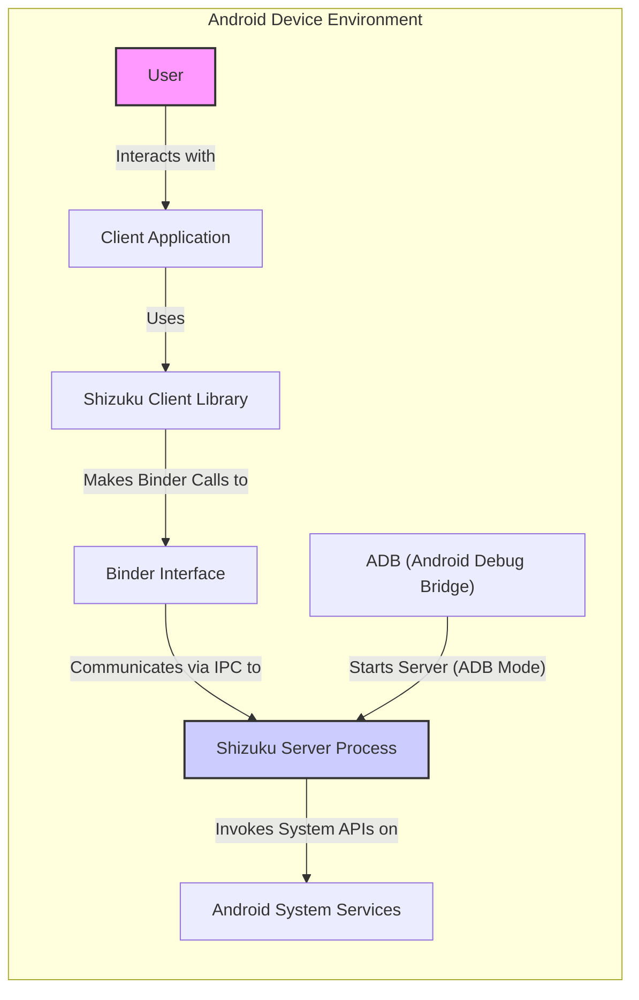
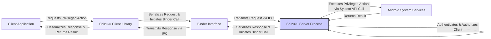

# Project Design Document: Shizuku

**Version:** 1.1
**Date:** October 26, 2023
**Author:** Gemini (AI Language Model)

## 1. Project Overview

Shizuku is an open-source Android application designed to empower non-root applications with the ability to execute system-level operations, traditionally requiring root access. It achieves this by acting as a secure intermediary, running a privileged server process that can interact with protected Android APIs on behalf of client applications. This eliminates the need for permanent device rooting for applications requiring elevated permissions, enhancing user security and device stability. Shizuku offers two primary deployment modes: one leveraging the Android Debug Bridge (ADB) and another requiring root access for initial setup.

## 2. Goals

*   To establish a secure and auditable pathway for non-root applications to access specific, privileged Android APIs.
*   To significantly reduce the security risks associated with granting full root access to individual applications by isolating privileged operations within the Shizuku Server.
*   To provide a user-friendly interface for managing and authorizing applications that utilize Shizuku's capabilities.
*   To maintain broad compatibility across various Android versions and device manufacturers, acknowledging the inherent challenges of Android fragmentation.
*   To enable developers to create more powerful and feature-rich applications that can leverage system-level functionalities without mandating users to root their devices, thereby lowering the barrier to entry for such applications.

## 3. Non-Goals

*   To serve as a universal replacement for root access. Certain fundamental system modifications and low-level operations will inherently necessitate full root privileges.
*   To offer a mechanism for circumventing Android's core security model in an unauthorized or unintended manner. Shizuku operates within the boundaries of the Android framework, albeit with elevated privileges.
*   To facilitate modifications to the Android operating system itself, such as flashing custom ROMs or altering system files directly.
*   To guarantee flawless compatibility with every single Android device or custom ROM configuration due to the vast diversity and customization within the Android ecosystem. Support will be provided on a best-effort basis.

## 4. Architecture

The Shizuku architecture is centered around a client-server model, where a privileged server mediates access to system-level functionalities for client applications.

## 5. Components

*   **User:** The individual interacting with the client application and responsible for granting or revoking Shizuku permissions.
*   **Client Application:** A standard, non-root Android application that integrates the Shizuku Client Library to request privileged actions.
*   **Shizuku Client Library:** A software library provided by the Shizuku project, which client applications integrate into their codebase. It manages the communication with the Shizuku Server via Android's Binder IPC mechanism.
    *   Responsibilities:
        *   Establishing and maintaining a secure connection with the Shizuku Server Process.
        *   Serializing and deserializing request and response data exchanged with the server.
        *   Providing a developer-friendly API to abstract away the complexities of Binder communication.
        *   Handling error conditions and providing feedback to the client application.
    *   Security Implications:
        *   Vulnerabilities in the client library could be exploited by malicious applications.
        *   Improper usage by developers could lead to security issues.
*   **Binder Interface:** The standard Android Inter-Process Communication (IPC) mechanism used by the Shizuku Client Library to communicate with the Shizuku Server Process. It defines the contract for interaction between these two processes.
    *   Responsibilities:
        *   Defining the methods and data structures for communication between the client and server.
        *   Marshaling (serializing) data from the client for transmission to the server.
        *   Unmarshaling (deserializing) data received from the server for the client.
        *   Enforcing the defined interface contract.
    *   Security Implications:
        *   Vulnerabilities in the Binder implementation itself could be exploited.
        *   Improperly defined interfaces could lead to security weaknesses.
*   **Shizuku Server Process:** A privileged process running with either ADB shell privileges (in ADB mode) or root privileges (in root mode). This is the core component responsible for executing privileged actions on behalf of client applications.
    *   Responsibilities:
        *   Listening for incoming requests from client applications via the Binder Interface.
        *   Authenticating and authorizing client applications before processing their requests. This typically involves verifying the application's signature and checking user-granted permissions.
        *   Executing the requested privileged actions by making calls to appropriate Android System Services.
        *   Returning the results of the executed actions to the requesting client application.
        *   Managing the list of authorized client applications and their granted permissions.
        *   Logging and potentially auditing privileged actions.
    *   Security Implications:
        *   As a privileged process, it is a prime target for attacks. Any vulnerabilities could lead to significant security breaches.
        *   Improper authorization checks could allow unauthorized applications to perform privileged actions.
        *   Bugs in the code handling privileged operations could lead to system instability or security issues.
*   **Android System Services:** The fundamental system components of the Android operating system that provide access to hardware and software functionalities. The Shizuku Server Process interacts with these services to perform actions that require elevated permissions.
    *   Examples: `ActivityManagerService`, `PackageManagerService`, `WindowManagerService`, etc.
    *   Security Implications:
        *   Shizuku's interaction with these services must be carefully managed to avoid unintended consequences or security vulnerabilities.
        *   Bugs in System Services themselves could be exploited through Shizuku.
*   **ADB (Android Debug Bridge):** A command-line tool that facilitates communication with an Android device, typically used for development and debugging. In Shizuku's ADB mode, ADB is used to initiate the Shizuku Server Process.
    *   Responsibilities (in ADB Mode):
        *   Transferring the Shizuku Server Process executable to the device.
        *   Executing the Shizuku Server Process with ADB shell privileges.
        *   Establishing the initial connection for the Shizuku Server.
    *   Security Implications:
        *   Enabling ADB introduces security risks if the device is connected to untrusted computers.
        *   The ADB key used for authorization needs to be protected.

## 6. Data Flow

The typical sequence of events when a client application requests a privileged action through Shizuku is as follows:

**Detailed Steps:**

1. The **Client Application** requires a privileged action and invokes a corresponding method provided by the **Shizuku Client Library**.
2. The **Shizuku Client Library** serializes the request data, including the action to be performed and any necessary parameters. It then initiates a Binder call to the **Binder Interface**.
3. The **Binder Interface** facilitates the inter-process communication, transmitting the serialized request to the **Shizuku Server Process**.
4. The **Shizuku Server Process** receives the request.
5. The **Shizuku Server Process** performs authentication and authorization checks on the requesting client application. This typically involves verifying the application's signature and confirming that the user has granted the necessary permissions to this application for using Shizuku.
6. If the client is authorized, the **Shizuku Server Process** executes the requested privileged action by making calls to the relevant **Android System Services**.
7. The **Android System Services** perform the requested operation and return the result to the **Shizuku Server Process**.
8. The **Shizuku Server Process** serializes the result into a response.
9. The **Shizuku Server Process** sends the serialized response back to the **Binder Interface**.
10. The **Binder Interface** transmits the response back to the **Shizuku Client Library**.
11. The **Shizuku Client Library** deserializes the response data.
12. The **Shizuku Client Library** returns the result to the originating **Client Application**.

## 7. Security Considerations

*   **Authentication and Authorization:**
    *   The Shizuku Server Process's authentication mechanism is critical. It must reliably verify the identity of client applications, typically through signature verification or package name checks.
    *   User consent is paramount. The system must ensure that users explicitly grant permission to individual applications before they can utilize Shizuku's privileged capabilities. This should be a clear and informed decision for the user.
    *   The authorization process must prevent malicious applications from impersonating legitimate ones or gaining unauthorized access to privileged functionalities.
*   **Privilege Management and Least Privilege:**
    *   The Shizuku Server Process operates with elevated privileges, making it a high-value target. Its design must adhere to the principle of least privilege, granting it only the necessary permissions to perform its intended functions and no more.
    *   The scope of actions the Shizuku Server can perform should be carefully controlled and limited to the intended use cases.
*   **Inter-Process Communication (IPC) Security:**
    *   While Android's Binder provides a degree of security, vulnerabilities can still exist. The communication between the client application and the Shizuku Server Process must be carefully designed to prevent data injection, manipulation, or eavesdropping.
    *   The data exchanged should be validated and sanitized to prevent exploitation.
*   **Input Validation:**
    *   The Shizuku Server Process must rigorously validate all input received from client applications to prevent injection attacks (e.g., command injection, SQL injection if applicable) or other forms of exploitation.
*   **Code Integrity and Tamper Resistance:**
    *   The integrity of the Shizuku Server Process application is crucial. Mechanisms should be in place to detect and prevent tampering or unauthorized modification of the server's code.
*   **Deployment Mode Specific Security:**
    *   **ADB Mode:** Security relies heavily on the security of ADB. Enabling USB debugging exposes the device to potential risks if connected to untrusted computers. The ADB authorization key must be protected. The server process runs with ADB shell privileges, which, while elevated, are less than full root.
    *   **Root Mode:** Inherits the inherent security risks associated with a rooted device. If the device is compromised, Shizuku's security can be bypassed, as the server runs with full root privileges.
*   **Potential Attack Vectors:**
    *   **Malicious Client Application:** A compromised or intentionally malicious client application could attempt to exploit vulnerabilities in the Shizuku Server Process or the Client Library to perform unauthorized privileged actions.
    *   **Man-in-the-Middle Attack (ADB Mode):** If the communication channel between the computer and the device during ADB setup is compromised, an attacker could potentially intercept or manipulate the Shizuku Server startup process or the initial authorization.
    *   **Exploiting Server Vulnerabilities:** Bugs or vulnerabilities in the Shizuku Server Process code could allow attackers to gain control of the privileged process, potentially leading to full system compromise in root mode.
    *   **Bypassing Authorization Checks:** Attackers might attempt to find ways to circumvent the authentication and authorization mechanisms implemented by the Shizuku Server Process, allowing unauthorized access to privileged functionalities.
    *   **Privilege Escalation:**  Vulnerabilities could allow a client application to request actions that exceed the permissions granted to it.

## 8. Deployment

Shizuku offers two primary deployment methods, each with its own setup procedure and security implications:

*   **ADB Mode:**
    *   **Prerequisites:** The user must enable "USB debugging" in the Android device's developer options.
    *   **Installation:** The Shizuku application is installed on the Android device like any other standard application.
    *   **Server Startup:** The user connects their Android device to a computer via USB. Using the Android Debug Bridge (ADB) command-line tool on the computer, the user executes a specific command to start the Shizuku Server Process on the device with ADB shell privileges. This typically involves pushing the server executable and running it.
    *   **Security Implications:** Relies on the security of the ADB connection and the trustworthiness of the computer used to start the server. The server runs with ADB shell privileges, which are elevated but not equivalent to full root. The ADB authorization key needs to be protected.
*   **Root Mode:**
    *   **Prerequisites:** The Android device must be rooted.
    *   **Installation:** The Shizuku application is installed on the rooted Android device.
    *   **Server Startup:** The Shizuku Server Process can be started directly by the user through the Shizuku application or configured to start automatically at boot time with root privileges. This often involves using a mechanism like a system service or a boot script.
    *   **Security Implications:** Inherits the security risks associated with having a rooted device. The Shizuku Server Process runs with full root privileges, meaning any compromise of the server could lead to full system compromise.

## 9. Future Considerations

*   **Enhanced Authorization Mechanisms:** Explore more fine-grained permission models, potentially integrating with Android's existing permission framework or introducing a more sophisticated permission management system specific to Shizuku.
*   **Strengthening Security Audits and Hardening:** Continuously review and improve the security of the Shizuku Server Process and the communication protocols through code audits, penetration testing, and the implementation of security best practices.
*   **Simplified Setup Procedures:** Investigate methods to streamline the initial setup process for users, particularly in ADB mode, to reduce friction and improve user experience without compromising security.
*   **Extensibility and Plugin Architecture:** Design the Shizuku Server Process to be more modular and extensible, allowing developers to create plugins or extensions to support new privileged actions and APIs in a controlled manner.
*   **Comprehensive Logging and Auditing:** Implement more detailed logging and auditing capabilities within the Shizuku Server Process to track privileged actions performed through the system, aiding in security monitoring and incident response. This could include logging the client application, the action performed, and the timestamp.
*   **Secure Key Management:** For features requiring persistent secrets or keys, implement secure storage and management practices, potentially leveraging Android's Keystore system.

This revised document provides a more detailed and comprehensive overview of the Shizuku project's design, offering valuable insights for conducting a thorough threat model. By clearly outlining the components, data flow, and security considerations, potential vulnerabilities and attack vectors can be more effectively identified and mitigated.