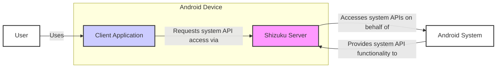
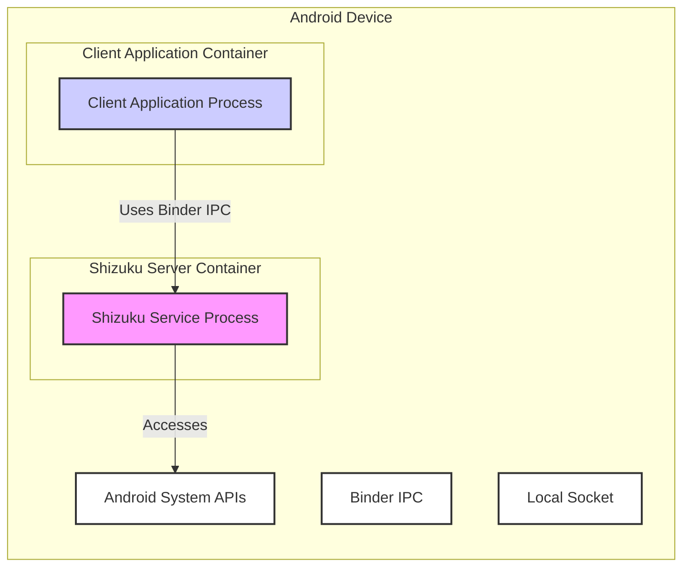
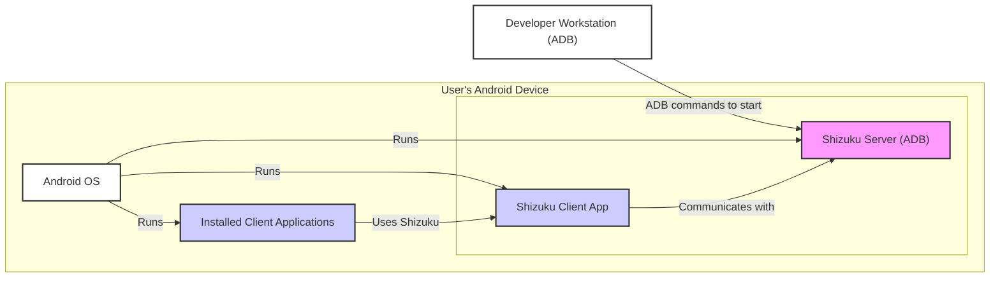
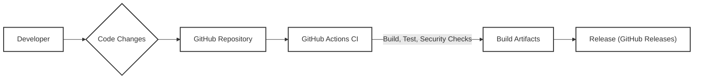

# BUSINESS POSTURE

- Business Priorities and Goals:
  - Enable Android applications to access system-level APIs without requiring full root access on the device.
  - Provide a more secure and controlled way for applications to perform privileged operations compared to granting full root access.
  - Simplify the development and usage of applications that require system-level functionalities.
  - Offer a user-friendly alternative to complex rooting procedures for specific use cases.

- Business Risks:
  - Security vulnerabilities in Shizuku could be exploited to gain unauthorized access to system APIs, potentially leading to data breaches, device compromise, or denial of service.
  - Misuse of Shizuku by malicious applications could bypass Android security mechanisms and harm users.
  - Compatibility issues with different Android versions and device manufacturers could limit adoption and user experience.
  - Lack of user trust if Shizuku is perceived as insecure or unreliable.
  - Dependence on ADB or root access for initial setup might deter some users.

# SECURITY POSTURE

- Existing Security Controls:
  - security control: Permission management within Shizuku to control which applications can access system APIs. (Implemented in Shizuku server and client application logic)
  - security control: User confirmation prompts for granting Shizuku access to applications. (Implemented in Shizuku client application UI)
  - security control: Communication between client applications and Shizuku server is intended to be local, reducing network exposure. (Implicit in design, local socket communication)
  - accepted risk: Reliance on user's understanding of permissions and potential risks when granting access to applications.
  - accepted risk: Initial setup requires ADB or root access, which might introduce security risks if not performed correctly.

- Recommended Security Controls:
  - security control: Implement input validation and sanitization on all data received by the Shizuku server from client applications to prevent injection attacks.
  - security control: Regularly perform security audits and penetration testing to identify and address potential vulnerabilities in Shizuku.
  - security control: Implement code signing for Shizuku server and client applications to ensure integrity and prevent tampering.
  - security control: Provide clear and comprehensive documentation and security guidelines for users on how to use Shizuku securely.
  - security control: Implement rate limiting and request throttling on the Shizuku server to mitigate potential denial-of-service attacks.

- Security Requirements:
  - Authentication:
    - requirement: Shizuku server should authenticate client applications to ensure only authorized applications can access system APIs. (Mechanism: Package name verification, signature verification)
  - Authorization:
    - requirement: Implement a fine-grained authorization mechanism to control which system APIs are accessible to each authorized application. (Mechanism: Permission mapping, API access control lists)
    - requirement: Users should be able to easily review and revoke permissions granted to applications. (Mechanism: User interface in Shizuku client application)
  - Input Validation:
    - requirement: All input data received by the Shizuku server from client applications must be validated to prevent injection attacks (e.g., command injection, path traversal). (Mechanism: Input sanitization, whitelisting, data type validation)
  - Cryptography:
    - requirement: Secure communication channel between client applications and Shizuku server if communication extends beyond local device boundaries in future. (Not currently applicable, but consider for future enhancements)
    - requirement: Protect sensitive data, such as API keys or configuration settings, if any are stored by Shizuku. (Mechanism: Encryption at rest, secure storage)

# DESIGN

## C4 CONTEXT

- Context Diagram Elements:
  - - Name: User
    - Type: Person
    - Description: An Android device user who installs and uses applications that leverage Shizuku.
    - Responsibilities: Grants permissions to applications and Shizuku, installs and configures Shizuku.
    - Security controls: User awareness and education about permissions, device security settings.
  - - Name: Client Application
    - Type: Software System
    - Description: An Android application that is designed to use system-level APIs through Shizuku.
    - Responsibilities: Requests access to system APIs via Shizuku, processes data received from system APIs.
    - Security controls: Application-level permission requests, secure coding practices, input validation on data received from system APIs.
  - - Name: Shizuku Server
    - Type: Software System
    - Description: A background service running on the Android device with elevated privileges (ADB or root) that mediates access to system APIs for client applications.
    - Responsibilities: Authenticates client applications, authorizes API access requests, interacts with the Android System APIs, enforces security controls.
    - Security controls: Permission management, input validation, access control lists, secure inter-process communication.
  - - Name: Android System
    - Type: Software System
    - Description: The underlying Android operating system providing system APIs and managing device resources.
    - Responsibilities: Provides system functionalities, enforces system-level security policies, manages permissions.
    - Security controls: Android security model, SELinux, permission system, kernel-level security mechanisms.

## C4 CONTAINER

- Container Diagram Elements:
  - - Name: Shizuku Service Process
    - Type: Process
    - Description: A background process running as an Android service with elevated privileges (obtained via ADB or root). It hosts the core logic of Shizuku server.
    - Responsibilities: Manages client connections, authenticates and authorizes client applications, handles API requests, interacts with Android System APIs via Binder IPC, enforces security policies.
    - Security controls: Process isolation, least privilege principle, input validation, access control lists, secure inter-process communication (Binder IPC).
  - - Name: Client Application Process
    - Type: Process
    - Description: The process of an Android application that wants to use system APIs through Shizuku.
    - Responsibilities: Sends API requests to Shizuku Service Process via Binder IPC, receives responses, handles data.
    - Security controls: Application sandbox, standard Android permissions, input validation on data received from Shizuku.
  - - Name: Android System APIs
    - Type: System Interface
    - Description: Collection of Android system-level APIs that Shizuku Server interacts with to perform privileged operations.
    - Responsibilities: Provide system functionalities, enforce system-level security.
    - Security controls: Android security model, API access controls, permission checks within Android System.
  - - Name: Binder IPC
    - Type: Communication Protocol
    - Description: Android's Inter-Process Communication mechanism used for communication between Client Application Process and Shizuku Service Process.
    - Responsibilities: Secure and reliable communication between processes.
    - Security controls: Binder security features, process isolation enforced by Android.

## DEPLOYMENT

- Deployment Architecture:
  - Shizuku is deployed directly on the user's Android device. There are no separate server-side deployments outside of the user's device.
  - Deployment involves installing the Shizuku client application and running the Shizuku server component, which can be started via ADB or root.

- Detailed Deployment (ADB method):

- Deployment Diagram Elements:
  - - Name: Android OS
    - Type: Operating System
    - Description: The Android operating system running on the user's mobile device.
    - Responsibilities: Provides the runtime environment for Shizuku and client applications, manages system resources, enforces security policies.
    - Security controls: Android security features, kernel security, application sandboxing.
  - - Name: Shizuku Client App
    - Type: Application
    - Description: The user-facing Android application that manages Shizuku server and permissions, and allows users to start the server.
    - Responsibilities: User interface for Shizuku management, starting Shizuku server (via ADB or root), managing application permissions.
    - Security controls: Standard Android application security, user permission prompts.
  - - Name: Shizuku Server (ADB)
    - Type: Process
    - Description: The Shizuku server process started via ADB commands from a developer workstation or using root access. Runs with elevated privileges.
    - Responsibilities:  Mediates access to system APIs, authenticates client applications, enforces permissions.
    - Security controls: Process isolation, access control lists, input validation.
  - - Name: Installed Client Applications
    - Type: Applications
    - Description: Third-party Android applications installed by the user that are designed to use Shizuku.
    - Responsibilities: Utilize Shizuku to access system APIs, provide functionalities to the user.
    - Security controls: Application sandboxing, standard Android permissions, Shizuku permission management.
  - - Name: Developer Workstation (ADB)
    - Type: Computer
    - Description: A computer used by a developer to send ADB commands to the Android device to initially start the Shizuku server (ADB method).
    - Responsibilities: Initial setup of Shizuku server via ADB.
    - Security controls: Workstation security, secure ADB connection.

## BUILD

- Build Process:
  - Developer: Developers write code and commit changes to the GitHub repository.
  - GitHub Repository: Source code is hosted on GitHub.
  - GitHub Actions CI: GitHub Actions is used for Continuous Integration.
    - Build: Compiles the Android application (Shizuku client and server components).
    - Test: Runs automated tests (unit tests, integration tests).
    - Security Checks: Performs static analysis security testing (SAST), code linting, dependency scanning to identify vulnerabilities.
  - Build Artifacts:  Generated APK files for Shizuku client application and potentially server components.
  - Release (GitHub Releases): Build artifacts are packaged and released on GitHub Releases for users to download.

- Build Security Controls:
  - security control: Source code hosted on a reputable platform (GitHub).
  - security control: Use of GitHub Actions for automated builds, reducing manual steps and potential for human error.
  - security control: Implementation of automated tests to ensure code quality and functionality.
  - security control: Integration of SAST tools and linters in the CI pipeline to detect potential security vulnerabilities and code quality issues early in the development cycle. (Recommended: Integrate dependency scanning to check for vulnerable dependencies)
  - security control: Code signing of release APKs to ensure integrity and authenticity. (Implemented as part of standard Android build process)
  - security control: Access control to the GitHub repository and CI/CD pipeline to prevent unauthorized modifications.

# RISK ASSESSMENT

- Critical Business Processes:
  - Enabling applications to access system APIs without root.
  - Maintaining user trust and security reputation of Shizuku.
  - Ensuring compatibility and stability of Shizuku across different Android devices and versions.

- Data Sensitivity:
  - Shizuku itself does not directly handle sensitive user data. However, it provides access to system APIs, which can potentially expose sensitive data depending on the APIs accessed and how client applications use them.
  - Sensitivity level: Moderate to High, depending on the system APIs exposed and the context of use. Misuse or vulnerabilities could lead to unauthorized access to user data managed by the Android system or other applications.

# QUESTIONS & ASSUMPTIONS

- Questions:
  - What are the specific system APIs that Shizuku is intended to expose? (Assumption: Shizuku aims to provide a flexible framework to expose various system APIs as needed by client applications).
  - What is the intended user base for Shizuku? (Assumption: Android developers and advanced users who need system-level functionalities in their applications without full root access).
  - Are there any specific regulatory compliance requirements for Shizuku? (Assumption: No specific regulatory compliance requirements beyond general software security best practices).
  - What is the process for handling security vulnerabilities reported in Shizuku? (Assumption: Standard open-source vulnerability disclosure and patching process).

- Assumptions:
  - BUSINESS POSTURE: The primary business goal is to provide a secure and user-friendly way to access system APIs on Android without root, targeting developers and advanced users.
  - SECURITY POSTURE: Security is a high priority. The project aims to minimize security risks associated with granting elevated privileges. Current security controls are basic, and further security measures are recommended.
  - DESIGN: The design is based on a client-server architecture with local communication. Deployment is on-device. Build process uses standard CI practices with potential for security enhancements.