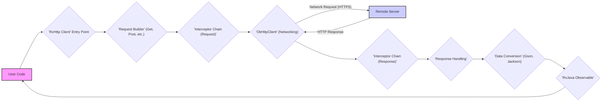

## Project Design Document: RxHttp Library (Improved)

**1. Introduction**

This document provides an enhanced design overview of the RxHttp library (as found at [https://github.com/liujingxing/rxhttp](https://github.com/liujingxing/rxhttp)). Building upon the initial design, this version offers more granular detail regarding the library's architecture, component interactions, and data flow, specifically tailored for effective threat modeling. The aim is to provide a comprehensive understanding of potential attack surfaces and vulnerabilities within the library.

**2. Goals**

*   Present a refined and more detailed architectural overview of the RxHttp library, emphasizing security-relevant aspects.
*   Provide in-depth descriptions of key components, highlighting their functionalities and potential security implications.
*   Elaborate on the data flow within the library, pinpointing data transformation points and potential vulnerability locations.
*   Offer more specific and actionable security considerations to guide subsequent threat modeling activities.

**3. Scope**

This document focuses on the design of the RxHttp library's core functionalities related to initiating and processing HTTP requests and responses. It includes interactions with the underlying OkHttp library and considerations for data handling. The scope remains within the library's boundaries, without detailing the intricacies of the remote servers it interacts with.

**4. Architectural Overview**

The RxHttp library provides a fluent and reactive interface for making HTTP requests in Android and Java environments. It leverages the robust networking capabilities of OkHttp and the asynchronous programming model of RxJava. The architecture is designed for ease of use and extensibility, but security considerations are paramount in understanding potential risks.

**5. Key Components (Detailed)**

*   **`RxHttp` Client (Entry Point):**
    *   Provides static methods (`get`, `post`, `put`, `delete`, `head`, `patch`, `options`, `trace`) to initiate various HTTP request types.
    *   Acts as the primary interface for developers, abstracting away the complexities of request construction and execution.
    *   Potential security concern: Improper input sanitization at this entry point could lead to issues if user-provided data is directly used in URLs or headers without encoding.
*   **Request Builders (`GetRequestBuilder`, `PostRequestBuilder`, etc.):**
    *   Responsible for constructing immutable `Request` objects that encapsulate all details of an HTTP request.
    *   Offer methods to set URLs, headers, query parameters, request bodies (including different content types like JSON, form data, files), and timeouts.
    *   Potential security concern: Vulnerabilities could arise if builders don't enforce proper encoding of data added to URLs or headers, leading to injection attacks. Incorrect handling of file uploads could also pose risks.
*   **Interceptor Chain (Request & Response):**
    *   Leverages OkHttp's interceptor mechanism, allowing for modification of requests before being sent and responses after being received.
    *   Interceptors can be used for logging, authentication, adding common headers, error handling, and caching.
    *   Potential security concerns:
        *   **Malicious Interceptors:**  If developers introduce custom interceptors with vulnerabilities (e.g., logging sensitive data, bypassing security checks), it can compromise the application.
        *   **Order of Interceptors:** The order of interceptors is crucial. Incorrect ordering could lead to security bypasses (e.g., authentication interceptor running after a logging interceptor that exposes credentials).
*   **`OkHttpClient` (Networking Engine):**
    *   The underlying HTTP client responsible for the actual network communication.
    *   Manages connection pooling, HTTP/2 negotiation, TLS/SSL handshake, and caching.
    *   Potential security concerns:
        *   **TLS/SSL Configuration:** Misconfiguration of TLS/SSL settings (e.g., allowing weak ciphers, not enforcing certificate validation) can lead to man-in-the-middle attacks.
        *   **Proxy Settings:** Improperly configured or malicious proxy settings can expose traffic or redirect requests.
        *   **Cookie Management:** Vulnerabilities in cookie handling can lead to session hijacking or other authentication issues.
*   **Response Handling Mechanism:**
    *   Processes the `Response` object received from `OkHttpClient`.
    *   Handles HTTP status codes, extracts headers, and provides access to the response body.
    *   Potential security concern: Improper handling of error responses might expose sensitive information. Lack of proper content-type checking could lead to vulnerabilities during deserialization.
*   **Data Conversion/Serialization/Deserialization (using libraries like Gson, Jackson):**
    *   Responsible for converting request parameters into appropriate formats (e.g., JSON, form data) and parsing response bodies into Java/Kotlin objects.
    *   Potential security concerns:
        *   **Deserialization Vulnerabilities:**  Using insecure deserialization practices can allow attackers to execute arbitrary code.
        *   **Data Injection:** If response data is not properly validated after deserialization, it could lead to data injection vulnerabilities within the application.
*   **Cache Management (OkHttp's built-in cache):**
    *   Stores HTTP responses to reduce network traffic and improve performance.
    *   Can be configured for size, location, and caching policies.
    *   Potential security concerns:
        *   **Sensitive Data in Cache:** Caching sensitive data without proper encryption or access controls can lead to information disclosure.
        *   **Cache Poisoning:**  If an attacker can manipulate the cache, they might be able to serve malicious content to users.
*   **Error Handling:**
    *   Manages network errors, HTTP errors (e.g., 404, 500), and parsing exceptions.
    *   Provides mechanisms to handle errors gracefully and potentially retry requests.
    *   Potential security concern:  Verbose error messages or stack traces exposed to the user can reveal sensitive information about the application's internal workings.

**6. Data Flow (Detailed)**

The journey of an HTTP request and response through RxHttp involves several stages, each with potential security implications:

1. **Request Initiation:** User code calls a method on the `RxHttp` client, providing the target URL and any necessary parameters. Potential vulnerability: Input validation flaws in user-provided data.
2. **Request Building:** The appropriate `RequestBuilder` is instantiated and configured. Data is added to the request (headers, parameters, body). Potential vulnerability: Improper encoding or sanitization of data added to the request.
3. **Request Interception:** Configured request interceptors are executed sequentially. They can modify the request (e.g., adding authentication headers). Potential vulnerability: Malicious or poorly implemented interceptors.
4. **Network Transmission (via OkHttp):** The `OkHttpClient` sends the request over the network. Potential vulnerability: TLS/SSL misconfiguration, exposure to network attacks if not using HTTPS.
5. **Server Processing:** The remote server receives and processes the request (outside the scope of RxHttp).
6. **Response Reception (via OkHttp):** The `OkHttpClient` receives the HTTP response from the server.
7. **Response Interception:** Configured response interceptors are executed in reverse order. They can modify the response or handle errors. Potential vulnerability: Malicious or poorly implemented interceptors.
8. **Response Handling:** RxHttp's response handling mechanism processes the raw response, checking status codes and extracting headers. Potential vulnerability: Inadequate content-type validation.
9. **Data Conversion:** The response body is converted into the desired data type using configured converters (e.g., Gson). Potential vulnerability: Deserialization vulnerabilities.
10. **Response Emission (via RxJava):** The converted response data (or an error) is emitted as an `Observable`.
11. **Response Consumption:** User code subscribes to the `Observable` to receive the response data or handle errors. Potential vulnerability: Improper handling of sensitive data in the consuming code.

**7. Diagrammatic Representation (Mermaid Flowchart)**

**8. Security Considerations (Actionable for Threat Modeling)**

The following security considerations provide a more actionable framework for threat modeling:

*   **Ensure HTTPS Enforcement:** Verify that the `OkHttpClient` is configured to enforce HTTPS and reject insecure connections to prevent man-in-the-middle attacks. Threat Scenario: Attacker intercepts communication and steals sensitive data.
*   **Validate and Sanitize Input:**  Implement input validation and sanitization at the `RxHttp` client level to prevent injection attacks (e.g., SQL injection if parameters are used on the server-side, header injection). Threat Scenario: Attacker injects malicious code or commands through request parameters.
*   **Secure Custom Interceptors:**  Thoroughly review and test any custom interceptors to ensure they do not introduce vulnerabilities (e.g., logging sensitive data, bypassing security checks). Threat Scenario: Malicious interceptor logs user credentials.
*   **Configure TLS/SSL Properly:** Ensure the `OkHttpClient` is configured with secure TLS/SSL settings, disabling weak ciphers and enforcing certificate validation. Threat Scenario: Attacker downgrades connection to a weaker cipher and exploits vulnerabilities.
*   **Secure Cookie Management:** Understand how RxHttp and OkHttp handle cookies and implement appropriate security measures (e.g., `HttpOnly`, `Secure` flags) to prevent session hijacking. Threat Scenario: Attacker steals session cookies and impersonates a user.
*   **Protect Cached Data:** If caching is enabled, ensure sensitive data is not cached or is encrypted at rest. Implement appropriate access controls for the cache. Threat Scenario: Unauthorized access to the cache reveals sensitive user data.
*   **Guard Against Deserialization Vulnerabilities:**  If using libraries like Gson or Jackson, follow secure deserialization practices to prevent arbitrary code execution. Threat Scenario: Attacker sends a malicious payload that, when deserialized, executes code on the application.
*   **Implement Robust Error Handling:** Avoid exposing sensitive information in error messages or stack traces. Implement proper logging and monitoring for security-related errors. Threat Scenario: Error messages reveal internal application details to an attacker.
*   **Regularly Update Dependencies:** Keep RxHttp and its dependencies (OkHttp, RxJava, JSON libraries) up-to-date to patch known security vulnerabilities. Threat Scenario: Application is vulnerable to known exploits in outdated libraries.
*   **Secure File Uploads:** If the application handles file uploads, implement proper validation (file type, size, content) to prevent malicious file uploads. Threat Scenario: Attacker uploads a malware-infected file.

**9. Assumptions and Constraints**

*   Developers using RxHttp are expected to have a basic understanding of HTTP and network security principles.
*   The security of the remote servers interacting with RxHttp is the responsibility of the server administrators.
*   This document focuses on the security aspects within the RxHttp library itself and does not cover broader application security concerns.

**10. Future Considerations**

*   A detailed code review and static analysis of the RxHttp codebase would provide a more in-depth understanding of potential vulnerabilities.
*   Dynamic analysis and penetration testing can help identify runtime vulnerabilities.
*   Investigating the library's handling of different authentication and authorization schemes is crucial for a complete security assessment.

This improved design document provides a more detailed and security-focused overview of the RxHttp library, serving as a valuable resource for conducting thorough threat modeling and identifying potential security vulnerabilities. The enhanced descriptions, data flow analysis, and actionable security considerations aim to facilitate a comprehensive security assessment of the library.
