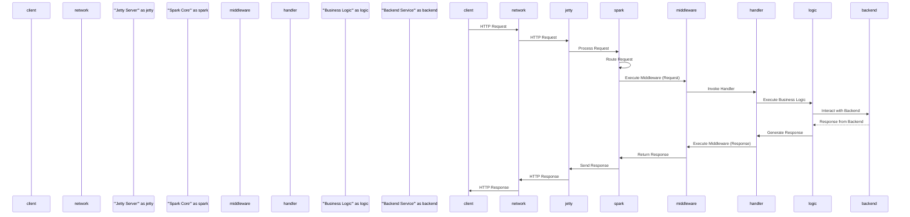

# Project Design Document: Spark Web Framework

**Version:** 1.1
**Date:** October 26, 2023
**Author:** AI Software Architect

## 1. Introduction

This document provides a detailed design overview of the Spark web framework (https://github.com/perwendel/spark). This document aims to capture the key architectural components, data flow, and interactions within the framework. It will serve as a foundation for subsequent threat modeling activities, enabling a structured approach to identifying potential security vulnerabilities.

## 2. Goals and Non-Goals

* **Goals:**
    * Clearly define the architecture and components of the Spark web framework, emphasizing aspects relevant to security.
    * Describe the typical request lifecycle within a Spark application, highlighting data transformation and potential interception points.
    * Identify key data flows and interactions between components, focusing on the nature and sensitivity of the data.
    * Provide sufficient detail for effective threat modeling, enabling the identification of assets, threats, and vulnerabilities.
* **Non-Goals:**
    * Provide a comprehensive code-level analysis of the Spark framework's internal implementation details.
    * Detail every possible configuration option or extension point available within the framework.
    * Offer specific security implementation recommendations or prescriptive best practices (these will be addressed in the threat modeling phase based on the identified risks).

## 3. Architectural Overview

Spark is a micro web framework for Java that allows developers to quickly create web applications with minimal boilerplate. It leverages the embedded Jetty server by default to handle HTTP requests and responses. The framework focuses on providing a simple and expressive API for defining routes and handling requests.

### 3.1. High-Level Architecture Diagram

```mermaid
graph LR
    A["'Client (Browser, API Consumer)'"] -- "HTTP Request" --> B["'Network (Internet/LAN)'"];
    B -- "HTTP Request" --> C["'Spark Application\n(Embedded Jetty)'"];
    C -- "Route Matching" --> D["'User-Defined Routes\nand Handlers'"];
    D -- "Execution" --> E["'Business Logic\n(Developer Code)'"];
    E -- "Data Interaction" --> F["'Backend Services\n(Database, etc.)'"];
    F -- "Data Response" --> E;
    E -- "Response Generation" --> D;
    D -- "Response Handling" --> C;
    C -- "HTTP Response" --> B;
    B -- "HTTP Response" --> A;
```

### 3.2. Key Components

* **Client:** The entity initiating the HTTP request. This could be a web browser, a mobile application, another service, or a command-line tool. Clients can introduce various threats depending on their trustworthiness and the data they control.
* **Network:** The communication medium through which requests and responses travel. This represents a potential interception point for eavesdropping or man-in-the-middle attacks.
* **Spark Application (Embedded Jetty):** The core of the framework, responsible for receiving and processing HTTP requests. This component includes:
    * **Jetty Server:** The embedded web server responsible for listening for incoming HTTP requests on a specified port. It handles the low-level details of network communication. Vulnerabilities in Jetty could directly impact the Spark application.
    * **Spark Core:** The framework's core logic, responsible for:
        * **Request Handling:** Receiving and parsing incoming HTTP requests.
        * **Routing:** Matching incoming request URLs and HTTP methods to defined routes. This is a critical area for security, as incorrect routing can lead to unauthorized access.
        * **Middleware/Filters:** Allowing developers to intercept and process requests and responses. This can be used for security measures like authentication and authorization, but also introduces potential vulnerabilities if not implemented correctly.
        * **Response Handling:**  Preparing and sending HTTP responses back to the client.
* **User-Defined Routes and Handlers:** The mappings defined by the application developer that associate specific URL paths and HTTP methods (GET, POST, PUT, DELETE, etc.) with corresponding handler functions. These define the application's API and are prime targets for attackers.
* **Business Logic (Developer Code):** The custom code written by the developer within the handler functions to perform specific actions based on the incoming request. This is where application-specific vulnerabilities like business logic flaws can reside. It often involves:
    * **Data Processing:** Manipulating and transforming data received in the request.
    * **Data Validation:** Ensuring the integrity and validity of input data.
    * **Interaction with Backend Services:** Communicating with databases, external APIs, or other services.
* **Backend Services:** External systems or services that the Spark application might interact with. These represent potential attack surfaces if not properly secured. Examples include:
    * **Databases:** Storing persistent data. Vulnerabilities here can lead to data breaches.
    * **Message Queues:** Facilitating asynchronous communication.
    * **Third-Party APIs:** Integrating with external services.

## 4. Request Lifecycle

The following outlines the typical flow of an HTTP request through a Spark application, highlighting potential security implications at each stage:

1. **Client Sends Request:** A client initiates an HTTP request targeting a specific URL of the Spark application. The request may contain sensitive data that needs protection in transit.
2. **Network Transmission:** The request travels through the network to the server hosting the Spark application. This is a vulnerable point for eavesdropping and tampering if not secured with HTTPS.
3. **Jetty Receives Request:** The embedded Jetty server listens on the configured port and receives the incoming HTTP request. Jetty's configuration and any vulnerabilities within it are relevant here.
4. **Request Processing by Jetty:** Jetty parses the HTTP request, including headers, parameters, and body. Improper parsing could lead to vulnerabilities.
5. **Spark Routing:** Jetty passes the request to the Spark framework. Spark's routing mechanism analyzes the request URL and HTTP method to determine the appropriate user-defined route and handler. Incorrectly configured routes can expose unintended functionality.
6. **Middleware/Filter Execution (Optional):** If defined, middleware or filters are executed before the handler. These can perform actions like authentication, authorization, logging, or request modification. Security vulnerabilities in middleware can have significant impact.
7. **Handler Invocation:** The corresponding handler function, defined by the developer, is invoked. Spark provides access to request and response objects within the handler. This is where application-specific logic and potential vulnerabilities reside.
8. **Business Logic Execution:** The code within the handler function executes, potentially interacting with backend services or performing other operations. This stage is crucial for input validation and secure data handling.
9. **Response Generation:** The handler generates an HTTP response. This includes setting the response status code, headers, and body. Improperly generated responses can lead to information disclosure or cross-site scripting vulnerabilities.
10. **Middleware/Filter Execution (Optional - Response Phase):**  Middleware can also process the outgoing response.
11. **Response Transmission:** Spark passes the response back to Jetty.
12. **Jetty Sends Response:** Jetty transmits the HTTP response back to the client through the network.
13. **Client Receives Response:** The client receives and processes the HTTP response.

### 4.1. Request Flow Diagram

## 5. Data Flow

Data flows through the Spark application in several key ways, each presenting potential security concerns:

* **Incoming Request Data:** Data sent by the client in the HTTP request. This data is untrusted and must be treated with caution.
    * **URL Parameters:** Data embedded in the URL path. Susceptible to tampering and information disclosure in logs.
    * **Query Parameters:** Data appended to the URL after the '?'. Similar risks to URL parameters.
    * **Headers:** Metadata about the request. Can be manipulated by attackers to bypass security checks or inject malicious content.
    * **Request Body:** Data sent in the body of the request (e.g., for POST or PUT requests). Can contain sensitive information and is a primary target for injection attacks.
* **Internal Processing Data:** Data manipulated and processed within the handler function and business logic. Secure handling and storage of this data are crucial. This can include:
    * **Data retrieved from backend services:** The security of this data depends on the security of the backend services.
    * **Data transformed or aggregated:**  Care must be taken to avoid introducing errors or vulnerabilities during transformation.
    * **Session data:**  Sensitive user information stored for session management. Requires secure storage and handling to prevent session hijacking.
* **Outgoing Response Data:** Data sent back to the client in the HTTP response. Care must be taken to prevent information leakage and cross-site scripting vulnerabilities.
    * **Response Body:** The main content of the response (e.g., HTML, JSON, XML). Needs proper encoding to prevent XSS.
    * **Headers:** Metadata about the response. Can be used to set security-related directives (e.g., Content-Security-Policy).
    * **Status Code:** Indicates the outcome of the request. While not directly data, informative status codes can sometimes reveal information to attackers.

## 6. Security Considerations (with Threat Context)

While Spark itself is a lightweight framework and doesn't enforce specific security mechanisms, several security considerations are crucial for developers building applications with Spark. Failure to address these can lead to various threats:

* **Input Validation:**  Ensuring that data received from clients is validated and sanitized to prevent injection attacks (e.g., SQL injection, cross-site scripting, command injection). Lack of validation allows attackers to inject malicious code or data.
* **Output Encoding:** Properly encoding data before sending it to the client to prevent cross-site scripting (XSS) vulnerabilities. Without proper encoding, attacker-controlled data can be executed in the user's browser.
* **Authentication and Authorization:** Implementing mechanisms to verify the identity of users and control access to resources. Lack of authentication allows unauthorized access, while insufficient authorization can lead to privilege escalation. Common threats include brute-force attacks and credential stuffing.
* **Session Management:** Securely managing user sessions to maintain state across multiple requests and prevent session hijacking or fixation attacks. Weak session management can allow attackers to impersonate legitimate users.
* **Dependency Management:** Ensuring that all dependencies used by the Spark application are up-to-date and free from known vulnerabilities. Using vulnerable dependencies can directly expose the application to known exploits.
* **Error Handling:** Implementing proper error handling to avoid leaking sensitive information in error messages. Verbose error messages can reveal internal system details to attackers.
* **HTTPS/TLS:** Enabling HTTPS to encrypt communication between the client and the server, protecting data in transit from eavesdropping and man-in-the-middle attacks.
* **Cross-Site Request Forgery (CSRF) Protection:** Implementing measures to prevent attackers from forcing authenticated users to perform unintended actions.
* **Security Headers:** Utilizing HTTP security headers (e.g., Content-Security-Policy, Strict-Transport-Security, X-Frame-Options) to enhance the application's security posture and mitigate various client-side attacks.
* **Rate Limiting and Throttling:** Implementing mechanisms to limit the number of requests from a single source to prevent denial-of-service attacks and brute-force attempts.

## 7. Deployment Considerations

Spark applications are typically deployed as standalone JAR files that include the embedded Jetty server. The deployment environment significantly impacts the overall security of the application.

* **Bare Metal Servers:** Requires careful configuration and hardening of the operating system and network.
* **Virtual Machines (VMs):**  Security depends on the underlying hypervisor and VM configuration. Isolation between VMs is crucial.
* **Containers (Docker, Kubernetes):**  Container security best practices must be followed, including image scanning, resource limits, and network policies.
* **Cloud Platforms (AWS, Azure, GCP):** Leverage cloud-provided security services and follow platform-specific security recommendations. Proper configuration of firewalls, access controls, and identity management is essential.

## 8. Future Considerations

This design document provides a foundational understanding of the Spark framework's architecture for threat modeling. Future enhancements could include:

* Detailed analysis of common middleware used with Spark and their security implications.
* A deeper dive into the routing mechanism and potential vulnerabilities related to route configuration.
* Examination of different template engines used with Spark and their susceptibility to injection attacks.
* Analysis of common data storage patterns used with Spark applications and associated security risks.

This document serves as a crucial input for the subsequent threat modeling process, where potential vulnerabilities and attack vectors will be identified and analyzed based on the architecture, data flows, and security considerations described herein.