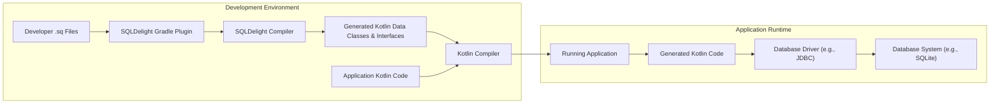
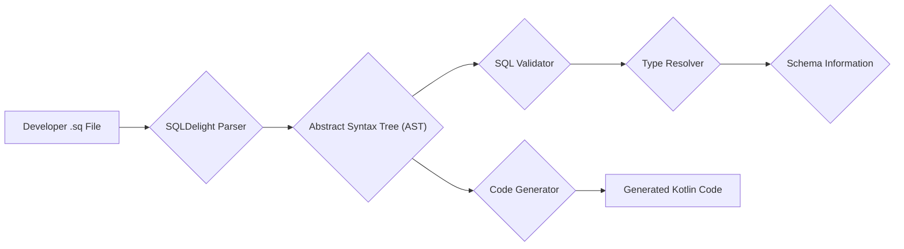
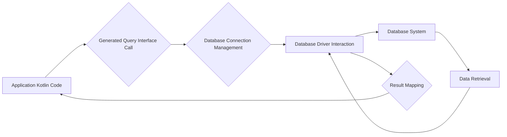

# Project Design Document: SQLDelight

**Version:** 1.1
**Date:** October 26, 2023
**Author:** AI Software Architect

## 1. Introduction

This document details the architecture of SQLDelight, a Kotlin library available at [https://github.com/sqldelight/sqldelight](https://github.com/sqldelight/sqldelight). SQLDelight enhances database interactions in Kotlin by generating type-safe Kotlin APIs directly from SQL statements. This design document outlines the system's components, data flow, and security considerations, serving as a foundation for threat modeling.

## 2. Goals

* Clearly define the architectural components of SQLDelight.
* Illustrate the data flow during both compilation and runtime.
* Identify key areas relevant to security and potential threats.
* Provide a structured overview for understanding SQLDelight's operation.

## 3. Non-Goals

* Provide a line-by-line code walkthrough.
* Offer specific security fixes or penetration testing results.
* Detail the history of SQLDelight's development.
* Describe the internal workings of specific database systems.

## 4. Architectural Overview

SQLDelight's architecture spans the development environment (compile time) and the application runtime. The core function is to transform SQL definitions into usable Kotlin code, which then interacts with a database.

**Key Actors:**

* **'Developer':** Writes SQL queries and schema definitions in `.sq` files.
* **'SQLDelight Gradle Plugin':** Integrates SQLDelight into the Kotlin build process, invoking the compiler.
* **'SQLDelight Compiler':** Parses `.sq` files, validates SQL syntax, and generates Kotlin code.
* **'Generated Kotlin Data Classes & Interfaces':** The output of the compiler, providing type-safe database access.
* **'Kotlin Compiler':** Compiles the generated Kotlin code and the application's source code.
* **'Application Kotlin Code':** The developer's Kotlin code that utilizes the generated SQLDelight API.
* **'Database Driver (e.g., JDBC)':**  A library that enables communication between the generated code and the specific database system.
* **'Database System (e.g., SQLite)':** The underlying database where data is stored and managed.
* **'Running Application':** The deployed application utilizing SQLDelight for database interactions.

## 5. Component Details

This section provides a more detailed look at the key components.

* **'.sq' Files':**
    * Purpose: Define SQL queries, schema, and other database-related statements.
    * Content: Standard SQL syntax with SQLDelight-specific extensions.
    * Input to: SQLDelight Compiler.

* **'SQLDelight Gradle Plugin':**
    * Purpose:  Integrate SQLDelight into the Gradle build lifecycle.
    * Responsibilities:
        * Configuring the SQLDelight Compiler.
        * Specifying input directories for `.sq` files.
        * Defining output directories for generated Kotlin code.
        * Managing SQLDelight compiler dependencies.
    * Interaction with: Gradle build system, SQLDelight Compiler.

* **'SQLDelight Compiler':**
    * Purpose:  Transform `.sq` files into type-safe Kotlin code.
    * Stages:
        * **Parsing:**  Analyzes the `.sq` files and builds an Abstract Syntax Tree (AST).
        * **Validation:** Checks the SQL syntax and semantics for correctness.
        * **Type Resolution:** Determines the data types of query parameters and results based on the schema.
        * **Code Generation:**  Emits Kotlin code, including:
            * Data classes representing database tables.
            * Interfaces for executing queries.
            * Implementations of these interfaces.
            * Type-safe wrappers for parameters and results.
    * Inputs: `.sq` files, database schema information (inferred or provided).
    * Outputs: Generated Kotlin code.

* **'Generated Kotlin Data Classes & Interfaces':**
    * Purpose: Provide a type-safe API for database interaction.
    * Features:
        * Data classes representing database tables with corresponding columns and types.
        * Interfaces defining query methods with type-safe parameters and return types.
        * Implementations of these interfaces for executing queries.
    * Used by: Application Kotlin Code.

* **'Kotlin Compiler':**
    * Purpose: Compile the generated Kotlin code and the application's source code into bytecode.
    * Role: Standard Kotlin compilation process.
    * Inputs: Generated Kotlin code, Application Kotlin Code.
    * Outputs: Bytecode (e.g., JVM bytecode, Android DEX bytecode).

* **'Application Kotlin Code':**
    * Purpose:  Utilize the generated SQLDelight API to interact with the database.
    * Actions:
        * Creating instances of the generated database class.
        * Calling generated query methods.
        * Handling results returned by the generated code.

* **'Database Driver (e.g., JDBC)':**
    * Purpose:  Provide a platform-specific interface for communicating with the database system.
    * Examples: SQLite JDBC driver, PostgreSQL JDBC driver.
    * Used by: Generated Kotlin code at runtime.

* **'Database System (e.g., SQLite)':**
    * Purpose:  Store and manage the application's data.
    * Examples: SQLite, PostgreSQL, MySQL, H2.
    * Interacted with: Through the Database Driver.

## 6. Data Flow Diagrams

This section details the flow of data during the compilation and runtime phases.

### 6.1. Compilation Phase Data Flow

**Detailed Compilation Data Flow:**

* **'Developer .sq File':** Contains the SQL definitions.
* **'SQLDelight Parser':** Reads and parses the `.sq` file, creating an Abstract Syntax Tree (AST).
* **'Abstract Syntax Tree (AST)':** A hierarchical representation of the SQL code structure.
* **'SQL Validator':** Checks the AST for syntactical and semantic correctness according to SQL rules.
* **'Type Resolver':** Analyzes the AST and schema information to determine the data types of expressions and results.
* **'Schema Information':**  Information about the database schema, either inferred from `.sq` files or provided externally.
* **'Code Generator':** Traverses the AST and schema information to generate corresponding Kotlin code.
* **'Generated Kotlin Code':** The output of the compilation process, providing the type-safe API.

### 6.2. Runtime Phase Data Flow

**Detailed Runtime Data Flow:**

* **'Application Kotlin Code':** Initiates a database operation by calling a method on the generated query interface.
* **'Generated Query Interface Call':** The invocation of a specific query method in the generated Kotlin code.
* **'Database Connection Management':** The generated code or underlying libraries handle obtaining and managing a connection to the database.
* **'Database Driver Interaction':** The generated code uses the appropriate database driver to send the SQL query to the database.
* **'Database System':** Executes the SQL query against the stored data.
* **'Data Retrieval':** The database retrieves the requested data.
* **'Result Mapping':** The database driver returns the results, and the generated Kotlin code maps these results into type-safe Kotlin objects (data classes).
* **'Application Kotlin Code':** Receives the mapped results for further processing.

## 7. Security Considerations

This section outlines potential security considerations relevant to SQLDelight.

* **Input Validation and SQL Injection:**
    * **Threat:** Maliciously crafted data could be injected through parameters if not handled correctly, potentially leading to unauthorized data access or modification.
    * **Mitigation:** SQLDelight's generated code uses parameterized queries, which significantly reduces the risk of SQL injection. However, developers must use the generated API correctly and avoid constructing raw SQL.

* **Code Generation Security:**
    * **Threat:** Vulnerabilities in the SQLDelight compiler could lead to the generation of insecure code.
    * **Mitigation:**  Rigorous testing and security reviews of the SQLDelight compiler are crucial. Sanitization of inputs during compilation is also important.

* **Dependency Vulnerabilities:**
    * **Threat:** SQLDelight relies on external libraries. Vulnerabilities in these dependencies could be exploited.
    * **Mitigation:** Regularly update dependencies and monitor for known vulnerabilities. Employ dependency scanning tools.

* **Build Process Security:**
    * **Threat:** A compromised build environment could inject malicious code into the generated Kotlin files.
    * **Mitigation:** Secure the build environment, use trusted build pipelines, and implement integrity checks.

* **Data Exposure in Generated Code:**
    * **Threat:**  Sensitive information (e.g., database schema, parts of queries) might be present in the generated code.
    * **Mitigation:** While not a direct vulnerability, consider the potential for information disclosure. Avoid storing sensitive credentials directly in the code.

* **Permissions and Access Control (Database Level):**
    * **Threat:**  Insufficient database permissions could allow unauthorized access or modification.
    * **Mitigation:**  SQLDelight relies on the underlying database system's access control mechanisms. Properly configure database permissions and authentication.

* **Error Handling and Information Disclosure:**
    * **Threat:**  Verbose error messages or stack traces could reveal sensitive information about the database structure or application logic.
    * **Mitigation:** Implement robust error handling that avoids exposing sensitive details in production environments.

## 8. Deployment Considerations

SQLDelight's impact on deployment is primarily through the generated code.

* **Mobile Applications (Android/iOS):** The generated Kotlin code is compiled into the application and interacts with embedded databases like SQLite.
* **Backend Applications (JVM):**  SQLDelight can be used with various JVM-based backend frameworks and database systems (e.g., PostgreSQL, MySQL). The generated code is part of the application artifact.
* **Multiplatform Projects:** SQLDelight's multiplatform capabilities allow sharing SQL definitions and generated code across different platforms (e.g., Android, iOS, Desktop).

## 9. Future Considerations

* **Enhanced SQL Dialect Support:** Expanding support for more advanced SQL features and database-specific syntax.
* **Improved Compiler Error Messages:** Providing more detailed and actionable error messages during compilation.
* **Plugin System:** Allowing developers to extend or customize the code generation process.
* **Static Analysis Integration:**  Integrating with static analysis tools to detect potential issues in `.sq` files or generated code.
* **Formal Security Audits:** Conducting regular security audits to identify and address potential vulnerabilities.

This improved design document provides a more detailed and structured overview of SQLDelight's architecture, enhancing its value for threat modeling and understanding the system's inner workings.