# Project Design Document: SQLDelight

**Version:** 1.1
**Date:** October 26, 2023
**Author:** AI Software Architect

## 1. Introduction

This document provides an enhanced and more detailed design overview of the SQLDelight project, an open-source library available at [https://github.com/cashapp/sqldelight](https://github.com/cashapp/sqldelight). This revised document aims to provide an even clearer articulation of the system's architecture, components, and data flow to facilitate future threat modeling activities. It elaborates on the key elements of SQLDelight, their interactions, and the overall system boundaries, offering a more granular understanding of the project.

## 2. Goals

*   Provide a comprehensive and detailed architectural overview of SQLDelight.
*   Clearly identify key components and elaborate on their specific responsibilities and interactions.
*   Describe the data flow within the system with enhanced clarity and precision.
*   Establish a robust foundation for subsequent threat modeling exercises by providing sufficient detail.
*   Document the system in a clear, understandable, and well-structured manner.

## 3. Overview

SQLDelight is a powerful Kotlin Multiplatform library designed to generate typesafe Kotlin APIs directly from SQL statements. This allows developers to embed SQL queries within their Kotlin code while benefiting from compile-time safety and code generation. The library parses SQL files, rigorously validates the SQL syntax and semantics, and then generates corresponding Kotlin code for seamless database interaction. This approach significantly improves code maintainability by ensuring SQL queries are checked at compile time, reduces the likelihood of runtime SQL errors, and provides a more intuitive and type-safe way to interact with databases. The core functionality encompasses SQL parsing, schema validation, and Kotlin code generation, all integrated within the Kotlin compilation process.

## 4. System Architecture

The SQLDelight system comprises several interconnected components working in concert:

*   **SQL Input Files (`.sq`):**
    *   These plain text files are the starting point, containing SQL statements authored by developers.
    *   They define the database schema (tables, columns, etc.) and the queries to be executed.
    *   These files are typically located within the project's source directories.
*   **SQLDelight Gradle Plugin (or Build System Integration):**
    *   This plugin integrates SQLDelight into the Kotlin build process (e.g., using Gradle, Maven, or other build tools).
    *   It's responsible for discovering `.sq` files within the project.
    *   It orchestrates the invocation of the SQLDelight compiler.
*   **SQLDelight Compiler:**
    *   The core component responsible for processing `.sq` files.
    *   It encompasses the SQL Parser, Schema Validator, and Code Generator.
*   **SQL Parser (within Compiler):**
    *   This module analyzes the raw SQL text from `.sq` files.
    *   It constructs an Abstract Syntax Tree (AST) representing the structure of the SQL statements.
    *   It performs initial syntax validation to ensure the SQL is well-formed.
*   **Schema Validator (within Compiler):**
    *   This component takes the parsed AST and performs semantic validation.
    *   It checks if the SQL statements are valid against the defined or inferred database schema.
    *   It ensures data types, table names, and column names are consistent and correct.
    *   It can infer schema information from the SQL statements themselves or from separate schema definition files (if provided).
*   **Code Generator (within Compiler):**
    *   The engine that transforms the validated SQL AST into Kotlin code.
    *   It generates:
        *   Data classes representing the structure of the data returned by queries.
        *   Interfaces defining the available queries and their parameters.
        *   Implementation classes for executing the queries using a database driver.
        *   Type-safe accessors for database columns and parameters.
*   **Generated Kotlin Code (`.kt`):**
    *   The output of the code generation process.
    *   Standard Kotlin code that developers can use directly in their applications.
    *   This code provides a type-safe and convenient way to interact with the database.
*   **Database (Runtime Environment):**
    *   The actual database system where data is persisted and queried (e.g., SQLite, MySQL, PostgreSQL, H2).
    *   SQLDelight does not manage the database instance itself.
*   **Database Driver (e.g., `sqlite-driver`, `h2-driver`):**
    *   A library that provides the platform-specific implementation for communicating with a particular database system.
    *   SQLDelight uses a driver interface, and specific driver implementations are chosen based on the target database.
    *   These drivers handle the low-level details of database connection, query execution, and result retrieval.

## 5. Data Flow

The flow of data and control within the SQLDelight system occurs in distinct phases:

1. **Development Phase:**
    *   Developers write SQL statements in `.sq` files.
    *   These files are saved within the project's source structure.
2. **Compilation Phase:**
    *   The Kotlin compiler is invoked as part of the build process.
    *   The **SQLDelight Gradle Plugin** intercepts the compilation.
    *   The plugin identifies all `.sq` files in the project.
    *   For each `.sq` file, the **SQLDelight Compiler** is invoked.
    *   The **SQL Parser** within the compiler reads the `.sq` file and constructs an Abstract Syntax Tree (AST).
    *   The **Schema Validator** analyzes the AST, validating the SQL against the database schema (either explicitly defined or inferred).
    *   If validation is successful, the **Code Generator** transforms the AST into Kotlin source code.
    *   The **Generated Kotlin Code** is written to the project's generated sources directory.
    *   The **Kotlin Compiler** then compiles the generated Kotlin code along with the rest of the application's Kotlin code.
3. **Runtime Phase:**
    *   The application is executed.
    *   The application code utilizes the **Generated Kotlin Code** to interact with the database.
    *   The generated code uses the appropriate **Database Driver** to establish a connection to the **Database**.
    *   When a query defined in the `.sq` files needs to be executed, the generated Kotlin code uses the driver to send the SQL query to the database.
    *   The **Database** processes the query and returns the results.
    *   The **Database Driver** receives the results and passes them back to the generated Kotlin code.
    *   The generated Kotlin code maps the database results to the generated data classes, making the data available to the application in a type-safe manner.

```mermaid
graph LR
    subgraph "Development Time"
        A["'Developer .sq Files'"] --> B["'SQLDelight Gradle Plugin'"];
    end
    subgraph "Compilation Time"
        B --> C["'SQLDelight Compiler'"];
        C --> D["'SQL Parser'"];
        D --> E["'Schema Validator'"];
        E --> F["'Code Generator'"];
        F --> G["'Generated Kotlin Code (.kt)'"];
        G --> H["'Kotlin Compiler'"];
    end
    subgraph "Runtime"
        H --> I["'Application Code'"];
        I --> J["'Generated Kotlin Code (Runtime)'"];
        J --> K["'Database Driver Interface'"];
        K --> L["'Database (e.g., SQLite)'"];
        L --> K;
        J --> I;
    end
```

## 6. Security Considerations (For Threat Modeling)

This section expands on the initial security considerations, providing more specific areas to explore during threat modeling:

*   **SQL Injection Vulnerabilities:**
    *   While SQLDelight aims to prevent direct SQL injection, vulnerabilities could arise from:
        *   Improper use of string interpolation or concatenation within the generated code if developers extend or modify it.
        *   Flaws in the code generation logic that might inadvertently create injectable SQL.
        *   Vulnerabilities in custom database driver implementations.
*   **Dependency Management and Supply Chain Security:**
    *   The SQLDelight plugin and database drivers rely on external dependencies.
    *   Compromised dependencies could introduce vulnerabilities.
    *   Regularly scanning dependencies for known vulnerabilities is crucial.
    *   Ensuring the integrity of the build process and dependency resolution mechanisms.
*   **Code Generation Security:**
    *   Bugs or oversights in the SQLDelight compiler's code generation logic could lead to:
        *   Generation of insecure code patterns.
        *   Incorrect handling of data types or escaping, potentially leading to vulnerabilities.
        *   Unexpected behavior that could be exploited.
*   **Schema Validation Weaknesses:**
    *   Incomplete or flawed schema validation could allow:
        *   Processing of malicious or invalid SQL that could cause database errors or unexpected behavior.
        *   Circumvention of intended data access controls.
*   **Information Disclosure:**
    *   Error messages or logging during compilation or runtime could inadvertently expose sensitive information, such as:
        *   Database schema details.
        *   Specific SQL queries being executed.
        *   Internal implementation details.
*   **Build Environment Security:**
    *   Compromise of the development or build environment could allow attackers to:
        *   Inject malicious code into the SQLDelight compiler or generated code.
        *   Modify `.sq` files to introduce malicious queries.
*   **Database Driver Security:**
    *   The security of the underlying database driver is paramount.
    *   Vulnerabilities in the driver could be exploited through the generated code.
    *   Keeping database drivers up-to-date is essential.
*   **Access Control and Permissions:**
    *   While SQLDelight generates code, the actual database access control and permissions are managed by the underlying database system.
    *   Ensuring proper database configuration and user permissions is critical.

## 7. Dependencies

SQLDelight relies on a set of key dependencies for its functionality:

*   **Kotlin Compiler and Standard Library:** The foundational components of the Kotlin language and tooling.
*   **ANTLR (Another Tool for Language Recognition):** Used for parsing the SQL language.
*   **Square's KotlinPoet:** A Kotlin library for generating Kotlin source code.
*   **Database-Specific JDBC Drivers (or equivalent):**  Examples include:
    *   `org.xerial:sqlite-jdbc` for SQLite.
    *   `com.h2database:h2` for H2 Database.
    *   Drivers for other supported databases like MySQL, PostgreSQL, etc.
*   **Gradle (or other build system) API:** For integration with the build process.
*   Potentially other internal Square libraries or utility libraries.

## 8. Deployment

The deployment of SQLDelight is primarily focused on the development and build phases:

*   **Integration into the Build Process:**
    *   Adding the SQLDelight Gradle plugin to the project's `build.gradle.kts` (or equivalent for other build systems).
    *   Configuring the plugin with database schema information or connection details if needed.
*   **Dependency Management:**
    *   Including the appropriate database driver dependency in the project's build file.
*   **Source Code Organization:**
    *   Placing `.sq` files in the designated source directories within the project structure (typically under `src/main/sqldelight`).

At runtime, the generated Kotlin code is simply part of the application's compiled code and interacts with the database through the included driver. No separate deployment of SQLDelight itself is required for the runtime environment.

## 9. Future Considerations

The SQLDelight project is continuously evolving. Potential future enhancements and areas of focus include:

*   **Enhanced SQL Feature Support:** Expanding support for more advanced SQL features and database-specific syntax variations.
*   **Improved Schema Management:** Providing more sophisticated tools for schema definition, migration, and evolution.
*   **Advanced Type Mapping:** Offering more control over the mapping between SQL data types and Kotlin types.
*   **Better Error Reporting and Debugging:** Enhancing error messages and providing better tooling for debugging SQL queries and generated code.
*   **Reactive Extensions:** Exploring integration with reactive programming libraries like Coroutines Flow or RxJava.
*   **Support for More Database Systems:** Expanding the range of officially supported database systems.
*   **Improved IDE Integration:** Enhancing IDE support for features like syntax highlighting, code completion, and refactoring for `.sq` files.
*   **Security Audits and Hardening:**  Proactive efforts to identify and address potential security vulnerabilities in the compiler and generated code.

This enhanced document provides a more detailed and comprehensive understanding of the SQLDelight project's architecture, data flow, and security considerations. It serves as a valuable resource for subsequent threat modeling activities, offering a deeper insight into the system's inner workings and potential areas of risk.