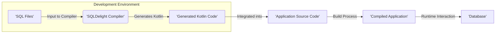

# Project Design Document: SQLDelight

**Version:** 1.1
**Date:** October 26, 2023
**Author:** AI Architecture Expert

## 1. Introduction

This document provides an enhanced and detailed design overview of SQLDelight, a Kotlin library that generates typesafe Kotlin APIs from SQL statements. This document is specifically tailored for use in threat modeling activities, providing a comprehensive understanding of the system's architecture, components, and data flow with a strong focus on potential security implications.

## 2. Goals

The primary goal of this document is to provide a clear, comprehensive, and security-focused description of the SQLDelight project's design. This will empower security professionals to:

* Gain a deep understanding of the system's architecture and its various components.
* Effectively identify potential threat vectors, attack surfaces, and vulnerabilities within the system.
* Thoroughly assess the security risks associated with the project's design and implementation.
* Develop targeted and effective mitigation strategies to address identified risks.

## 3. Scope

This document comprehensively covers the design of the core SQLDelight library and its interaction with the software development lifecycle, particularly the build process. It includes:

* A detailed breakdown of the SQLDelight compiler's functionality and internal workings.
* The various types of input the compiler accepts and the output it produces.
* The mechanisms for integrating SQLDelight with common build tools such as Gradle and Maven.
* An in-depth look at the structure and functionality of the generated Kotlin code and its interaction with database systems.

This document explicitly excludes:

* The internal implementation details of specific database systems (e.g., SQLite, PostgreSQL, MySQL).
* The runtime behavior of applications utilizing the generated code beyond the immediate scope of database interaction.
* User interface elements, IDE plugins, or other tooling that are not core to the SQLDelight library itself.

## 4. High-Level Architecture

SQLDelight functions as a crucial build-time tool within the software development process. It consumes SQL files as input and, through a compilation step, generates type-safe Kotlin code that facilitates secure and efficient database access.

* **'SQL Files':** These are human-readable text files, typically with a `.sq` extension, containing SQL statements augmented with SQLDelight-specific syntax for type mapping, query definitions, and schema declarations.
* **'SQLDelight Compiler':** This is the central component of SQLDelight, responsible for parsing SQL files, performing semantic analysis and validation, and ultimately generating the corresponding Kotlin code.
* **'Generated Kotlin Code':** This is the output of the compiler, providing type-safe interfaces, data classes, and implementations that encapsulate database interactions.
* **'Application Source Code':** The developer's handwritten Kotlin code that imports and utilizes the 'Generated Kotlin Code' to interact with the database.
* **'Compiled Application':** The final executable or deployable artifact produced by the build process, incorporating the generated code.
* **'Database':** The underlying database system where application data is persisted and managed.

## 5. Detailed Design

### 5.1. 'SQL Files'

* **Description:** Plain text files with the `.sq` extension, serving as the primary input to SQLDelight.
* **Content:** Contains standard SQL statements, enhanced with SQLDelight's declarative syntax for:
    * Defining queries with named parameters for type safety and prevention of basic SQL injection.
    * Explicitly specifying the expected return type of queries, ensuring type consistency.
    * Declaring database table schemas, including column names, data types, and constraints.
* **Location:** Typically organized within the project's source directories, often following a convention like `src/main/sqldelight`.
* **Processing:** Parsed and analyzed by the 'SQLDelight Compiler' during the build phase.
* **Security Considerations:**
    * **Integrity of SQL Files:** Maintaining the integrity of these files is crucial, as malicious modifications could lead to the generation of vulnerable code or unintended database operations. Source control and access controls are important.
    * **Accidental Exposure of Secrets:** Although discouraged, developers might inadvertently include sensitive information like temporary credentials or schema details within these files. Secure coding practices and configuration management are essential.

### 5.2. 'SQLDelight Compiler'

* **Description:** A Kotlin compiler plugin or a standalone command-line tool responsible for the core logic of SQLDelight.
* **Functionality:**
    * **Lexing and Parsing:** Reads and parses the 'SQL Files', verifying the syntax against the SQLDelight grammar. This stage is crucial for identifying syntactical errors and potential injection attempts at a basic level.
    * **Semantic Analysis and Validation:** Performs deeper analysis to understand the meaning of the SQL statements, validate table and column references, and ensure type compatibility. This helps catch logical errors and potential data integrity issues early.
    * **Code Generation:** The core function, where the compiler transforms the parsed SQL definitions into type-safe Kotlin code. This involves generating data classes, interfaces for database operations (queries, inserts, updates, deletes), and type mappers.
    * **Integration with Build Tools:** Seamlessly integrates with build systems like Gradle and Maven through dedicated plugins, allowing for automated code generation during the build process.
    * **Configuration:** Configurable via build scripts to specify input and output directories, target database dialects (SQLite, PostgreSQL, etc.), and other generation options.
* **Security Considerations:**
    * **Vulnerabilities in the Compiler:** Bugs or security flaws within the compiler itself could lead to the generation of vulnerable code, regardless of the input SQL. Regular updates and security audits of the SQLDelight library are important.
    * **Input Sanitization and Validation:** The compiler must robustly handle potentially malicious or malformed SQL input to prevent crashes, unexpected behavior, or the generation of exploitable code. This includes protection against advanced SQL injection techniques that might bypass basic checks.
    * **Dependency Security:** The compiler depends on other libraries (e.g., ANTLR for parsing). Vulnerabilities in these dependencies could indirectly impact the compiler's security. Regular dependency checks and updates are necessary.
    * **Code Generation Logic Flaws:** Errors in the code generation logic could inadvertently introduce vulnerabilities in the generated Kotlin code, such as incorrect parameterization or insufficient escaping.

### 5.3. 'Generated Kotlin Code'

* **Description:** Kotlin source code automatically generated by the 'SQLDelight Compiler' based on the definitions in the 'SQL Files'.
* **Content:**
    * **Data Classes:** Kotlin data classes representing database tables, with properties corresponding to table columns and their respective data types.
    * **Interfaces for Database Operations:** Interfaces defining type-safe methods for performing database operations (e.g., `insert`, `select`, `update`, `delete`), ensuring that parameters and return types are correctly handled.
    * **Implementations of Interfaces:** Concrete implementations of the database operation interfaces, which internally use parameterized queries to interact with the underlying database, mitigating basic SQL injection risks.
    * **Type Mappers:** Code responsible for converting data between database types and Kotlin types.
* **Location:** Typically generated in a designated output directory within the project's build structure (e.g., `build/generated/sqldelight`).
* **Usage:** Consumed by the 'Application Source Code' to perform database interactions in a type-safe and more secure manner.
* **Security Considerations:**
    * **Potential for SQL Injection (Advanced Cases):** While SQLDelight uses parameterized queries, vulnerabilities could still arise in complex scenarios or if there are subtle flaws in the generated code's parameter handling. Thorough testing and code reviews are crucial.
    * **Data Exposure Risks:** Improper handling of sensitive data within the generated code or the data classes could lead to unintended exposure. Secure coding practices in the application code are vital.
    * **Complexity and Auditability:** Highly complex generated code might be harder to audit for potential security vulnerabilities. Keeping SQL definitions relatively straightforward can improve maintainability and security.

### 5.4. Build Tool Integration (Gradle/Maven)

* **Description:** Plugins or extensions for build tools that facilitate the integration and execution of the 'SQLDelight Compiler' within the standard build lifecycle.
* **Functionality:**
    * **Configuration of the Compiler:** Allows developers to configure compiler settings (input/output directories, database dialect, etc.) within the build scripts.
    * **Automated Compiler Execution:** Automatically invokes the 'SQLDelight Compiler' during the build process, ensuring that the generated code is always up-to-date.
    * **Management of Dependencies:** Handles the inclusion of the SQLDelight library and its dependencies in the project.
* **Security Considerations:**
    * **Build Script Vulnerabilities:** Maliciously crafted or compromised build scripts could potentially tamper with the compilation process, introduce malicious code, or exfiltrate sensitive information. Secure build pipeline practices are essential.
    * **Plugin Security:** Vulnerabilities in the SQLDelight Gradle or Maven plugins themselves could be exploited. Keeping these plugins updated and verifying their integrity is important.
    * **Dependency Resolution Risks:** If the build tool resolves dependencies from untrusted sources, it could lead to the introduction of compromised versions of SQLDelight or its dependencies. Using secure and trusted repositories is crucial.

## 6. Data Flow

The data flow within the SQLDelight ecosystem, focusing on the path from SQL definition to database interaction, is as follows:

```mermaid
graph LR
    A["'Developer Creates/Modifies .sq Files'"] --> B["'Build Process Initiated (e.g., Gradle task)'"]
    B --> C["'Build Tool Executes SQLDelight Compiler Plugin'"]
    C --> D["'Compiler Parses and Validates SQL Files'"]
    D --> E["'Compiler Generates Kotlin Code'"]
    E --> F["'Generated Code Integrated into Application Compilation'"]
    F --> G["'Application Executes, Utilizing Generated Code'"]
    G --> H["'Generated Code Interacts with Database (Parameterized Queries)'"]
```

1. **'Developer Creates/Modifies .sq Files':** Developers write or modify `.sq` files containing SQL statements and SQLDelight-specific syntax.
2. **'Build Process Initiated (e.g., Gradle task)':** The software build process is triggered, often by a developer command or a CI/CD pipeline.
3. **'Build Tool Executes SQLDelight Compiler Plugin':** The build tool (e.g., Gradle) executes the configured SQLDelight compiler plugin.
4. **'Compiler Parses and Validates SQL Files':** The SQLDelight compiler parses the `.sq` files, performing syntax and semantic validation.
5. **'Compiler Generates Kotlin Code':** Based on the validated SQL definitions, the compiler generates the corresponding Kotlin code.
6. **'Generated Code Integrated into Application Compilation':** The generated Kotlin code is included in the application's source set and compiled along with the rest of the application code.
7. **'Application Executes, Utilizing Generated Code':** At runtime, the application code utilizes the generated Kotlin code to perform database operations.
8. **'Generated Code Interacts with Database (Parameterized Queries)':** The generated code executes SQL queries against the database, typically using parameterized queries to prevent basic SQL injection attacks.

## 7. Key Technologies

* **Kotlin:** The primary programming language for SQLDelight's implementation and the generated code.
* **SQL:** The standard query language forming the basis of the `.sq` files.
* **Gradle and Maven:** Popular build tools used for integrating and managing the SQLDelight compilation process.
* **ANTLR (likely):** A parser generator framework likely used internally by the SQLDelight compiler for parsing SQL syntax.

## 8. Deployment Model

SQLDelight itself is primarily a build-time dependency. The core library and compiler are not deployed with the final application. Instead, the generated Kotlin code is compiled into the application artifact and interacts with the database at runtime.

## 9. Security Considerations (Detailed)

Expanding on the initial thoughts, here are more detailed security considerations for threat modeling:

* **SQL Injection Vulnerabilities (Beyond Basic):** While parameterization helps, complex queries or custom logic within the generated code might still be susceptible to advanced SQL injection techniques if not carefully implemented.
* **Compiler Vulnerabilities Leading to Malicious Code Generation:** A compromised or flawed compiler could generate code with backdoors, vulnerabilities, or unintended data access.
* **Supply Chain Attacks Targeting SQLDelight or Dependencies:** Malicious actors could target the SQLDelight library itself or its dependencies on platforms like Maven Central, potentially injecting vulnerabilities.
* **Build Environment Compromise:** If the build environment is compromised, attackers could modify SQL files, compiler configurations, or the compiler itself to inject malicious code.
* **Exposure of Sensitive Data in Generated Code or Memory:** Improper handling of sensitive data within the generated data classes or during database interactions could lead to exposure.
* **Insufficient Input Validation by the Compiler:** If the compiler doesn't thoroughly validate SQL input, it might be possible to craft malicious SQL that bypasses checks and leads to unexpected behavior or code generation flaws.
* **Denial of Service through Malicious SQL:** Carefully crafted SQL in `.sq` files could potentially lead to the generation of inefficient queries that could cause performance issues or denial of service at runtime.
* **Information Disclosure through Error Messages:** Verbose error messages generated by the compiler or the generated code could inadvertently reveal sensitive information about the database schema or internal workings.

## 10. Threat Modeling Focus Areas

Based on the detailed design and security considerations, the following areas should be the primary focus during threat modeling activities:

* **'SQLDelight Compiler' Input Validation and Sanitization:** Thoroughly analyze how the compiler handles various forms of SQL input, including potentially malicious or malformed statements. Investigate potential bypasses for injection attacks.
* **Security of the 'SQLDelight Compiler' Code Generation Logic:** Scrutinize the code generation process to identify any potential flaws that could lead to the generation of insecure code, such as incorrect parameterization, missing escaping, or vulnerabilities in data handling.
* **'SQLDelight Compiler' and Plugin Dependency Management:**  Assess the security posture of the compiler's dependencies and the build tool plugins. Investigate mechanisms for ensuring the integrity and authenticity of these dependencies.
* **Security of the Build Process Integration:** Analyze the security of the integration points with build tools like Gradle and Maven. Identify potential vulnerabilities in build scripts or plugin configurations that could be exploited.
* **Potential Misuse of 'Generated Kotlin Code' by Developers:** Explore scenarios where developers might misuse the generated code in ways that could introduce security vulnerabilities, such as constructing dynamic queries outside of the generated API.
* **Handling of Sensitive Data Throughout the Process:** Examine how sensitive data is handled from the initial SQL definitions through the generated code and during database interactions. Identify potential points of exposure.

## 11. Glossary

* **DSL (Domain Specific Language):** In this context, refers to the SQLDelight-specific extensions and syntax added to standard SQL within the `.sq` files.
* **ORM (Object-Relational Mapping):** While SQLDelight simplifies database interaction, it's not a full ORM. It focuses on generating type-safe code from SQL rather than providing a complete object-centric abstraction over the database.

This enhanced document provides a more in-depth and security-focused understanding of the SQLDelight project's design, specifically tailored to facilitate comprehensive threat modeling. This detailed information will enable security professionals to more effectively identify, assess, and mitigate potential security risks associated with SQLDelight.