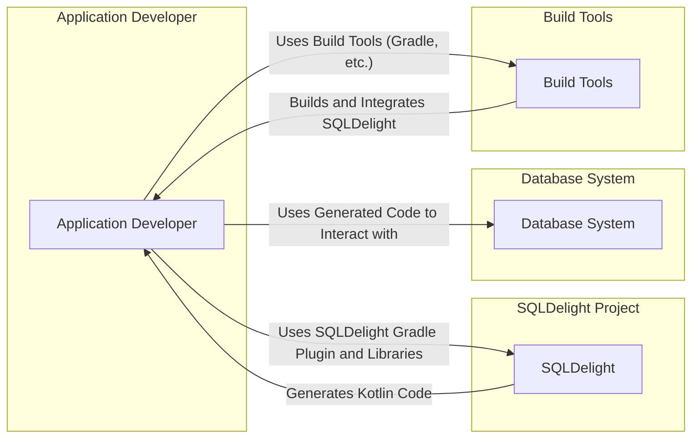
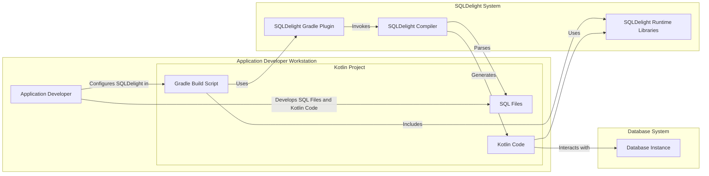
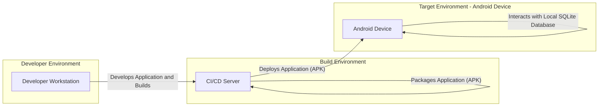

# BUSINESS POSTURE

This project, SQLDelight, aims to simplify database interactions for Kotlin Multiplatform and Android developers. It provides a type-safe way to write and manage SQL queries by generating Kotlin code from SQL schema and queries.

- Business Priorities and Goals:
  - Enhance developer productivity by reducing boilerplate code for database access.
  - Improve code maintainability and reduce errors by providing type-safe database interactions.
  - Support Kotlin Multiplatform, enabling code sharing across different platforms (Android, iOS, JVM, etc.).
  - Offer a robust and reliable solution for database management in Kotlin projects.

- Business Risks:
  - Adoption risk: Developers might prefer existing ORM solutions or raw SQL queries.
  - Complexity risk: Integrating SQLDelight into existing projects might require a learning curve.
  - Dependency risk: Reliance on SQLDelight introduces a dependency that needs to be maintained and updated.
  - Security risk: Vulnerabilities in SQLDelight could potentially impact applications using it, especially if it mishandles SQL queries or data.

# SECURITY POSTURE

- Security Controls:
  - security control: Code review process for contributions (GitHub pull requests). Implemented in GitHub repository contribution guidelines.
  - security control: Open source project, allowing community scrutiny. Implemented by project being publicly available on GitHub.
  - security control: Use of Kotlin and Java, languages with established security practices. Implemented by technology stack choice.
  - security control: Build process likely includes standard Kotlin/Java compilation and testing. Assumed based on typical software development practices.

- Accepted Risks:
  - accepted risk: Potential vulnerabilities in dependencies (Kotlin, Java, Gradle, etc.). Accepted as inherent risk of using external libraries and platforms.
  - accepted risk: Risk of community contributions introducing vulnerabilities. Mitigated by code review but not entirely eliminated.
  - accepted risk: Reliance on developer's secure coding practices when writing SQL queries and using generated code. Accepted as responsibility of the user of the library.

- Recommended Security Controls:
  - security control: Implement automated security scanning (SAST/DAST) in the build pipeline to detect potential vulnerabilities in the codebase.
  - security control: Regularly update dependencies to patch known vulnerabilities.
  - security control: Provide security guidelines for developers using SQLDelight, focusing on secure SQL query practices and input validation when using data with generated code.

- Security Requirements:
  - Authentication: Not directly applicable to SQLDelight itself, as it's a library. Authentication is handled by the application using SQLDelight and the underlying database system.
  - Authorization: Not directly applicable to SQLDelight itself. Authorization is handled by the application and the database system. SQLDelight should not bypass database authorization mechanisms.
  - Input Validation: SQLDelight generates code based on SQL queries. It's crucial that the generated code and the library itself do not introduce vulnerabilities related to SQL injection. Input validation should be primarily handled by the application layer using SQLDelight, but SQLDelight should facilitate secure query construction and parameterization.
  - Cryptography: Not directly applicable to SQLDelight core functionality. Cryptographic operations would be handled by the application layer or the database system if data encryption is required. SQLDelight should not interfere with or weaken any cryptographic measures implemented by the application or database.

# DESIGN

## C4 CONTEXT



- Elements of Context Diagram:
  - - Name: Application Developer
    - Type: Person
    - Description: Developers who use SQLDelight to manage databases in their Kotlin applications.
    - Responsibilities: Writes SQL queries, integrates SQLDelight into their projects, uses generated Kotlin code to interact with databases.
    - Security controls: Responsible for secure coding practices, including input validation and secure SQL query construction when using SQLDelight.
  - - Name: SQLDelight
    - Type: Software System
    - Description: A Kotlin library and Gradle plugin that generates Kotlin code from SQL schema and queries, providing type-safe database access.
    - Responsibilities: Parse SQL files, generate Kotlin code, provide runtime libraries for database interaction.
    - Security controls: Code review, open source visibility, potential future automated security scanning, dependency updates.
  - - Name: Database System
    - Type: External System
    - Description: The database system (e.g., SQLite, PostgreSQL, MySQL) that the application interacts with.
    - Responsibilities: Stores and manages data, executes SQL queries, enforces database security policies.
    - Security controls: Database-specific security controls (authentication, authorization, encryption, access control lists, etc.).
  - - Name: Build Tools
    - Type: External System
    - Description: Build tools like Gradle, Maven, or others used to build Kotlin projects and integrate SQLDelight.
    - Responsibilities: Build and compile the application code, manage dependencies, execute build scripts including SQLDelight Gradle plugin.
    - Security controls: Build tool specific security controls, dependency management, potentially build pipeline security if using CI/CD.

## C4 CONTAINER



- Elements of Container Diagram:
  - - Name: Application Developer
    - Type: Person
    - Description: Developers using SQLDelight on their workstations.
    - Responsibilities: Develops SQL files, writes Kotlin code, configures SQLDelight in build scripts.
    - Security controls: Workstation security practices, secure coding habits.
  - - Name: SQL Files
    - Type: Data Store
    - Description: SQL files containing database schema and queries, input to SQLDelight compiler.
    - Responsibilities: Define database structure and data access logic.
    - Security controls: Access control to SQL files, secure storage of SQL files in version control.
  - - Name: Kotlin Code
    - Type: Application
    - Description: Kotlin source code, including generated code from SQLDelight and application logic.
    - Responsibilities: Application logic, database interaction using generated code.
    - Security controls: Secure coding practices, input validation, authorization logic within the application.
  - - Name: Gradle Build Script
    - Type: Configuration
    - Description: Gradle build script configuring SQLDelight plugin and project dependencies.
    - Responsibilities: Build automation, dependency management, SQLDelight plugin configuration.
    - Security controls: Secure configuration of build scripts, dependency vulnerability scanning.
  - - Name: SQLDelight Gradle Plugin
    - Type: Application
    - Description: Gradle plugin that integrates SQLDelight compiler into the build process.
    - Responsibilities: Invoke SQLDelight compiler, manage SQLDelight dependencies.
    - Security controls: Plugin integrity, updates to latest version.
  - - Name: SQLDelight Compiler
    - Type: Application
    - Description: Core component of SQLDelight that parses SQL files and generates Kotlin code.
    - Responsibilities: SQL parsing, code generation, type safety enforcement.
    - Security controls: Code review, automated testing, potential future security scanning.
  - - Name: SQLDelight Runtime Libraries
    - Type: Library
    - Description: Kotlin runtime libraries used by the generated code to interact with databases.
    - Responsibilities: Provide database interaction functionalities, handle database connections.
    - Security controls: Library integrity, updates to latest version, secure database interaction implementation.
  - - Name: Database Instance
    - Type: Data Store
    - Description: Instance of the database system where application data is stored.
    - Responsibilities: Data persistence, query execution, data integrity.
    - Security controls: Database security controls (authentication, authorization, encryption, network security).

## DEPLOYMENT

SQLDelight itself is not deployed as a running service. It's a development tool used during the build process. The applications that *use* SQLDelight are deployed. Let's consider a typical deployment scenario for an Android application using SQLDelight.



- Elements of Deployment Diagram:
  - - Name: Developer Workstation
    - Type: Infrastructure
    - Description: Developer's local machine where application code is written and initially built.
    - Responsibilities: Code development, local testing, initial build.
    - Security controls: Workstation security practices, developer access controls.
  - - Name: CI/CD Server
    - Type: Infrastructure
    - Description: Continuous Integration/Continuous Deployment server (e.g., GitHub Actions, Jenkins) used for automated builds, testing, and deployment.
    - Responsibilities: Automated builds, testing, packaging, and deployment of the application.
    - Security controls: CI/CD pipeline security, access controls, secure build environment, secret management.
  - - Name: Android Device
    - Type: Infrastructure
    - Description: Target Android device where the application is deployed and run.
    - Responsibilities: Run the application, execute SQLDelight generated code, interact with the local SQLite database.
    - Security controls: Device security (OS updates, security patches), application sandboxing, data encryption on device.
  - - Name: Local SQLite Database
    - Type: Data Store
    - Description: SQLite database embedded within the Android application on the device.
    - Responsibilities: Local data storage for the application.
    - Security controls: File system permissions, application sandboxing, potential data encryption at rest (device level).

## BUILD

```mermaid
flowchart LR
    subgraph "Developer"
        A[Developer Workstation]
    end
    subgraph "Version Control System (GitHub)"
        B[GitHub Repository]
    end
    subgraph "CI/CD System (GitHub Actions)"
        C[GitHub Actions]
        subgraph "Build Environment"
            D[Build Agent]
            E[Gradle Build]
            F[Security Scanners (SAST, Linters)]
        end
        G[Build Artifacts (JAR, etc.)]
    end
    A -- "Code Changes" --> B
    B -- "Triggers Build" --> C
    C -- "Runs Build Process on" --> D
    D -- "Executes" --> E
    E -- "Includes" --> F
    E -- "Produces" --> G
    G -- "Published to Package Registry (Maven Central)" --> H[Package Registry]
```

- Elements of Build Diagram:
  - - Name: Developer Workstation
    - Type: Environment
    - Description: Developer's local machine where code is written and tested.
    - Responsibilities: Code development, local testing, committing code changes.
    - Security controls: Workstation security, developer authentication.
  - - Name: GitHub Repository
    - Type: Code Repository
    - Description: GitHub repository hosting the SQLDelight source code.
    - Responsibilities: Version control, code storage, collaboration.
    - Security controls: Access control (GitHub permissions), branch protection, audit logs.
  - - Name: GitHub Actions
    - Type: CI/CD System
    - Description: GitHub's CI/CD platform used for automated builds and workflows.
    - Responsibilities: Automate build process, run tests, perform security checks, publish artifacts.
    - Security controls: Workflow security, secret management, access control, audit logs.
  - - Name: Build Agent
    - Type: Infrastructure
    - Description: Virtual machine or container running the build process in GitHub Actions.
    - Responsibilities: Execute build steps, provide build environment.
    - Security controls: Secure build environment, isolated execution.
  - - Name: Gradle Build
    - Type: Build Tool
    - Description: Gradle build system used to compile, test, and package SQLDelight.
    - Responsibilities: Compilation, testing, dependency management, packaging.
    - Security controls: Dependency vulnerability scanning, build script security.
  - - Name: Security Scanners (SAST, Linters)
    - Type: Security Tool
    - Description: Static Application Security Testing (SAST) tools and linters used to analyze code for potential vulnerabilities and code quality issues during build.
    - Responsibilities: Automated code analysis, vulnerability detection, code quality checks.
    - Security controls: Scanner configuration, vulnerability reporting.
  - - Name: Build Artifacts (JAR, etc.)
    - Type: Artifact
    - Description: Compiled and packaged SQLDelight libraries (JAR files, etc.).
    - Responsibilities: Distributable components of SQLDelight.
    - Security controls: Artifact signing, integrity checks.
  - - Name: Package Registry (Maven Central)
    - Type: Artifact Repository
    - Description: Maven Central repository where SQLDelight artifacts are published for distribution.
    - Responsibilities: Artifact hosting, distribution, versioning.
    - Security controls: Repository security, artifact integrity verification (signatures).

# RISK ASSESSMENT

- Critical Business Processes:
  - Development of applications using SQLDelight. If SQLDelight is compromised, it could impact all applications using it, potentially leading to data breaches or application malfunctions.
  - Build and release process of SQLDelight itself. A compromised build process could lead to distribution of malicious versions of SQLDelight.
  - Data access within applications using SQLDelight. Vulnerabilities could lead to unauthorized data access or manipulation.

- Data to Protect and Sensitivity:
  - SQLDelight source code: Sensitive intellectual property. Confidentiality and integrity are important.
  - SQLDelight build artifacts: Integrity is crucial to prevent distribution of compromised libraries.
  - Data handled by applications using SQLDelight: Sensitivity depends on the application. SQLDelight itself doesn't handle data directly, but vulnerabilities could indirectly expose application data. Sensitivity ranges from low to high depending on the application domain (PII, financial data, etc.).

# QUESTIONS & ASSUMPTIONS

- BUSINESS POSTURE:
  - Question: What is the primary target audience for SQLDelight (e.g., startups, enterprises, specific industries)?
  - Assumption: Target audience is broad Kotlin Multiplatform and Android developers, ranging from individual developers to companies.
  - Question: What are the key performance indicators (KPIs) for SQLDelight's success (e.g., adoption rate, community contributions, user satisfaction)?
  - Assumption: Success is measured by adoption rate within the Kotlin developer community and positive community feedback.

- SECURITY POSTURE:
  - Question: Are there any existing security audits or penetration testing performed on SQLDelight?
  - Assumption: No formal security audits or penetration testing have been explicitly mentioned or are publicly known.
  - Question: What is the process for handling security vulnerability reports?
  - Assumption: Standard open-source vulnerability reporting process via GitHub issues or security channels.
  - Question: Are there any specific security certifications or compliance requirements for SQLDelight?
  - Assumption: No specific security certifications or compliance requirements are assumed for this open-source project.

- DESIGN:
  - Question: What are the long-term architectural goals for SQLDelight?
  - Assumption: Long-term goals include continued support for Kotlin Multiplatform, performance improvements, and feature enhancements based on community feedback.
  - Question: Are there plans to integrate with specific security tools or frameworks?
  - Assumption: No specific integrations with security tools are currently planned, but standard security practices are expected to be followed.
  - Question: What database systems are officially supported and tested with SQLDelight?
  - Assumption: Primarily SQLite, with support for other SQL databases like PostgreSQL, MySQL, etc., through JDBC drivers. Official support and testing scope needs to be clarified.