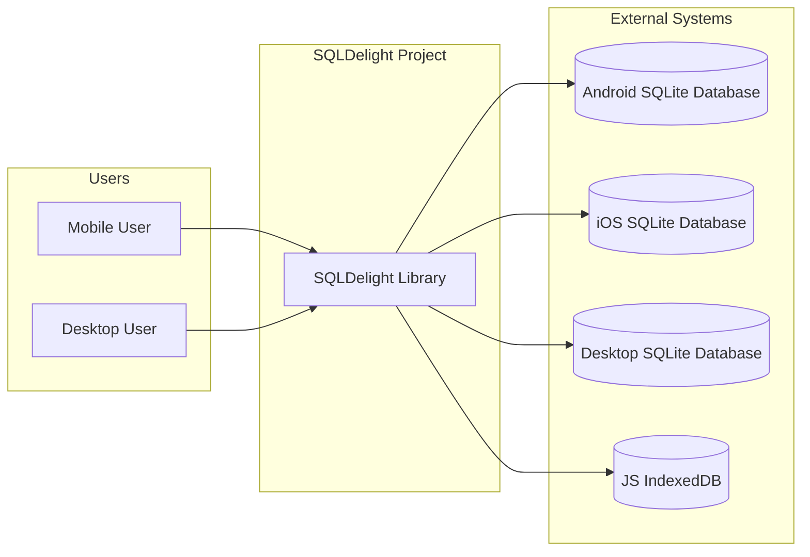
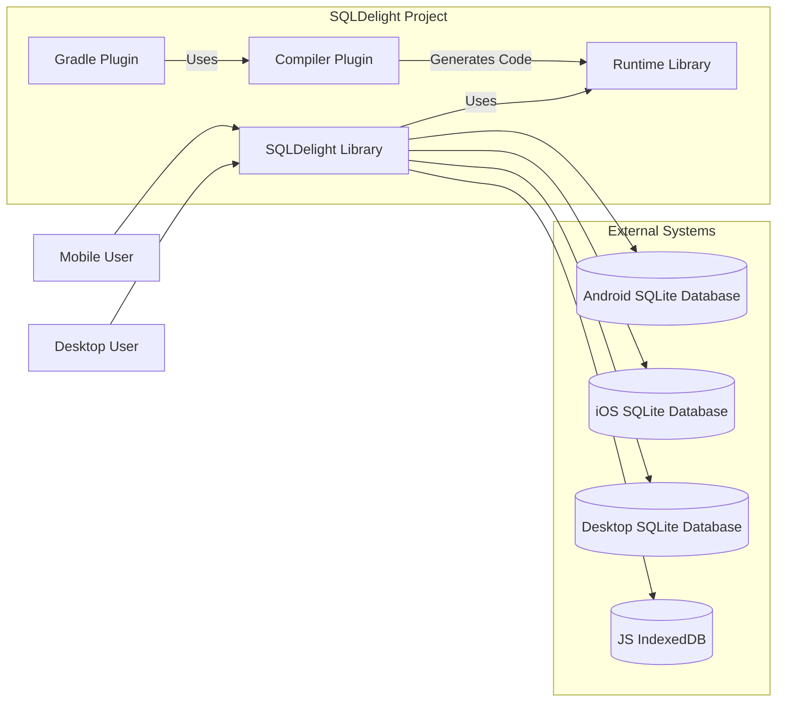
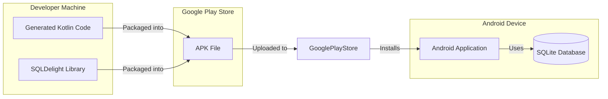

# Project Design Document: SQLDelight

## BUSINESS POSTURE

SQLDelight is a library that generates typesafe Kotlin APIs from SQL statements. It's designed to improve developer productivity and code quality when working with SQLite databases in Kotlin applications, particularly in multiplatform environments.

Priorities and Goals:

*   Provide a seamless and efficient way to interact with SQLite databases in Kotlin.
*   Enable compile-time verification of SQL queries, reducing runtime errors.
*   Support Kotlin Multiplatform, allowing code sharing across different platforms (Android, iOS, JVM, JS).
*   Enhance developer productivity by generating boilerplate code.
*   Maintain a high level of performance and minimize overhead.

Business Risks:

*   Data corruption or loss due to incorrect SQL queries (mitigated by compile-time checks).
*   Security vulnerabilities introduced by improper handling of user input in SQL queries (SQL injection).
*   Performance bottlenecks due to inefficiently generated code or database interactions.
*   Compatibility issues with different SQLite versions or platform-specific implementations.
*   Inability to adapt to evolving SQL standards or Kotlin language features.
*   Steep learning curve for developers unfamiliar with the library.

## SECURITY POSTURE

Existing Security Controls:

*   security control: Compile-time SQL validation: SQLDelight parses and validates SQL statements at compile time, preventing many common SQL errors and some forms of injection that rely on malformed SQL. (Implemented in the compiler plugin).
*   security control: Typesafe API: The generated Kotlin code provides a typesafe interface, reducing the risk of type-related errors when interacting with the database. (Implemented in the generated code).
*   security control: Parameterized Queries: SQLDelight encourages the use of parameterized queries, which are a primary defense against SQL injection. (Implicit in the generated code and enforced by the API design).
*   security control: Limited direct SQL execution: By generating code from SQL, the library reduces the need for developers to write raw SQL strings, further minimizing the risk of SQL injection. (Design choice).

Accepted Risks:

*   accepted risk: SQL Injection through complex, dynamically generated SQL within Kotlin code that bypasses SQLDelight's compile-time checks. While SQLDelight promotes parameterized queries, it's still possible (though discouraged) to construct SQL strings dynamically in Kotlin. If user input is incorporated into these dynamic strings without proper sanitization, SQL injection vulnerabilities can still exist.
*   accepted risk: Reliance on underlying SQLite security: SQLDelight relies on the security and integrity of the underlying SQLite database. Any vulnerabilities or misconfigurations in SQLite itself are outside SQLDelight's control.
*   accepted risk: Potential for denial-of-service (DoS) via resource exhaustion: Complex or maliciously crafted queries, even if validated by SQLDelight, could potentially lead to resource exhaustion (CPU, memory) on the database server or client device.
*   accepted risk: Limited control over database file permissions: SQLDelight doesn't directly manage database file permissions. It's the responsibility of the application using SQLDelight to ensure appropriate file permissions are set to prevent unauthorized access.

Recommended Security Controls:

*   security control: Input validation and sanitization: Even with parameterized queries, rigorously validate and sanitize all user inputs *before* they are used in any database operation, even those seemingly unrelated to SQL. This provides defense-in-depth against injection attacks and other data integrity issues.
*   security control: Regularly update dependencies: Keep SQLDelight, Kotlin, and any related libraries up-to-date to benefit from the latest security patches and improvements.
*   security control: Consider using SQLCipher: For applications requiring strong data encryption at rest, integrate SQLDelight with SQLCipher, an encrypted version of SQLite.

Security Requirements:

*   Authentication: Not directly applicable to SQLDelight itself, as it's a database access library. Authentication is the responsibility of the application using SQLDelight.
*   Authorization: Not directly handled by SQLDelight. The application logic must implement authorization checks to control access to data and database operations. SQLDelight can be *used* to implement authorization, by querying authorization-related tables, but it doesn't provide authorization mechanisms itself.
*   Input Validation: All user input used in database operations, even indirectly, MUST be validated and sanitized to prevent injection attacks and data corruption. This is crucial even when using parameterized queries.
*   Cryptography: If data encryption at rest is required, SQLCipher should be used. SQLDelight itself does not provide encryption.
*   Data Sensitivity: The application using SQLDelight must handle data according to its sensitivity level. This includes appropriate storage, transmission, and access controls.

## DESIGN

### C4 CONTEXT



Context Diagram Element Description:

*   Element:
    *   Name: Mobile User
    *   Type: Person
    *   Description: A user interacting with a mobile application that uses SQLDelight.
    *   Responsibilities: Interacts with the application's UI, triggering database operations.
    *   Security controls: Relies on application-level security controls for authentication and authorization.

*   Element:
    *   Name: Desktop User
    *   Type: Person
    *   Description: A user interacting with a desktop application that uses SQLDelight.
    *   Responsibilities: Interacts with the application's UI, triggering database operations.
    *   Security controls: Relies on application-level security controls for authentication and authorization.

*   Element:
    *   Name: SQLDelight Library
    *   Type: Software System
    *   Description: The SQLDelight library, which generates typesafe Kotlin APIs from SQL.
    *   Responsibilities: Generates Kotlin code for database interaction, validates SQL at compile time, provides a typesafe API.
    *   Security controls: Compile-time SQL validation, typesafe API, parameterized queries, limited direct SQL execution.

*   Element:
    *   Name: Android SQLite Database
    *   Type: Database
    *   Description: The native SQLite database on an Android device.
    *   Responsibilities: Stores and retrieves data for the Android application.
    *   Security controls: Relies on Android's security model and file system permissions.

*   Element:
    *   Name: iOS SQLite Database
    *   Type: Database
    *   Description: The native SQLite database on an iOS device.
    *   Responsibilities: Stores and retrieves data for the iOS application.
    *   Security controls: Relies on iOS's security model and file system permissions.

*   Element:
    *   Name: Desktop SQLite Database
    *   Type: Database
    *   Description: The native SQLite database on a Desktop device.
    *   Responsibilities: Stores and retrieves data for the Desktop application.
    *   Security controls: Relies on OS security model and file system permissions.

*   Element:
    *   Name: JS IndexedDB
    *   Type: Database
    *   Description: The native IndexedDB database on JS environment.
    *   Responsibilities: Stores and retrieves data for the JS application.
    *   Security controls: Relies on JS environment security model.

### C4 CONTAINER



Container Diagram Element Description:

*   Element:
    *   Name: SQLDelight Library
    *   Type: Software System
    *   Description: The SQLDelight library, which generates typesafe Kotlin APIs from SQL.
    *   Responsibilities: Generates Kotlin code for database interaction, validates SQL at compile time, provides a typesafe API.
    *   Security controls: Compile-time SQL validation, typesafe API, parameterized queries, limited direct SQL execution.

*   Element:
    *   Name: Compiler Plugin
    *   Type: Compiler Plugin
    *   Description: The SQLDelight compiler plugin, integrated into the Kotlin compiler.
    *   Responsibilities: Parses SQL files, validates SQL statements, generates Kotlin code.
    *   Security controls: Compile-time SQL validation.

*   Element:
    *   Name: Runtime Library
    *   Type: Library
    *   Description: The SQLDelight runtime library, providing core functionality for database interaction.
    *   Responsibilities: Provides APIs for executing queries, managing transactions, and handling results.
    *   Security controls: Parameterized queries.

*   Element:
    *   Name: Gradle Plugin
    *   Type: Build Tool Plugin
    *   Description: Facilitates integration with the Gradle build system.
    *   Responsibilities: Configures the compiler plugin, manages dependencies.
    *   Security controls: None directly, but facilitates the use of the compiler plugin.

*   Element:
    *   Name: Android SQLite Database
    *   Type: Database
    *   Description: The native SQLite database on an Android device.
    *   Responsibilities: Stores and retrieves data for the Android application.
    *   Security controls: Relies on Android's security model and file system permissions.

*   Element:
    *   Name: iOS SQLite Database
    *   Type: Database
    *   Description: The native SQLite database on an iOS device.
    *   Responsibilities: Stores and retrieves data for the iOS application.
    *   Security controls: Relies on iOS's security model and file system permissions.

*   Element:
    *   Name: Desktop SQLite Database
    *   Type: Database
    *   Description: The native SQLite database on a Desktop device.
    *   Responsibilities: Stores and retrieves data for the Desktop application.
    *   Security controls: Relies on OS security model and file system permissions.

*   Element:
    *   Name: JS IndexedDB
    *   Type: Database
    *   Description: The native IndexedDB database on JS environment.
    *   Responsibilities: Stores and retrieves data for the JS application.
    *   Security controls: Relies on JS environment security model.

*   Element:
    *   Name: Mobile User
    *   Type: Person
    *   Description: A user interacting with a mobile application that uses SQLDelight.
    *   Responsibilities: Interacts with the application's UI, triggering database operations.
    *   Security controls: Relies on application-level security controls for authentication and authorization.

*   Element:
    *   Name: Desktop User
    *   Type: Person
    *   Description: A user interacting with a desktop application that uses SQLDelight.
    *   Responsibilities: Interacts with the application's UI, triggering database operations.
    *   Security controls: Relies on application-level security controls for authentication and authorization.

### DEPLOYMENT

SQLDelight is a library, not a standalone application, so it doesn't have its own deployment process in the traditional sense. Instead, it's integrated into other applications, and its deployment is tied to the deployment of those applications. Here are a few possible deployment scenarios:

1.  **Android Application:** The SQLDelight library and generated code are packaged within the Android application's APK file. Deployment involves distributing the APK through the Google Play Store or other distribution channels.
2.  **iOS Application:** The SQLDelight library and generated code are compiled into the iOS application. Deployment involves distributing the application through the Apple App Store or other distribution channels.
3.  **JVM Application:** The SQLDelight library and generated code are packaged within a JAR file. Deployment can involve various methods, such as deploying to a server, distributing as a standalone executable, or including in a larger application.
4.  **JS Application:** The SQLDelight library and generated code are compiled and bundled with application. Deployment can involve various methods, such as deploying to a server or distributing as a standalone executable.
5.  **Multiplatform Application:** SQLDelight is used within a Kotlin Multiplatform project, and the deployment process follows the specific deployment procedures for each target platform (Android, iOS, JVM, JS, etc.).

We will describe Android Application deployment in details:



Deployment Diagram Element Description:

*   Element:
    *   Name: Android Device
    *   Type: Device
    *   Description: Physical or emulated Android device.
    *   Responsibilities: Runs Android applications.
    *   Security controls: Android operating system security features.

*   Element:
    *   Name: SQLite Database
    *   Type: Database
    *   Description: The embedded SQLite database within the Android application.
    *   Responsibilities: Stores application data.
    *   Security controls: Android file system permissions, potential use of SQLCipher for encryption.

*   Element:
    *   Name: Android Application
    *   Type: Application
    *   Description: The Android application that uses SQLDelight.
    *   Responsibilities: Provides application functionality to the user.
    *   Security controls: Application-level security controls, including input validation, data sanitization, and secure coding practices.

*   Element:
    *   Name: Google Play Store
    *   Type: Application Store
    *   Description: The official app store for Android applications.
    *   Responsibilities: Distributes Android applications to users.
    *   Security controls: Google Play Store security checks and policies.

*   Element:
    *   Name: APK File
    *   Type: File
    *   Description: The Android Package Kit file, containing the application code, resources, and SQLDelight components.
    *   Responsibilities: Serves as the distribution package for the application.
    *   Security controls: Code signing, integrity checks.

*   Element:
    *   Name: Developer Machine
    *   Type: Device
    *   Description: The developer's computer where the application is built.
    *   Responsibilities: Hosts the development environment and build tools.
    *   Security controls: Standard development environment security practices.

*   Element:
    *   Name: Generated Kotlin Code
    *   Type: Code
    *   Description: The Kotlin code generated by SQLDelight from SQL statements.
    *   Responsibilities: Provides the typesafe database access layer.
    *   Security controls: Inherits security controls from SQLDelight (compile-time validation, parameterized queries).

*   Element:
    *   Name: SQLDelight Library
    *   Type: Library
    *   Description: The SQLDelight library itself.
    *   Responsibilities: Provides the core functionality for code generation and database interaction.
    *   Security controls: Compile-time SQL validation, typesafe API, parameterized queries.

### BUILD

The build process for a project using SQLDelight typically involves the following steps:

1.  **Developer writes SQL:** The developer creates `.sq` files containing SQL statements.
2.  **Gradle Plugin Configuration:** The SQLDelight Gradle plugin is configured in the project's `build.gradle` (or `build.gradle.kts`) file. This configuration specifies the source directories for SQL files, database schema, and other settings.
3.  **Code Generation:** During the build process, the Gradle plugin invokes the SQLDelight compiler plugin.
4.  **SQL Parsing and Validation:** The compiler plugin parses the SQL statements in the `.sq` files and validates them against the defined database schema. Any syntax errors or schema violations are reported as compile-time errors.
5.  **Kotlin Code Generation:** If the SQL is valid, the compiler plugin generates Kotlin code that provides a typesafe API for interacting with the database. This generated code includes data classes for representing database tables and functions for executing queries and updates.
6.  **Compilation:** The generated Kotlin code, along with the rest of the application code, is compiled by the Kotlin compiler.
7.  **Packaging:** The compiled code, along with the SQLDelight runtime library and any other dependencies, is packaged into the appropriate format for the target platform (e.g., an APK file for Android, a JAR file for JVM).

```mermaid
graph LR
    subgraph "Developer Machine"
        Developer[Developer]
        SQLFiles[.sq Files]
        Gradle[Gradle Build System]
        CompilerPlugin[SQLDelight Compiler Plugin]
        GeneratedCode[Generated Kotlin Code]
        KotlinCompiler[Kotlin Compiler]
        RuntimeLibrary[SQLDelight Runtime Library]
        ApplicationCode[Application Code]
        BuildArtifact[Build Artifact (APK, JAR, etc.)]
    end

    Developer -- Writes --> SQLFiles
    Developer -- Writes --> ApplicationCode
    SQLFiles -- Processed by --> CompilerPlugin
    Gradle -- Uses --> CompilerPlugin
    CompilerPlugin -- Generates --> GeneratedCode
    GeneratedCode -- Compiled by --> KotlinCompiler
    ApplicationCode -- Compiled by --> KotlinCompiler
    KotlinCompiler -- Uses --> RuntimeLibrary
    KotlinCompiler -- Produces --> BuildArtifact
```

Security Controls in the Build Process:

*   security control: Compile-time SQL validation: The SQLDelight compiler plugin performs static analysis of SQL statements, detecting syntax errors and schema violations before runtime. This helps prevent SQL injection vulnerabilities and other database-related errors.
*   security control: Dependency management: The Gradle build system manages project dependencies, including the SQLDelight runtime library. Regularly updating dependencies helps ensure that the latest security patches are applied.
*   security control: (Recommended) Static Application Security Testing (SAST): Integrate SAST tools into the build process to scan the generated Kotlin code and application code for potential security vulnerabilities.
*   security control: (Recommended) Software Composition Analysis (SCA): Use SCA tools to identify and manage vulnerabilities in third-party libraries, including SQLDelight and its dependencies.

## RISK ASSESSMENT

*   Critical Business Processes:
    *   Data persistence and retrieval: SQLDelight is directly involved in storing and retrieving application data. Any failure or vulnerability in this process could have significant consequences.
    *   Data integrity: Maintaining the accuracy and consistency of data is crucial. SQLDelight's compile-time checks help ensure data integrity, but vulnerabilities could still lead to data corruption.
    *   Application functionality: Many application features rely on database interactions. If SQLDelight fails or is compromised, the application may become unusable.

*   Data We Are Trying to Protect and Sensitivity:
    *   The specific data stored and managed by SQLDelight depends on the application using it. This could range from non-sensitive configuration data to highly sensitive personal information, financial data, or health records.
    *   The sensitivity of the data determines the level of security required. Applications handling sensitive data should employ additional security measures, such as encryption at rest (using SQLCipher) and in transit, strict access controls, and robust input validation.

## QUESTIONS & ASSUMPTIONS

*   Questions:
    *   What specific types of data will be stored using SQLDelight in different applications? This is crucial for determining the appropriate security measures.
    *   What are the specific security requirements and compliance regulations (e.g., GDPR, HIPAA) that apply to the applications using SQLDelight?
    *   What is the expected scale and performance requirements for applications using SQLDelight? This can influence the choice of database configuration and optimization strategies.
    *   Are there any specific platform limitations or compatibility concerns that need to be considered?
    *   What level of expertise do the developers have with SQL and secure coding practices? This will impact the risk assessment and the need for training or additional security reviews.

*   Assumptions:
    *   Developers using SQLDelight have a basic understanding of SQL and database concepts.
    *   Developers are aware of the potential for SQL injection and other database security vulnerabilities.
    *   The underlying SQLite database is properly configured and secured.
    *   The application using SQLDelight will implement appropriate authentication and authorization mechanisms.
    *   The application will handle data according to its sensitivity level.
    *   The build environment is secure and free from malware.
    *   Developers will follow secure coding practices and regularly update dependencies.
    *   The application will implement robust error handling and logging.