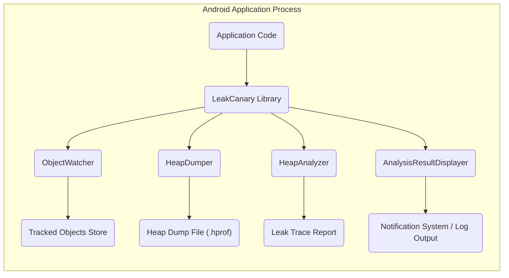

# Project Design Document: LeakCanary

**Version:** 1.1
**Date:** October 26, 2023
**Author:** AI Software Architect

## 1. Introduction

This document provides an enhanced architectural design of the LeakCanary project, an open-source library for Android that aids developers in detecting and resolving memory leaks within their applications. This detailed design serves as a crucial foundation for subsequent threat modeling activities, enabling a thorough assessment of potential security risks.

### 1.1. Purpose

The primary purpose of this document is to offer a more in-depth and refined overview of the LeakCanary system's architecture, its constituent components, and the intricate flow of data within it. This detailed understanding is paramount for effectively analyzing the system's potential attack surface and identifying possible security vulnerabilities that might be exploited.

### 1.2. Scope

This document encompasses the core functionalities of the LeakCanary library, aligning with the information available in the provided GitHub repository: [https://github.com/square/leakcanary](https://github.com/square/leakcanary). The focus remains on the in-process operation of the library within the confines of an Android application. External services, third-party integrations beyond the library's inherent functions, and specific implementations within consuming applications fall outside the scope of this document.

### 1.3. Goals

*   To provide a more granular definition of the components within LeakCanary and elucidate their interactions with greater clarity.
*   To meticulously describe the data flow, emphasizing data transformation and handling procedures, particularly concerning potentially sensitive information.
*   To pinpoint key areas and specific components that warrant close attention from a security perspective, providing context for potential vulnerabilities.
*   To establish a robust and comprehensive basis for conducting a thorough and effective threat model of the LeakCanary project.

## 2. System Architecture

LeakCanary operates as an integrated, in-process library within an Android application. It functions by passively monitoring object allocations and meticulously tracking objects that are suspected of leaking memory.

### 2.1. High-Level Overview

### 2.2. Component Description

*   **Application Code:** This represents the developer's custom Android application code into which the LeakCanary library is integrated. This code is responsible for creating and managing objects within the application's memory space.
*   **LeakCanary Library:** This is the central library providing the core memory leak detection functionality. It is typically included as a dependency within the application's `build.gradle` file. Its lifecycle is tied to the application process.
*   **ObjectWatcher:** This crucial component is responsible for the initial observation of object allocations.
    *   It specifically monitors objects that are expected to become eligible for garbage collection (GC), such as Activities or Fragments upon their destruction.
    *   It maintains a store of `WeakReference` objects pointing to these potentially leaky objects. Using `WeakReference` ensures that the `ObjectWatcher` itself does not prevent the garbage collection of the tracked objects.
    *   Periodically, or upon specific triggers, it checks if the objects referenced by the `WeakReference` instances have been reclaimed by the garbage collector.
*   **HeapDumper:** When the `ObjectWatcher` determines that a tracked object has not been garbage collected after a predefined period, indicating a potential leak, it initiates the `HeapDumper`.
    *   The primary responsibility of the `HeapDumper` is to trigger the creation of a heap dump of the application's memory.
    *   This heap dump is a snapshot of the memory at a specific point in time and is typically serialized into a `.hprof` (Heap Profile) file.
    *   The process of creating a heap dump can be resource-intensive, potentially causing a temporary pause or slight performance hiccup in the application's execution.
    *   The `.hprof` file is usually stored on the device's file system.
*   **HeapAnalyzer:** This component is responsible for the detailed analysis of the generated heap dump.
    *   It takes the `.hprof` file as its input.
    *   It parses the binary data within the `.hprof` file to reconstruct the object graph and identify all objects and their relationships in memory at the time of the dump.
    *   It specifically searches for the suspected leaked object (identified by the `ObjectWatcher`).
    *   It then traces the reference chains leading to this object, starting from GC roots (objects that the garbage collector will never reclaim).
    *   The goal is to identify the shortest path of strong references that prevents the garbage collector from reclaiming the suspected object. This path constitutes the "leak trace."
*   **AnalysisResultDisplayer:** Once the `HeapAnalyzer` has completed its analysis and identified a memory leak, this component is responsible for presenting the findings to the developer.
    *   In debug builds, it typically displays a notification within the application or via the Android system's notification mechanism, informing the developer of the detected leak.
    *   It also logs the detailed **Leak Trace Report**, including the chain of references that are causing the leak, to the Android system's log output (Logcat). This log output is crucial for developers to understand and fix the leak.
*   **Tracked Objects Store:** This is an internal data structure, likely a collection (e.g., a Set or Map), maintained by the `ObjectWatcher`. It holds the `WeakReference` instances of the objects being monitored for potential leaks.
*   **Heap Dump File (.hprof):** This file is the output of the `HeapDumper`. It's a binary file containing a snapshot of the application's memory at a specific point in time. It includes information about all objects in memory, their class types, and the references between them. This file can potentially contain sensitive data.
*   **Leak Trace Report:** This is the structured output generated by the `HeapAnalyzer`. It details the chain of strong references preventing a suspected object from being garbage collected. It typically includes class names, field names, and potentially object hash codes.
*   **Notification System / Log Output:** These are the mechanisms used by the `AnalysisResultDisplayer` to communicate the leak detection results to the developer. Notifications are often used for immediate feedback in debug builds, while log output provides a persistent record of the leaks.

## 3. Data Flow

The process of detecting a memory leak using LeakCanary involves a distinct sequence of data flow and transformations:

1. The **Application Code** creates and manages objects in memory as part of its normal operation.
2. The **LeakCanary Library** is initialized, typically during application startup, and starts the **ObjectWatcher**.
3. The **ObjectWatcher** begins monitoring objects that are expected to be garbage collected soon after they are no longer needed. It creates and stores **WeakReference** instances to these objects in the **Tracked Objects Store**.
4. At regular intervals or upon specific events, the **ObjectWatcher** checks the status of the objects referenced in the **Tracked Objects Store**. It verifies if the garbage collector has reclaimed these objects.
5. If a tracked object persists in memory beyond an acceptable timeframe (i.e., the `WeakReference` is still reachable), the **ObjectWatcher** flags it as a potential memory leak and triggers the **HeapDumper**.
6. The **HeapDumper** initiates the process of creating a **Heap Dump File (.hprof)**, capturing a snapshot of the application's memory. This file is typically written to the device's storage.
7. The **HeapAnalyzer** then reads and parses the generated **Heap Dump File (.hprof)**.
8. The **HeapAnalyzer** analyzes the object graph within the heap dump, specifically searching for the suspected leaked object. It traces the strong reference paths from GC roots to the suspected object.
9. The **HeapAnalyzer** constructs a **Leak Trace Report** that details the chain of references preventing the object from being garbage collected. This report contains information about the classes and fields involved in the leak.
10. Finally, the **AnalysisResultDisplayer** receives the **Leak Trace Report** and presents this information to the developer through the **Notification System / Log Output**.

## 4. Deployment Considerations

LeakCanary's deployment is tightly coupled with the deployment of the Android application it is integrated into.

*   **Integration as a Library:** Developers integrate LeakCanary by declaring it as a dependency in their application's `build.gradle` file. The build system then includes the library's code within the application package (APK).
*   **Conditional Inclusion based on Build Types:** A common practice is to configure LeakCanary to be active only in debug or internal testing builds. This prevents the performance overhead and potential exposure of sensitive data through heap dumps in release versions of the application. Build variants and product flavors in Gradle are typically used to manage this.
*   **Permissions Requirements:** LeakCanary often requires specific Android permissions to function correctly.
    *   Historically, `android.permission.READ_EXTERNAL_STORAGE` and `android.permission.WRITE_EXTERNAL_STORAGE` were needed to save the heap dump file to the device's storage.
    *   With newer versions of Android and the introduction of scoped storage, the library might utilize application-specific directories, reducing the need for broad storage permissions. However, the ability to write the `.hprof` file remains a requirement.
*   **Impact on Application Size:** Including LeakCanary will increase the size of the application package. This is a consideration, especially for applications with strict size limits.

## 5. Security Considerations

While primarily designed as a development and debugging tool, LeakCanary introduces several security considerations that must be carefully evaluated:

*   **Potential Exposure of Sensitive Data within Heap Dumps:** Heap dumps, by their nature, capture a snapshot of the application's memory. This can inadvertently include sensitive data that was present in memory at the time the dump was taken.
    *   Examples of such sensitive data include user credentials (passwords, tokens), API keys, personally identifiable information (PII), and other confidential business data.
    *   Heap dump files (`.hprof`) are typically stored unencrypted on the device's storage, making them potentially accessible to other applications with sufficient permissions or in cases of device compromise.
    *   The content of the heap dump is a direct representation of memory and is not obfuscated or sanitized by default.
*   **Risk of Resource Exhaustion and Denial of Service:** The process of triggering and generating heap dumps can be computationally expensive and consume significant resources (CPU, memory, I/O).
    *   If triggered too frequently or at inopportune times, heap dumps can lead to temporary performance degradation, application unresponsiveness, or even application crashes due to memory pressure.
    *   A malicious actor, if able to influence the triggering of heap dumps (though unlikely in typical usage scenarios), could potentially use this as a form of denial-of-service attack against the application.
*   **Information Disclosure through Leak Trace Reports:** While the leak trace reports themselves do not contain raw sensitive data, they can reveal valuable information about the application's internal structure, object relationships, and coding patterns.
    *   This information could potentially be leveraged by attackers to gain a better understanding of the application's inner workings, identify potential vulnerabilities, or reverse engineer parts of the application's logic.
*   **Risk of Accidental Inclusion in Release Builds:** A significant security risk arises if LeakCanary is unintentionally included and active in release builds of the application.
    *   This would expose the functionality to end-users, potentially leading to the generation of heap dumps containing sensitive information on users' devices.
    *   It also introduces the performance overhead of the library in production environments.
*   **Security Implications of Granted Permissions:** The permissions required by LeakCanary, particularly storage access permissions, could be a point of concern if the library itself were to be compromised or if a vulnerability within the library were exploited.
    *   Malicious actors could potentially leverage these permissions to access or exfiltrate heap dump files or other data on the device.
*   **Dependency on `shark` Library:** LeakCanary relies on the `shark` library for heap dump analysis. Any vulnerabilities present in the `shark` library could indirectly impact the security of applications using LeakCanary.

## 6. Dependencies

LeakCanary relies on several components of the Android SDK and the `shark` library developed by Square for heap dump parsing and analysis. Key dependencies include:

*   **Android SDK:** Various components of the Android Software Development Kit are used for core functionalities such as memory management (`java.lang.ref.WeakReference`), notifications (`android.app.NotificationManager`), logging (`android.util.Log`), and file system access (`java.io.File`).
*   **`shark` Library:** This is a crucial dependency providing the core functionality for parsing `.hprof` files and performing the heap dump analysis to identify memory leaks. Its security is directly relevant to LeakCanary.

## 7. Future Enhancements (Out of Scope for Initial Threat Model)

While not directly impacting the current threat model based on the existing codebase, potential future enhancements to LeakCanary could introduce new security considerations that would need to be addressed. Examples include:

*   **Remote Reporting of Leak Traces or Heap Dumps:** If future versions of LeakCanary introduce the capability to remotely report leak traces or even upload heap dumps to a central server for analysis, this would introduce significant security concerns regarding data transmission, storage, and access control.
*   **Integration with Cloud-Based Analysis Services:** Similar to remote reporting, integration with cloud-based analysis services would raise questions about data privacy, security of the analysis platform, and the potential for sensitive data to be exposed.
*   **More Sophisticated Heap Dump Analysis Techniques:** While enhancing functionality, the introduction of more complex analysis techniques could also introduce new attack vectors or vulnerabilities within the analysis process itself.

This enhanced design document provides a more detailed and nuanced understanding of the LeakCanary project's architecture, data flow, and potential security considerations. This information is critical for conducting a thorough and effective threat model, allowing for the identification of potential vulnerabilities and the development of appropriate mitigation strategies.