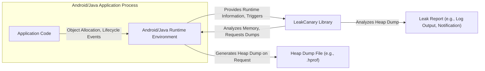
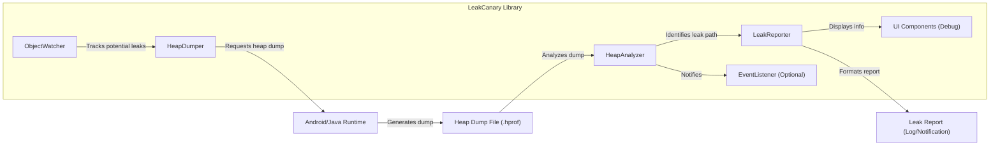
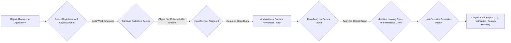

# Project Design Document: LeakCanary

**Version:** 1.1
**Date:** October 26, 2023
**Author:** AI Software Architect

## 1. Introduction

This document provides a detailed design overview of LeakCanary, an open-source library for Android and Java designed to help developers detect and fix memory leaks. This document aims to provide a comprehensive understanding of LeakCanary's architecture, components, and data flow, which will serve as the basis for subsequent threat modeling activities. The focus is on providing sufficient detail to identify potential security vulnerabilities and attack vectors.

## 2. Goals and Objectives

The primary goals of LeakCanary are:

* **Automated Memory Leak Detection:** To automatically identify memory leaks within Android and Java applications, minimizing the need for manual memory analysis in typical scenarios.
* **Actionable Leak Insights:** To equip developers with detailed, actionable information about detected leaks, including the specific leaking object instance, the complete reference chain preventing garbage collection, and the thread context where the leak originated.
* **Performance-Conscious Operation:** To operate with a minimal and acceptable impact on the performance of the monitored application, particularly in production environments where resource usage is critical.
* **Simplified Integration Process:** To offer a straightforward and easy integration process into existing Android and Java development projects with minimal configuration overhead.

## 3. System Architecture

LeakCanary functions as an embedded library within the target application. It leverages the capabilities of the Android and Java runtime environments to observe object lifecycles and identify instances where objects are not being garbage collected as expected.

### 3.1. High-Level Architecture



* **Android/Java Application Process:** Represents the running instance of the application being monitored for memory leaks.
    * **Application Code:** The custom code written by the developers of the application.
    * **Android/Java Runtime Environment:** The underlying system responsible for executing the application code, managing memory, and providing core functionalities. LeakCanary interacts with this environment to monitor object states and trigger heap dumps.
* **LeakCanary Library:** The core set of classes and functionalities provided by the LeakCanary library. It actively monitors object lifecycles, triggers heap dumps, analyzes them, and generates reports.
* **Heap Dump File (e.g., `.hprof`):** A binary snapshot of the application's memory at a specific point in time. This file contains information about all objects in memory, their relationships, and their data. LeakCanary analyzes this file to identify leaks.
* **Leak Report (e.g., Log Output, Notification):** The output generated by LeakCanary, detailing the detected memory leaks. This can be in the form of log messages, in-app notifications (especially in debug builds), or custom outputs via listeners.

### 3.2. Component-Level Architecture

LeakCanary is composed of several interconnected components, each with specific responsibilities:

* **`ObjectWatcher`:**
    * **Responsibility:**  Monitors objects that are expected to be released from memory (garbage collected). Developers can explicitly register objects to be watched, or LeakCanary can automatically watch certain lifecycle-aware components (e.g., Activities, Fragments).
    * **Mechanism:** Uses `WeakReference` to hold references to the watched objects. This allows the garbage collector to reclaim the memory if there are no other strong references to the object. If the `WeakReference` is still reachable after a predefined delay, it indicates a potential leak.
* **`HeapDumper`:**
    * **Responsibility:**  Triggers the creation of a heap dump file when the `ObjectWatcher` suspects a memory leak.
    * **Mechanism:** Interacts with the Android/Java Runtime environment to initiate the heap dump process. This typically involves pausing the application briefly. The heap dump is usually written to a file in the application's private storage.
* **`HeapAnalyzer`:**
    * **Responsibility:**  Parses and analyzes the generated heap dump file to identify the root cause of the suspected memory leak.
    * **Mechanism:**  Uses a graph database representation of the objects in the heap dump. It then performs a reachability analysis, finding the shortest path of strong references from the garbage collection roots to the leaking object. This path reveals why the object is still in memory.
* **`LeakReporter`:**
    * **Responsibility:**  Formats the findings of the `HeapAnalyzer` into a human-readable leak report.
    * **Mechanism:**  Extracts relevant information from the analysis results, such as the class of the leaking object, the reference chain, and the thread where the leaking reference resides. This information is then formatted into a clear and concise report, typically outputted to the application's logs.
* **`EventListener` (Optional):**
    * **Responsibility:** Provides a mechanism for developers to receive notifications when leaks are detected and to customize the handling of leak reports.
    * **Mechanism:** Developers can implement interfaces provided by LeakCanary to receive callbacks when a leak is confirmed. This allows for custom actions, such as sending leak reports to a remote server or displaying custom UI elements.
* **UI Components (Debug Builds):**
    * **Responsibility:**  In debug builds, LeakCanary often includes UI components to display leak information directly within the application.
    * **Mechanism:**  This might involve displaying a notification when a leak is detected, or providing an in-app screen to view the details of the detected leaks. These components are typically disabled in release builds to avoid impacting the user experience.



## 4. Data Flow

The process of leak detection in LeakCanary follows a specific sequence of data flow:



1. **Object Allocated in Application:** An object is created and used within the application's code.
2. **Object Registered with `ObjectWatcher`:**  The object, or a relevant reference to it, is registered with the `ObjectWatcher`. This might happen automatically for certain Android lifecycle components or through explicit developer calls.
3. **Garbage Collection Occurs:** The Android/Java Runtime's garbage collector runs periodically to reclaim unused memory.
4. **Object Not Collected After Timeout:** The `ObjectWatcher` checks if the `WeakReference` to the watched object is still reachable after a predefined timeout period. If it is, it indicates that the object has not been garbage collected and is a potential leak.
5. **`HeapDumper` Triggered:** The `ObjectWatcher` triggers the `HeapDumper` to initiate the process of creating a heap dump.
6. **Android/Java Runtime Generates `.hprof`:** The Android/Java Runtime environment generates a heap dump file (`.hprof`) containing a snapshot of the application's memory.
7. **`HeapAnalyzer` Parses `.hprof`:** The `HeapAnalyzer` reads and parses the generated `.hprof` file.
8. **Analyzes Object Graph:** The `HeapAnalyzer` builds an in-memory representation of the object graph from the heap dump and performs reachability analysis to find the shortest path of strong references preventing the leaking object from being garbage collected.
9. **Identifies Leaking Object and Reference Chain:** The analysis identifies the specific object that is leaking and the chain of references that are keeping it alive.
10. **`LeakReporter` Generates Report:** The `LeakReporter` takes the analysis results and formats them into a human-readable report.
11. **Outputs Leak Report (Log, Notification, Custom Handler):** The leak report is outputted through various channels, such as the application's log output, in-app notifications (in debug builds), or through custom handlers registered via the `EventListener`.

## 5. Security Considerations

While LeakCanary is a valuable tool for debugging, it introduces several security considerations that need to be addressed:

* **Exposure of Sensitive Data in Heap Dumps:** Heap dumps capture the entire memory state of the application, potentially including sensitive data like user credentials, API keys, personal information, and business secrets.
    * **Threat:** Unauthorized access to heap dump files could lead to a significant data breach.
    * **Mitigation:**
        * Ensure heap dumps are stored in the application's private storage with appropriate file permissions.
        * Avoid generating or storing heap dumps in production environments.
        * Consider using memory obfuscation techniques to reduce the risk of exposing sensitive data in memory.
        * Implement secure deletion mechanisms for heap dump files when they are no longer needed.
* **Performance Impact Leading to Denial of Service (DoS):** The process of generating a heap dump can be resource-intensive, potentially causing temporary freezes or ANR errors, especially on low-end devices.
    * **Threat:** A malicious actor could potentially trigger frequent heap dumps to degrade the application's performance or cause it to become unresponsive, leading to a denial-of-service.
    * **Mitigation:**
        * Limit the frequency of heap dump generation. LeakCanary is designed to trigger dumps only when a potential leak is detected.
        * Ensure heap dumping is performed in a background thread to minimize impact on the main thread.
        * Consider disabling LeakCanary or its heap dumping functionality in production builds.
* **Information Disclosure through Leak Reports:** Leak reports contain detailed information about the application's internal structure, object relationships, and potential vulnerabilities.
    * **Threat:** Exposure of leak reports could provide attackers with valuable insights for reverse engineering the application or identifying potential attack vectors.
    * **Mitigation:**
        * Restrict access to leak reports to authorized developers.
        * Avoid logging detailed leak reports in production environments.
        * If using custom `EventListener` implementations to transmit leak reports, ensure secure communication channels (e.g., HTTPS).
* **Dependency Vulnerabilities:** LeakCanary relies on other third-party libraries. Vulnerabilities in these dependencies could introduce security risks.
    * **Threat:** Attackers could exploit known vulnerabilities in LeakCanary's dependencies to compromise the application.
    * **Mitigation:**
        * Regularly update LeakCanary and its dependencies to the latest versions to patch known vulnerabilities.
        * Perform security scans on the application's dependencies.
* **Accidental Inclusion in Production Builds:** If not configured correctly, LeakCanary might be inadvertently included in production builds.
    * **Threat:** This could lead to the generation of heap dumps and leak reports in production, potentially exposing sensitive information and impacting performance.
    * **Mitigation:**
        * Utilize build flavors and dependency management tools (e.g., Gradle) to ensure LeakCanary is only included in debug or staging builds.
        * Implement automated checks to verify that debugging libraries are not included in release builds.
* **Security of Custom `EventListener` Implementations:** Developers might implement custom `EventListener` logic to handle leak reports. Vulnerabilities in this custom code could introduce security risks.
    * **Threat:** Insecure handling of leak data in custom event listeners could lead to data breaches or other security issues.
    * **Mitigation:**
        * Thoroughly review and test any custom `EventListener` implementations for potential security vulnerabilities.
        * Follow secure coding practices when implementing custom event listeners.
        * Avoid storing sensitive information within leak reports if they are being transmitted externally.

## 6. Deployment Considerations

LeakCanary is typically integrated into Android projects as a Gradle dependency. Proper configuration is crucial to ensure it's only active in debug builds.

Example Gradle dependency configuration:

```gradle
dependencies {
  debugImplementation("com.squareup.leakcanary:leakcanary-android:2.12") // Only for debug builds
}
```

This configuration ensures that the LeakCanary library is only included when building the debug version of the application, mitigating the risk of it running in production.

## 7. Future Enhancements (Context for Potential Future Threats)

While not directly part of the current threat model, considering future enhancements can help anticipate potential future security implications:

* **More Granular Control over Watched Objects and Data Collected:**  Future versions might offer more options for customizing which objects are monitored and the level of detail included in heap dumps or reports. This could introduce new attack vectors if not implemented securely.
* **Integration with Cloud-Based Analysis Services:**  If LeakCanary integrates with cloud services for more advanced analysis, the security of data transmission and storage in the cloud becomes a concern.
* **Automated Remediation Suggestions:**  Future versions might suggest automated fixes for detected leaks. Care must be taken to ensure these suggestions are safe and do not introduce new vulnerabilities.

This improved design document provides a more detailed and security-focused overview of LeakCanary, serving as a stronger foundation for subsequent threat modeling activities. The enhanced security considerations section highlights potential vulnerabilities and provides more specific mitigation strategies.