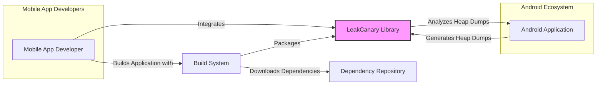

# BUSINESS POSTURE

- Business Priorities and Goals:
  - Primary goal is to improve the quality and stability of Android applications by helping developers identify and fix memory leaks.
  - Secondary goal is to reduce development time and costs associated with debugging memory leaks.
  - Tertiary goal is to enhance user experience by preventing application crashes and performance issues caused by memory leaks.
- Business Risks:
  - Risk of undetected memory leaks in production applications leading to crashes, poor performance, and negative user reviews.
  - Risk of increased development time and costs if memory leaks are difficult to diagnose and fix without proper tooling.
  - Risk of reputational damage if applications are perceived as unstable or unreliable due to memory leaks.

# SECURITY POSTURE

- Existing Security Controls:
  - security control: LeakCanary is designed to be used in debug builds only, minimizing its presence in production environments. Described in README and documentation.
  - security control: Source code is publicly available on GitHub, allowing for community review and scrutiny. Public GitHub repository.
- Accepted Risks:
  - accepted risk: Potential exposure of debug information if debug builds with LeakCanary are accidentally distributed. Risk is mitigated by design to be used only in debug builds.
  - accepted risk: Dependency on third-party libraries and components, which may introduce vulnerabilities. Risk is mitigated by standard dependency management and updates.
- Recommended Security Controls:
  - security control: Implement automated security scanning of dependencies to identify and address known vulnerabilities. Recommended for build process.
  - security control: Regularly review and update dependencies to incorporate security patches. Recommended for maintenance process.
  - security control: Provide clear guidelines and documentation to developers on the secure usage of LeakCanary, emphasizing its debug-only nature. Recommended for documentation.
- Security Requirements:
  - Authentication: Not applicable, LeakCanary is a library and does not require authentication.
  - Authorization: Not applicable, LeakCanary is a library and does not require authorization.
  - Input Validation: Not directly applicable to LeakCanary itself as it primarily analyzes application memory. However, the applications using LeakCanary should still adhere to input validation best practices.
  - Cryptography: Not directly applicable to LeakCanary as it does not handle sensitive data in transit or at rest. However, applications using LeakCanary might handle sensitive data and should use cryptography appropriately.

# DESIGN

## C4 CONTEXT



- C4 Context Elements:
  - - Name: Mobile App Developer
    - Type: Person
    - Description: Developers who build Android applications and use LeakCanary to detect memory leaks.
    - Responsibilities: Integrate LeakCanary into their debug builds, analyze leak reports, and fix memory leaks in their applications.
    - Security controls: Responsible for using LeakCanary in debug environments only and not exposing debug builds with LeakCanary in production.
  - - Name: Android Application
    - Type: Software System
    - Description: The Android application being developed and tested. It generates heap dumps that LeakCanary analyzes.
    - Responsibilities: Generate heap dumps when memory leaks are suspected, provide the runtime environment for LeakCanary to operate.
    - Security controls: Application developers are responsible for the overall security of the Android application, including secure coding practices that minimize vulnerabilities.
  - - Name: LeakCanary Library
    - Type: Software System
    - Description: The memory leak detection library. It is integrated into Android applications during development to automatically detect and report memory leaks.
    - Responsibilities: Monitor application memory, detect memory leaks, analyze heap dumps, and provide reports to developers.
    - Security controls: Designed to be used in debug builds only. Source code is publicly available.
  - - Name: Build System
    - Type: Software System
    - Description: The system used to build the Android application, including integrating dependencies like LeakCanary. Examples include Gradle, Maven, or Bazel.
    - Responsibilities: Build the Android application, manage dependencies, package the application and LeakCanary library.
    - Security controls: Dependency scanning, build process security, secure storage of build artifacts.
  - - Name: Dependency Repository
    - Type: Software System
    - Description:  Repositories like Maven Central or Google Maven where LeakCanary and other dependencies are hosted.
    - Responsibilities: Host and distribute software libraries, ensure integrity and availability of packages.
    - Security controls: Package signing, vulnerability scanning, access control.

## C4 CONTAINER

```mermaid
flowchart LR
    subgraph Android Application Process
        A[LeakCanary Library]
        subgraph HeapAnalyzer Container
            B[Heap Dump Parser]
            C[Object Graph Analyzer]
            D[Leak Suspect Finder]
        end
        subgraph Display Container
            E[Leak Details UI]
            F[Notifications]
        end
        G[Android Debug Bridge (ADB)]
        H[Heap Dump File System]
    end

    A --> B: Uses
    A --> E: Uses
    A --> F: Uses
    A --> H: Stores/Reads
    B --> C: Uses
    C --> D: Uses
    E --> G: Optional via ADB

    style A fill:#f9f,stroke:#333,stroke-width:2px
    style HeapAnalyzer Container fill:#ccf,stroke:#333,stroke-width:1px,stroke-dasharray: 5 5
    style Display Container fill:#ccf,stroke:#333,stroke-width:1px,stroke-dasharray: 5 5
```

- C4 Container Elements:
  - - Name: LeakCanary Library
    - Type: Container
    - Description:  The main LeakCanary library integrated into the Android application. It orchestrates the leak detection process.
    - Responsibilities: Initialize leak detection, trigger heap dumps, manage analysis, and display results.
    - Security controls: Designed for debug builds, relies on Android application's security context.
  - - Name: HeapAnalyzer Container
    - Type: Container
    - Description:  Responsible for analyzing heap dumps to identify memory leaks.
    - Responsibilities: Parse heap dumps, build object graph, find leak suspects based on reference chains.
    - Security controls: Operates on heap dump data, no external network communication.
  - - Name: Heap Dump Parser
    - Type: Component
    - Description:  Parses the raw heap dump file generated by the Android runtime.
    - Responsibilities: Convert heap dump binary data into a structured format for analysis.
    - Security controls: Input is a local heap dump file, potential for parsing vulnerabilities if heap dump format is maliciously crafted (unlikely in this context).
  - - Name: Object Graph Analyzer
    - Type: Component
    - Description:  Builds an object graph from the parsed heap dump data to understand object relationships and reference chains.
    - Responsibilities: Construct in-memory representation of object relationships, identify potential leak paths.
    - Security controls: Operates on in-memory data structures.
  - - Name: Leak Suspect Finder
    - Type: Component
    - Description:  Identifies objects that are likely memory leaks based on reference chains and reachability analysis.
    - Responsibilities: Apply leak detection heuristics, identify and rank potential leak suspects.
    - Security controls: Operates on in-memory data structures.
  - - Name: Display Container
    - Type: Container
    - Description:  Handles the presentation of leak information to the developer.
    - Responsibilities: Display leak details in a user-friendly format, provide notifications about detected leaks.
    - Security controls: UI components, primarily for local display within the debug application.
  - - Name: Leak Details UI
    - Type: Component
    - Description:  User interface within the debug application to show detailed information about detected memory leaks.
    - Responsibilities: Present leak traces, object details, and potential fixes.
    - Security controls: UI within debug application, no external exposure.
  - - Name: Notifications
    - Type: Component
    - Description:  Provides notifications to the developer when memory leaks are detected.
    - Responsibilities: Generate and display notifications within the debug application.
    - Security controls: Local notifications within debug application.
  - - Name: Android Debug Bridge (ADB)
    - Type: External System
    - Description:  Android Debug Bridge, a command-line tool that allows communication with an Android device. Optionally used to access LeakCanary UI.
    - Responsibilities: Facilitate communication between development machine and Android device for debugging purposes.
    - Security controls: ADB access should be restricted to development environments.
  - - Name: Heap Dump File System
    - Type: Data Store
    - Description:  Local file system storage for heap dump files generated by the Android application.
    - Responsibilities: Persist heap dump files for analysis.
    - Security controls: Local file system access, heap dumps may contain sensitive application data.

## DEPLOYMENT

- Deployment Architecture Options:
  - Option 1: Local Debug Build Deployment (Chosen for detailed description) - LeakCanary is integrated into the debug build of an Android application and runs directly on the developer's device or emulator during development.
  - Option 2: Internal Test Build Deployment - LeakCanary could be included in internal test builds distributed to QA teams for pre-release testing.

- Detailed Deployment Architecture (Option 1: Local Debug Build Deployment):

```mermaid
flowchart LR
    subgraph Developer Workstation
        A[Developer IDE]
        B[Android Emulator/Device]
    end

    subgraph Android Emulator/Device
        C[Android OS]
        D[Debug Android Application]
        E[LeakCanary Library]
    end

    A --> B: Deploys Debug Build
    B --> C: Runs on
    D --> C: Runs on
    E --> D: Integrated into

    style E fill:#f9f,stroke:#333,stroke-width:2px
```

- Deployment Elements:
  - - Name: Developer IDE
    - Type: Infrastructure
    - Description:  The Integrated Development Environment (e.g., Android Studio) used by developers to build and deploy the Android application.
    - Responsibilities: Develop, build, and deploy the Android application to the emulator or device.
    - Security controls: Developer workstation security, code repository access controls.
  - - Name: Android Emulator/Device
    - Type: Infrastructure
    - Description:  The Android emulator or physical device where the debug build of the application is deployed and run.
    - Responsibilities: Execute the Android application and LeakCanary library, provide the runtime environment.
    - Security controls: Device security, emulator security settings.
  - - Name: Android OS
    - Type: Infrastructure
    - Description:  The Android Operating System running on the emulator or device.
    - Responsibilities: Provide core OS functionalities, manage application processes.
    - Security controls: Android OS security features, permissions model.
  - - Name: Debug Android Application
    - Type: Software
    - Description:  The debug build of the Android application with LeakCanary integrated.
    - Responsibilities: Run the application logic, generate heap dumps, interact with LeakCanary.
    - Security controls: Application-level security controls, debug build configurations.
  - - Name: LeakCanary Library
    - Type: Software
    - Description:  The LeakCanary library running within the debug Android application process.
    - Responsibilities: Detect and report memory leaks within the application process.
    - Security controls: Operates within the application's security context, designed for debug environments.

## BUILD

```mermaid
flowchart LR
    A[Developer] --> B{Code Changes};
    B --> C[Version Control System (GitHub)];
    C --> D[Build System (GitHub Actions/Local)];
    D --> E[Dependency Management];
    D --> F[Compilation & Packaging];
    D --> G[Security Checks (Dependency Scan, Linters)];
    G --> H{Security Issues?};
    H -- Yes --> I[Security Fixes];
    H -- No --> J[Build Artifacts (JAR/AAR)];
    J --> K[Dependency Repository (Maven Central/Google Maven)];
    I --> B;

    style G fill:#ccf,stroke:#333,stroke-width:1px,stroke-dasharray: 5 5
```

- Build Process Description:
  - Developer makes code changes and commits them to a Version Control System (e.g., GitHub).
  - A Build System (e.g., GitHub Actions, local Gradle build) is triggered by code changes or manually.
  - Dependency Management tool resolves and downloads project dependencies.
  - Compilation and Packaging tools compile the code and package it into build artifacts (e.g., JAR or AAR files for Android libraries).
  - Security Checks are performed, including dependency scanning for known vulnerabilities and code linters for potential security issues.
  - If security issues are found, the build process may be halted, and developers need to address the issues and iterate.
  - If no security issues are found, Build Artifacts are produced.
  - Build Artifacts are published to a Dependency Repository (e.g., Maven Central, Google Maven) for distribution.

- Build Security Controls:
  - security control: Version Control System (GitHub) for code integrity and change tracking. Implemented by GitHub.
  - security control: Build System (GitHub Actions/Local Gradle) for automated and repeatable builds. Implemented by GitHub Actions or local Gradle setup.
  - security control: Dependency Management (Gradle) for managing and resolving dependencies. Implemented by Gradle.
  - security control: Security Checks (Dependency Scanning) to identify vulnerable dependencies. Can be integrated into GitHub Actions or Gradle build.
  - security control: Security Checks (Code Linters) to identify potential code quality and security issues. Can be integrated into GitHub Actions or Gradle build.
  - security control: Code Review process before merging code changes to ensure code quality and security. Implemented by development team process.
  - security control: Secure publishing process to Dependency Repository, including signing artifacts. Implemented by publishing process and repository requirements.

# RISK ASSESSMENT

- Critical Business Processes Protected:
  - Ensuring Android application stability and performance.
  - Reducing debugging time and costs for memory leaks.
  - Maintaining positive user experience and application reputation.
- Data to Protect and Sensitivity:
  - Heap Dumps: Contain snapshots of application memory, which may include sensitive data depending on the application (e.g., user data, API keys in memory). Sensitivity is high if application handles sensitive user data.
  - Leak Reports: Summaries of detected memory leaks, derived from heap dumps. Sensitivity is medium, as they may indirectly reveal application internals.
  - Source Code: Publicly available, but integrity and confidentiality are important for maintaining trust in the library. Sensitivity is medium to high.
  - Build Artifacts (JAR/AAR): Publicly distributed, integrity is critical to prevent supply chain attacks. Sensitivity is high.

# QUESTIONS & ASSUMPTIONS

- Questions:
  - Are there any specific compliance requirements for projects using LeakCanary (e.g., GDPR, HIPAA)?
  - Are there any specific types of sensitive data that applications using LeakCanary are expected to handle?
  - What is the typical risk appetite of organizations using LeakCanary (startup vs. Fortune 500)?
- Assumptions:
  - LeakCanary is primarily used by mobile application developers during the development and testing phases.
  - LeakCanary is intended for debug builds and should not be included in production builds.
  - Organizations using LeakCanary are concerned about application quality, stability, and user experience.
  - Security focus is on preventing accidental exposure of debug information and ensuring the integrity of the LeakCanary library itself.
  - Risk appetite can vary, but generally, all organizations benefit from improved application quality and reduced debugging efforts.