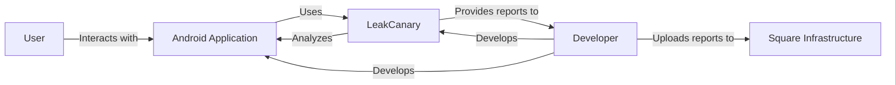
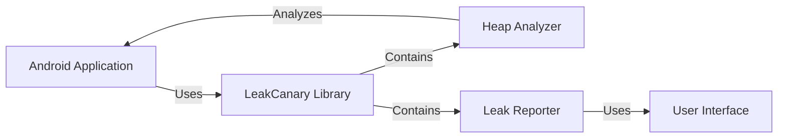
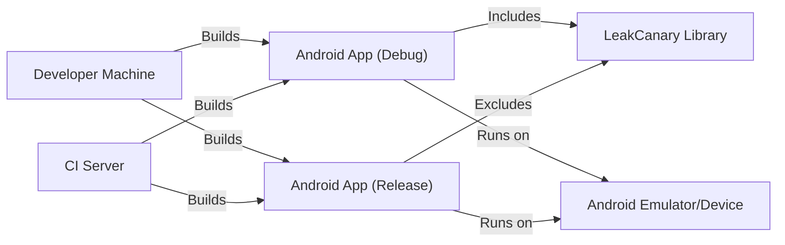
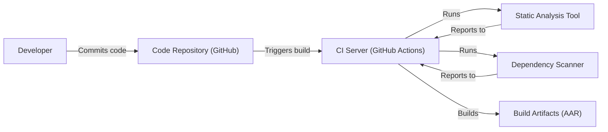

# Project Design Document: LeakCanary

## BUSINESS POSTURE

LeakCanary is a memory leak detection library for Android and Java. It's developed and maintained by Square, a large, publicly-traded company with a strong focus on financial services and security. Given Square's business, the following are likely business priorities and goals:

Priorities:

*   Maintain customer trust: Ensuring the security and reliability of Square's services is paramount to maintaining customer trust.
*   Protect sensitive data: Square handles a significant amount of sensitive financial data, making data protection a top priority.
*   Minimize operational costs: Efficient resource utilization is crucial for profitability.
*   Rapid development and deployment: The ability to quickly iterate and release new features and updates is essential for staying competitive.

Goals:

*   Reduce memory leaks in Android applications: This improves application performance and stability, leading to a better user experience.
*   Provide a developer-friendly tool: Easy integration and use are crucial for adoption and effectiveness.
*   Minimize overhead: The library should have a minimal impact on the performance of the application being monitored.
*   Open source and community-driven: Encourage contributions and feedback from the wider Android developer community.

Business Risks:

*   Reputational damage: If LeakCanary itself were to introduce vulnerabilities or instability, it could damage Square's reputation.
*   Increased support costs: If LeakCanary is difficult to use or generates false positives, it could increase support costs for Square and its users.
*   Legal and compliance risks: If LeakCanary were to mishandle sensitive data, it could lead to legal and compliance issues.

## SECURITY POSTURE

Existing Security Controls:

*   security control: Code Reviews: All code changes are reviewed by other developers before being merged. (Implicit in open-source development on GitHub).
*   security control: Static Analysis: Likely use of static analysis tools to identify potential bugs and vulnerabilities. (Common practice in Java/Android development).
*   security control: Open Source: The project is open source, allowing for community scrutiny and contributions.
*   security control: Minimal Permissions: LeakCanary operates within the context of the application it's monitoring and doesn't require additional system-level permissions.
*   security control: Testing: Extensive test suite to ensure functionality and prevent regressions. (Visible in the GitHub repository).

Accepted Risks:

*   accepted risk: Reliance on developer diligence: The effectiveness of LeakCanary depends on developers correctly integrating and using the library.
*   accepted risk: Potential for false positives: LeakCanary may sometimes identify false positives, requiring developers to investigate and confirm.
*   accepted risk: Overhead in debug builds: LeakCanary adds some overhead to debug builds, but this is generally acceptable for development purposes.
*   accepted risk: Third-party dependencies: LeakCanary depends on other libraries, which could introduce vulnerabilities.

Recommended Security Controls:

*   security control: Dependency Scanning: Implement automated dependency scanning to identify and address known vulnerabilities in third-party libraries.
*   security control: Fuzz Testing: Incorporate fuzz testing to identify unexpected behavior and potential crashes.
*   security control: Security-focused code reviews: Explicitly focus on security aspects during code reviews.

Security Requirements:

*   Authentication: Not applicable, as LeakCanary operates within the context of the host application.
*   Authorization: Not applicable, as LeakCanary operates within the context of the host application.
*   Input Validation: LeakCanary itself doesn't directly handle user input. However, it should be robust against potentially malformed data from the application being monitored.
*   Cryptography: Not directly applicable, as LeakCanary primarily deals with memory management. However, if LeakCanary were to transmit data remotely (which it currently doesn't), encryption would be required.

## DESIGN

### C4 CONTEXT

Element Descriptions:

*   Element:
    *   Name: User
    *   Type: Person
    *   Description: The end-user of the Android application.
    *   Responsibilities: Interacts with the Android application.
    *   Security controls: N/A - External entity.

*   Element:
    *   Name: Android Application
    *   Type: Software System
    *   Description: The Android application being monitored for memory leaks.
    *   Responsibilities: Provides functionality to the user.
    *   Security controls: Standard Android security best practices.

*   Element:
    *   Name: LeakCanary
    *   Type: Software System (Library)
    *   Description: The memory leak detection library.
    *   Responsibilities: Detects and reports memory leaks in the Android application.
    *   Security controls: Code reviews, static analysis, testing, minimal permissions.

*   Element:
    *   Name: Developer
    *   Type: Person
    *   Description: The developer of the Android application and/or LeakCanary.
    *   Responsibilities: Develops, maintains, and debugs the application and LeakCanary.
    *   Security controls: N/A - External entity.

*   Element:
    *   Name: Square Infrastructure
    *   Type: Infrastructure
    *   Description: Infrastructure provided by Square.
    *   Responsibilities: Provides infrastructure for CI/CD, hosting, etc.
    *   Security controls: Standard Square security best practices.

### C4 CONTAINER

Element Descriptions:

*   Element:
    *   Name: Android Application
    *   Type: Software System
    *   Description: The Android application being monitored.
    *   Responsibilities: Provides functionality to the user.
    *   Security controls: Standard Android security best practices.

*   Element:
    *   Name: LeakCanary Library
    *   Type: Library
    *   Description: The main entry point for LeakCanary.
    *   Responsibilities: Provides the API for integrating LeakCanary into the application.
    *   Security controls: Code reviews, static analysis, testing.

*   Element:
    *   Name: Heap Analyzer
    *   Type: Component
    *   Description: Analyzes the heap dumps to identify potential leaks.
    *   Responsibilities: Parses heap dumps, identifies retained objects, and determines leak suspects.
    *   Security controls: Input validation (of heap dump data).

*   Element:
    *   Name: Leak Reporter
    *   Type: Component
    *   Description: Reports the detected leaks to the developer.
    *   Responsibilities: Formats and presents the leak information.
    *   Security controls: None specific.

*   Element:
    *   Name: User Interface
    *   Type: Component
    *   Description: Displays leak information within the application.
    *   Responsibilities: Presents leak reports in a user-friendly way.
    *   Security controls: None specific.

### DEPLOYMENT

Possible Deployment Solutions:

1.  Integrated into the application's debug build: LeakCanary is typically included as a dependency in the application's debug build variant. It's not included in release builds.
2.  Standalone analysis tool: While less common, it's theoretically possible to use LeakCanary's heap analysis components in a standalone tool.

Chosen Solution (1 - Integrated into debug build):

Element Descriptions:

*   Element:
    *   Name: Developer Machine
    *   Type: Infrastructure
    *   Description: The developer's local machine.
    *   Responsibilities: Used for development, building, and testing.
    *   Security controls: Standard developer machine security practices.

*   Element:
    *   Name: CI Server
    *   Type: Infrastructure
    *   Description: Continuous Integration server.
    *   Responsibilities: Automates building, testing, and deployment.
    *   Security controls: Access controls, secure build environment.

*   Element:
    *   Name: Android App (Debug)
    *   Type: Application
    *   Description: The debug build of the Android application, including LeakCanary.
    *   Responsibilities: Runs the application with leak detection enabled.
    *   Security controls: LeakCanary's security controls.

*   Element:
    *   Name: Android App (Release)
    *   Type: Application
    *   Description: The release build of the Android application, excluding LeakCanary.
    *   Responsibilities: Runs the application without leak detection.
    *   Security controls: Standard Android application security.

*   Element:
    *   Name: LeakCanary Library
    *   Type: Library
    *   Description: The LeakCanary library files.
    *   Responsibilities: Provides leak detection functionality.
    *   Security controls: Code reviews, static analysis, testing.

*   Element:
    *   Name: Android Emulator/Device
    *   Type: Infrastructure
    *   Description: The Android emulator or physical device where the application is run.
    *   Responsibilities: Executes the Android application.
    *   Security controls: Standard Android device security.

### BUILD

Build Process Description:

1.  Developer commits code to the GitHub repository.
2.  GitHub Actions (or a similar CI system) is triggered.
3.  The CI server checks out the code.
4.  Static analysis tools (e.g., FindBugs, PMD, Android Lint) are run to identify potential code quality and security issues.
5.  Dependency scanning tools (e.g., OWASP Dependency-Check) are run to identify known vulnerabilities in dependencies.
6.  The project is built, producing an AAR (Android Archive) file.
7.  The build artifacts and reports from the analysis tools are stored.

Security Controls:

*   security control: CI/CD Pipeline: Automated build and testing process.
*   security control: Static Analysis: Use of static analysis tools to identify potential vulnerabilities.
*   security control: Dependency Scanning: Automated scanning for known vulnerabilities in dependencies.
*   security control: Code Review: (Implicit in the GitHub workflow).

## RISK ASSESSMENT

Critical Business Processes:

*   Android application development and deployment.
*   Maintaining the stability and performance of Android applications.
*   Protecting the reputation of Square and LeakCanary.

Data Protection:

*   LeakCanary itself does not handle sensitive user data directly. It analyzes heap dumps, which *could* contain sensitive data if the application being monitored is mishandling that data.
*   Data Sensitivity: Low (for LeakCanary itself), Potentially High (for the heap dumps it analyzes, depending on the application).

## QUESTIONS & ASSUMPTIONS

Questions:

*   What specific static analysis tools are currently used?
*   What is the process for handling reported vulnerabilities in LeakCanary or its dependencies?
*   Are there any plans to expand LeakCanary's functionality to include other types of resource leak detection?
*   Are heap dumps ever transmitted off-device, and if so, what security measures are in place?

Assumptions:

*   BUSINESS POSTURE: Square prioritizes security and reliability.
*   SECURITY POSTURE: Standard security best practices are followed in the development of LeakCanary.
*   DESIGN: LeakCanary is primarily used in debug builds and is not included in release builds.
*   DESIGN: Heap dumps are analyzed locally on the device.
*   DESIGN: CI environment is secure.