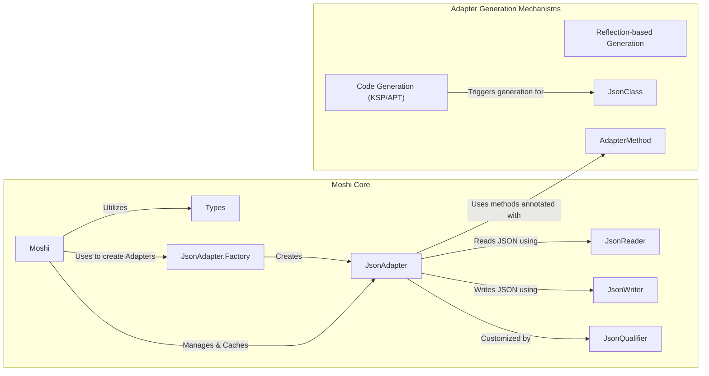
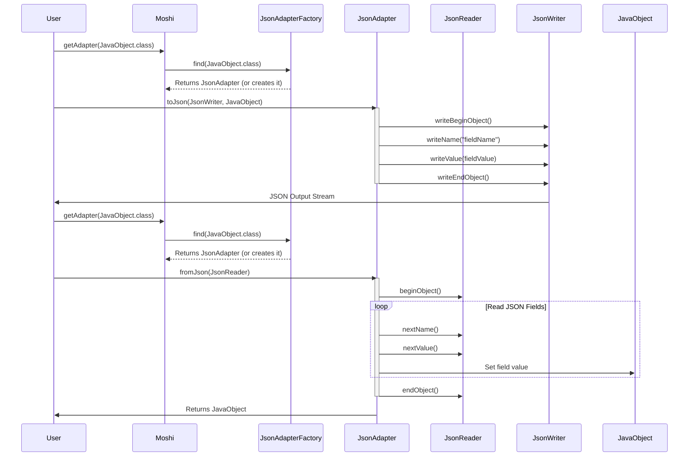

# Project Design Document: Moshi - A Modern JSON Library for Android and Java

**Version:** 1.1
**Date:** October 26, 2023
**Author:** AI Software Architect

## 1. Introduction

This document provides an enhanced design overview of the Moshi library, a modern JSON library for Android and Java. This document aims to provide a more detailed articulation of the architecture, components, and data flow within Moshi to facilitate a more comprehensive and effective threat modeling exercise. The information presented here is based on the publicly available source code of the Moshi project found at [https://github.com/square/moshi](https://github.com/square/moshi).

## 2. Goals

*   Provide a clear, concise, and more detailed description of Moshi's architecture and key components, emphasizing aspects relevant to security.
*   Elaborate on the data flow during JSON serialization and deserialization, highlighting potential points of interaction and manipulation.
*   Identify potential areas of interest for security analysis and threat modeling with more specific examples.
*   Serve as a robust foundational document for subsequent security assessments, enabling more targeted analysis.

## 3. Overview

Moshi is a library for parsing JSON into Java and Kotlin classes. It simplifies the process of converting structured data into typed objects and vice versa. Key features include:

*   First-class support for Kotlin and Java.
*   Flexible adapter generation mechanisms:
    *   Reflection-based adapter generation for ease of use.
    *   Code-generation-based adapter generation (using Kotlin Symbol Processing - KSP, or Annotation Processing - APT) for improved performance and compile-time safety.
*   Streaming API (`JsonReader` and `JsonWriter`) for efficient and memory-conscious processing of large JSON documents.
*   Extensibility through a well-defined `JsonAdapter` interface, allowing for custom serialization and deserialization logic.
*   Comprehensive support for various JSON features, including:
    *   Handling of null values.
    *   Lenient parsing to accommodate non-strict JSON.
    *   Custom naming strategies for mapping JSON field names to Java/Kotlin property names.

## 4. Architectural Design

Moshi's architecture is centered around the concept of `Adapters`, which act as the bridge between JSON representations and Java/Kotlin types. The `Moshi` instance orchestrates the creation and retrieval of these adapters.

### 4.1. Key Components

*   **`Moshi`:** The central orchestrator and entry point for using the library.
    *   Manages a registry of `JsonAdapter.Factory` instances.
    *   Caches created `JsonAdapter` instances for efficiency.
    *   Provides methods to obtain `JsonAdapter` instances for specific types.
*   **`JsonAdapter<T>`:** An interface defining the contract for converting between a JSON representation and a Java/Kotlin type `T`.
    *   `toJson(JsonWriter writer, T value)`: Serializes an object of type `T` to JSON using the provided `JsonWriter`.
    *   `fromJson(JsonReader reader)`: Deserializes JSON from the provided `JsonReader` into an object of type `T`.
*   **`JsonReader`:** An abstract interface for reading JSON tokens from an input source.
    *   Implementations like `JsonUtf8Reader` handle the low-level parsing of UTF-8 encoded JSON text.
    *   Provides methods to read various JSON tokens (begin object, begin array, name, string, number, boolean, null, end object, end array).
*   **`JsonWriter`:** An abstract interface for writing JSON tokens to an output destination.
    *   Implementations like `JsonUtf8Writer` handle the low-level generation of UTF-8 encoded JSON text.
    *   Provides methods to write various JSON tokens (begin object, begin array, name, value (string, number, boolean, null), end object, end array).
*   **`JsonQualifier`:** Annotations used to customize the behavior of adapters, allowing for specific handling of JSON fields based on context.
    *   Examples include annotations for handling different date formats or specific naming conventions.
*   **`JsonClass`:** An annotation used in conjunction with code generation (KSP/APT) to instruct the processor to automatically generate a `JsonAdapter` implementation for the annotated data class.
*   **`AdapterMethod`:** Annotations (`@ToJson`, `@FromJson`) used to define custom serialization and deserialization logic within a class, providing fine-grained control over the conversion process.
*   **`Types`:** A utility class providing static methods for working with Java and Kotlin types, particularly useful for handling generic types and type parameters.
*   **`JsonAdapter.Factory`:** An interface responsible for creating `JsonAdapter` instances for specific types.
    *   Moshi includes default factories for common Java and Kotlin types.
    *   Developers can implement custom factories to provide adapters for types not handled by the default factories.
    *   Factories are consulted in a specific order when `Moshi` needs to find an adapter for a given type.
*   **Reflection-based Adapter Generation:** A mechanism where `JsonAdapter` implementations are generated at runtime using Java reflection to inspect the structure of classes.
    *   Offers convenience but can have performance implications and limitations with certain language features.
*   **Code Generation (KSP/APT):** A mechanism where `JsonAdapter` implementations are generated at compile time using Kotlin Symbol Processing (KSP) or Annotation Processing (APT).
    *   Provides better performance and compile-time safety compared to reflection.
    *   Requires the use of the `@JsonClass` annotation.

### 4.2. Component Diagram

### 4.3. Data Flow

The following details the typical data flow for serialization and deserialization processes within Moshi.

#### 4.3.1. Serialization (Java/Kotlin Object to JSON)

1. The user requests a `JsonAdapter<T>` for the object to be serialized from the `Moshi` instance using `moshi.adapter(ObjectType::class.java)`.
2. `Moshi` iterates through its registered `JsonAdapter.Factory` instances to find a factory that can create an adapter for the requested type.
3. The appropriate `JsonAdapter` is retrieved (either from the cache or created by a factory).
4. The user calls the `toJson(JsonWriter writer, T value)` method on the obtained `JsonAdapter`, passing the object to be serialized and a `JsonWriter` instance.
5. The `JsonAdapter` uses the provided `JsonWriter` to write the JSON representation of the object.
    *   For generated adapters (reflection or code generation), this involves iterating through the fields of the object and writing their values to the `JsonWriter` using appropriate methods (e.g., `name()`, `value()`).
    *   Custom logic defined in `@ToJson` annotated methods within the object or in custom adapters is executed.
6. The `JsonWriter` implementation (e.g., `JsonUtf8Writer`) handles the low-level writing of JSON tokens (begin object, name, value, etc.) to the underlying output stream (e.g., a `FileOutputStream`).
7. `JsonQualifier` annotations on fields or parameters influence how specific fields are serialized (e.g., custom naming, formatting).

#### 4.3.2. Deserialization (JSON to Java/Kotlin Object)

1. The user requests a `JsonAdapter<T>` for the target object type from the `Moshi` instance using `moshi.adapter(ObjectType::class.java)`.
2. `Moshi` retrieves the appropriate `JsonAdapter` as described in the serialization process.
3. The user calls the `fromJson(JsonReader reader)` method on the `JsonAdapter`, passing a `JsonReader` instance that is reading from the JSON source.
4. The `JsonAdapter` uses the provided `JsonReader` to read and parse the JSON structure.
    *   The `JsonReader` implementation (e.g., `JsonUtf8Reader`) reads the JSON input stream and breaks it down into tokens.
    *   For generated adapters, this involves reading the JSON tokens and mapping them to the fields of the target object.
    *   Custom logic defined in `@FromJson` annotated methods or custom adapters is executed to handle specific JSON structures or perform data transformations.
5. The `JsonAdapter` creates an instance of the target object and populates its fields based on the data read from the `JsonReader`.
6. `JsonQualifier` annotations influence how specific JSON fields are deserialized and mapped to object properties.

### 4.4. Data Flow Diagram

## 5. Security Considerations (For Threat Modeling)

This section provides a more detailed exploration of potential security considerations relevant for threat modeling Moshi.

*   **Deserialization of Untrusted Data:**  A primary concern with any JSON processing library.
    *   **Potential Threats:**
        *   **Denial of Service (DoS):**  Maliciously crafted JSON with deeply nested structures or extremely large strings can consume excessive memory or processing time, leading to application crashes or unresponsiveness.
        *   **Resource Exhaustion:**  Similar to DoS, but focusing on exhausting specific resources like CPU or network bandwidth.
        *   **Unexpected Behavior:**  Malformed JSON might lead to unexpected states or errors within the application if not handled robustly.
    *   **Mitigation Strategies (Application Level):**
        *   Input validation and sanitization before deserialization.
        *   Setting limits on the depth and size of JSON structures.
        *   Implementing appropriate error handling and logging.
*   **Custom Adapters and Adapter Methods:**  Introduce potential vulnerabilities if not implemented securely.
    *   **Potential Threats:**
        *   **Information Disclosure:** Custom logic might inadvertently expose sensitive information during serialization.
        *   **Arbitrary Code Execution (Less likely but possible):** If custom adapters interact with external systems or execute code based on untrusted JSON data, vulnerabilities could arise.
        *   **Injection Attacks:** If custom deserialization logic doesn't properly sanitize input before using it in further operations (e.g., database queries).
    *   **Mitigation Strategies (Development Best Practices):**
        *   Thoroughly review and test custom adapter logic.
        *   Avoid performing sensitive operations or interacting with external systems directly within adapters without proper security measures.
        *   Follow secure coding principles.
*   **Reflection-based Adapter Generation:**
    *   **Potential Threats:**
        *   **Access to Non-Public Members:** Reflection can bypass access modifiers, potentially allowing access to internal state that should not be exposed. While Moshi doesn't inherently exploit this for malicious purposes, it's a consideration when deserializing into classes from untrusted sources.
        *   **Performance Overhead:** While not a direct security vulnerability, excessive reflection can impact performance, potentially leading to denial of service in resource-constrained environments.
    *   **Mitigation Strategies (Moshi Design & Application Level):**
        *   Moshi's reflection logic is generally safe, but developers should be aware of the implications when using it with untrusted data.
        *   Prefer code generation for performance-critical applications or when dealing with sensitive data structures.
*   **Code Generation (KSP/APT):**
    *   **Potential Threats:**
        *   **Vulnerabilities in the Code Generation Process:** Bugs in Moshi's KSP/APT processors could lead to the generation of vulnerable adapter code.
        *   **Supply Chain Attacks:** If the KSP/APT processors themselves are compromised.
    *   **Mitigation Strategies (Moshi Development & Build Process):**
        *   Rigorous testing of the code generation logic.
        *   Secure development practices for the Moshi project itself.
        *   Using trusted and verified versions of Moshi and its dependencies.
*   **Dependency Management:**  Moshi relies on external libraries.
    *   **Potential Threats:**
        *   **Transitive Vulnerabilities:** Vulnerabilities in Moshi's dependencies (e.g., Okio) can indirectly affect applications using Moshi.
    *   **Mitigation Strategies (Application Level):**
        *   Regularly update Moshi and its dependencies to the latest versions.
        *   Use dependency scanning tools to identify and address known vulnerabilities.
*   **Lenient Parsing:** While useful, it can introduce risks.
    *   **Potential Threats:**
        *   **Processing of Unexpected Data:** Lenient parsing might allow the processing of JSON that doesn't conform to the expected schema, potentially leading to unexpected behavior or security vulnerabilities if the application logic relies on strict adherence to the schema.
    *   **Mitigation Strategies (Application Level):**
        *   Carefully consider when to enable lenient parsing.
        *   Implement robust validation logic after deserialization, even with lenient parsing enabled.
*   **Error Handling:**
    *   **Potential Threats:**
        *   **Information Disclosure:** Verbose error messages might reveal sensitive information about the application's internal structure or data.
    *   **Mitigation Strategies (Application Level):**
        *   Implement appropriate error handling that avoids exposing sensitive details in error messages, especially in production environments.

## 6. Dependencies

Moshi has the following key dependencies:

*   **Okio:** A library from Square that provides efficient and reliable I/O operations.

## 7. Deployment

Moshi is typically deployed as a library embedded within Android or Java applications. It is included as a dependency in the project's build configuration (e.g., `build.gradle` for Android/Gradle projects or `pom.xml` for Maven projects). The specific deployment context influences the potential attack surface and relevant threats.

## 8. Future Considerations

*   Further in-depth security analysis of the interaction between custom `JsonQualifier` implementations and the core deserialization logic.
*   Detailed static and dynamic analysis of the code generation modules (KSP and APT) to identify potential vulnerabilities in the generated code.
*   Continuous monitoring of dependencies for newly discovered vulnerabilities and timely updates.
*   Consideration of adding security-focused documentation or guidelines for developers using Moshi, emphasizing secure deserialization practices.

This enhanced document provides a more detailed and security-focused overview of the Moshi library's design. The expanded descriptions of components, data flow, and security considerations aim to facilitate a more thorough and effective threat modeling process. The identified potential threats and mitigation strategies serve as valuable starting points for security assessments and the development of secure coding practices when using Moshi.
