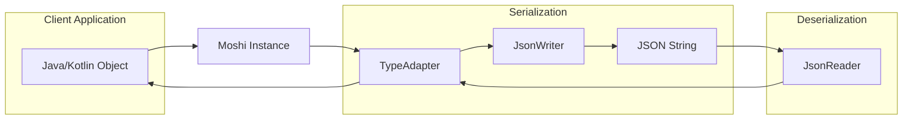
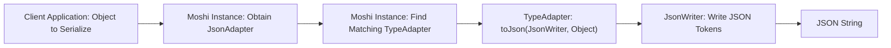
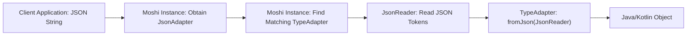

# Project Design Document: Moshi - A Modern JSON Library for Android and Java

**Version:** 1.1
**Date:** October 26, 2023
**Author:** AI Software Architect

## 1. Introduction

This document provides a detailed design overview of Moshi, a modern JSON library for Android and Java, developed by Square. This document aims to clearly articulate the architecture, components, and data flow within Moshi, making it suitable for subsequent threat modeling activities. This revision includes more detail on internal workings and security considerations.

Moshi simplifies the process of parsing and generating JSON in Java and Kotlin applications. It leverages Kotlin's reflection capabilities (when available) and code generation (annotation processing) to provide a convenient and efficient way to serialize and deserialize JSON data to and from Java/Kotlin objects. It prioritizes correctness and offers a flexible mechanism for customizing JSON handling.

## 2. Goals and Objectives

The primary goals of Moshi are:

- **Ease of Use:** Provide a straightforward and intuitive API for common JSON operations, minimizing boilerplate code.
- **Efficiency:** Offer good performance in both parsing and generation of JSON, suitable for resource-constrained environments like Android.
- **Type Safety:** Leverage Java and Kotlin's type systems to minimize runtime errors and ensure data integrity during serialization and deserialization.
- **Extensibility:** Allow customization and extension to handle complex JSON structures, diverse data types, and specific application requirements through `TypeAdapter`s and factories.
- **Interoperability:** Work seamlessly with existing Java and Kotlin codebases and integrate well with other libraries.
- **Correctness:** Ensure accurate and reliable conversion between JSON and Java/Kotlin objects, adhering to JSON specifications.

## 3. Architecture and Design

Moshi's architecture is centered around the `Moshi` builder and the concept of pluggable `TypeAdapter`s.

### 3.1. High-Level Architecture

### 3.2. Component Descriptions

- **`Moshi` Instance:**
    - The central orchestrator for JSON processing. Created using a `Moshi.Builder`.
    - Manages an ordered list of `TypeAdapter.Factory` instances.
    - Provides the primary entry point for obtaining `JsonAdapter` instances for specific types using `adapter(Type)`.
    - Immutable once built, ensuring thread safety.
    - Configuration includes registering custom `TypeAdapter.Factory` instances, `JsonQualifier` annotations, and support for Kotlin reflection.

- **`TypeAdapter<T>`:**
    - The core component responsible for the bidirectional conversion between a Java/Kotlin type `T` and its JSON representation.
    - Abstract class with concrete implementations provided by Moshi or custom implementations.
    - Contains `fromJson(JsonReader reader)` for deserialization (reading JSON and creating an object) and `toJson(JsonWriter writer, T value)` for serialization (writing an object as JSON).
    - Moshi provides built-in `TypeAdapter`s for primitive types, common JDK classes (like `List`, `Map`, `Date`), and Kotlin data classes.

- **`JsonReader`:**
    - A low-level, efficient, and stream-based JSON parser.
    - Operates on a character stream representing the JSON input.
    - Provides methods for reading JSON tokens sequentially: `beginObject()`, `endObject()`, `nextName()`, `nextString()`, `nextInt()`, `nextBoolean()`, `nextNull()`, etc.
    - Crucial for handling the structure and data types within the JSON.
    - Tracks the current parsing location, enabling error reporting.

- **`JsonWriter`:**
    - A low-level, efficient, and stream-based JSON generator.
    - Writes JSON tokens to an underlying output stream.
    - Provides methods for writing JSON structures: `beginObject()`, `endObject()`, `name(String)`, `value(String)`, `value(int)`, `value(boolean)`, `nullValue()`, etc.
    - Enforces correct JSON syntax.
    - Offers options for indentation and formatting.

- **`TypeAdapter.Factory`:**
    - An interface for creating `TypeAdapter` instances dynamically based on the requested type and annotations.
    - Enables the registration of custom logic for selecting or creating `TypeAdapter`s.
    - Factories are consulted in the order they are registered with the `Moshi.Builder`. The first factory that can create an adapter for a given type wins.
    - Used for implementing features like:
        - Handling `@JsonClass(generateAdapter = true)` for code-generated adapters.
        - Supporting `@JsonQualifier` annotations to customize serialization/deserialization.
        - Implementing polymorphic serialization/deserialization based on type information in the JSON.

- **`JsonQualifier` Annotations:**
    - Custom annotations used to provide semantic context for serialization and deserialization of specific fields or types.
    - Examples include annotations for specifying custom date formats (`@Json(format = "...")`) or handling null values differently.
    - `TypeAdapter.Factory` implementations can inspect these annotations to create specialized `TypeAdapter` instances.

### 3.3. Data Flow

#### 3.3.1. Serialization (Java/Kotlin Object to JSON)

- The client application provides a Java/Kotlin object to the `Moshi` instance.
- The `Moshi` instance is queried for a `JsonAdapter` for the object's type.
- The `Moshi` instance iterates through its registered `TypeAdapter.Factory` instances to find the first factory that can create a suitable `TypeAdapter` for the given type (considering annotations).
- The appropriate `TypeAdapter`'s `toJson()` method is invoked, passing the object and a `JsonWriter`.
- The `TypeAdapter` inspects the object's fields (using reflection or generated code) and uses the `JsonWriter` to write corresponding JSON tokens (names and values), potentially recursively obtaining `JsonAdapter`s for nested objects.
- The `JsonWriter` builds the final JSON string.

#### 3.3.2. Deserialization (JSON to Java/Kotlin Object)

- The client application provides a JSON string to the `Moshi` instance.
- The `Moshi` instance is queried for a `JsonAdapter` for the target Java/Kotlin object type.
- The `Moshi` instance iterates through its registered `TypeAdapter.Factory` instances to find the first factory that can create a suitable `TypeAdapter` for the target type.
- A `JsonReader` is created from the JSON string.
- The `TypeAdapter`'s `fromJson()` method is invoked, passing the `JsonReader`.
- The `TypeAdapter` uses the `JsonReader` to read JSON tokens, mapping them to the fields of the target Java/Kotlin object, potentially recursively obtaining `JsonAdapter`s for nested objects.
- The `fromJson()` method returns the populated Java/Kotlin object.

### 3.4. External Interactions

Moshi's interactions extend beyond the immediate client application:

- **Input JSON Data Sources:**
    - **Network APIs:** Receiving JSON responses from web services.
    - **Local File Systems:** Reading JSON data from configuration files or data storage.
    - **Databases:**  Potentially interacting with databases that store JSON documents.
    - **Message Queues:** Processing JSON messages from queuing systems.
    - **User Input:**  Less common but possible if applications allow users to input JSON directly.

- **Output JSON Data Destinations:**
    - **Network APIs:** Sending JSON payloads to web services.
    - **Local File Systems:** Writing JSON data to configuration files or for data persistence.
    - **Databases:** Storing serialized objects as JSON documents in databases.
    - **Message Queues:** Publishing JSON messages to queuing systems.
    - **Logging Systems:**  Formatting data as JSON for logging purposes.

- **Reflection/Code Generation Mechanisms:**
    - **Java Reflection API:** Used at runtime to inspect class structures, access fields, and determine types when code generation is not used.
    - **Kotlin Reflection API:** Similar to Java reflection but specific to Kotlin's features.
    - **Annotation Processing (KAPT/APT):** Used during compilation to generate efficient `TypeAdapter` implementations for classes annotated with `@JsonClass(generateAdapter = true)`. This improves performance by avoiding runtime reflection.

## 4. Security Considerations (Precursor to Threat Modeling)

This section details potential security considerations relevant to Moshi's design, providing a foundation for thorough threat modeling.

- **Deserialization of Untrusted Data:**
    - **Code Injection/Remote Code Execution:**  While Moshi itself doesn't inherently execute code from JSON, vulnerabilities in custom `TypeAdapter` implementations or the handling of polymorphic types could be exploited. For instance, if a custom adapter instantiates classes based on values in the JSON without proper validation, it could lead to the instantiation of malicious classes.
    - **Denial of Service (DoS):**
        - **Recursive Structures:**  Malicious JSON with deeply nested objects or arrays can cause stack overflow errors or excessive memory consumption during parsing. Moshi has some built-in protections against extremely deep nesting, but these limits might be bypassed or insufficient in certain scenarios.
        - **Large Strings/Numbers:**  Extremely large string or number values in the JSON could lead to excessive memory allocation or processing time.
    - **Data Corruption/Type Confusion:**  If the incoming JSON doesn't conform to the expected schema, or if custom `TypeAdapter`s have flaws, deserialization might result in incorrect or corrupted data being populated into Java/Kotlin objects. This could lead to unexpected application behavior or security vulnerabilities down the line.
    - **Billion Laughs Attack (XML Entity Expansion Analogue):** Although JSON doesn't have entities in the same way as XML, carefully crafted JSON with highly repetitive structures could still lead to excessive memory usage during parsing.

- **Serialization of Sensitive Data:**
    - **Unintentional Exposure of Sensitive Information:**  By default, Moshi serializes all public and non-transient fields. If sensitive information is present in these fields and not explicitly excluded (e.g., using `@Transient` or custom exclusion strategies), it will be included in the JSON output. This is a configuration issue but a critical security consideration.
    - **Insecure Defaults:** Ensure default serialization behavior doesn't inadvertently expose sensitive data.

- **Dependency Vulnerabilities:**
    - Moshi relies on the Kotlin standard library and potentially other libraries (though it has minimal direct dependencies). Vulnerabilities in these underlying libraries could affect Moshi's security. Regular dependency updates and security scanning are crucial.

- **Custom `TypeAdapter` Security:**
    - **Input Validation:** Custom `TypeAdapter` implementations must thoroughly validate incoming JSON data to prevent unexpected behavior or vulnerabilities. Failure to validate data types, ranges, or formats can lead to various issues.
    - **Secure Handling of External Resources:** If custom adapters interact with external resources (databases, network services), they must do so securely to prevent injection attacks or other vulnerabilities.
    - **Preventing Information Disclosure:** Custom adapters should avoid logging or otherwise exposing sensitive information during error handling or processing.

- **Reflection Risks:**
    - While Moshi uses reflection for convenience, uncontrolled or excessive reflection can potentially expose internal implementation details or create unexpected access points. Moshi's use of reflection is generally controlled, but understanding its implications is important.

- **Configuration Vulnerabilities:**
    - Misconfiguration of the `Moshi` instance (e.g., registering insecure or poorly written custom `TypeAdapter.Factory` instances) can introduce security vulnerabilities.

## 5. Deployment Considerations

Moshi is deployed as a library dependency within Java and Android applications.

- **Dependency Management:**  Included using build tools like Gradle (Android/Kotlin) or Maven (Java) by adding the appropriate dependency declaration.
- **Runtime Environment:**  Requires a compatible Java Virtual Machine (JVM) or Android Runtime (ART).
- **Code Generation:** When using annotation processing for adapter generation, this step occurs during the build process, and the generated code is included in the application.

## 6. Future Considerations

- **Improved Error Reporting and Recovery:**  Provide more detailed error messages and potentially mechanisms for recovering from certain parsing errors.
- **Performance Enhancements:**  Continuously optimize parsing and generation performance, especially for large JSON payloads.
- **Support for Emerging JSON Standards:**  Adapt to new JSON specifications and features as they arise.
- **Formal Security Audits:**  Conduct regular, independent security audits and penetration testing to proactively identify and address potential vulnerabilities.
- **Built-in Security Features:** Explore adding built-in features to mitigate common JSON-related vulnerabilities, such as stricter limits on nesting depth or payload size.

This revised document provides a more detailed and security-focused overview of the Moshi library's design, enhancing its value for subsequent threat modeling activities. The expanded descriptions of components, data flows, and security considerations offer a more comprehensive understanding of the system's architecture and potential attack surfaces.