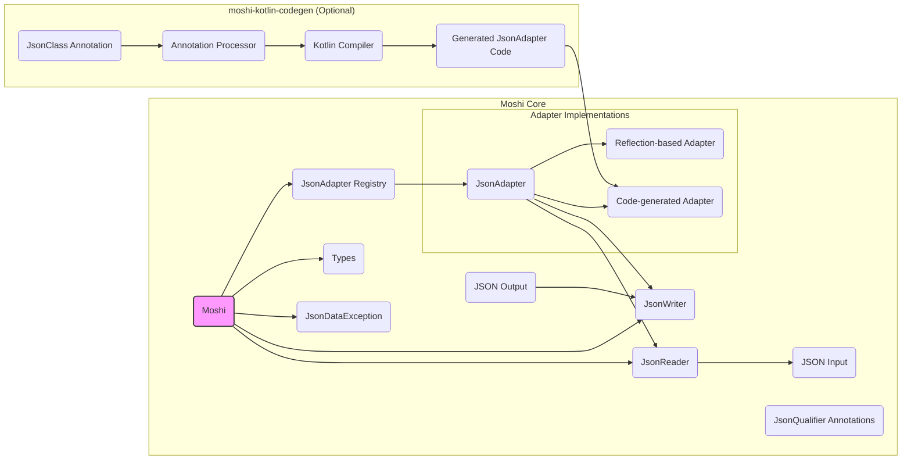
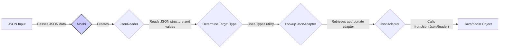
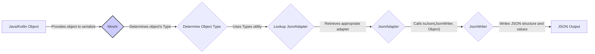

# Project Design Document: Moshi - A Modern JSON Library for Android and Java

**Version:** 1.1
**Date:** October 26, 2023
**Author:** Gemini (AI Language Model)

## 1. Introduction

This document provides a detailed design overview of the Moshi library, a modern JSON serialization/deserialization library for Android and Java. This document is intended to serve as a foundation for subsequent threat modeling activities. It outlines the key components, architecture, and data flow within the Moshi library, with a focus on aspects relevant to security.

### 1.1. Purpose

The primary purpose of this document is to provide a comprehensive technical description of the Moshi library to facilitate effective threat modeling. It aims to identify potential security vulnerabilities by detailing the library's internal workings, data handling, and interactions with external components.

### 1.2. Scope

This document covers the core functionalities and architectural components of the Moshi library as represented in the provided GitHub repository (https://github.com/square/moshi). It focuses on the serialization and deserialization processes, adapter generation (both reflection-based and code-generated), key data structures, and error handling mechanisms. It does not delve into the implementation details of every individual built-in adapter or plugin but focuses on the general architecture and potential attack surfaces.

### 1.3. Goals

*   Clearly describe the architecture and responsibilities of the core components within the Moshi library.
*   Illustrate the detailed data flow during both serialization and deserialization processes, highlighting potential points of manipulation or injection.
*   Identify potential areas of interest for security analysis and threat modeling, providing specific examples of potential vulnerabilities.
*   Provide a solid basis for understanding the library's attack surface and potential security risks.

## 2. Overview

Moshi is a JSON library designed for ease of use and performance in Java and Kotlin environments. It simplifies the conversion of JSON data to and from Java/Kotlin objects using a system of `JsonAdapter`s. Moshi supports both reflection-based adapter creation for convenience and compile-time code generation (via `moshi-kotlin-codegen`) for improved performance and type safety. Its design emphasizes robustness and extensibility.

## 3. Architecture

The Moshi library's architecture is centered around the concept of `JsonAdapter`s, which act as the primary converters between JSON and Java/Kotlin types. The `Moshi` class orchestrates the adapter lookup and the overall serialization/deserialization process.

### 3.1. Key Components

*   **`Moshi`:** The central orchestrator and entry point for using the library.
    *   Manages a registry (cache) of `JsonAdapter` instances.
    *   Provides methods to create new `JsonAdapter` instances, either directly or through factories.
    *   Handles the overall serialization and deserialization process by delegating to appropriate adapters.
    *   Offers configuration options for customizing behavior (e.g., lenient parsing).
*   **`JsonAdapter<T>`:** An abstract class defining the contract for converting between a Java/Kotlin type `T` and JSON.
    *   Implementations provide the specific logic for `toJson(JsonWriter, T)` (serialization) and `fromJson(JsonReader)` (deserialization).
    *   Can be implemented manually or generated by Moshi (reflection or code generation).
*   **`JsonReader`:** Responsible for reading and parsing JSON input.
    *   Provides methods to navigate the JSON structure (begin/end object/array, nextName, nextString, nextInt, etc.).
    *   Handles parsing of different JSON value types.
    *   Manages the current parsing state and position.
    *   Can throw `JsonDataException` for invalid JSON.
*   **`JsonWriter`:** Responsible for writing JSON output.
    *   Provides methods to construct JSON structures (begin/end object/array, name, value).
    *   Handles escaping of special characters in JSON strings.
    *   Manages the current writing state and formatting.
*   **`Types`:** A utility class for working with Java and Kotlin types, particularly generic types.
    *   Provides methods to resolve type parameters and create `Type` instances.
    *   Used for adapter lookup, especially for parameterized types.
*   **`JsonQualifier` Annotations:** Annotations used to customize serialization and deserialization based on specific criteria.
    *   Allows for selecting different adapters based on annotations.
    *   Examples include `@Json`, `@Transient`, and custom qualifier annotations.
*   **`JsonClass` Annotation:** An annotation used to mark Kotlin classes for which `moshi-kotlin-codegen` should generate optimized adapters.
*   **`JsonDataException`:** An exception class used to indicate errors during JSON parsing or conversion.
*   **Reflection-based Adapters:** Adapters created dynamically at runtime using Java reflection.
    *   Provide a convenient way to handle serialization/deserialization without explicit adapter generation.
    *   Can be less performant than code-generated adapters.
*   **Code-generated Adapters:** Optimized `JsonAdapter` implementations generated at compile time by the `moshi-kotlin-codegen` annotation processor.
    *   Offer better performance and type safety compared to reflection-based adapters.

### 3.2. Component Diagram

### 3.3. Data Flow

The data flow within Moshi involves the interaction of its core components during serialization and deserialization.

#### 3.3.1. Deserialization (JSON to Object)

1. **JSON Input:** The process starts with a JSON string or input stream.
2. **Moshi:** The `Moshi` instance receives the JSON input and the target Java/Kotlin `Type`.
3. **JsonReader Creation:** `Moshi` creates a `JsonReader` instance to parse the input.
4. **Determine Target Type:** `Moshi` uses the provided `Type` information to identify the target class for deserialization.
5. **Lookup JsonAdapter:** `Moshi` consults its `JsonAdapter` registry, using the target `Type` (and potentially `JsonQualifier` annotations), to find the appropriate `JsonAdapter`.
6. **JsonAdapter.fromJson(JsonReader):** The `fromJson` method of the selected `JsonAdapter` is invoked. This method uses the `JsonReader` to read and interpret the JSON data, mapping it to the fields of the target Java/Kotlin object.
7. **Java/Kotlin Object:** The fully populated Java or Kotlin object is returned.

#### 3.3.2. Serialization (Object to JSON)

1. **Java/Kotlin Object:** The process begins with a Java or Kotlin object to be serialized.
2. **Moshi:** The `Moshi` instance receives the object to be serialized.
3. **Determine Object Type:** `Moshi` determines the runtime type of the object.
4. **Lookup JsonAdapter:** `Moshi` consults its `JsonAdapter` registry to find the appropriate `JsonAdapter` for the object's type (and potentially `JsonQualifier` annotations).
5. **JsonAdapter.toJson(JsonWriter, Object):** The `toJson` method of the selected `JsonAdapter` is invoked. This method uses a `JsonWriter` to write the JSON representation of the object's fields and values.
6. **JsonWriter:** The `JsonWriter` constructs the JSON output, handling formatting and escaping.
7. **JSON Output:** The serialized JSON string or output stream is produced.

## 4. Security Considerations

Based on the architecture and data flow, several potential security considerations are relevant for threat modeling:

*   **Malicious JSON Input Processing (`JsonReader`):**
    *   **Large or deeply nested JSON:**  Processing excessively large or deeply nested JSON structures could lead to stack overflow errors or excessive memory consumption, causing denial-of-service (DoS).
    *   **Unexpected data types:** Providing JSON values that do not match the expected types could lead to `JsonDataException` exceptions. While this prevents incorrect deserialization, improper handling of these exceptions in the application could expose vulnerabilities.
    *   **JSON injection:** If the application constructs JSON output by concatenating strings without proper escaping, attackers might inject malicious JSON fragments.
*   **Deserialization Vulnerabilities (`JsonAdapter.fromJson`):**
    *   **Type confusion:** If the application logic relies on the assumed type of deserialized objects without proper validation, attackers might be able to provide JSON that deserializes to a different, potentially malicious, type.
    *   **Unintended side effects in custom adapters:** Custom `JsonAdapter` implementations might contain vulnerabilities if they perform actions beyond simple data mapping, such as interacting with external systems or modifying application state.
    *   **Deserialization of untrusted data:** Deserializing JSON from untrusted sources without proper validation can lead to the instantiation of unexpected objects with malicious intent. This is a general deserialization vulnerability pattern.
*   **Reflection Abuse (Reflection-based Adapters):**
    *   **Access to non-public fields:** Reflection-based adapters can access and modify non-public fields, potentially bypassing intended access restrictions.
    *   **Instantiation of arbitrary classes:** While Moshi itself doesn't directly instantiate arbitrary classes from JSON via reflection, vulnerabilities in custom adapters or the application logic could lead to this.
*   **Code Generation Issues (`moshi-kotlin-codegen`):**
    *   **Vulnerabilities in the annotation processor:**  Bugs or vulnerabilities in the `moshi-kotlin-codegen` annotation processor could potentially lead to the generation of insecure adapter code.
    *   **Exposure of internal implementation details:**  While less of a direct vulnerability, excessively verbose generated code could potentially reveal internal implementation details.
*   **Dependency Vulnerabilities:**
    *   Vulnerabilities in underlying libraries like Okio could indirectly impact Moshi's security, particularly in areas related to I/O operations.
*   **Handling of Sensitive Data:**
    *   **Exposure during serialization:** If sensitive data is serialized without proper sanitization or encryption, it could be exposed in the JSON output.
    *   **Logging of sensitive data:** Care should be taken to avoid logging JSON data containing sensitive information.
*   **Custom `JsonQualifier` Logic:**
    *   If the logic for handling custom qualifiers is flawed, it could lead to incorrect adapter selection or bypass security checks.

## 5. Dependencies

Moshi has the following key dependencies:

*   **Kotlin Standard Library (stdlib):** Provides core language features and utilities for Kotlin.
*   **Okio:** A library developed by Square that provides efficient and reliable I/O primitives used by Moshi for reading and writing JSON data.

The `moshi-kotlin-codegen` artifact has dependencies on the Kotlin compiler infrastructure, specifically:

*   **Kotlin Compiler:**  Used to process annotations and generate adapter code.
*   **Kotlin Annotation Processing API (KAPT):**  The mechanism through which `moshi-kotlin-codegen` integrates with the Kotlin compilation process.

## 6. Deployment

Moshi is typically deployed as a library within Android or Java applications. Integration involves adding the appropriate dependencies to the project's build configuration (e.g., `build.gradle` for Android/Gradle projects or `pom.xml` for Maven projects). The `moshi-kotlin-codegen` annotation processor is added as an `kapt` dependency in Kotlin projects.

## 7. Future Considerations

*   Further detailed analysis of the `JsonReader` implementation to identify potential vulnerabilities related to parsing edge cases and malformed JSON.
*   Security review of common custom `JsonAdapter` patterns and best practices to prevent the introduction of vulnerabilities.
*   Investigation into potential security implications of using Moshi with different JSON schema validation libraries.
*   Regularly monitoring for and addressing any reported security vulnerabilities in Moshi and its dependencies.

This document provides a more detailed and security-focused understanding of the Moshi library's design. It serves as a more robust foundation for subsequent threat modeling activities.