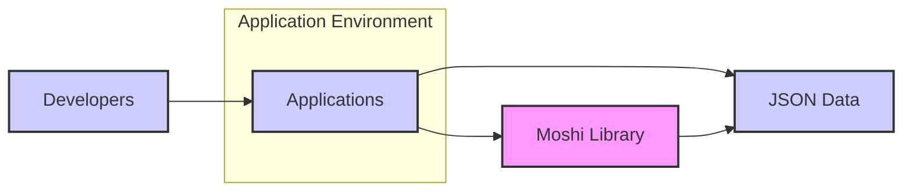
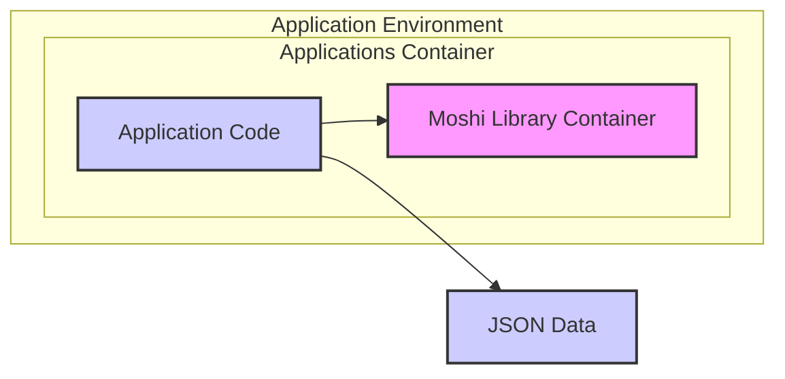
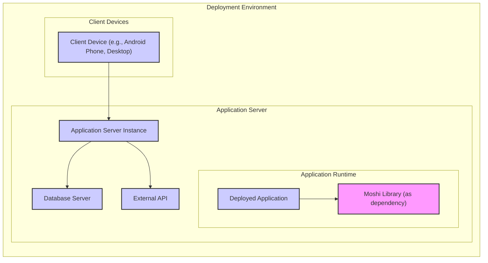
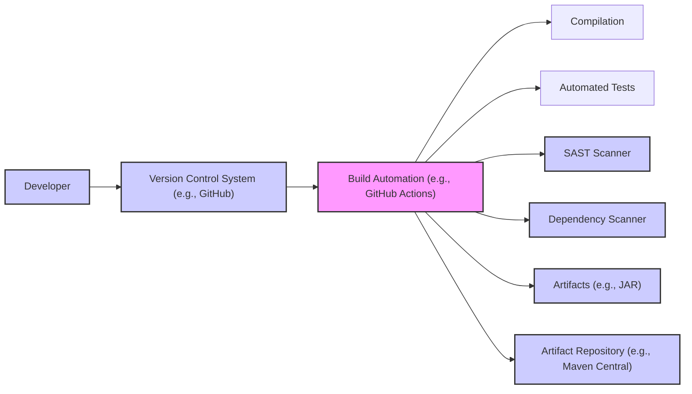

# BUSINESS POSTURE

This project provides a modern JSON library for Android and Java. It aims to make it easy to parse JSON into Java classes and generate JSON from Java classes. The primary business goal is to provide a reliable, efficient, and user-friendly library for JSON processing in Java and Android environments, catering to developers building applications that require JSON serialization and deserialization.

The most important business risks associated with this project are:

- Risk of vulnerabilities in the library that could be exploited by malicious actors, leading to data breaches, application crashes, or other security incidents in applications that depend on Moshi.
- Risk of performance issues or bugs that could negatively impact the performance and stability of applications using Moshi.
- Risk of compatibility issues with different Java and Android versions or other libraries, leading to integration challenges for developers.
- Risk of lack of adoption or community support, which could lead to the library becoming outdated or unmaintained.

# SECURITY POSTURE

Existing security controls for this project:

- security control: Code is hosted on GitHub, providing transparency and enabling community review.
- security control: Open source licensing encourages community contributions and scrutiny.
- security control: Build process likely includes standard Java compilation and testing. (Assumption based on typical Java library projects)

Accepted risks for this project:

- accepted risk: Reliance on community contributions for identifying and addressing security vulnerabilities.
- accepted risk: Potential for vulnerabilities to be present in dependencies used by Moshi.
- accepted risk: Open source nature means vulnerability information is publicly available once disclosed.

Recommended security controls to implement:

- recommended security control: Implement automated Static Application Security Testing (SAST) in the build pipeline to identify potential code-level vulnerabilities.
- recommended security control: Implement automated Dependency Scanning to identify known vulnerabilities in third-party libraries used by Moshi.
- recommended security control: Establish a clear vulnerability disclosure and response process to handle security issues reported by the community or identified through internal testing.
- recommended security control: Conduct regular security code reviews, especially for critical components and new features.
- recommended security control: Consider fuzz testing to identify unexpected behavior and potential vulnerabilities in JSON parsing logic.

Security requirements for this project:

- Authentication: Not directly applicable as Moshi is a library and does not handle user authentication. Applications using Moshi will be responsible for their own authentication mechanisms.
- Authorization: Not directly applicable as Moshi is a library and does not handle user authorization. Applications using Moshi will be responsible for their own authorization mechanisms.
- Input Validation: Critical. Moshi must robustly validate and sanitize JSON input to prevent injection attacks (e.g., JSON injection) and denial-of-service attacks caused by malformed or excessively large JSON payloads. Input validation should be implemented during JSON parsing to ensure data conforms to expected formats and constraints.
- Cryptography: Not directly applicable to the core functionality of Moshi as a JSON processing library. However, if Moshi is used in contexts where sensitive data is handled, applications using Moshi will be responsible for implementing appropriate encryption and decryption mechanisms before or after JSON processing. Moshi should not introduce any cryptographic vulnerabilities or weaknesses.

# DESIGN

## C4 CONTEXT

Context Diagram Elements:

- Element:
  - Name: Developers
  - Type: Person
  - Description: Software developers who use Moshi library to build applications.
  - Responsibilities: Integrate Moshi into their applications for JSON processing. Configure and use Moshi API correctly.
  - Security controls: Secure development practices, input validation in applications using Moshi.

- Element:
  - Name: Applications
  - Type: Software System
  - Description: Java and Android applications that utilize Moshi library for JSON serialization and deserialization.
  - Responsibilities: Process JSON data, interact with external systems or data sources that use JSON format, manage application security.
  - Security controls: Input validation, authorization, authentication, data encryption, secure communication protocols.

- Element:
  - Name: Moshi Library
  - Type: Software System
  - Description: The Moshi JSON processing library itself.
  - Responsibilities: Provide API for efficient and reliable JSON parsing and generation. Ensure robustness and security of JSON processing logic.
  - Security controls: Input validation within JSON parsing logic, secure coding practices, automated security testing, dependency management.

- Element:
  - Name: JSON Data
  - Type: External System/Data
  - Description: JSON formatted data that applications need to process. This data can come from various sources like APIs, files, databases, or user input.
  - Responsibilities: Provide data in JSON format. Data source security is dependent on the source itself.
  - Security controls: Data validation at the source, secure data transmission protocols (HTTPS), access control to data sources.

## C4 CONTAINER

Container Diagram Elements:

- Element:
  - Name: Moshi Library Container
  - Type: Container
  - Description: Represents the Moshi library as a deployable unit (e.g., JAR file). It contains the core JSON processing logic.
  - Responsibilities: JSON parsing and generation, providing API for applications to use.
  - Security controls: Input validation within the library, secure coding practices, automated security testing during library development.

- Element:
  - Name: Application Code
  - Type: Container
  - Description: Represents the application code that integrates and uses the Moshi library.
  - Responsibilities: Application specific logic, calling Moshi API for JSON processing, handling application security concerns.
  - Security controls: Application level input validation, authorization, authentication, secure data handling, using Moshi API securely.

- Element:
  - Name: JSON Data
  - Type: External System/Data
  - Description:  JSON formatted data that is processed by the application using Moshi.
  - Responsibilities: Providing JSON data to the application.
  - Security controls: Data validation at the source, secure transmission to the application.

## DEPLOYMENT

Deployment Diagram: Moshi library itself is not deployed as a standalone service. It is deployed as a dependency within applications. Therefore, the deployment context is the deployment environment of the applications that use Moshi.  A typical deployment scenario for applications using Moshi would be:

Deployment Diagram Elements:

- Element:
  - Name: Application Server Instance
  - Type: Infrastructure
  - Description: Represents an instance of an application server (e.g., Tomcat, Jetty, Kestrel, or Android Runtime) where the application is deployed.
  - Responsibilities: Hosting and running the application, providing runtime environment.
  - Security controls: Server hardening, access control, network security, monitoring, OS security patches.

- Element:
  - Name: Deployed Application
  - Type: Software
  - Description: The application code packaged and deployed to the application server. Includes application logic and uses Moshi library.
  - Responsibilities: Application specific functionality, JSON processing using Moshi, handling user requests, interacting with other systems.
  - Security controls: Application level security controls (authentication, authorization, input validation), secure coding practices, using Moshi API securely.

- Element:
  - Name: Moshi Library (as dependency)
  - Type: Software
  - Description: Moshi library included as a dependency within the deployed application.
  - Responsibilities: Providing JSON processing capabilities to the application at runtime.
  - Security controls: Security controls are primarily implemented during the development and build phase of the Moshi library itself.

- Element:
  - Name: Database Server
  - Type: Infrastructure
  - Description: Database server used by the application to store and retrieve data. (Optional, depending on application).
  - Responsibilities: Data persistence, data management.
  - Security controls: Database access control, encryption at rest and in transit, database hardening, regular backups.

- Element:
  - Name: External API
  - Type: Infrastructure
  - Description: External APIs that the application interacts with, potentially exchanging JSON data. (Optional, depending on application).
  - Responsibilities: Providing external services and data.
  - Security controls: API authentication and authorization, secure communication protocols (HTTPS), API rate limiting, input validation at API endpoints.

- Element:
  - Name: Client Device (e.g., Android Phone, Desktop)
  - Type: Infrastructure
  - Description: Devices used by end-users to access the application.
  - Responsibilities: User interface, user interaction with the application.
  - Security controls: Device security, secure communication with the application server.

## BUILD

Build Process Description:

1. Developer: Developers write code for Moshi library and commit changes to a Version Control System (VCS) like GitHub.
2. Version Control System (VCS):  GitHub repository hosts the source code and manages code changes. Security controls: Access control to the repository, branch protection, code review processes.
3. Build Automation:  A Build Automation system (e.g., GitHub Actions, Jenkins) is triggered by code changes in the VCS. Security controls: Secure configuration of CI/CD pipelines, access control to build system, audit logging.
4. Compilation: The build system compiles the Java code. Security controls: Use of trusted and updated build tools (Java compiler).
5. Automated Tests: Automated unit and integration tests are executed to verify code functionality and catch regressions. Security controls: Well-designed and comprehensive test suite, secure test environment.
6. SAST Scanner: Static Application Security Testing (SAST) tools are integrated into the build pipeline to automatically scan the code for potential security vulnerabilities. Security controls: Regularly updated SAST tools, configured with relevant security rules.
7. Dependency Scanner: Dependency scanning tools are used to identify known vulnerabilities in third-party libraries used by Moshi. Security controls: Regularly updated dependency vulnerability database, automated alerts for identified vulnerabilities.
8. Artifacts:  Build artifacts, such as JAR files, are created. Security controls: Integrity checks for build artifacts, secure storage of artifacts during the build process.
9. Artifact Repository:  Artifacts are published to an Artifact Repository (e.g., Maven Central) for distribution and consumption by developers. Security controls: Secure artifact repository, access control, artifact signing to ensure integrity and authenticity.

# RISK ASSESSMENT

Critical business process we are trying to protect:

- Secure and reliable JSON data processing within applications that depend on Moshi.  This includes ensuring data integrity, confidentiality (if applicable based on application context), and availability of applications using Moshi.

Data we are trying to protect and their sensitivity:

- Moshi itself does not directly handle or store sensitive data. However, it processes JSON data which can contain sensitive information depending on the application context. The sensitivity of data processed by Moshi is entirely dependent on the applications that use it.  For example, applications might use Moshi to process JSON data containing personal identifiable information (PII), financial data, or health records. In such cases, vulnerabilities in Moshi could indirectly lead to exposure or compromise of this sensitive data.

# QUESTIONS & ASSUMPTIONS

Questions:

- What are the specific use cases and environments where Moshi is primarily used? (e.g., mobile apps, backend services, specific industries). Understanding the typical use cases can help tailor security recommendations.
- What is the current vulnerability disclosure and response process for Moshi?
- Are there any existing security testing practices beyond basic unit tests?
- What are the dependencies of Moshi, and are they regularly monitored for vulnerabilities?
- What are the performance requirements and constraints for Moshi? (Performance considerations can sometimes influence security design choices).

Assumptions:

- Assumption: Moshi is intended to be used in a wide range of Java and Android applications with varying security requirements.
- Assumption: The development team follows general secure coding practices.
- Assumption: The build process includes basic compilation and testing, but security specific checks might need to be enhanced.
- Assumption: Moshi is distributed as a library dependency and not deployed as a standalone service.
- Assumption: Applications using Moshi are responsible for implementing their own application-level security controls (authentication, authorization, etc.).