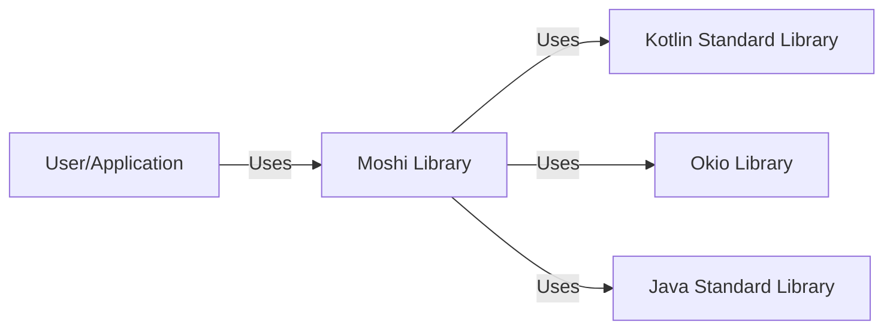
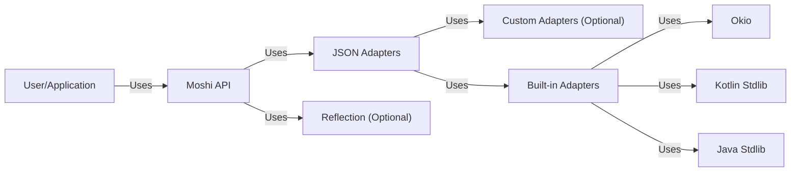
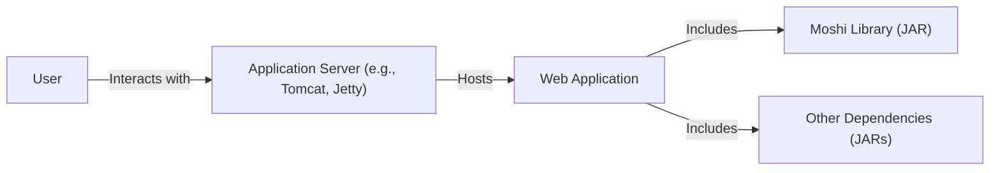
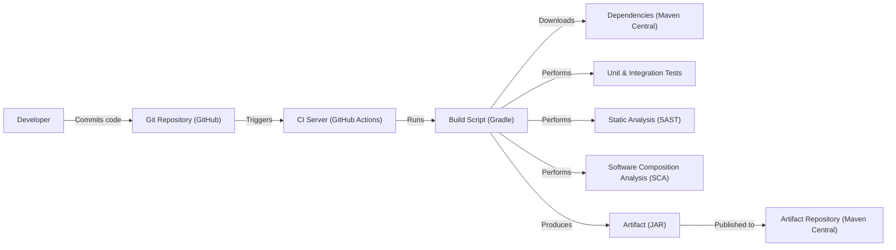

# BUSINESS POSTURE

Business Priorities and Goals:

* Provide a modern, efficient, and customizable JSON library for Java and Kotlin.
* Offer a simpler, more robust alternative to existing JSON libraries like Gson.
* Improve developer productivity by reducing boilerplate code related to JSON serialization and deserialization.
* Enhance performance and reduce memory footprint compared to other JSON libraries.
* Support advanced features like polymorphism, custom adapters, and streaming.
* Maintain strong compatibility with Kotlin's features, including null safety and data classes.
* Ensure the library is easy to use, well-documented, and actively maintained.

Business Risks:

* Incompatibility with existing projects or libraries that rely on different JSON processing mechanisms.
* Performance bottlenecks or excessive memory usage when handling large or complex JSON data.
* Security vulnerabilities arising from improper handling of untrusted JSON input.
* Difficulty in adapting the library to evolving JSON standards or specific application requirements.
* Lack of community adoption or contribution, leading to stagnation or obsolescence.
* Bugs or unexpected behavior that could lead to data corruption or application instability.

# SECURITY POSTURE

Existing Security Controls:

* security control: The project uses GitHub, which provides a secure platform for code hosting, version control, and collaboration.
* security control: The project is open-source, allowing for community review and scrutiny of the codebase.
* security control: Moshi focuses on secure defaults, such as strict parsing, to mitigate common JSON vulnerabilities.
* security control: The library is designed to handle various edge cases and malformed JSON input gracefully. (implied, needs verification)
* security control: The project likely has unit and integration tests to ensure the correctness and security of the code. (implied, needs verification)

Accepted Risks:

* accepted risk: The library relies on external dependencies, which could introduce vulnerabilities if not properly managed.
* accepted risk: Users may misuse the library or introduce vulnerabilities in their own code that interacts with Moshi.
* accepted risk: The library may not be fully compliant with all relevant security standards or regulations. (needs verification)

Recommended Security Controls:

* security control: Implement regular dependency updates and vulnerability scanning to mitigate supply chain risks.
* security control: Provide clear security documentation and guidelines for users on how to use the library securely.
* security control: Conduct regular security audits and penetration testing to identify and address potential vulnerabilities.
* security control: Implement a security policy and vulnerability disclosure program.
* security control: Consider using static analysis tools (SAST) to identify potential security issues during development.
* security control: Consider using dynamic analysis tools (DAST) to test the library's runtime behavior and identify vulnerabilities.

Security Requirements:

* Authentication: Not directly applicable to a JSON library.
* Authorization: Not directly applicable to a JSON library.
* Input Validation:
    * The library should strictly validate JSON input against the expected schema.
    * The library should handle malformed or unexpected JSON input gracefully, without crashing or exposing sensitive information.
    * The library should provide mechanisms for users to customize validation rules and error handling.
* Cryptography:
    * Not directly applicable to a JSON library, unless it's used for handling encrypted data. If so, it should use well-established cryptographic libraries and algorithms.
* Data Protection:
    * The library should not store or transmit sensitive data unnecessarily.
    * If the library handles sensitive data, it should be protected in accordance with relevant security standards and regulations.

# DESIGN

## C4 CONTEXT

Element Descriptions:

* User/Application:
    * Name: User/Application
    * Type: External Entity
    * Description: Represents the application or user that utilizes the Moshi library for JSON serialization and deserialization.
    * Responsibilities: Provides data to be serialized to JSON, consumes data deserialized from JSON, configures Moshi instances and adapters.
    * Security controls: Input validation of data before serialization, secure handling of deserialized data.
* Moshi Library:
    * Name: Moshi Library
    * Type: System
    * Description: The core Moshi library, providing JSON processing capabilities.
    * Responsibilities: Serializing Java/Kotlin objects to JSON, deserializing JSON to Java/Kotlin objects, providing adapter mechanisms for custom data types, handling JSON parsing and formatting.
    * Security controls: Strict JSON parsing, input validation, secure defaults.
* Kotlin Standard Library:
    * Name: Kotlin Standard Library
    * Type: External Dependency
    * Description: The standard library for the Kotlin programming language.
    * Responsibilities: Provides core functionalities for Kotlin, including collections, coroutines, and other utilities.
    * Security controls: Relies on the security of the Kotlin runtime and standard library implementation.
* Okio Library:
    * Name: Okio Library
    * Type: External Dependency
    * Description: A library that complements `java.io` and `java.nio` to make it easier to access, store, and process data.
    * Responsibilities: Provides efficient I/O operations, including buffered streams and byte manipulation.
    * Security controls: Relies on the security of the Okio library implementation.
* Java Standard Library:
    * Name: Java Standard Library
    * Type: External Dependency
    * Description: The standard library for the Java programming language.
    * Responsibilities: Provides core functionalities for Java, including I/O, collections, and other utilities.
    * Security controls: Relies on the security of the Java runtime and standard library implementation.

## C4 CONTAINER

Element Descriptions:

* User/Application:
    * Name: User/Application
    * Type: External Entity
    * Description: Represents the application or user that utilizes the Moshi library.
    * Responsibilities: Provides data, consumes data, configures Moshi.
    * Security controls: Input validation, secure handling of data.
* Moshi API:
    * Name: Moshi API
    * Type: Container
    * Description: The public API of the Moshi library, providing access to its functionalities.
    * Responsibilities: Exposes methods for creating Moshi instances, configuring adapters, and performing serialization/deserialization.
    * Security controls: API design should follow secure coding principles.
* JSON Adapters:
    * Name: JSON Adapters
    * Type: Container
    * Description: The core component for converting between Java/Kotlin objects and JSON.
    * Responsibilities: Handles the logic for serializing and deserializing different data types.
    * Security controls: Input validation, type checking, secure handling of data.
* Reflection (Optional):
    * Name: Reflection (Optional)
    * Type: Container
    * Description: Used for reflection-based serialization and deserialization.
    * Responsibilities: Dynamically accesses class information and fields.
    * Security controls: Should be used carefully to avoid security vulnerabilities related to reflection.
* Custom Adapters (Optional):
    * Name: Custom Adapters (Optional)
    * Type: Container
    * Description: User-defined adapters for handling custom data types.
    * Responsibilities: Implements the logic for serializing and deserializing specific data types.
    * Security controls: Relies on the security of the user-provided implementation.
* Built-in Adapters:
    * Name: Built-in Adapters
    * Type: Container
    * Description: Provides adapters for common data types like primitives, collections, and dates.
    * Responsibilities: Handles the serialization and deserialization of built-in types.
    * Security controls: Implemented with secure coding practices.
* Okio:
    * Name: Okio
    * Type: External Dependency
    * Description: Library for efficient I/O operations.
    * Responsibilities: Provides buffered streams and byte manipulation.
    * Security controls: Relies on the security of the Okio library.
* Kotlin Stdlib:
    * Name: Kotlin Stdlib
    * Type: External Dependency
    * Description: Kotlin Standard Library.
    * Responsibilities: Core Kotlin functionalities.
    * Security controls: Relies on Kotlin runtime security.
* Java Stdlib:
    * Name: Java Stdlib
    * Type: External Dependency
    * Description: Java Standard Library.
    * Responsibilities: Core Java functionalities.
    * Security controls: Relies on Java runtime security.

## DEPLOYMENT

Possible Deployment Solutions:

1.  **Embedded Library:** Moshi is typically used as a library embedded within another application. The application is then deployed according to its specific requirements (e.g., as a web application, a desktop application, a mobile app, etc.).
2.  **Standalone Service (Less Common):** While less common, Moshi could theoretically be used as part of a standalone service that provides JSON processing capabilities. This service could be deployed as a containerized application (e.g., using Docker) or as a serverless function.

Chosen Deployment Solution (Embedded Library):

Element Descriptions:

* Application Server:
    * Name: Application Server (e.g., Tomcat, Jetty)
    * Type: Infrastructure Node
    * Description: The server environment that hosts the web application.
    * Responsibilities: Provides the runtime environment for the application, handles HTTP requests and responses.
    * Security controls: Server hardening, firewall configuration, regular security updates.
* Web Application:
    * Name: Web Application
    * Type: Software System
    * Description: The application that utilizes the Moshi library.
    * Responsibilities: Provides the application's core functionality.
    * Security controls: Application-level security controls, input validation, output encoding, authentication, authorization.
* Moshi Library (JAR):
    * Name: Moshi Library (JAR)
    * Type: Library
    * Description: The Moshi library packaged as a JAR file.
    * Responsibilities: Provides JSON serialization and deserialization.
    * Security controls: Secure coding practices within the library, dependency management.
* Other Dependencies (JARs):
    * Name: Other Dependencies (JARs)
    * Type: Library
    * Description: Other libraries required by the web application.
    * Responsibilities: Provides various functionalities to the application.
    * Security controls: Dependency management, vulnerability scanning.
* User:
    * Name: User
    * Type: External Entity
    * Description: The user interacting with the web application.
    * Responsibilities: Sends requests to the application, receives responses.
    * Security controls: Browser security settings, secure communication protocols (HTTPS).

## BUILD

Build Process Description:

1.  **Code Commit:** A developer commits code changes to the Git repository hosted on GitHub.
2.  **CI Trigger:** The commit triggers a build on the CI server (GitHub Actions).
3.  **Build Script Execution:** The CI server executes the build script (Gradle).
4.  **Dependency Download:** The build script downloads dependencies from Maven Central.
5.  **Testing:** The build script runs unit and integration tests.
6.  **Static Analysis (SAST):** A SAST tool (e.g., SpotBugs, PMD) analyzes the code for potential security vulnerabilities.
7.  **Software Composition Analysis (SCA):** An SCA tool (e.g., OWASP Dependency-Check) analyzes the project's dependencies for known vulnerabilities.
8.  **Artifact Creation:** The build script produces the Moshi library artifact (JAR file).
9.  **Artifact Publication:** The artifact is published to an artifact repository (Maven Central).

Security Controls:

* security control: Use of a secure code repository (GitHub).
* security control: Automated build process using a CI server (GitHub Actions).
* security control: Dependency management using Gradle and Maven Central.
* security control: Unit and integration testing to ensure code quality and security.
* security control: Static analysis (SAST) to identify potential code vulnerabilities.
* security control: Software Composition Analysis (SCA) to identify vulnerabilities in dependencies.
* security control: Secure artifact repository (Maven Central).

# RISK ASSESSMENT

Critical Business Processes:

* JSON serialization and deserialization for data exchange between applications and services.
* Data binding for mapping JSON data to Java/Kotlin objects.
* Configuration and customization of JSON processing.

Data to Protect:

* **Any data serialized or deserialized using Moshi.** The sensitivity of this data depends entirely on the application using Moshi. Moshi itself doesn't inherently handle sensitive data, but it *processes* data that *could* be sensitive.
* **Configuration data for Moshi (if any).** This is generally not sensitive.

Data Sensitivity:

* **Variable:** The sensitivity of the data processed by Moshi is entirely dependent on the context of the application using it. It could range from non-sensitive public data to highly sensitive PII, financial data, or healthcare information.

# QUESTIONS & ASSUMPTIONS

Questions:

* What specific types of data will be processed by Moshi in the applications where it is used?
* Are there any specific security standards or regulations that the applications using Moshi must comply with (e.g., GDPR, HIPAA, PCI DSS)?
* What is the threat model for the applications using Moshi? What are the potential attackers and their motivations?
* Are there any existing security reviews or audits of the Moshi library?
* What is the process for reporting and addressing security vulnerabilities in Moshi?
* Are there any performance requirements or limitations for Moshi?
* What level of logging and monitoring is required for Moshi's operations?

Assumptions:

* BUSINESS POSTURE: The primary goal is to provide a reliable and efficient JSON library. Security is a high priority, but performance and ease of use are also important considerations.
* SECURITY POSTURE: The development team follows secure coding practices. The library is regularly updated to address security vulnerabilities. Users are responsible for securely handling the data they process with Moshi.
* DESIGN: Moshi is primarily used as an embedded library within other applications. The build process includes security checks like SAST and SCA. The deployment environment is secure and follows best practices.