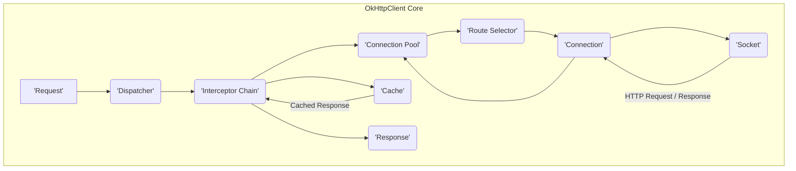
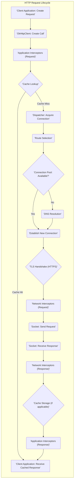

## Project Design Document: OkHttp Library (Improved)

**1. Introduction**

This document provides a detailed design overview of the OkHttp library, a widely used open-source HTTP client for Android and Java applications. It aims to capture the key architectural elements, core components, and the flow of data within the library during HTTP communication. This document is intended to serve as a robust foundation for subsequent threat modeling activities.

**2. Goals**

The primary goals of this design document are to:

*   Provide a clear and comprehensive understanding of OkHttp's architecture and its core functionalities related to HTTP communication.
*   Identify and describe the key software components within OkHttp and their interactions with each other.
*   Illustrate the detailed flow of data during the lifecycle of HTTP requests and responses processed by OkHttp.
*   Thoroughly highlight security-relevant aspects of the library's design and operation.
*   Serve as a well-defined basis for identifying potential security threats, vulnerabilities, and attack vectors.

**3. Scope**

This document focuses on the core mechanisms and functionalities of the OkHttp library involved in initiating, processing, and managing HTTP requests and responses. This includes:

*   Construction and execution of HTTP requests.
*   Management of underlying network connections, including connection pooling and reuse.
*   Resolution of domain names to IP addresses (DNS resolution).
*   Establishment and management of secure connections using TLS/SSL.
*   The role and operation of interceptors (both application and network level).
*   Mechanisms for caching HTTP responses to improve performance and reduce network load.
*   Support for WebSocket communication protocols.
*   Negotiation and handling of different HTTP protocols (e.g., HTTP/1.1, HTTP/2, HTTP/3).

This document explicitly excludes:

*   Specific implementation details of individual classes, methods, or internal algorithms within OkHttp.
*   Detailed analysis of third-party libraries or integrations that utilize OkHttp.
*   Specific usage patterns or configurations within individual client applications embedding OkHttp.

**4. Architectural Overview**

OkHttp is designed with a layered architecture to manage the complexities of HTTP communication. The central component is the `OkHttpClient`, which acts as the configuration hub and the entry point for executing requests. A `Request` is built using the `Request.Builder` and then executed either synchronously or asynchronously via the `OkHttpClient`. Interceptors form a crucial pipeline for observing and modifying requests and responses at different stages. The `ConnectionPool` efficiently manages connections, and TLS/SSL handles secure communication.

**5. Key Components**

*   **`OkHttpClient`**: This is the primary class for configuring and executing HTTP requests. It manages global settings such as connection timeouts, the list of interceptors, the connection pool, and the cache. It acts as the factory for creating `Call` instances.
*   **`Request`**: An immutable object representing an HTTP request. It encapsulates the target URL, the HTTP method (GET, POST, etc.), request headers, and the request body (if any). It's typically built using a `Request.Builder`.
*   **`Response`**: An immutable object representing the server's HTTP response. It includes the HTTP status code, response headers, and the response body.
*   **`Call`**: Represents a single, specific request/response interaction. It can be executed synchronously (blocking the current thread) or asynchronously (using a callback). Each `Call` can only be executed once.
*   **`Dispatcher`**: Responsible for managing the execution of `Call` instances. It limits the number of concurrent requests to the same host and the total number of concurrent requests, preventing resource exhaustion.
*   **`Interceptor`**: An interface that allows for intercepting and modifying HTTP requests before they are sent and responses after they are received. Interceptors form a chain and are executed in a defined order.
    *   **Application Interceptors**: These interceptors are added by the application developer and operate before OkHttp handles internal concerns like redirects and retries. They see the original, unmodified request and the final, potentially modified response.
    *   **Network Interceptors**: These interceptors are part of OkHttp's internal processing and operate closer to the network. They observe intermediate requests and responses, including those resulting from redirects and retries.
*   **`Interceptor Chain`**: An ordered list of interceptors (both application and network) that are executed sequentially for each request/response.
*   **`ConnectionPool`**: Manages a pool of reusable TCP connections to remote servers. This reduces the overhead of establishing new connections for subsequent requests to the same host, improving performance.
*   **`RouteSelector`**: Determines the possible routes to connect to a target server, considering factors like IP addresses (for multi-homed hosts), proxy configurations, and whether to use TLS.
*   **`Connection`**: Represents an established connection to a server, typically a TCP socket. For HTTPS, this includes the established TLS session.
*   **`Socket`**: The underlying network socket used for communication with the server.
*   **`Cache`**: Stores HTTP responses on disk or in memory to avoid redundant network requests. It respects HTTP caching directives (e.g., `Cache-Control`).
*   **`Authenticator`**: An interface for handling authentication challenges from the server (e.g., HTTP Basic or Digest authentication). Implementations provide credentials when the server requires authentication.
*   **`CookieJar`**: An interface responsible for managing HTTP cookies. Implementations can store cookies in memory or persistently.
*   **`HostnameVerifier`**: An interface used during TLS/SSL handshakes to verify that the hostname in the server's certificate matches the hostname of the requested server.
*   **`SSLSocketFactory`**: A factory for creating SSL sockets, used for establishing secure HTTPS connections. It encapsulates the TLS/SSL implementation.
*   **`TrustManager`**: Decides which certificate authorities (CAs) are trusted. It's used during TLS/SSL handshakes to validate the server's certificate chain. Custom `TrustManager` implementations can be used for certificate pinning.
*   **`Protocol`**: Represents the negotiated HTTP protocol version used for the connection (e.g., `HTTP_1_1`, `HTTP_2`, `HTTP_3`).
*   **`EventListener`**: An interface that allows applications to observe various events during the lifecycle of a request, such as DNS lookups, connection establishment, and request/response headers.
*   **`WebSocket`**: Provides support for establishing and managing WebSocket connections, enabling bidirectional, full-duplex communication over a single TCP connection.

**6. Data Flow**

The typical flow of data for an HTTP request initiated using OkHttp follows these steps:

1. **Request Construction**: The client application creates a `Request` object using the `Request.Builder`, specifying the URL, HTTP method, headers, and optional request body.
2. **Call Creation**: The `OkHttpClient` receives the `Request` and creates a `Call` object representing this specific request/response exchange.
3. **Application Interception**: The `Interceptor Chain` begins processing with the application interceptors. Each interceptor in the chain has the opportunity to inspect and modify the `Request` before it proceeds further.
4. **Cache Lookup**: OkHttp checks its configured `Cache` to see if a valid, unexpired cached response exists for the given `Request`. If a suitable cached response is found, it's returned, bypassing network activity (subject to cache directives).
5. **Connection Acquisition**: If the response is not cached or the cache entry is invalid, the `Dispatcher` attempts to execute the call. The `RouteSelector` determines the possible routes to the target server. The `ConnectionPool` is checked for an existing, reusable `Connection` to one of these routes.
6. **DNS Resolution**: If no suitable existing connection is found, and a new connection is needed, DNS resolution is performed to resolve the server's hostname to one or more IP addresses.
7. **Connection Establishment**: A new TCP connection is established with the server based on the selected route.
8. **TLS Handshake (for HTTPS)**: If the request is for an HTTPS URL, a TLS handshake is performed to establish a secure, encrypted connection. This involves certificate exchange and verification using the configured `SSLSocketFactory`, `TrustManager`, and `HostnameVerifier`.
9. **Network Interception**: Network interceptors in the `Interceptor Chain` are executed. These interceptors can observe and modify the request just before it's sent over the network.
10. **Request Transmission**: The HTTP request (headers and body) is transmitted to the server over the established `Socket`.
11. **Response Reception**: The server sends back an HTTP response, including the status code, headers, and response body.
12. **Network Interception (Response)**: The network interceptors are executed again, this time on the received `Response`, allowing for inspection and modification.
13. **Cache Storage**: If the response is cacheable according to HTTP caching directives, OkHttp stores it in the `Cache` for potential future use.
14. **Application Interception (Response)**: The application interceptors are executed on the received `Response`, allowing the application to process the final response.
15. **Response Delivery**: The `Response` object is delivered back to the client application through the `Call` (either directly for synchronous calls or via a callback for asynchronous calls).

**7. Security Considerations**

*   **TLS/SSL Configuration and Vulnerabilities**: OkHttp relies on the underlying Java platform's TLS/SSL implementation. Misconfiguration of `SSLSocketFactory`, `TrustManager`, or `HostnameVerifier` can introduce vulnerabilities like man-in-the-middle attacks. Outdated TLS versions or cipher suites can also be exploited.
*   **Certificate Pinning Implementation**: While OkHttp supports certificate pinning, incorrect implementation (e.g., pinning to development certificates in production) can lead to connectivity issues. Proper management and rotation of pinned certificates are crucial.
*   **Proxy Authentication Security**:  Vulnerabilities in the proxy authentication mechanism or insecure storage of proxy credentials can be exploited. Care must be taken to handle proxy authentication securely.
*   **Input Validation and Sanitization**: Although OkHttp primarily handles network communication, applications must validate and sanitize URLs and headers before passing them to OkHttp to prevent issues like header injection attacks.
*   **HTTP Protocol Downgrade Attacks**: While OkHttp negotiates the best available protocol, vulnerabilities in the negotiation process could potentially be exploited to force a downgrade to a less secure protocol (e.g., from HTTP/2 to HTTP/1.1).
*   **Cookie Security**: Improper handling of cookies by the application or vulnerabilities in OkHttp's `CookieJar` implementation could lead to session hijacking or other cookie-related attacks. Secure and HTTP-only flags should be used appropriately.
*   **WebSocket Security**: When using WebSockets, proper validation of the WebSocket handshake and careful handling of incoming WebSocket frames are essential to prevent injection attacks or other vulnerabilities.
*   **Cache Poisoning Risks**: If the HTTP cache is not managed correctly or if server-side caching directives are weak, malicious actors could potentially inject harmful responses into the cache, leading to cache poisoning attacks.
*   **Interceptor Security**:  Malicious or poorly written interceptors can introduce significant security risks. They have the ability to intercept and modify sensitive data in requests and responses, potentially logging credentials or injecting malicious content. Careful review and control over interceptor implementations are necessary.
*   **Denial of Service (DoS)**: While OkHttp has mechanisms to limit concurrent requests, improper configuration or malicious use could still lead to resource exhaustion and denial of service.
*   **Dependency Management**:  Keeping OkHttp and its transitive dependencies up-to-date is crucial to patch known security vulnerabilities.

**8. Deployment Considerations**

OkHttp is typically deployed as a library embedded within Android or Java applications. The security of OkHttp in a deployed environment is influenced by several factors:

*   **Application Security**: The security of the host application is paramount. Vulnerabilities in the application code that uses OkHttp can be exploited, even if OkHttp itself is secure.
*   **Device Security (for Android)**: On Android, the security of the underlying device and operating system affects OkHttp's security. For example, a compromised device might have untrusted root certificates installed.
*   **Network Environment**: The security of the network over which OkHttp communicates is also a factor. Communication over untrusted networks is more susceptible to attacks.
*   **Configuration**: Proper configuration of OkHttp's security-related settings (e.g., TLS settings, certificate pinning) is essential for maintaining a secure deployment. Developers must understand the implications of these settings.
*   **Permissions (for Android)**: On Android, the application needs the necessary network permissions to use OkHttp. Restricting these permissions can limit the potential impact of vulnerabilities.

**9. Future Considerations**

*   **Enhanced HTTP/3 and QUIC Support**: Continued development and refinement of HTTP/3 support, leveraging the security features inherent in the QUIC protocol.
*   **Improved Security Defaults**: Exploring more secure default configurations for TLS/SSL and other security-related settings to reduce the burden on developers.
*   **Standardized Interceptor Security Guidelines**: Providing clearer guidance and best practices for developing secure interceptors to prevent common pitfalls.
*   **Integration with Security Auditing Tools**:  Facilitating integration with static and dynamic analysis tools to help identify potential security vulnerabilities in OkHttp usage.
*   **Further Refinement of Certificate Pinning API**:  Potentially offering more flexible and robust mechanisms for certificate pinning.
*   **Exploration of Post-Quantum Cryptography**:  Monitoring and potentially incorporating post-quantum cryptographic algorithms as they become standardized and practical.

This improved design document provides a more detailed and comprehensive overview of the OkHttp library, focusing on aspects relevant to security. It serves as a valuable resource for understanding the library's architecture and identifying potential areas of security concern during the threat modeling process.