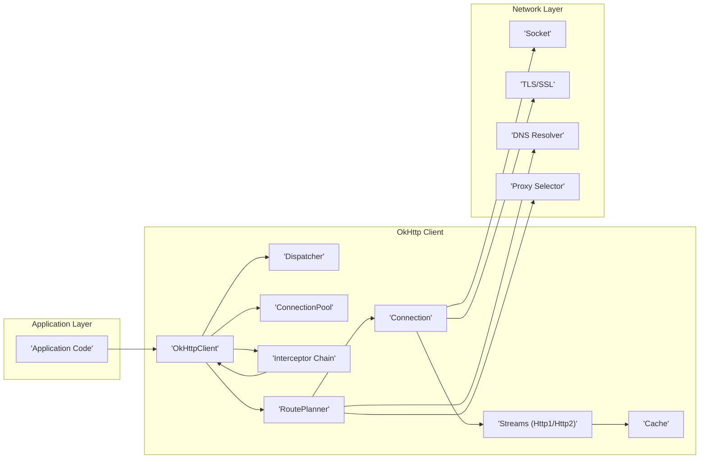
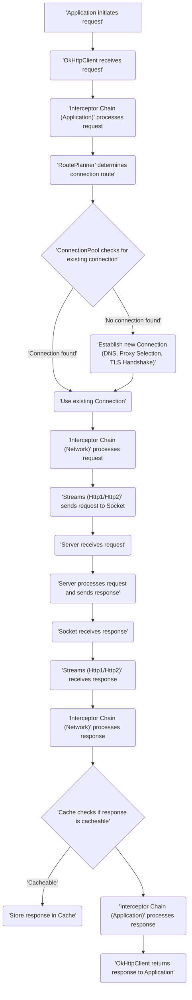

# Project Design Document: OkHttp Library

**Version:** 1.1
**Date:** October 26, 2023
**Author:** AI Software Architect

## 1. Introduction

This document provides an enhanced architectural design of the OkHttp library, an open-source HTTP client for Android and Java applications. This detailed design is specifically tailored to serve as a robust foundation for subsequent threat modeling activities. It meticulously outlines the key components, data flow, and interactions within the library, emphasizing aspects relevant to security.

## 2. Goals

* Provide a comprehensive and refined overview of the OkHttp library's architecture.
* Identify and elaborate on the responsibilities of key components, highlighting security-sensitive functionalities.
* Describe the typical data flow during HTTP requests and responses with a focus on potential security checkpoints.
* Deepen the discussion on security considerations, providing concrete examples for future threat modeling.

## 3. Architectural Overview

OkHttp's architecture is designed for modularity, efficiency, and extensibility in handling HTTP communication. It employs a layered approach where distinct components manage specific aspects of the request-response lifecycle. This structure allows for clear separation of concerns and facilitates the integration of custom logic through interceptors.

## 4. Component Details

This section provides a more detailed explanation of each key component within the OkHttp library, with a particular focus on their functionalities and potential security implications:

* **OkHttpClient:**
    * The primary interface for interacting with OkHttp. It acts as the central configuration point.
    * Manages the lifecycle of requests and responses, coordinating the activities of other components.
    * Configuration options include timeouts (connection, read, write), interceptors, connection pool settings, cache configuration, and TLS/SSL settings. **Security Note:** Incorrectly configured timeouts or permissive TLS settings can introduce vulnerabilities.

* **Dispatcher:**
    * Orchestrates the execution of HTTP requests, managing both synchronous and asynchronous operations.
    * Enforces concurrency limits, preventing resource exhaustion.
    * Maintains queues for ready and running calls. **Security Note:**  While primarily for resource management, unexpected behavior in the dispatcher could lead to denial-of-service if not handled correctly.

* **ConnectionPool:**
    * Manages a pool of reusable TCP connections to remote servers, significantly improving performance by reducing connection establishment overhead.
    * Implements connection keep-alive policies and idle timeout mechanisms. **Security Note:** Improperly managed connection pools could lead to connections being held open longer than necessary, potentially exposing them to attacks or exhausting resources. Reusing connections without proper state management could also lead to information leakage.

* **Interceptor Chain:**
    * A powerful mechanism for intercepting and modifying HTTP requests before they are sent and responses after they are received.
    * Consists of an ordered list of interceptors.
        * **Application Interceptors:** Operate on the application's intended request and the server's raw response.
        * **Network Interceptors:** Operate on the intermediate request as it's sent to the origin server and the response as received over the network.
    * **Security Note:** Interceptors are a critical point for security. Malicious or poorly written interceptors can introduce vulnerabilities such as:
        * **Logging sensitive data:** Accidentally logging authentication tokens or other sensitive information.
        * **Modifying requests in insecure ways:** Removing security headers or altering the request body to bypass security checks.
        * **Introducing vulnerabilities:**  Failing to properly handle exceptions or introducing new attack vectors.

* **RoutePlanner:**
    * Determines the sequence of steps required to establish a connection to the target server.
    * Considers factors like network availability, proxy configurations (obtained via `ProxySelector`), and IP address preferences.
    * Handles fallback mechanisms if a connection attempt fails. **Security Note:** Incorrect proxy configurations or vulnerabilities in the `ProxySelector` could lead to requests being routed through malicious proxies.

* **Connection:**
    * Represents an established, persistent connection to a remote server.
    * Manages the underlying `Socket` and the associated TLS session (if HTTPS).
    * Can handle both HTTP/1.1 and HTTP/2 protocols. **Security Note:** The security of the `Connection` relies heavily on the underlying `Socket` and `TLS/SSL` implementation. Vulnerabilities in these lower layers can directly impact the security of the connection.

* **Streams (Http1/Http2):**
    * Responsible for the actual transmission and reception of HTTP data over the established `Connection`.
    * Implements the specific details of the HTTP/1.1 or HTTP/2 protocol, including framing, header parsing, and body handling. **Security Note:** Vulnerabilities in HTTP protocol implementations, such as improper handling of large headers or chunked encoding issues, can be exploited. HTTP/2 specific vulnerabilities like rapid reset attacks also fall under this component.

* **Cache:**
    * Stores HTTP responses to reduce latency and network traffic for subsequent identical requests.
    * Respects HTTP caching directives (e.g., `Cache-Control` headers).
    * Can be configured for in-memory or disk-based storage. **Security Note:** Improperly configured or secured caches can lead to:
        * **Exposure of sensitive data:** Cached responses might contain sensitive information that could be accessed by unauthorized users.
        * **Cache poisoning:** Attackers might be able to inject malicious responses into the cache, which would then be served to legitimate users.

* **Socket:**
    * The fundamental building block for network communication, providing the raw TCP connection to the server.
    * Handles the low-level details of sending and receiving data. **Security Note:** While OkHttp doesn't directly manage socket security beyond what the underlying OS provides, vulnerabilities at the socket level can impact OkHttp's security.

* **TLS/SSL:**
    * Provides secure communication over the network by encrypting data and verifying the identity of the server.
    * Handles the TLS handshake process, certificate validation, and encryption/decryption of data.
    * Supports various TLS versions and cipher suites. **Security Note:** This is a critical security component. Vulnerabilities here can lead to man-in-the-middle attacks, eavesdropping, and data manipulation. Using outdated TLS versions or weak cipher suites significantly increases risk. Improper certificate validation is a major vulnerability.

* **DNS Resolver:**
    * Translates hostnames into IP addresses, enabling the establishment of network connections.
    * Can use the system's default DNS resolver or a custom implementation. **Security Note:**  Susceptible to DNS spoofing and poisoning attacks, which can redirect requests to malicious servers. Using secure DNS protocols (like DNS over HTTPS) can mitigate some of these risks.

* **Proxy Selector:**
    * Determines which proxy server (if any) should be used for a given request.
    * Allows for dynamic proxy selection based on the target URL or other criteria. **Security Note:**  A compromised or misconfigured proxy selector can route traffic through untrusted proxies, potentially exposing sensitive data or allowing for request manipulation.

## 5. Data Flow

The following diagram and description detail the typical flow of an HTTP request through the OkHttp library, highlighting key stages and potential security considerations at each step:

**Detailed Steps with Security Considerations:**

1. **Application initiates request:** The application creates an `okhttp3.Request` object. **Security Note:** The application itself is responsible for not including sensitive information in the URL or headers unnecessarily.
2. **OkHttpClient receives request:** The `OkHttpClient` receives the request and begins processing.
3. **Interceptor Chain (Application) processes request:** Application interceptors are executed. **Security Note:**  Interceptors at this stage can add authentication headers, modify request bodies, or perform other actions that have direct security implications.
4. **RoutePlanner determines connection route:** The `RoutePlanner` selects the route, potentially involving DNS resolution and proxy selection. **Security Note:** This stage is vulnerable to DNS spoofing and routing through malicious proxies.
5. **ConnectionPool checks for existing connection:** OkHttp attempts to reuse an existing connection. **Security Note:** Reused connections must be handled carefully to prevent information leakage between different requests or users.
6. **Establish new Connection (if needed):** If no suitable connection exists:
    * **DNS Resolution:** The `DNS Resolver` translates the hostname. **Security Note:** Vulnerable to DNS spoofing.
    * **Proxy Selection:** The `Proxy Selector` determines the proxy. **Security Note:** Risk of routing through malicious proxies.
    * **TLS Handshake (if HTTPS):** A secure connection is established. **Security Note:** Vulnerable to downgrade attacks, weak cipher suites, and certificate validation issues.
7. **Use existing Connection (if available):** A previously established connection is used.
8. **Interceptor Chain (Network) processes request:** Network interceptors observe the request being sent. **Security Note:** These interceptors can log network traffic, potentially exposing sensitive data if not done carefully.
9. **Streams (Http1/Http2) sends request to Socket:** The request is sent over the network.
10. **Server receives request:** The remote server processes the request.
11. **Server processes request and sends response:** The server generates the response.
12. **Socket receives response:** The response is received over the network.
13. **Streams (Http1/Http2) receives response:** The response data is processed according to the HTTP protocol. **Security Note:** Vulnerable to protocol-specific attacks.
14. **Interceptor Chain (Network) processes response:** Network interceptors observe the received response. **Security Note:** Can log response data, potentially exposing sensitive information.
15. **Cache checks if response is cacheable:** OkHttp checks if the response can be stored in the cache.
16. **Store response in Cache (if cacheable):** The response is stored in the cache. **Security Note:** Risk of exposing sensitive data in the cache and cache poisoning.
17. **Interceptor Chain (Application) processes response:** Application interceptors process the response. **Security Note:** Can modify the response before it reaches the application, potentially masking security issues or introducing new ones.
18. **OkHttpClient returns response to Application:** The response is returned to the application.

## 6. Security Considerations (For Threat Modeling)

This section expands on the security considerations, providing more specific examples of potential threats:

* **TLS/SSL Implementation:**
    * **Threats:** Man-in-the-middle attacks due to lack of certificate validation, downgrade attacks exploiting vulnerabilities in older TLS versions (e.g., SSLv3, TLS 1.0), use of weak or deprecated cipher suites making encryption breakable.
    * **Mitigation:** Enforce strong TLS versions (TLS 1.2 or higher), use strong cipher suites, implement proper certificate pinning, and regularly update the security provider.
* **DNS Resolution:**
    * **Threats:** DNS spoofing attacks redirecting requests to malicious servers, DNS poisoning corrupting DNS server records.
    * **Mitigation:** Consider using DNS over HTTPS (DoH) or DNS over TLS (DoT), validate DNS responses, and use reputable DNS resolvers.
* **Proxy Handling:**
    * **Threats:** Routing traffic through malicious proxies leading to eavesdropping or manipulation, vulnerabilities in proxy authentication mechanisms.
    * **Mitigation:**  Carefully configure proxy settings, avoid using untrusted proxies, and ensure secure communication with the proxy server.
* **Connection Pooling:**
    * **Threats:** Information leakage if connections are reused between different users or requests without proper state cleanup, connections held open unnecessarily increasing the attack surface.
    * **Mitigation:** Configure appropriate connection timeouts, ensure proper session management, and consider disabling connection reuse for sensitive operations.
* **Caching:**
    * **Threats:** Exposure of sensitive data stored in the cache, cache poisoning attacks serving malicious content.
    * **Mitigation:**  Carefully configure caching behavior using appropriate `Cache-Control` headers, avoid caching sensitive data, and implement mechanisms to prevent cache poisoning.
* **Interceptor Chain:**
    * **Threats:** Malicious interceptors logging sensitive data, modifying requests or responses in insecure ways, introducing new vulnerabilities.
    * **Mitigation:**  Thoroughly vet and control the use of custom interceptors, ensure proper error handling within interceptors, and carefully consider the order of interceptors.
* **HTTP Protocol Handling (HTTP/1.1 and HTTP/2):**
    * **Threats:** Exploiting vulnerabilities specific to each protocol (e.g., HTTP/2 rapid reset attack, HTTP/1.1 header smuggling), denial-of-service attacks by sending malformed or oversized headers/bodies.
    * **Mitigation:** Keep OkHttp updated to benefit from security patches, implement input validation and sanitization, and configure appropriate limits for header and body sizes.
* **WebSocket Security (if used):**
    * **Threats:** Cross-site WebSocket hijacking, vulnerabilities in the WebSocket handshake or frame processing.
    * **Mitigation:** Implement proper origin validation, use secure WebSocket protocols (WSS), and sanitize input and output data.
* **Error Handling and Logging:**
    * **Threats:** Exposing sensitive information in error messages or logs, providing attackers with valuable information for reconnaissance.
    * **Mitigation:** Implement secure logging practices, avoid logging sensitive data, and provide generic error messages to users.
* **Dependency Management:**
    * **Threats:** Security vulnerabilities in underlying dependencies (like Okio).
    * **Mitigation:** Regularly update dependencies to their latest secure versions and monitor for known vulnerabilities.

## 7. Dependencies

OkHttp relies on the following key dependencies:

* **Kotlin Standard Library:** Provides core language features and utilities for Kotlin-based development.
* **Okio:** An efficient library for accessing, processing, and moving data, complementing `java.io` and `java.nio`. **Security Note:** Security vulnerabilities in Okio could directly impact OkHttp.

## 8. Deployment Considerations

OkHttp is typically integrated as a library within Android and Java applications. Its security posture is intrinsically linked to the security of the host application and the environment in which it operates. Developers utilizing OkHttp must be diligent in configuring it securely and understanding the security implications of its various features and configurations.

This enhanced design document provides a more detailed and security-focused understanding of the OkHttp library's architecture, serving as a more robust foundation for subsequent threat modeling efforts.
