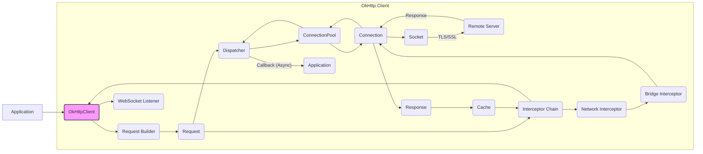
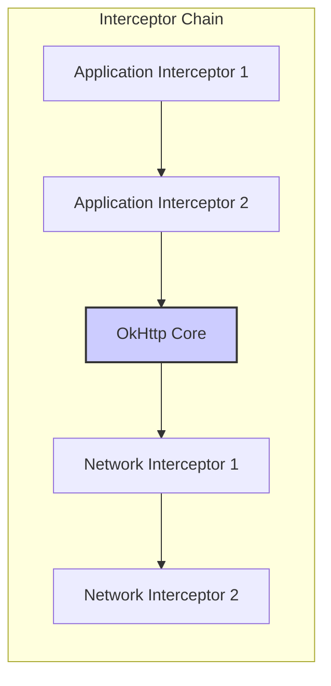

# Project Design Document: OkHttp Library

**Version:** 1.1
**Date:** October 26, 2023
**Author:** AI Software Architect

## 1. Introduction

This document provides an enhanced architectural design of the OkHttp library, a widely used and robust open-source HTTP client for Android and Java applications. Given its critical role in network communication for numerous applications, a thorough understanding of its architecture is paramount for effective security analysis. This document is specifically tailored to facilitate subsequent threat modeling activities, offering a comprehensive view of the library's components, data flow, and key functionalities with a security-focused lens.

## 2. Goals and Scope

The primary goal of this document remains to clearly articulate the design of OkHttp to facilitate effective threat modeling. This includes:

*   Providing a more detailed breakdown of key components and their interactions.
*   Illustrating the flow of data during HTTP requests and responses with greater precision.
*   Explicitly highlighting critical security-relevant aspects of the architecture and potential vulnerabilities.
*   Serving as a robust foundation for identifying potential attack vectors and informing mitigation strategies.

The scope of this document encompasses the core functionalities of the OkHttp library related to initiating, processing, and managing HTTP requests and responses. This includes, but is not limited to, connection management, protocol negotiation, interceptor mechanisms, caching strategies, and WebSocket communication.

## 3. Architectural Overview

OkHttp's architecture is designed for modularity, performance, and extensibility. It abstracts the complexities of network communication, allowing developers to focus on application-level logic while providing fine-grained control through its various components. The core architectural elements and their relationships are depicted below:

*   **Application:** The application code that utilizes the OkHttp library.
*   **OkHttpClient:** The primary interface for creating and configuring HTTP requests.
*   **Request:** An immutable representation of an outgoing HTTP request.
*   **Response:** An immutable representation of an incoming HTTP response.
*   **Call:** Represents a single, logical request-response exchange.
*   **Dispatcher:** Manages the execution of both synchronous and asynchronous `Call` instances.
*   **ConnectionPool:** Maintains a pool of reusable TCP connections for efficiency.
*   **Interceptor:** A powerful chain of responsibility mechanism for modifying requests and responses.
*   **Cache:** Provides a persistent store for HTTP responses to reduce latency and network load.
*   **Protocol Negotiation:** Handles the selection of the optimal HTTP protocol (e.g., HTTP/1.1, HTTP/2, HTTP/3).
*   **TLS/SSL:** Manages secure communication channels using Transport Layer Security.
*   **WebSockets:** Enables bidirectional, full-duplex communication over a single TCP connection.

## 4. Detailed Design

### 4.1. OkHttpClient

*   The central point of interaction with the library.
*   Configurable with various settings impacting security and performance:
    *   Connection timeouts
    *   Read/write timeouts
    *   Proxy configuration
    *   SSLSocketFactory and TrustManager for TLS/SSL customization
    *   HostnameVerifier for custom hostname verification
    *   Authenticator for handling authentication challenges
    *   CookieJar for managing cookies
    *   Interceptors (application and network)
    *   Cache configuration
*   Manages the lifecycle of the `Dispatcher`, `ConnectionPool`, and `Cache`.

### 4.2. Request and Request Builder

*   `Request`: An immutable object containing all details of an HTTP request.
    *   `url`: The target URL.
    *   `method`: HTTP method (GET, POST, etc.).
    *   `headers`: HTTP headers.
    *   `body`: Request body (if applicable).
    *   `cacheControl`: Directives for caching behavior.
*   `RequestBuilder`: A builder pattern for constructing `Request` objects.

### 4.3. Response

*   `Response`: An immutable object representing the server's reply.
    *   `code`: HTTP status code.
    *   `message`: Status message.
    *   `headers`: HTTP response headers.
    *   `body`: Response body.
    *   `protocol`: The negotiated HTTP protocol.
    *   `handshake`: Details of the TLS handshake (if applicable).
    *   `request`: The original `Request` that generated this `Response`.

### 4.4. Call

*   Represents a single attempt to execute a request and receive a response.
*   Created by calling `OkHttpClient.newCall(Request)`.
*   Can be executed synchronously (`call.execute()`) or asynchronously (`call.enqueue(Callback)`).
*   Provides a mechanism to cancel ongoing requests (`call.cancel()`).

### 4.5. Dispatcher

*   Orchestrates the execution of `Call` instances.
*   Utilizes thread pools to manage concurrency:
    *   `maxRequests`: Maximum number of total concurrent requests.
    *   `maxRequestsPerHost`: Maximum number of concurrent requests to the same host.
*   Allows setting idle timeout for connections.

### 4.6. ConnectionPool

*   Manages a pool of persistent TCP connections to remote servers.
*   Reduces connection establishment overhead, improving performance.
*   Connections are identified by the route (target host, port, and proxy).
*   Implements connection keep-alive and idle timeout mechanisms.
*   Evicts idle connections to conserve resources.

### 4.7. Interceptors

*   A chain of responsibility pattern for intercepting and modifying requests and responses.
*   Executed in a defined order, allowing for layered processing.
*   **Application Interceptors:**
    *   Registered directly on the `OkHttpClient`.
    *   Executed before OkHttp's core logic.
    *   Can modify the request before it's sent and the response after it's received.
*   **Network Interceptors:**
    *   Registered separately on the `OkHttpClient`.
    *   Have access to the connection and the raw network stream.
    *   Executed within OkHttp's core logic, after connection establishment and before the response is fully processed.
*   Common use cases: logging, authentication, authorization, header manipulation, caching.

### 4.8. Cache

*   Stores HTTP responses to avoid redundant network requests.
*   Supports various caching directives defined in HTTP headers (e.g., `Cache-Control`, `Expires`, `Pragma`).
*   Can be configured with a maximum size and a directory for persistent storage.
*   Implements mechanisms for cache invalidation and updates.

### 4.9. Protocol Negotiation

*   Determines the HTTP protocol version to be used for communication.
*   For HTTPS connections, uses the TLS Application-Layer Protocol Negotiation (ALPN) extension during the TLS handshake.
*   Supports HTTP/1.1, HTTP/2, and HTTP/3.

### 4.10. TLS/SSL

*   Provides secure communication over HTTPS.
*   Uses `SSLSocketFactory` for creating secure sockets.
*   Performs certificate validation to ensure the server's identity.
*   Supports custom `TrustManager` for managing trusted certificates.
*   Supports custom `HostnameVerifier` for verifying the server's hostname against the certificate.

### 4.11. WebSockets

*   Enables persistent, bidirectional communication channels.
*   Uses a dedicated listener interface (`WebSocketListener`) for handling WebSocket events (e.g., opening, closing, receiving messages).
*   Provides methods for sending text and binary messages.

## 5. Data Flow

The typical flow of data for an HTTP request initiated by an application using OkHttp is as follows:

1. The application creates a `Request` object using a `RequestBuilder`.
2. The application obtains an `OkHttpClient` instance.
3. A `Call` object is created from the `Request` using `OkHttpClient.newCall(Request)`.
4. For asynchronous execution, the `Call` is enqueued with the `Dispatcher`. For synchronous execution, the `Call` is executed immediately.
5. **Application Interceptors** are executed in the order they are added to the `OkHttpClient`. They can modify the `Request` before it reaches OkHttp's core.
6. OkHttp's core logic checks the **Cache** for a valid cached response. If found, the cached response is returned, bypassing network activity.
7. If no valid cached response exists, the `ConnectionPool` is checked for an existing reusable `Connection` to the target server.
8. If no suitable connection is found, a new TCP connection is established. For HTTPS URLs, a TLS handshake is performed, including **Protocol Negotiation (ALPN)**.
9. **Network Interceptors** are executed. They have access to the underlying network connection and can modify the request being sent and the response being received.
10. The `Request` is sent to the **Remote Server** via the `Socket`.
11. The **Remote Server** sends a `Response`.
12. **Network Interceptors** process the incoming `Response`.
13. OkHttp's core logic determines if the `Response` is cacheable based on HTTP headers and the `Cache` configuration. If cacheable, the `Response` is stored in the `Cache`.
14. **Application Interceptors** are executed again, allowing them to process the final `Response` before it's returned to the application.
15. The `Response` is returned to the application through the `Call` object (either via the `Callback` for asynchronous calls or directly as the return value for synchronous calls).

```mermaid
graph LR
    A["Application"] --> B("OkHttpClient");
    B --> C("Request Builder");
    C --> D("Request");
    D --> E("Application Interceptors");
    E --> F("Cache Lookup");
    F -- "Cache Hit" --> G("Return Cached Response");
    F -- "Cache Miss" --> H("ConnectionPool");
    H -- "Existing Connection" --> I("Send Request");
    H -- "New Connection" --> J("Establish Connection & TLS Handshake");
    J --> I;
    I --> K("Network Interceptors");
    K --> L("Remote Server");
    L --> M("Network Interceptors");
    M --> N("Cache Store");
    N --> O("Application Interceptors");
    O --> P("Return Response to Application");
    style F fill:#ccf,stroke:#333,stroke-width:2px
```

## 6. Key Components for Threat Modeling

The following components are particularly critical from a security perspective and should be the primary focus during threat modeling:

*   **OkHttpClient Configuration:**  Insecure or default configurations can introduce significant vulnerabilities (e.g., weak TLS settings, disabled hostname verification).
*   **Interceptors (Application & Network):**  Malicious or poorly implemented interceptors can introduce vulnerabilities by manipulating requests/responses, logging sensitive data, or bypassing security checks.
*   **ConnectionPool:**  Improper management or vulnerabilities in the connection pool could lead to connection hijacking or resource exhaustion.
*   **Cache:**  Cache poisoning or manipulation can lead to serving stale or malicious content to users.
*   **TLS/SSL Implementation & Configuration:**  Weak TLS versions, insecure cipher suites, or improper certificate validation can expose communication to eavesdropping and MITM attacks.
*   **Protocol Negotiation:**  Vulnerabilities in protocol negotiation could be exploited for downgrade attacks.
*   **WebSockets Implementation:**  Improper handling of WebSocket connections can lead to vulnerabilities like XSS or injection attacks.
*   **Dependency Management:**  Outdated or vulnerable dependencies can introduce security risks.

## 7. Security Considerations

Based on the architectural design, the following security considerations are paramount:

*   **Man-in-the-Middle (MITM) Attacks:**
    *   Ensure strong TLS configuration (latest TLS versions, secure cipher suites).
    *   Enforce proper certificate validation and hostname verification.
    *   Consider certificate pinning for enhanced security.
*   **Injection Attacks (via Interceptors):**
    *   Carefully review and sanitize any modifications made to requests or responses within interceptors.
    *   Avoid logging sensitive information in interceptors.
*   **Denial of Service (DoS) Attacks:**
    *   Properly configure connection pool limits and timeouts to prevent resource exhaustion.
    *   Implement safeguards against processing excessively large responses.
*   **Cache Poisoning:**
    *   Understand and carefully configure caching directives.
    *   Implement mechanisms to prevent unauthorized modification of cached responses.
*   **Cross-Site Scripting (XSS) and other attacks via WebSockets:**
    *   Sanitize and validate all data received through WebSocket connections.
    *   Implement proper authentication and authorization for WebSocket communication.
*   **Dependency Vulnerabilities:**
    *   Regularly update OkHttp and its dependencies to patch known vulnerabilities.
    *   Utilize dependency scanning tools to identify potential risks.
*   **Insecure Defaults:**
    *   Avoid relying on default configurations; explicitly configure security-sensitive settings.
*   **Data Leakage:**
    *   Avoid logging or storing sensitive information (e.g., API keys, authentication tokens) unnecessarily.
    *   Implement secure storage mechanisms for cached data.

## 8. Dependencies

OkHttp relies on the following key libraries, which are relevant from a security perspective:

*   **Kotlin Standard Library:** Provides core language features. Security vulnerabilities in the Kotlin runtime could potentially impact OkHttp.
*   **Okio:** A library for efficient I/O. Vulnerabilities in Okio's handling of data streams could affect OkHttp's security.
*   **Conscrypt (Optional):** A security provider offering enhanced TLS/SSL capabilities. Using a vulnerable version of Conscrypt could weaken TLS security.

Maintaining up-to-date and secure versions of these dependencies is crucial for the overall security of applications using OkHttp.

## 9. Deployment Considerations

The security of OkHttp in a deployed environment is influenced by several factors:

*   **Application Security:** The security of the application using OkHttp is paramount. Vulnerabilities in the application logic can be exploited even with a secure OkHttp configuration.
*   **Network Security:** The security of the network infrastructure through which OkHttp communicates is critical. Network segmentation and firewalls can help mitigate risks.
*   **Secure Credential Management:** If OkHttp is used to access services requiring authentication, secure storage and handling of credentials are essential.
*   **Configuration Management:** Securely managing the configuration of `OkHttpClient` instances across different environments is important.
*   **Monitoring and Logging:** Implementing robust monitoring and logging can help detect and respond to potential security incidents involving OkHttp.

## 10. Conclusion

This enhanced design document provides a more detailed and security-focused understanding of the OkHttp library's architecture and data flow. By carefully considering the components and security considerations outlined in this document, developers and security professionals can conduct more effective threat modeling exercises and implement appropriate security measures to build resilient and secure applications leveraging the capabilities of OkHttp. Continuous review and adaptation of security practices in light of evolving threats and updates to the OkHttp library are essential for maintaining a strong security posture.