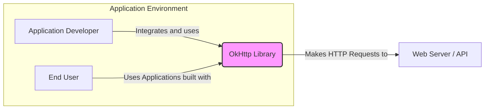
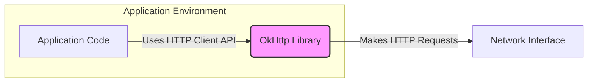
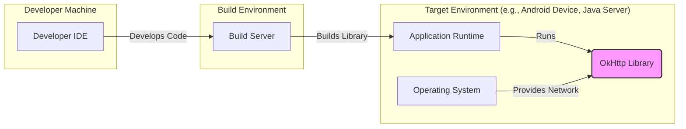
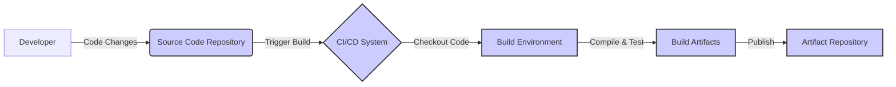

# BUSINESS POSTURE

- Business Priorities and Goals:
  - Provide a reliable, efficient, and feature-rich HTTP client for Java and Android applications.
  - Enable developers to easily integrate robust networking capabilities into their applications.
  - Maintain a high level of performance and stability for network operations.
  - Support modern HTTP standards and features.
  - Ensure broad compatibility across different Java and Android environments.
- Business Risks:
  - Vulnerabilities in the OkHttp library could compromise applications using it, leading to data breaches or service disruptions.
  - Performance issues in OkHttp could negatively impact the performance of applications relying on it.
  - Lack of compatibility with new platforms or protocols could limit the adoption and usefulness of OkHttp.
  - Security misconfigurations or misuse of OkHttp by developers could introduce vulnerabilities into applications.

# SECURITY POSTURE

- Existing Security Controls:
  - security control: TLS/SSL support for encrypted communication, implemented within the library to handle HTTPS connections. Described in OkHttp documentation and source code.
  - security control: Input validation on response headers and bodies to prevent common vulnerabilities. Implemented within the library's response processing logic. Described in source code.
  - security control: Connection pooling and reuse to improve performance and reduce resource consumption, which can indirectly enhance security by reducing attack surface related to connection setup. Implemented within the library's connection management logic. Described in source code.
  - security control: Support for modern HTTP features and security best practices, such as HTTP/2 and certificate pinning. Implemented as features within the library. Described in documentation and source code.
  - accepted risk: Reliance on application developers to correctly configure and use OkHttp securely within their applications.
  - accepted risk: Potential vulnerabilities in underlying platform libraries (e.g., Java/Android networking stack) that OkHttp depends on.

- Recommended Security Controls:
  - security control: Automated security scanning (SAST/DAST) integrated into the OkHttp development pipeline to identify potential vulnerabilities early in the development lifecycle.
  - security control: Regular dependency updates for OkHttp's build and test dependencies to mitigate risks from known vulnerabilities in third-party libraries.
  - security control: Security code reviews conducted by experienced security engineers to identify and address potential security flaws in the design and implementation.
  - security control: Public vulnerability disclosure policy and process to handle reported security issues in a timely and transparent manner.

- Security Requirements:
  - Authentication:
    - Requirement: Support for standard HTTP authentication schemes (e.g., Basic, Digest, Bearer Token).
    - Requirement: Secure handling of authentication credentials, avoiding storage in plaintext within the library itself.
    - Requirement: Ability for applications to integrate custom authentication mechanisms.
  - Authorization:
    - Requirement: While OkHttp is primarily a client library and does not enforce authorization, it must correctly handle and propagate authorization tokens or headers provided by applications.
    - Requirement: Support for handling server-side authorization responses and errors.
  - Input Validation:
    - Requirement: Robust validation of HTTP response headers and bodies to prevent injection attacks (e.g., header injection, body injection).
    - Requirement: Protection against malformed or unexpected HTTP responses that could lead to parsing errors or denial-of-service.
    - Requirement: Input validation should be applied to all data received from external sources (web servers).
  - Cryptography:
    - Requirement: Strong TLS/SSL implementation using secure cipher suites and protocols.
    - Requirement: Support for certificate validation and revocation mechanisms (e.g., CRL, OCSP).
    - Requirement: Protection of cryptographic keys and sensitive data used for TLS/SSL.
    - Requirement: Support for certificate pinning to enhance security against man-in-the-middle attacks.

# DESIGN

## C4 CONTEXT

- Context Diagram Elements:
  - - Name: OkHttp Library
    - Type: Software System
    - Description: An open-source HTTP client for Java and Android, designed for efficiency and modern HTTP features.
    - Responsibilities:
      - Making HTTP requests to web servers and APIs.
      - Handling HTTP responses.
      - Managing connections and connection pooling.
      - Providing APIs for applications to configure and execute HTTP requests.
      - Implementing security features like TLS/SSL.
    - Security controls:
      - TLS/SSL encryption for communication.
      - Input validation on HTTP responses.
      - Connection management to prevent resource exhaustion.
  - - Name: Application Developer
    - Type: Person
    - Description: Software developers who integrate the OkHttp library into their Java or Android applications.
    - Responsibilities:
      - Integrating OkHttp into applications.
      - Configuring OkHttp for specific application needs.
      - Using OkHttp APIs to make HTTP requests.
      - Handling HTTP responses within applications.
      - Ensuring secure usage of OkHttp in applications.
    - Security controls:
      - Secure coding practices when using OkHttp.
      - Proper configuration of OkHttp security features (e.g., certificate pinning).
      - Application-level security controls to protect data handled by OkHttp.
  - - Name: End User
    - Type: Person
    - Description: Users who interact with applications that utilize the OkHttp library for network communication.
    - Responsibilities:
      - Using applications that rely on OkHttp for network operations.
      - Indirectly benefiting from the performance and reliability of OkHttp.
    - Security controls:
      - Rely on application security and OkHttp's security features for secure communication.
  - - Name: Web Server / API
    - Type: External System
    - Description: External web servers and APIs that applications communicate with using OkHttp.
    - Responsibilities:
      - Serving HTTP responses to requests from OkHttp.
      - Implementing server-side security controls.
      - Authenticating and authorizing requests.
    - Security controls:
      - Server-side security controls (e.g., firewalls, intrusion detection systems).
      - TLS/SSL encryption on the server side.
      - Authentication and authorization mechanisms.

## C4 CONTAINER

- Container Diagram Elements:
  - - Name: OkHttp Library
    - Type: Library (Java/Kotlin)
    - Description: A Java/Kotlin library providing HTTP client functionality. It encapsulates the logic for making HTTP requests, handling responses, managing connections, and implementing security features.
    - Responsibilities:
      - HTTP request and response processing.
      - Connection pooling and management.
      - TLS/SSL implementation.
      - API for application code to interact with HTTP.
    - Security controls:
      - TLS/SSL encryption within the library.
      - Input validation on HTTP responses within the library.
      - Secure coding practices in library development.
  - - Name: Application Code
    - Type: Software Component
    - Description: The application code that integrates and uses the OkHttp library to perform network operations. This is the code written by application developers.
    - Responsibilities:
      - Initiating HTTP requests using OkHttp API.
      - Handling HTTP responses received from OkHttp.
      - Configuring OkHttp client as needed.
      - Implementing application-level logic related to network communication.
    - Security controls:
      - Secure usage of OkHttp API in application code.
      - Application-level input validation and output encoding.
      - Proper error handling and logging.
  - - Name: Network Interface
    - Type: System Interface
    - Description: Represents the network interface of the device or system where the application is running. OkHttp uses this interface to send and receive network traffic.
    - Responsibilities:
      - Transmitting HTTP requests over the network.
      - Receiving HTTP responses from the network.
      - Providing network connectivity for the application.
    - Security controls:
      - Operating system and network level security controls.
      - Firewalls and network security policies.

## DEPLOYMENT

- Deployment Diagram Elements:
  - - Name: Developer IDE
    - Type: Development Environment
    - Description: Integrated Development Environment used by developers to write and test code that uses OkHttp.
    - Responsibilities:
      - Code development and testing.
      - Local execution and debugging of applications using OkHttp.
    - Security controls:
      - Developer workstation security controls.
      - Code review and static analysis tools.
  - - Name: Build Server
    - Type: Build Environment
    - Description: Automated build server (e.g., CI/CD system) that compiles, tests, and packages the OkHttp library.
    - Responsibilities:
      - Automated building of OkHttp library.
      - Running unit and integration tests.
      - Packaging the library for distribution.
      - Potentially performing security scans during the build process.
    - Security controls:
      - Access control to build server and build artifacts.
      - Secure build pipeline configuration.
      - Integration of security scanning tools in the build process.
  - - Name: Application Runtime
    - Type: Execution Environment
    - Description: The runtime environment where applications using OkHttp are executed (e.g., Android device, Java server).
    - Responsibilities:
      - Running applications that include OkHttp.
      - Providing resources for OkHttp to operate (e.g., network access, memory).
    - Security controls:
      - Operating system level security controls.
      - Application runtime environment security configurations.
  - - Name: OkHttp Library
    - Type: Software Library
    - Description: Deployed as part of applications within the application runtime environment.
    - Responsibilities:
      - Providing HTTP client functionality within the application runtime.
    - Security controls:
      - Security features implemented within the library itself (TLS/SSL, input validation).
  - - Name: Operating System
    - Type: System Software
    - Description: The operating system of the target environment, providing network and system resources for OkHttp and applications.
    - Responsibilities:
      - Providing network connectivity.
      - Managing system resources.
      - Enforcing system-level security policies.
    - Security controls:
      - Operating system security patches and updates.
      - Firewall and network security configurations.
      - Access control and user management.

## BUILD

- Build Process Elements:
  - - Name: Developer
    - Type: Person
    - Description: Software developers who write and contribute code to the OkHttp project.
    - Responsibilities:
      - Writing code for OkHttp.
      - Performing local testing and code reviews.
      - Committing code changes to the source code repository.
    - Security controls:
      - Secure coding practices.
      - Code review process.
      - Access control to source code repository.
  - - Name: Source Code Repository
    - Type: Code Repository (e.g., GitHub)
    - Description: Central repository (like GitHub) where the OkHttp source code is stored and managed.
    - Responsibilities:
      - Version control of source code.
      - Collaboration and code sharing.
      - Triggering build processes upon code changes.
    - Security controls:
      - Access control to the repository.
      - Branching and merging strategies for code integrity.
      - Audit logging of code changes.
  - - Name: CI/CD System
    - Type: Automation System (e.g., GitHub Actions)
    - Description: Continuous Integration and Continuous Delivery system that automates the build, test, and publishing process for OkHttp.
    - Responsibilities:
      - Automated build process.
      - Running unit and integration tests.
      - Performing static analysis and security scans.
      - Packaging and publishing build artifacts.
    - Security controls:
      - Secure configuration of CI/CD pipelines.
      - Access control to CI/CD system and configurations.
      - Secrets management for credentials used in the build process.
      - Integration of security scanning tools (SAST, dependency scanning).
  - - Name: Build Environment
    - Type: Build Infrastructure
    - Description: The environment where the OkHttp library is compiled and tested. This includes build tools, dependencies, and runtime environment.
    - Responsibilities:
      - Providing a consistent and reproducible build environment.
      - Executing build scripts and tests.
    - Security controls:
      - Securely configured build environment.
      - Regular updates and patching of build tools and dependencies.
  - - Name: Build Artifacts
    - Type: Software Packages (e.g., JAR files, AAR files)
    - Description: The output of the build process, which are the compiled and packaged OkHttp library files.
    - Responsibilities:
      - Representing the distributable form of the OkHttp library.
    - Security controls:
      - Integrity checks (e.g., checksums, signatures) for build artifacts.
      - Secure storage of build artifacts.
  - - Name: Artifact Repository
    - Type: Package Registry (e.g., Maven Central)
    - Description: Repository where the build artifacts (OkHttp library packages) are published and made available for developers to download and use.
    - Responsibilities:
      - Hosting and distributing OkHttp library packages.
      - Providing access for developers to download the library.
    - Security controls:
      - Access control to the artifact repository.
      - Secure distribution channels (e.g., HTTPS).
      - Integrity verification of published artifacts.

# RISK ASSESSMENT

- Critical Business Processes:
  - Network communication for applications using OkHttp. This is critical for any application that relies on network data exchange, including fetching data from APIs, downloading resources, and interacting with web services. Disruption or compromise of this process can lead to application malfunction, data breaches, or denial of service.
- Data Sensitivity:
  - The data handled by OkHttp depends entirely on the applications using it. OkHttp itself is a transport mechanism and can handle any type of data transmitted over HTTP. The sensitivity of this data can range from public information to highly confidential personal or financial data, depending on the application's purpose. Therefore, the security of OkHttp is crucial for protecting a wide range of potentially sensitive data.

# QUESTIONS & ASSUMPTIONS

- BUSINESS POSTURE:
  - Assumption: The primary business goal is to provide a widely adopted and trusted HTTP client library.
  - Assumption: Performance and reliability are key business drivers for OkHttp's development.
  - Question: What is the process for prioritizing feature development and bug fixes, especially security-related issues?
  - Question: What is the level of support and maintenance commitment for different versions of OkHttp?

- SECURITY POSTURE:
  - Assumption: Secure Development Lifecycle (SDLC) practices are followed in OkHttp development, including security testing and code reviews.
  - Assumption: Vulnerability management is a priority, with a process for handling and disclosing security issues.
  - Question: Are there regular penetration tests or security audits conducted on OkHttp?
  - Question: What tools and processes are used for static and dynamic security analysis?
  - Question: Is there a dedicated security team or individual responsible for OkHttp security?

- DESIGN:
  - Assumption: The design prioritizes modularity and separation of concerns to facilitate security reviews and updates.
  - Assumption: The library is designed to be resilient to various network conditions and potentially malicious responses.
  - Question: What is the approach to handling and mitigating denial-of-service attacks at the HTTP client level?
  - Question: How is configuration security ensured, preventing developers from easily introducing insecure configurations?
  - Question: What is the strategy for backward compatibility while introducing new security features or improvements?