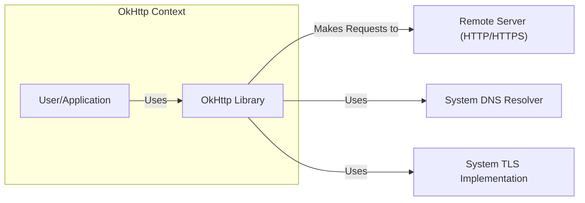
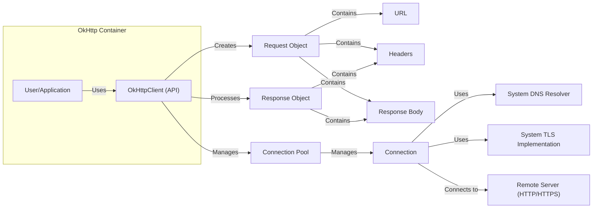
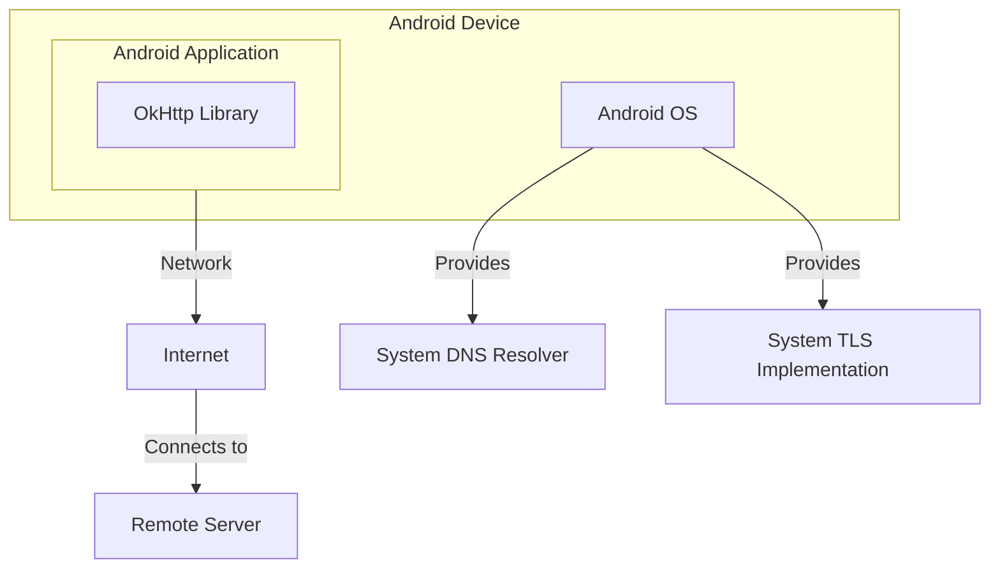
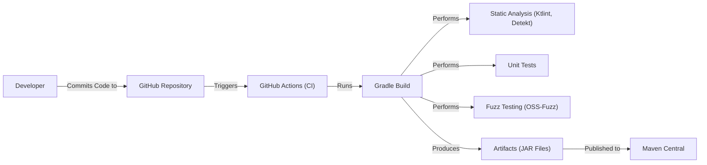

Okay, let's create a design document for the OkHttp project, focusing on aspects relevant for threat modeling.

# BUSINESS POSTURE

OkHttp is a widely used, open-source HTTP client for Java, Kotlin, and Android.  It's a foundational component for many applications, including those built by Square and numerous other companies and individual developers.

Priorities and Goals:

-   Provide a fast, reliable, and efficient HTTP client.
-   Support modern HTTP features (HTTP/2, HTTP/3, connection pooling, etc.).
-   Maintain backward compatibility where feasible.
-   Offer a clean and easy-to-use API.
-   Ensure high performance and low resource consumption.
-   Be a trustworthy and secure component for network communication.

Business Risks:

-   Vulnerabilities in OkHttp could be exploited to compromise a vast number of applications that rely on it. This is the most significant risk.
-   Performance issues or bugs could disrupt applications and services.
-   Lack of support for new HTTP standards could limit its usefulness in the future.
-   Compatibility issues could break existing applications.
-   Reputational damage due to security incidents or major bugs.

# SECURITY POSTURE

Existing Security Controls:

-   security control: Secure Coding Practices: The project appears to follow secure coding practices, based on a review of the codebase and issue tracker. This includes addressing common vulnerabilities like injection flaws, buffer overflows, and improper error handling. Implemented in source code.
-   security control: Regular Updates: The project is actively maintained, with frequent releases that include bug fixes and security patches. Described in release notes.
-   security control: Dependency Management: OkHttp manages its dependencies carefully, aiming to use up-to-date and secure versions of libraries. Described in build configuration files.
-   security control: TLS/SSL Support: OkHttp provides robust support for TLS/SSL, allowing secure communication with HTTPS servers. Implemented in source code.
-   security control: Certificate Pinning: OkHttp supports certificate pinning, which helps prevent man-in-the-middle attacks. Implemented in source code.
-   security control: Fuzz Testing: OkHttp uses fuzz testing (OSS-Fuzz) to proactively identify potential vulnerabilities. Described in project documentation and configuration.
-   security control: Code Reviews: Code changes are subject to review before being merged. Implemented in GitHub pull request process.
-   security control: Static Analysis: Static analysis tools are used to identify potential security issues. Implemented in CI workflows.

Accepted Risks:

-   accepted risk: Reliance on Underlying Platform Security: OkHttp relies on the security of the underlying operating system and Java/Kotlin runtime environment for some aspects of its security.
-   accepted risk: Potential for Unknown Vulnerabilities: Like any complex software, there's always a risk of undiscovered vulnerabilities.

Recommended Security Controls:

-   security control: Regular Security Audits: Conduct periodic independent security audits to identify potential vulnerabilities that might be missed by internal reviews.
-   security control: Enhanced Input Validation: While OkHttp likely performs input validation, a dedicated review focusing specifically on input validation for all user-supplied data (URLs, headers, etc.) is recommended.
-   security control: Content Security Policy (CSP) Support (for WebView interactions): If OkHttp is used in contexts where it interacts with WebViews, consider adding support for CSP to mitigate XSS risks.

Security Requirements:

-   Authentication:
    -   Support for standard HTTP authentication schemes (Basic, Bearer, Digest).
    -   Secure handling of credentials (avoiding storage in logs or insecure locations).
    -   Support for custom authentication mechanisms.

-   Authorization:
    -   OkHttp itself doesn't handle application-level authorization, but it should provide mechanisms for applications to manage authorization headers and tokens.

-   Input Validation:
    -   Strict validation of all user-supplied data, including URLs, headers, and request bodies.
    -   Protection against common injection attacks (e.g., header injection).

-   Cryptography:
    -   Support for strong TLS/SSL configurations.
    -   Secure random number generation for cryptographic operations.
    -   Proper handling of certificates and keys.
    -   Support for modern cryptographic algorithms.

# DESIGN

## C4 CONTEXT

Element Descriptions:

-   1.  Name: User/Application
    -   2.  Type: User/External System
    -   3.  Description:  An application or user that utilizes the OkHttp library to make HTTP requests.
    -   4.  Responsibilities:  Initiates HTTP requests, provides request parameters (URL, headers, body), handles responses.
    -   5.  Security controls:  Responsible for application-level security, including authentication and authorization.

-   1.  Name: OkHttp Library
    -   2.  Type: System
    -   3.  Description: The OkHttp library itself.
    -   4.  Responsibilities:  Provides an API for making HTTP requests, handles connection pooling, manages caching, performs request/response processing, enforces security policies (e.g., certificate pinning).
    -   5.  Security controls:  TLS/SSL support, certificate pinning, input validation, secure coding practices, fuzz testing.

-   1.  Name: Remote Server (HTTP/HTTPS)
    -   2.  Type: External System
    -   3.  Description:  A remote server that OkHttp communicates with via HTTP or HTTPS.
    -   4.  Responsibilities:  Responds to HTTP requests, provides data.
    -   5.  Security controls:  Server-side security controls (e.g., web server security, application security).

-   1.  Name: System DNS Resolver
    -   2.  Type: External System
    -   3.  Description: The system's DNS resolver, used to resolve hostnames to IP addresses.
    -   4.  Responsibilities: Resolves domain names.
    -   5.  Security controls: Relies on system DNS security.

-   1.  Name: System TLS Implementation
    -   2.  Type: External System
    -   3.  Description: The system's TLS implementation, used for secure HTTPS connections.
    -   4.  Responsibilities: Handles TLS handshake, encryption/decryption.
    -   5.  Security controls: Relies on system TLS security.

## C4 CONTAINER

In the case of OkHttp, the container diagram is essentially an extension of the context diagram, as OkHttp is a library, not a multi-container application.

Element Descriptions:

-   1.  Name: User/Application
    -   2.  Type: User/External System
    -   3.  Description: An application or user that utilizes the OkHttp library.
    -   4.  Responsibilities: Initiates HTTP requests, provides request parameters, handles responses.
    -   5.  Security controls: Responsible for application-level security.

-   1.  Name: OkHttpClient (API)
    -   2.  Type: Container
    -   3.  Description: The main entry point for using OkHttp. Provides methods for creating and configuring HTTP clients.
    -   4.  Responsibilities: Manages configuration, connection pooling, interceptors, and dispatching requests.
    -   5.  Security controls: Configurable security settings (e.g., TLS versions, certificate pinning).

-   1.  Name: Connection Pool
    -   2.  Type: Container
    -   3.  Description: Manages a pool of reusable connections to reduce latency.
    -   4.  Responsibilities: Creates, manages, and reuses connections to remote servers.
    -   5.  Security controls: Connection reuse can improve performance, reducing the overhead of repeated TLS handshakes.

-   1.  Name: Request Object
    -   2.  Type: Container
    -   3.  Description: Represents an HTTP request.
    -   4.  Responsibilities: Contains the URL, headers, and body of the request.
    -   5.  Security controls: Input validation should be performed on the components of the request.

-   1.  Name: Response Object
    -   2.  Type: Container
    -   3.  Description: Represents an HTTP response.
    -   4.  Responsibilities: Contains the status code, headers, and body of the response.
    -   5.  Security controls: Response parsing should be done securely to prevent vulnerabilities.

-   1.  Name: URL
    -   2.  Type: Component
    -   3.  Description: The URL of the request.
    -   4.  Responsibilities: Specifies the target resource.
    -   5.  Security controls: URL validation is crucial to prevent attacks.

-   1.  Name: Headers
    -   2.  Type: Component
    -   3.  Description: HTTP headers.
    -   4.  Responsibilities: Provide metadata about the request or response.
    -   5.  Security controls: Header validation is important to prevent injection attacks.

-   1.  Name: Body
    -   2.  Type: Component
    -   3.  Description: The request or response body.
    -   4.  Responsibilities: Contains the data being sent or received.
    -   5.  Security controls: Body handling should be secure, especially when dealing with user-supplied data.

-   1.  Name: Connection
    -   2.  Type: Container
    -   3.  Description: A single connection to a remote server.
    -   4.  Responsibilities: Handles the actual sending and receiving of data.
    -   5.  Security controls: Uses TLS for secure connections.

-   1.  Name: System DNS Resolver
    -   2.  Type: External System
    -   3.  Description: The system's DNS resolver.
    -   4.  Responsibilities: Resolves domain names.
    -   5.  Security controls: Relies on system DNS security.

-   1.  Name: System TLS Implementation
    -   2.  Type: External System
    -   3.  Description: The system's TLS implementation.
    -   4.  Responsibilities: Handles TLS handshake, encryption/decryption.
    -   5.  Security controls: Relies on system TLS security.

-   1.  Name: Remote Server (HTTP/HTTPS)
    -   2.  Type: External System
    -   3.  Description: A remote server.
    -   4.  Responsibilities: Responds to HTTP requests.
    -   5.  Security controls: Server-side security controls.

## DEPLOYMENT

OkHttp is a library, so "deployment" in the traditional sense doesn't apply. Instead, it's *integrated* into other applications. However, we can describe how it's typically used and the environments it might run in.

Possible Deployment Solutions:

1.  **Android Applications:** OkHttp is commonly used within Android apps.
2.  **Java/Kotlin Server-Side Applications:** OkHttp can be used in server-side applications running on various platforms (Linux, Windows, macOS) and cloud environments (AWS, GCP, Azure, etc.).
3.  **Java/Kotlin Desktop Applications:** OkHttp can be used in desktop applications.

Chosen Solution (Android Application):

Element Descriptions:

-   1.  Name: Android Device
    -   2.  Type: Deployment Node
    -   3.  Description: A physical or emulated Android device.
    -   4.  Responsibilities: Runs the Android operating system and applications.
    -   5.  Security controls: Android OS security features, app sandboxing.

-   1.  Name: Android Application
    -   2.  Type: Software System Instance
    -   3.  Description: An Android application that uses OkHttp.
    -   4.  Responsibilities: Performs application-specific tasks, uses OkHttp for network communication.
    -   5.  Security controls: Application-level security, secure use of OkHttp.

-   1.  Name: OkHttp Library
    -   2.  Type: Library
    -   3.  Description: The OkHttp library integrated into the Android application.
    -   4.  Responsibilities: Handles HTTP requests and responses.
    -   5.  Security controls: OkHttp's internal security controls.

-   1.  Name: Android OS
    -   2.  Type: Operating System
    -   3.  Description: The Android operating system.
    -   4.  Responsibilities: Provides system services, including network access.
    -   5.  Security controls: Android OS security features.

-   1.  Name: Internet
    -   2.  Type: Network
    -   3.  Description: The internet.
    -   4.  Responsibilities: Connects the device to remote servers.
    -   5.  Security controls: Network-level security (e.g., firewalls).

-   1.  Name: Remote Server
    -   2.  Type: External System
    -   3.  Description: A remote server.
    -   4.  Responsibilities: Responds to HTTP requests.
    -   5.  Security controls: Server-side security controls.

-   1.  Name: System DNS Resolver
    -   2.  Type: External System
    -   3.  Description: The system's DNS resolver.
    -   4.  Responsibilities: Resolves domain names.
    -   5.  Security controls: Relies on system DNS security.

-   1.  Name: System TLS Implementation
    -   2.  Type: External System
    -   3.  Description: The system's TLS implementation.
    -   4.  Responsibilities: Handles TLS handshake, encryption/decryption.
    -   5.  Security controls: Relies on system TLS security.

## BUILD

OkHttp uses Gradle as its build system and GitHub Actions for CI/CD.

Build Process Security Controls:

-   security control: **Source Code Management (GitHub):**  Uses Git for version control, providing a history of changes and enabling collaboration.
-   security control: **CI/CD (GitHub Actions):** Automates the build, test, and release process, ensuring consistency and reducing manual errors.
-   security control: **Static Analysis (Ktlint, Detekt):**  Uses static analysis tools to identify potential code quality and security issues.
-   security control: **Unit Tests:**  Includes a comprehensive suite of unit tests to verify the correctness of the code.
-   security control: **Fuzz Testing (OSS-Fuzz):**  Uses fuzz testing to proactively identify potential vulnerabilities.
-   security control: **Dependency Management (Gradle):**  Uses Gradle to manage dependencies, allowing for controlled updates and vulnerability scanning.
-   security control: **Artifact Repository (Maven Central):**  Publishes artifacts to Maven Central, a widely used and trusted repository.

# RISK ASSESSMENT

Critical Business Processes:

-   Secure and reliable network communication for applications using OkHttp.
-   Maintaining the trust and reputation of OkHttp as a secure and dependable library.

Data to Protect:

-   **Data in Transit:**  Data transmitted between applications and servers using OkHttp. Sensitivity varies greatly depending on the application (e.g., user credentials, personal data, financial information). *High Sensitivity*
-   **Source Code:** The OkHttp source code itself.  While publicly available, unauthorized modifications could introduce vulnerabilities. *Medium Sensitivity*
-   **Configuration Data:**  Configuration settings used by OkHttp (e.g., timeouts, proxy settings).  Incorrect configuration could lead to security issues. *Medium Sensitivity*

# QUESTIONS & ASSUMPTIONS

Questions:

-   Are there any specific compliance requirements (e.g., PCI DSS, HIPAA) that applications using OkHttp commonly need to meet? This would influence recommendations for TLS configurations and data handling.
-   What is the process for handling reported security vulnerabilities?  Is there a bug bounty program?
-   Are there any plans to support post-quantum cryptography in the future?

Assumptions:

-   BUSINESS POSTURE:  It's assumed that maintaining a strong security posture is a high priority for the OkHttp project due to its widespread use and potential impact on numerous applications.
-   SECURITY POSTURE: It's assumed that the existing security controls are implemented effectively and regularly reviewed.
-   DESIGN: It's assumed that developers using OkHttp are responsible for implementing application-level security controls and securely handling sensitive data.