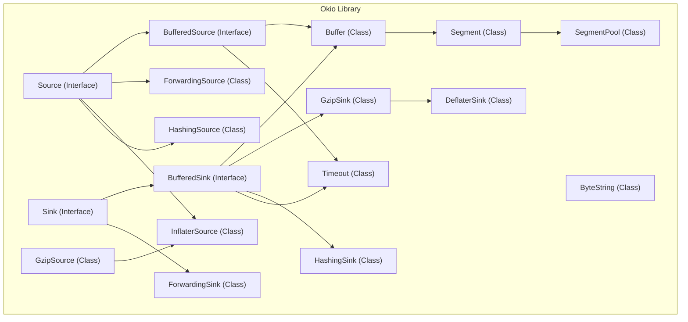
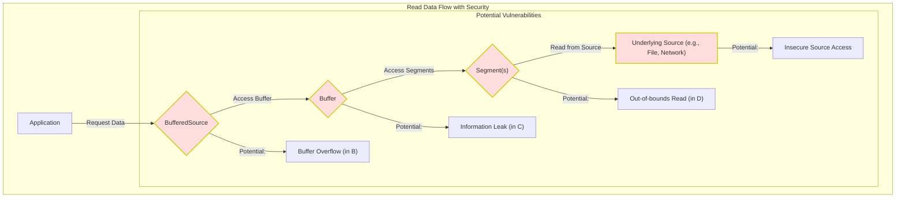

# Project Design Document: Okio Library - Enhanced for Threat Modeling

**Version:** 1.1
**Date:** October 26, 2023
**Author:** AI Software Architect

## 1. Introduction

This document provides an enhanced architectural overview of the Okio library, specifically tailored for threat modeling. It builds upon the foundational understanding of the library's internal workings, data flow, and key components, with a stronger emphasis on potential security vulnerabilities and attack surfaces. This document is intended to be a comprehensive resource for identifying and analyzing potential threats to systems utilizing the Okio library.

## 2. Goals and Non-Goals

**Goals:**

* Provide a detailed and security-focused description of the Okio library's architecture.
* Identify key components and their interactions, highlighting potential security implications.
* Clearly illustrate the flow of data within the library, pinpointing potential interception and manipulation points.
* Explicitly enumerate potential areas of security concern and common vulnerability types relevant to each component.
* Serve as a definitive reference document for structured threat modeling exercises (e.g., STRIDE, PASTA).

**Non-Goals:**

* Provide a line-by-line code audit or vulnerability assessment.
* Offer specific security remediation strategies or code patches.
* Document the complete public API of the library (refer to the official Okio documentation).
* Detail the project's version control history or development methodologies.
* Conduct performance benchmarking or optimization analysis.

## 3. Architectural Overview

Okio offers efficient and user-friendly abstractions for I/O operations in Java and Kotlin. It introduces `Source` and `Sink` as improved alternatives to standard Java streams, along with `Buffer` for in-memory data handling and `ByteString` for immutable byte sequences. The design emphasizes composability and performance, which can also introduce security considerations if not implemented carefully.

**Key Architectural Components with Security Relevance:**

* **`Source` (Interface):** Defines the contract for reading byte streams. Implementations are responsible for secure access and handling of the underlying data source. Vulnerabilities can arise from insecure source implementations (e.g., reading from unauthorized files, network locations without proper authentication).
* **`Sink` (Interface):** Defines the contract for writing byte streams. Implementations must ensure data integrity and secure writing to the destination. Insecure implementations could lead to data breaches or manipulation (e.g., writing to unintended files, exposing sensitive data over unencrypted connections).
* **`BufferedSource` (Interface):** Enhances `Source` with buffering. While improving performance, improper buffer management in implementations can lead to buffer overflows or information leaks if internal buffers are not cleared correctly.
* **`BufferedSink` (Interface):** Enhances `Sink` with buffering. Similar to `BufferedSource`, vulnerabilities can stem from incorrect buffer handling, potentially leading to buffer overflows or incomplete writes if flushing is not handled properly.
* **`Buffer` (Class):** The core in-memory data container, implemented as a linked list of `Segment` objects. Security concerns include the potential for dangling pointers or memory corruption if `Segment` management is flawed, and the risk of exposing sensitive data if buffers are not zeroed out when no longer needed.
* **`Segment` (Class):** Represents a contiguous block of bytes within a `Buffer`. Vulnerabilities here relate to memory safety and the potential for out-of-bounds access if `Segment` boundaries are not strictly enforced.
* **`SegmentPool` (Class):** A shared pool of reusable `Segment` objects. Concurrency issues (race conditions) can arise if access to the pool is not properly synchronized, potentially leading to data corruption or denial of service by exhausting the pool.
* **`ByteString` (Class):** An immutable sequence of bytes. While immutability enhances safety against accidental modification, the creation of `ByteString` instances from potentially untrusted sources requires careful consideration to prevent large allocations that could lead to memory exhaustion.
* **`ForwardingSource` (Class):** Enables the creation of decorator chains around a `Source`. A malicious or poorly implemented decorator could introduce vulnerabilities by intercepting, modifying, or leaking data.
* **`ForwardingSink` (Class):** Enables the creation of decorator chains around a `Sink`. Similar to `ForwardingSource`, malicious decorators can compromise data integrity or security during write operations.
* **Compression/Decompression Components (`GzipSource`, `GzipSink`, `DeflaterSink`, `InflaterSource`):**  These components are susceptible to vulnerabilities inherent in compression algorithms, such as decompression bombs (zip bombs) that can lead to denial of service by consuming excessive resources. Incorrect handling of compressed data streams could also introduce buffer overflows.
* **Hashing Components (`HashingSink`, `HashingSource`):** The security of these components depends on the strength of the underlying hash algorithm. Using weak or outdated algorithms can lead to collision attacks. Additionally, improper handling of input data could lead to vulnerabilities if the hashing process is not robust.
* **`Timeout` (Class):**  Crucial for preventing indefinite blocking and resource starvation. Insufficiently configured or improperly handled timeouts can be exploited for denial-of-service attacks.

## 4. Component Details with Security Focus

This section elaborates on the core components, emphasizing potential security vulnerabilities associated with each.

* **`Source` and `Sink`:**
    * **Threats:** Unauthorized data access, information disclosure, data manipulation, injection attacks (if the source provides data used in subsequent commands).
    * **Mitigation Considerations:** Implement robust access controls, validate input data, sanitize output data, use secure communication channels.
* **`BufferedSource` and `BufferedSink`:**
    * **Threats:** Buffer overflows (if buffer sizes are not correctly managed), information leaks (if internal buffers are not cleared), denial of service (if large buffers consume excessive memory).
    * **Mitigation Considerations:**  Strictly enforce buffer size limits, ensure proper buffer initialization and clearing, implement checks to prevent writing beyond buffer boundaries.
* **`Buffer`:**
    * **Threats:** Memory corruption (due to incorrect `Segment` management), dangling pointers, exposure of sensitive data in memory.
    * **Mitigation Considerations:** Implement robust memory management practices, carefully handle `Segment` pointers, consider zeroing out buffers when they are no longer in use.
* **`Segment` and `SegmentPool`:**
    * **Threats:** Race conditions (leading to data corruption), denial of service (by exhausting the pool), unauthorized access to `Segment` data.
    * **Mitigation Considerations:** Implement proper synchronization mechanisms for accessing the `SegmentPool`, limit the maximum size of the pool, ensure `Segment` data is not accessible after being returned to the pool.
* **`ByteString`:**
    * **Threats:** Denial of service (through large `ByteString` allocations), potential for data exposure if `ByteString` instances containing sensitive data are not handled carefully.
    * **Mitigation Considerations:**  Limit the size of `ByteString` instances created from untrusted sources, avoid storing sensitive data in long-lived `ByteString` objects if possible.
* **`ForwardingSource` and `ForwardingSink`:**
    * **Threats:** Introduction of vulnerabilities by malicious or poorly implemented decorators (e.g., logging sensitive data, modifying data in transit, introducing new attack vectors).
    * **Mitigation Considerations:**  Carefully review and audit any custom decorators, ensure decorators adhere to the principle of least privilege.
* **Compression/Decompression Components:**
    * **Threats:** Decompression bombs (zip bombs), buffer overflows during compression/decompression, denial of service due to excessive resource consumption.
    * **Mitigation Considerations:**  Implement checks to limit the compression ratio and output size, use secure and up-to-date compression libraries, handle potential exceptions during decompression gracefully.
* **Hashing Components:**
    * **Threats:** Collision attacks (if weak hash algorithms are used), potential for information disclosure if hash values are not properly protected.
    * **Mitigation Considerations:**  Use strong and well-vetted cryptographic hash algorithms, protect hash values from unauthorized access, consider using keyed hash functions (HMACs) for integrity checks.
* **`Timeout`:**
    * **Threats:** Denial of service (if timeouts are too long or not implemented), resource starvation.
    * **Mitigation Considerations:**  Implement appropriate timeouts for all I/O operations, allow for configuration of timeout values, handle timeout exceptions gracefully.

## 5. Data Flow with Security Implications

The following diagrams illustrate the data flow with annotations highlighting potential security vulnerabilities at each stage.

**Read Operation with Security Considerations:**

1. The application requests data from a `BufferedSource`.
2. The `BufferedSource` attempts to retrieve data from its internal `Buffer`. **Potential Vulnerability:** Buffer overflow if the requested amount exceeds the buffer's capacity or if buffer management is flawed.
3. The `Buffer` accesses data within its `Segment` objects. **Potential Vulnerability:** Information leaks if the buffer contains sensitive data that is not properly cleared.
4. If the `Buffer` doesn't have enough data, it requests more data from the underlying `Source`.
5. The underlying `Source` reads data, potentially in chunks, and populates `Segment` objects within the `Buffer`. **Potential Vulnerability:** Insecure access to the data source if proper authentication or authorization is lacking.
6. The `BufferedSource` then provides the requested data to the application. **Potential Vulnerability:** Out-of-bounds read if `Segment` boundaries are not correctly handled.

**Write Operation with Security Considerations:**

1. The application writes data to a `BufferedSink`.
2. The `BufferedSink` stores the data in its internal `Buffer`, within `Segment` objects. **Potential Vulnerability:** Buffer overflow if the input data exceeds the buffer's capacity.
3. The `Buffer` stores data within its `Segment` objects. **Potential Vulnerability:** Data corruption if `Segment` management is flawed or due to concurrency issues.
4. When the `Buffer` is full (or when `flush()` is called), the `BufferedSink` writes the data from the `Segment` objects to the underlying `Sink`. **Potential Vulnerability:** Out-of-bounds write if `Segment` boundaries are not correctly handled.
5. The underlying `Sink` writes the data to the destination. **Potential Vulnerability:** Insecure writing to the destination if proper authorization or encryption is lacking.

## 6. Security Considerations (Detailed)

This section provides a more structured breakdown of potential security considerations, categorized by common vulnerability types:

* **Input Validation:**
    * Failure to validate data read from `Source` implementations could lead to various attacks, including injection attacks and buffer overflows in subsequent processing.
* **Output Sanitization:**
    * Improper sanitization of data written to `Sink` implementations could expose sensitive information or enable cross-site scripting (XSS) if the output is rendered in a web context.
* **Buffer Management:**
    * **Buffer Overflows:** Incorrectly sized or managed buffers in `BufferedSource` and `BufferedSink` can lead to buffer overflows, potentially allowing attackers to execute arbitrary code.
    * **Information Leaks:** Failure to clear internal buffers in `BufferedSource` and `BufferedSink` could expose sensitive data from previous operations.
* **Memory Management:**
    * **Dangling Pointers:** Improper handling of `Segment` pointers in `Buffer` could lead to dangling pointers and memory corruption.
    * **Resource Exhaustion:** Attackers could attempt to exhaust the `SegmentPool` by allocating a large number of `Segment` objects, leading to denial of service.
* **Concurrency Control:**
    * **Race Conditions:** Lack of proper synchronization in shared components like `SegmentPool` can lead to race conditions and data corruption.
* **Cryptography:**
    * **Weak Hashing Algorithms:** Using weak or outdated hashing algorithms in `HashingSource` and `HashingSink` can lead to collision attacks.
    * **Lack of Encryption:** Data transmitted through `Sink` implementations might be vulnerable to eavesdropping if not encrypted.
* **Denial of Service (DoS):**
    * **Decompression Bombs:** Providing highly compressible data to decompression sinks can lead to excessive resource consumption and DoS.
    * **Timeout Exploitation:** Insufficiently configured timeouts can be exploited to cause indefinite blocking and DoS.
* **Injection Attacks:**
    * While Okio primarily deals with byte streams, improper handling of data read from `Source` implementations could indirectly lead to injection vulnerabilities in applications using Okio.
* **Third-Party Dependencies:**
    * Vulnerabilities in underlying compression libraries or other dependencies could indirectly affect the security of Okio.

## 7. Assumptions and Constraints (Security Focused)

* It is assumed that applications using Okio will implement their own higher-level security measures, such as authentication and authorization, appropriate to their specific needs.
* It is assumed that the underlying operating system and JVM/Kotlin Native runtime environment are patched against known vulnerabilities.
* This document primarily focuses on vulnerabilities within the Okio library itself and does not cover security risks arising from the misuse or misconfiguration of the library by developers.
* The analysis assumes that developers using Okio are aware of basic security best practices for handling sensitive data and performing I/O operations.

## 8. Glossary

* **Source:** An Okio interface for reading data, representing a potential input point for untrusted data.
* **Sink:** An Okio interface for writing data, representing a potential output point for sensitive information.
* **Buffer Overflow:** A condition where data written to a buffer exceeds its allocated size, potentially overwriting adjacent memory.
* **Information Leak:** The unintentional exposure of sensitive data.
* **Race Condition:** A concurrency issue where the outcome of a program depends on the unpredictable order of execution of multiple threads.
* **Denial of Service (DoS):** An attack that aims to make a system unavailable to its intended users.
* **Decompression Bomb (Zip Bomb):** A malicious archive file that expands to an enormous size when decompressed, potentially crashing the system.
* **Injection Attack:** A type of attack where malicious code is inserted into an application's input, which is then executed by the application.
* **STRIDE:** A threat modeling methodology focusing on Spoofing, Tampering, Repudiation, Information Disclosure, Denial of Service, and Elevation of Privilege.
* **PASTA:** A threat modeling methodology focusing on Process for Attack Simulation and Threat Analysis.

This enhanced document provides a more detailed and security-focused view of the Okio library's architecture, making it a more effective resource for threat modeling activities.
