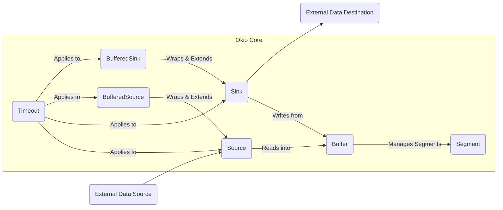
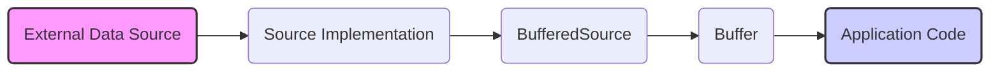
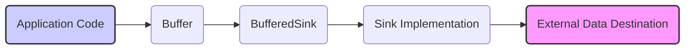

# Project Design Document: Okio Library

**Version:** 1.1
**Date:** October 26, 2023
**Author:** AI Software Architect

## 1. Introduction

This document provides an enhanced and more detailed design overview of the Okio library, a library that complements `java.io` and `java.nio` to make it much easier to access, store, and process data in Java and Kotlin. This document is specifically tailored to serve as a robust foundation for subsequent threat modeling activities. It meticulously outlines the key components, their architectural relationships, the flow of data, and critical security considerations within the Okio library.

## 2. Goals

*   Deliver a refined and more detailed architectural overview of the Okio library.
*   Precisely identify key components, elaborating on their functionalities and interactions.
*   Thoroughly describe the typical data flow patterns within the library, including various scenarios.
*   Highlight potential security considerations with a focus on actionable insights for threat modeling.
*   Serve as a comprehensive and reliable foundational document for subsequent threat modeling exercises, enabling a deeper understanding of potential attack surfaces.

## 3. Overview of Okio

Okio is a highly efficient and user-friendly library for Java and Kotlin that significantly simplifies working with I/O operations. It provides powerful abstractions over raw byte streams, making it easier and more performant to read and write data. Key features include:

*   **`Buffer`:** A highly optimized, segment-based buffer designed to minimize data copying, leading to improved performance. It acts as the central data storage within Okio.
*   **`Source` and `Sink`:** Fundamental interfaces defining the contract for reading and writing sequences of bytes, respectively. They represent the input and output streams in Okio's architecture.
*   **`BufferedSource` and `BufferedSink`:** Convenient and feature-rich wrappers around `Source` and `Sink` that introduce internal buffering and provide higher-level, easier-to-use read/write operations for various data types.
*   **`Timeout`:** A robust mechanism for setting deadlines and timeouts on I/O operations, crucial for preventing indefinite blocking and ensuring application responsiveness.
*   **Interoperability:** Seamlessly integrates with existing Java I/O APIs, allowing for a smooth transition and usage within established Java ecosystems.

## 4. Architectural Design

The core of Okio's design centers around the collaborative interaction of its key components. The following diagram provides a more detailed illustration of the architecture:

### 4.1. Key Components (Detailed)

*   **`Buffer`:**
    *   A mutable sequence of bytes residing in memory.
    *   Internally structured as a linked list of `Segment` objects, allowing for efficient growth and manipulation without large memory reallocations.
    *   Employs a strategy to minimize data copying during read and write operations, enhancing performance, especially for large data streams.
    *   Provides a rich set of methods for reading and writing primitive data types (int, long, strings, etc.) directly to and from the buffer.

*   **`Segment`:**
    *   A contiguous block of bytes with a fixed size (typically 8KB).
    *   Managed by the `Buffer`, acting as the fundamental unit of storage.
    *   Segments are often reused to reduce memory allocation overhead and improve performance. Each segment maintains pointers to the next and previous segments in the linked list.

*   **`Source`:**
    *   An interface defining the contract for an object that can read a sequence of bytes.
    *   Represents the input side of an I/O operation, abstracting away the underlying data source.
    *   Implementations can read data from diverse sources, including files (`FileSource`), network sockets (`Socket.getInputStream().source()`), and in-memory byte arrays.

*   **`Sink`:**
    *   An interface defining the contract for an object that can write a sequence of bytes.
    *   Represents the output side of an I/O operation, abstracting away the underlying data destination.
    *   Implementations can write data to various destinations, such as files (`FileSink`), network sockets (`Socket.getOutputStream().sink()`), and in-memory byte arrays.

*   **`BufferedSource`:**
    *   A decorator around a `Source` that introduces internal buffering.
    *   Offers convenient methods for reading data in chunks, lines (delimited by newlines), or as specific data types (e.g., `readInt()`, `readUtf8()`).
    *   Significantly improves performance by reducing the number of calls to the underlying `Source`, reading data in larger, more efficient blocks.

*   **`BufferedSink`:**
    *   A decorator around a `Sink` that provides internal buffering.
    *   Offers convenient methods for writing data in chunks or as specific data types (e.g., `writeInt()`, `writeUtf8()`).
    *   Enhances performance by accumulating data in its internal buffer and writing it to the underlying `Sink` in larger chunks, reducing the overhead of frequent small writes.
    *   Provides a `flush()` method to explicitly force the buffered data to be written to the underlying `Sink`.

*   **`Timeout`:**
    *   A mechanism for setting deadlines (specific points in time) and timeouts (durations) for I/O operations.
    *   Can be applied to operations on `Source` and `Sink`, as well as their buffered counterparts.
    *   Crucial for preventing applications from hanging indefinitely due to slow or unresponsive I/O operations.

## 5. Data Flow (Enhanced)

The following diagrams provide a more detailed illustration of the typical data flow for reading and writing operations using Okio, including potential variations.

### 5.1. Reading Data (Detailed)

**Data Flow Steps (Reading):**

*   Data originates from an "External Data Source" such as a file on disk, a network socket, or an in-memory byte array.
*   A specific "Source Implementation" (e.g., `FileSource`, `InputStreamSource`) is instantiated to handle reading data from the particular external source.
*   Often, the "Source Implementation" is wrapped by a "BufferedSource" to improve reading efficiency. The `BufferedSource` maintains an internal buffer.
*   The "BufferedSource" reads data from the underlying "Source Implementation" into its internal "Buffer" in larger chunks.
*   The "Application Code" then reads data from the "Buffer" of the "BufferedSource" as needed, benefiting from the buffering provided.

### 5.2. Writing Data (Detailed)

**Data Flow Steps (Writing):**

*   The "Application Code" writes data into the internal "Buffer" of a "BufferedSink".
*   The "BufferedSink" accumulates the written data in its internal "Buffer".
*   When the "Buffer" in the "BufferedSink" becomes full, or when the `flush()` method is explicitly called, the "BufferedSink" writes the accumulated data to the underlying "Sink Implementation".
*   The "Sink Implementation" (e.g., `FileSink`, `OutputStreamSink`) handles the actual writing of data to the "External Data Destination", such as a file, network socket, or in-memory byte array.

## 6. Security Considerations (Actionable for Threat Modeling)

While Okio primarily focuses on efficient I/O, several security considerations are crucial when integrating it into applications. These considerations can be directly used for threat modeling:

*   **Resource Exhaustion:**
    *   **Threat:** Reading from an untrusted `Source` without imposing size limits can lead to excessive memory consumption as the `Buffer` grows uncontrollably, potentially causing an `OutOfMemoryError`.
        *   **Mitigation:** Implement checks on the size of incoming data or use bounded buffers. Utilize the `Timeout` mechanism to prevent indefinite read operations.
    *   **Threat:** Writing to a `Sink` without considering backpressure can overwhelm the destination, leading to resource exhaustion or denial of service at the receiving end.
        *   **Mitigation:** Implement flow control mechanisms or ensure the receiving end can handle the data rate.
    *   **Threat:** Failure to set appropriate `Timeout` values on `Source` and `Sink` operations can lead to threads being blocked indefinitely, potentially causing thread pool exhaustion and application unresponsiveness (DoS).
        *   **Mitigation:** Always configure reasonable timeouts for I/O operations, especially when dealing with external or untrusted sources/destinations.

*   **Data Integrity:**
    *   **Threat:** Okio itself does not provide built-in mechanisms for verifying data integrity (e.g., checksums, cryptographic signatures). If data integrity is critical, vulnerabilities can arise if data is corrupted in transit or at the source/destination.
        *   **Mitigation:** Implement data integrity checks at a higher application level, using techniques like checksums (e.g., CRC32) or cryptographic hashing.

*   **Injection Attacks (Indirect):**
    *   **Threat:** While Okio doesn't directly interpret data, if data read using Okio is subsequently used in contexts vulnerable to injection attacks (e.g., constructing SQL queries, shell commands, or XML/JSON payloads), vulnerabilities can be introduced.
        *   **Mitigation:**  Thoroughly sanitize and validate all data read from external sources before using it in potentially vulnerable contexts. Employ parameterized queries or escaping techniques.

*   **Denial of Service (DoS):**
    *   **Threat:** A malicious `Source` could provide an extremely large or never-ending stream of data, potentially leading to memory exhaustion or prolonged processing, causing a DoS.
        *   **Mitigation:** Implement limits on the amount of data read from a `Source`. Use timeouts to prevent indefinite read operations.
    *   **Threat:** A malicious actor could attempt to write an excessive amount of data to a `Sink` with limited capacity, potentially causing resource exhaustion or failure at the destination.
        *   **Mitigation:** Implement checks on the amount of data being written and ensure the destination has adequate capacity or implement backpressure mechanisms.

*   **Error Handling:**
    *   **Threat:** Improper handling of I/O exceptions (e.g., `IOException`) can lead to unexpected application behavior, data corruption, or security vulnerabilities if sensitive information is leaked in error messages or if resources are not properly released.
        *   **Mitigation:** Implement robust error handling mechanisms, logging errors appropriately without exposing sensitive information. Ensure resources (like open files or sockets) are properly closed in `finally` blocks.

*   **Dependency Security:**
    *   **Threat:** Although Okio has minimal external dependencies, using outdated or vulnerable versions of Okio itself can expose applications to known security flaws.
        *   **Mitigation:** Regularly update the Okio library to the latest stable version to benefit from security patches and bug fixes.

*   **Underlying System Security:**
    *   **Assumption:** Okio relies on the security of the underlying operating system and Java Virtual Machine (JVM) for its basic I/O operations. Vulnerabilities in the OS or JVM could indirectly affect the security of applications using Okio.
        *   **Mitigation:** Keep the operating system and JVM up-to-date with the latest security patches.

## 7. Dependencies

Okio is designed to be lightweight and has minimal external dependencies. It primarily relies on the standard Java and Kotlin libraries. This reduces the attack surface associated with third-party dependencies.

*   Standard Java Libraries (`java.io`, `java.nio`).
*   Kotlin Standard Library (when used in Kotlin projects).

## 8. Deployment

Okio is typically deployed as a library integrated into Java or Kotlin applications.

*   Developers add the Okio dependency to their project's build configuration files (e.g., `build.gradle` for Gradle or `pom.xml` for Maven).
*   The library is then utilized within the application's codebase to perform various I/O operations, replacing or complementing standard Java I/O classes.

## 9. Future Considerations

*   Exploration of further optimizations for asynchronous I/O operations to enhance performance in non-blocking scenarios.
*   Potential introduction of built-in support for common data formats (e.g., JSON, Protocol Buffers) to simplify data serialization and deserialization.
*   Continuous monitoring for potential security vulnerabilities and timely release of security updates.

## 10. Conclusion

This enhanced design document provides a more detailed and actionable overview of the Okio library, emphasizing aspects relevant to threat modeling. By understanding the architecture, data flow, and potential security considerations outlined here, developers and security professionals can effectively identify and mitigate potential risks associated with using Okio in their applications. This document serves as a valuable resource for building secure and robust software leveraging the efficiency and convenience of the Okio library.