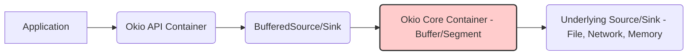

## Deep Security Analysis of Okio Library

### 1. Objective, Scope, and Methodology

**Objective:**

The objective of this deep security analysis is to thoroughly evaluate the security posture of the Okio library, focusing on its architecture, key components, and build/deployment processes. This analysis aims to identify potential security vulnerabilities and risks inherent in Okio's design and implementation, and to provide actionable, tailored mitigation strategies to enhance its security. The analysis will specifically focus on the security implications arising from Okio's role as a foundational I/O library and its handling of data streams.

**Scope:**

This analysis encompasses the following aspects of the Okio library, as outlined in the provided Security Design Review:

*   **Architecture and Components:**  Analysis of the Okio API Container, Okio Core Container, and their interactions.
*   **Data Flow:** Understanding how data is processed and manipulated within Okio, focusing on potential vulnerabilities related to data handling.
*   **Build and Deployment Processes:** Examination of the build pipeline using GitHub Actions and the deployment to Maven Central, identifying supply chain security risks.
*   **Existing and Recommended Security Controls:** Evaluation of the effectiveness of current security measures and the necessity of recommended controls like fuzz testing, dependency scanning, SBOM generation, signed releases, and security audits.
*   **Security Requirements:** Deep dive into the critical security requirements for Okio, particularly input validation and cryptography.

The analysis will **not** cover the security of applications that *use* Okio, but rather focus solely on the security of the Okio library itself.

**Methodology:**

This deep analysis will employ the following methodology:

1.  **Document Review:**  In-depth review of the provided Security Design Review document, including business and security posture, C4 diagrams, deployment and build process descriptions, risk assessment, and questions/assumptions.
2.  **Architecture and Data Flow Inference:** Based on the documentation and understanding of I/O libraries, infer the internal architecture and data flow within Okio. This will involve considering how Okio handles different types of data sources (files, network, memory) and data operations (reading, writing, buffering, encoding).
3.  **Component-Based Security Analysis:** Break down the Okio library into its key components (API Container, Core Container, Build Pipeline, Distribution Channels) and analyze the security implications of each component. This will involve identifying potential threats, vulnerabilities, and security weaknesses specific to each component's function and interactions.
4.  **Threat Modeling:**  Implicit threat modeling will be applied by considering common vulnerabilities in I/O libraries and how they might manifest in Okio, given its architecture and functionalities. This will focus on areas like input handling, data processing, and cryptographic operations.
5.  **Mitigation Strategy Development:** For each identified security implication, develop specific, actionable, and tailored mitigation strategies. These strategies will be practical recommendations that the Okio development team can implement to enhance the library's security.
6.  **Prioritization:** While not explicitly requested, the analysis will implicitly prioritize recommendations based on their potential impact and feasibility of implementation.

### 2. Security Implications of Key Components

Based on the Security Design Review and inferred architecture, the key components of Okio and their security implications are analyzed below:

**2.1. Okio API Container (Kotlin/Java Interfaces)**

*   **Description:** This component defines the public interfaces and abstract classes that developers interact with. It acts as the entry point to Okio's functionalities.
*   **Security Implications:**
    *   **Input Validation Weaknesses:** The API Container is the first point of contact for user-provided data. If input validation is insufficient or improperly implemented at this level, vulnerabilities like buffer overflows, path traversal, or format string bugs could be introduced in the underlying Core Container.
    *   **API Misuse:**  Developers might misuse the API in ways that lead to security vulnerabilities in their applications. While not directly Okio's fault, clear and secure API design and documentation are crucial to minimize this risk.
    *   **Exposure of Internal Details:**  Poorly designed APIs might inadvertently expose internal implementation details, potentially revealing attack vectors or making it easier for attackers to understand and exploit vulnerabilities in the Core Container.
*   **Specific Security Considerations for Okio API:**
    *   **Input Sanitization at API Boundaries:**  All data entering Okio through the API must be rigorously validated and sanitized. This includes checking data types, sizes, formats, and ranges to prevent unexpected or malicious inputs from reaching the Core Container.
    *   **Secure Defaults:** API design should prioritize secure defaults. For example, when dealing with file paths, the API should default to preventing path traversal vulnerabilities unless explicitly overridden by the developer with clear understanding of the risks.
    *   **Clear Documentation on Secure Usage:**  Provide comprehensive documentation that clearly outlines secure usage patterns of the API, highlighting potential security pitfalls and best practices. This should include examples of how to handle different types of inputs securely.

**2.2. Okio Core Container (Kotlin/Java Implementation)**

*   **Description:** This component contains the core logic and implementation of Okio's I/O operations, data structures (Buffers, Segments), and cryptographic functionalities.
*   **Security Implications:**
    *   **Buffer Overflow Vulnerabilities:**  Incorrect memory management or bounds checking in buffer operations could lead to buffer overflows, allowing attackers to overwrite memory and potentially execute arbitrary code. This is especially critical in a low-level I/O library like Okio.
    *   **Format String Bugs:** If Okio uses string formatting functions incorrectly with user-controlled input, format string vulnerabilities could arise, potentially leading to information disclosure or code execution.
    *   **Path Traversal Vulnerabilities:**  If Okio handles file paths without proper sanitization, attackers could potentially read or write files outside of intended directories, leading to data breaches or system compromise.
    *   **Cryptographic Vulnerabilities:**  If Okio implements cryptographic functionalities (like hashing) incorrectly, or uses weak algorithms, it could lead to vulnerabilities like weak encryption, hash collisions, or padding oracle attacks.
    *   **Denial of Service (DoS):**  Resource exhaustion vulnerabilities, such as uncontrolled memory allocation or infinite loops triggered by malicious input, could lead to DoS attacks against applications using Okio.
    *   **Logic Errors in I/O Operations:**  Flaws in the implementation of I/O operations (reading, writing, seeking, etc.) could lead to data corruption, unexpected behavior, or security vulnerabilities.
*   **Specific Security Considerations for Okio Core:**
    *   **Rigorous Input Validation and Sanitization:**  The Core Container must reinforce input validation received from the API Container and perform further validation specific to its internal operations.
    *   **Secure Memory Management:** Implement robust memory management practices to prevent buffer overflows and other memory-related vulnerabilities. Utilize safe memory allocation and deallocation techniques.
    *   **Safe String Handling:**  Avoid using potentially unsafe string formatting functions with user-controlled input. Use parameterized queries or safe string manipulation methods.
    *   **Secure Cryptographic Implementation:**  If implementing cryptography, use well-vetted and secure cryptographic libraries and algorithms. Follow best practices for key management and avoid rolling custom cryptography.
    *   **Resource Management:** Implement safeguards against resource exhaustion attacks. Set limits on buffer sizes, file sizes, and other resources to prevent DoS.
    *   **Thorough Testing:**  Extensive unit and integration testing, including fuzz testing, is crucial to identify and eliminate vulnerabilities in the Core Container's complex logic.

**2.3. Maven Central Repository**

*   **Description:** Maven Central is the public repository used to distribute Okio library JAR files.
*   **Security Implications:**
    *   **Supply Chain Attacks (Compromised Artifacts):** If the Okio JAR artifacts on Maven Central are compromised (e.g., through a compromised build server or account), users downloading and using Okio would be vulnerable. This is a critical supply chain risk.
    *   **Integrity Issues:**  If the integrity of the JAR artifacts on Maven Central is not guaranteed, users might download corrupted or tampered versions of Okio, leading to unpredictable behavior or vulnerabilities.
*   **Specific Security Considerations for Maven Central Distribution:**
    *   **Signed Releases:**  Signing Okio JAR artifacts cryptographically before publishing to Maven Central is essential. This allows users to verify the authenticity and integrity of the downloaded library.
    *   **Secure Publishing Process:**  Ensure the process of publishing artifacts to Maven Central is secure, with strong authentication and authorization controls to prevent unauthorized uploads or modifications.
    *   **Maven Central Security:** Rely on Maven Central's own security measures to protect the repository infrastructure and prevent unauthorized access.

**2.4. GitHub Repository**

*   **Description:** GitHub hosts the source code, issue tracking, and collaboration platform for Okio.
*   **Security Implications:**
    *   **Source Code Tampering:** If the GitHub repository is compromised, malicious code could be injected into the Okio codebase, leading to vulnerabilities in future releases.
    *   **Credential Compromise:** Compromised developer accounts or CI/CD secrets could be used to push malicious code or manipulate the build process.
    *   **Information Disclosure:**  Accidental exposure of sensitive information (e.g., API keys, credentials) in the repository history or issues could be exploited.
*   **Specific Security Considerations for GitHub Repository:**
    *   **Access Controls:** Implement strict access controls to the GitHub repository, limiting write access to authorized developers and using branch protection rules to enforce code reviews.
    *   **Two-Factor Authentication (2FA):** Enforce 2FA for all developers with write access to the repository to protect against account compromise.
    *   **Secret Scanning:** Utilize GitHub's secret scanning feature to detect and prevent accidental commits of sensitive information.
    *   **Audit Logging:**  Monitor GitHub audit logs for suspicious activity and potential security breaches.

**2.5. Build Server (GitHub Actions)**

*   **Description:** GitHub Actions is used as the CI/CD platform to build, test, and publish Okio.
*   **Security Implications:**
    *   **Build Pipeline Compromise:** If the build pipeline is compromised, malicious code could be injected into the build process, leading to the creation of vulnerable or malicious Okio artifacts.
    *   **Secret Leakage:**  Secrets used in the build process (e.g., signing keys, Maven Central credentials) could be leaked if not managed securely, potentially allowing attackers to compromise the release process.
    *   **Dependency Poisoning:**  If the build process is vulnerable to dependency poisoning attacks, malicious dependencies could be introduced, leading to vulnerabilities in Okio.
*   **Specific Security Considerations for Build Server:**
    *   **Secure Build Environment:** Harden the GitHub Actions build environment and minimize the attack surface.
    *   **Secrets Management:**  Use GitHub Actions secrets management to securely store and access sensitive credentials. Avoid hardcoding secrets in build scripts.
    *   **Dependency Management and Scanning:**  Implement robust dependency management practices and integrate dependency scanning tools into the build pipeline to detect and prevent vulnerable dependencies.
    *   **Pipeline Security:** Secure the CI/CD pipeline configuration itself to prevent unauthorized modifications or access.
    *   **Regular Audits of Build Configuration:** Periodically audit the build pipeline configuration to ensure it adheres to security best practices and identify potential vulnerabilities.

### 3. Architecture, Components, and Data Flow (Inferred)

Based on the description and common I/O library patterns, the inferred architecture and data flow within Okio can be summarized as follows:

1.  **Data Input:** Applications use the Okio API (e.g., `Okio.buffer(source)`, `Okio.sink(file)`) to create `BufferedSource` and `BufferedSink` objects. These objects abstract away the underlying data source (e.g., `Source`, `Sink`). Data sources can be files, network sockets, in-memory byte arrays, etc.
2.  **Buffering and Segmentation:** Okio likely uses internal buffering and segmentation mechanisms (e.g., `Buffer`, `Segment` classes) within the Core Container to efficiently handle data streams. Buffering improves performance by reducing system calls, and segmentation allows for efficient memory management and data manipulation.
3.  **Data Processing:**  Operations like reading bytes, writing bytes, reading lines, encoding/decoding data, and cryptographic hashing are performed within the Core Container, operating on the buffered data.
4.  **Data Output:**  Data is written to the underlying `Sink` (e.g., file, network socket) through the `BufferedSink` API.
5.  **Error Handling:** Okio needs to handle various I/O errors gracefully, including file not found, network connection errors, and data corruption. Secure error handling is crucial to prevent information disclosure or unexpected behavior.
6.  **Cryptographic Operations (if applicable):**  If Okio provides cryptographic functionalities, these operations would be implemented within the Core Container, likely using established cryptographic libraries.

**Data Flow Diagram (Simplified):**

**Data Flow Security Considerations:**

*   **Data Integrity:** Ensure data integrity throughout the data flow. Prevent data corruption during buffering, processing, and transmission. Implement checksums or other integrity checks if necessary for critical data operations.
*   **Confidentiality (if applicable):** If Okio handles sensitive data, ensure that data is not inadvertently leaked or exposed during processing. Applications using Okio are primarily responsible for confidentiality, but Okio should avoid introducing vulnerabilities that could compromise data confidentiality.
*   **Availability:** Prevent DoS attacks that could disrupt the data flow. Implement resource limits and error handling to maintain availability.

### 4. Tailored Security Considerations and Specific Recommendations

Based on the analysis, here are tailored security considerations and specific recommendations for the Okio project:

**4.1. Input Validation and Sanitization:**

*   **Consideration:**  Insufficient input validation is a major risk for I/O libraries. Okio must rigorously validate all inputs at both the API Container and Core Container levels.
*   **Recommendation 1 (API Container):** Implement input validation at the Okio API level to check for:
    *   **File Paths:** Sanitize file paths to prevent path traversal vulnerabilities. Use canonicalization and restrict allowed characters. Consider providing API options to control path handling behavior (e.g., strict vs. lenient).
    *   **Data Sizes:** Validate data sizes to prevent buffer overflows. Limit the size of buffers and data streams to reasonable values.
    *   **Data Formats:** If the API expects specific data formats (e.g., encoding, compression), validate the format to prevent unexpected processing or vulnerabilities.
*   **Recommendation 2 (Core Container):** Reinforce input validation within the Core Container, especially when handling data from external sources or the API. Implement checks for:
    *   **Buffer Boundaries:**  Strictly enforce buffer boundaries to prevent overflows. Use safe memory access methods.
    *   **Data Type and Range:** Validate data types and ranges to prevent unexpected behavior or errors during processing.
    *   **Control Characters:** Sanitize or escape control characters in input data to prevent format string bugs or other injection vulnerabilities.

**4.2. Secure Cryptography (If Implemented):**

*   **Consideration:** Incorrect cryptographic implementation can lead to severe vulnerabilities. If Okio provides cryptographic functionalities, secure implementation is paramount.
*   **Recommendation 3 (Cryptography):** If Okio implements cryptography:
    *   **Use Established Libraries:**  Prefer using well-vetted and established cryptographic libraries (e.g., Conscrypt, Bouncy Castle) instead of rolling custom cryptography.
    *   **Algorithm Selection:**  Use strong and up-to-date cryptographic algorithms. Avoid deprecated or weak algorithms.
    *   **Key Management:**  If Okio manages cryptographic keys (unlikely for a library like Okio itself, but consider in context of usage), implement secure key generation, storage, and handling practices.
    *   **Security Review:**  Have the cryptographic implementation reviewed by security experts to identify potential vulnerabilities.

**4.3. Fuzz Testing:**

*   **Consideration:** Fuzz testing is highly effective in discovering input validation and memory management vulnerabilities in I/O libraries.
*   **Recommendation 4 (Fuzz Testing):** Implement fuzz testing for Okio, focusing on:
    *   **API Fuzzing:** Fuzz the Okio API with malformed, unexpected, and boundary-case inputs to identify vulnerabilities in API handling and input validation.
    *   **Data Format Fuzzing:** Fuzz Okio with various data formats (e.g., different encodings, compressed data, corrupted data) to test its robustness in handling diverse and potentially malicious data.
    *   **File System Operations Fuzzing:** Fuzz file system operations with unusual file paths, permissions, and file contents to uncover path traversal or file handling vulnerabilities.
    *   **Network Operations Fuzzing:** If Okio handles network operations, fuzz network interactions with malformed packets and unexpected network conditions.
    *   **Integrate into CI/CD:** Integrate fuzz testing into the CI/CD pipeline for continuous vulnerability discovery. Consider using tools like Jazzer (for JVM fuzzing) or libFuzzer.

**4.4. Dependency Scanning and SBOM:**

*   **Consideration:** Dependency vulnerabilities are a significant supply chain risk. Okio needs to manage its dependencies securely.
*   **Recommendation 5 (Dependency Scanning):** Integrate automated dependency scanning into the CI/CD pipeline using tools like OWASP Dependency-Check or Snyk.
    *   **Continuous Monitoring:**  Continuously monitor dependencies for known vulnerabilities and receive alerts for updates.
    *   **Vulnerability Remediation:**  Establish a process for promptly addressing and remediating identified dependency vulnerabilities.
*   **Recommendation 6 (SBOM Generation):** Generate Software Bill of Materials (SBOMs) for each Okio release.
    *   **Transparency:**  Provide transparency to users about the components included in Okio, including direct and transitive dependencies.
    *   **Vulnerability Tracking:**  SBOMs help users track potential vulnerabilities in Okio's dependencies and assess their risk.
    *   **Standard Format:** Generate SBOMs in a standard format like SPDX or CycloneDX.

**4.5. Signed Releases and Artifact Verification:**

*   **Consideration:** Ensuring the integrity and authenticity of Okio releases is crucial to prevent supply chain attacks.
*   **Recommendation 7 (Signed Releases):** Implement signed releases for Okio JAR artifacts published to Maven Central.
    *   **JAR Signing:**  Sign JAR files using a strong cryptographic key.
    *   **Key Management:**  Establish secure key management practices for the signing key, protecting it from unauthorized access.
    *   **Verification Documentation:**  Provide clear documentation to users on how to verify the signatures of Okio JAR artifacts to ensure they are using genuine and untampered versions.

**4.6. Security Audits:**

*   **Consideration:** External security audits can provide an independent assessment of Okio's security posture and identify vulnerabilities that might be missed by internal processes.
*   **Recommendation 8 (Security Audits):** Conduct periodic security audits of Okio by reputable external security experts.
    *   **Code Review and Penetration Testing:**  Include both code review and penetration testing in the security audits to comprehensively assess Okio's security.
    *   **Regular Cadence:**  Conduct security audits at regular intervals (e.g., annually or after significant releases) to maintain a strong security posture.
    *   **Vulnerability Remediation:**  Establish a process for promptly addressing and remediating vulnerabilities identified during security audits.

**4.7. Security Incident Response Plan:**

*   **Consideration:**  Having a security incident response plan is essential for handling security vulnerabilities effectively.
*   **Recommendation 9 (Incident Response Plan):** Develop and maintain a security incident response plan for Okio.
    *   **Vulnerability Reporting Process:**  Clearly define a process for users and security researchers to report potential vulnerabilities responsibly (e.g., using GitHub security advisories).
    *   **Vulnerability Handling Process:**  Establish a process for triaging, investigating, and fixing reported vulnerabilities in a timely manner.
    *   **Disclosure Policy:**  Define a clear vulnerability disclosure policy, including timelines and communication strategies.
    *   **Communication Plan:**  Have a communication plan in place to notify users about security vulnerabilities and release security updates.

### 5. Actionable and Tailored Mitigation Strategies

The recommendations above are already tailored and actionable. To further emphasize actionability, here's a summary with more concrete steps:

1.  **Input Validation Implementation (Recommendations 1 & 2):**
    *   **Action:**  Dedicate development time to review and enhance input validation throughout the Okio codebase, starting with the API Container and extending to the Core Container.
    *   **Tooling:** Utilize static analysis tools to identify potential input validation weaknesses.
    *   **Testing:**  Write unit tests specifically focused on input validation scenarios, including boundary cases and malicious inputs.

2.  **Fuzz Testing Integration (Recommendation 4):**
    *   **Action:**  Set up a fuzz testing environment using Jazzer or libFuzzer.
    *   **Integration:** Integrate fuzz testing into the GitHub Actions CI/CD pipeline to run automatically on code changes.
    *   **Monitoring:**  Monitor fuzz testing results and prioritize fixing identified crashes and vulnerabilities.

3.  **Dependency Scanning Integration (Recommendation 5):**
    *   **Action:**  Choose a dependency scanning tool (e.g., OWASP Dependency-Check, Snyk) and integrate it into the Gradle build process and GitHub Actions workflow.
    *   **Configuration:** Configure the tool to scan for vulnerabilities in both direct and transitive dependencies.
    *   **Alerting:**  Set up alerts to notify the development team of new vulnerability findings.

4.  **SBOM Generation Implementation (Recommendation 6):**
    *   **Action:**  Integrate a tool or Gradle plugin for SBOM generation into the build process.
    *   **Format Selection:**  Choose a standard SBOM format (SPDX or CycloneDX).
    *   **Publication:**  Publish the generated SBOM alongside each Okio release on Maven Central or the GitHub release page.

5.  **Signed Releases Implementation (Recommendation 7):**
    *   **Action:**  Set up JAR signing in the Gradle build process using a dedicated signing key.
    *   **Key Management:**  Securely manage the signing key using GitHub Actions secrets or a dedicated key management system.
    *   **Documentation:**  Document the JAR signature verification process for Okio users.

6.  **Security Audit Planning (Recommendation 8):**
    *   **Action:**  Budget and schedule a security audit by a reputable security firm.
    *   **Scope Definition:**  Define the scope of the audit, including code review and penetration testing.
    *   **Remediation Process:**  Plan for the remediation of any vulnerabilities identified during the audit.

7.  **Incident Response Plan Development (Recommendation 9):**
    *   **Action:**  Draft a security incident response plan document, outlining vulnerability reporting, handling, and disclosure processes.
    *   **Review and Refinement:**  Review and refine the plan with the development team and relevant stakeholders.
    *   **Communication Channels:**  Establish communication channels for security-related announcements and updates.

By implementing these actionable mitigation strategies, the Okio project can significantly enhance its security posture, reduce the risk of vulnerabilities, and provide a more secure and reliable I/O library for the Java and Kotlin ecosystems.