# Project Design Document: Okio

## BUSINESS POSTURE

Okio is a library that complements `java.io` and `java.nio` to make it much easier to access, store, and process data. It's developed by Square, a large financial technology company. Given Square's industry, the following business priorities and risks are likely:

Priorities:

*   Reliability: Okio, as a foundational I/O library, must be extremely reliable. Any bugs or performance issues could have cascading effects on applications built upon it.
*   Performance: As a core library for data handling, performance is critical. It must be highly optimized for speed and minimal resource consumption.
*   Maintainability: The library should be easy to maintain and evolve over time, given its fundamental role.
*   Compatibility: Maintaining compatibility across different Java versions and environments is crucial for widespread adoption and use.
*   Security: While not directly handling sensitive data, as a foundational library, vulnerabilities in Okio could be exploited to compromise applications that depend on it.

Business Risks:

*   Data Corruption: Bugs in Okio could lead to data corruption, potentially impacting financial transactions or other critical data handled by applications using the library.
*   Performance Bottlenecks: Inefficient I/O operations in Okio could create performance bottlenecks in applications, leading to slowdowns or service disruptions.
*   Security Vulnerabilities: Exploitable vulnerabilities in Okio could be leveraged by attackers to gain unauthorized access or control over systems.
*   Compatibility Issues: Incompatibilities with specific Java versions or environments could limit the adoption of Okio or cause problems for existing users.
*   Reputational Damage: Any significant issues with Okio, especially security vulnerabilities, could damage Square's reputation as a provider of reliable and secure technology.

## SECURITY POSTURE

Existing Security Controls:

*   security control: Code Reviews: The GitHub repository indicates a collaborative development process with pull requests, suggesting code reviews are part of the development lifecycle. Where: GitHub pull request process.
*   security control: Testing: The project includes a comprehensive test suite, including unit and integration tests, to ensure functionality and prevent regressions. Where: `okio/src/test/java` directory.
*   security control: Static Analysis: The project uses SpotBugs, a static analysis tool, to identify potential bugs and vulnerabilities. Where: build configuration files.
*   security control: Dependency Management: The project uses a build system (likely Maven or Gradle, given the Java ecosystem) to manage dependencies, allowing for tracking and updating of external libraries. Where: build configuration files (pom.xml or build.gradle).
*   security control: Fuzz testing: The project uses fuzz testing to test failure cases. Where: `okio/src/jvmTest/java/okio/FuzzTest.kt`

Accepted Risks:

*   accepted risk: Complexity of I/O Operations: I/O operations are inherently complex and can be prone to subtle errors. The project accepts the risk of potential bugs related to edge cases or platform-specific behavior, mitigating this through extensive testing.
*   accepted risk: Reliance on Underlying Platform: Okio relies on the underlying Java platform (JVM) and operating system for I/O operations. The project accepts the risk of vulnerabilities or unexpected behavior in these underlying components.

Recommended Security Controls:

*   security control: Regular Security Audits: Conduct periodic security audits of the codebase to identify potential vulnerabilities that may have been missed during development.
*   security control: Dynamic Analysis (DAST): While not a replacement for secure coding practices, dynamic analysis during testing can help identify runtime vulnerabilities.
*   security control: SBOM (Software Bill of Materials): Generate and maintain an SBOM to track all dependencies and their versions, making it easier to identify and address vulnerabilities in third-party libraries.

Security Requirements:

*   Authentication: Not directly applicable, as Okio is a library and does not handle authentication.
*   Authorization: Not directly applicable, as Okio is a library and does not handle authorization.
*   Input Validation:
    *   Requirement: Okio should validate input parameters to its methods to prevent unexpected behavior or vulnerabilities. This includes checking for null values, invalid lengths, and out-of-range values.
    *   Requirement: Okio should handle potentially untrusted input from sources like files or network streams gracefully, avoiding vulnerabilities like buffer overflows or denial-of-service.
*   Cryptography:
    *   Requirement: If Okio implements any cryptographic operations (e.g., hashing or encryption), it should use well-established and secure cryptographic algorithms and libraries.
    *   Requirement: Cryptographic keys should be handled securely, avoiding hardcoding or insecure storage.
*   Output Encoding: Not directly applicable, Okio is a library and does not handle output encoding.

## DESIGN

### C4 CONTEXT

```mermaid
graph LR
    subgraph Okio Users
        Developer[("Developer")]
    end
    Developer -- "Uses" --> Okio[(("Okio"))]
    Okio -- "Uses" --> JavaIO[("Java I/O APIs")]
    Okio -- "Uses" --> JavaNIO[("Java NIO APIs")]
    Okio -- "Uses" --> Android[("Android APIs")]
    Okio -- "Uses" --> OkHttp[("OkHttp")]
    Okio -- "Uses" --> JNA[("JNA")]

```

Elements Description:

*   Element:
    *   Name: Developer
    *   Type: Person
    *   Description: A software developer who uses Okio in their applications.
    *   Responsibilities: Integrates Okio into their applications, uses Okio's APIs to perform I/O operations.
    *   Security controls: Follows secure coding practices, validates input to Okio's APIs.

*   Element:
    *   Name: Okio
    *   Type: Software System
    *   Description: A library that complements java.io and java.nio.
    *   Responsibilities: Provides a high-level, easy-to-use API for I/O operations, manages buffers and data streams, handles platform-specific details.
    *   Security controls: Input validation, secure handling of buffers, use of secure cryptographic algorithms (if applicable).

*   Element:
    *   Name: Java I/O APIs
    *   Type: Software System
    *   Description: The standard Java I/O APIs (java.io package).
    *   Responsibilities: Provides basic I/O functionality, including file and stream operations.
    *   Security controls: Relies on the underlying operating system and JVM for security.

*   Element:
    *   Name: Java NIO APIs
    *   Type: Software System
    *   Description: The standard Java NIO APIs (java.nio package).
    *   Responsibilities: Provides non-blocking I/O operations and buffer management.
    *   Security controls: Relies on the underlying operating system and JVM for security.

*   Element:
    *   Name: Android APIs
    *   Type: Software System
    *   Description: Android platform specific APIs.
    *   Responsibilities: Provides I/O operations on Android platform.
    *   Security controls: Relies on the underlying operating system and JVM for security.

*   Element:
    *   Name: OkHttp
    *   Type: Software System
    *   Description: OkHttp library.
    *   Responsibilities: Provides I/O operations.
    *   Security controls: Relies on the underlying operating system and JVM for security.

*   Element:
    *   Name: JNA
    *   Type: Software System
    *   Description: Java Native Access library.
    *   Responsibilities: Provides access to native shared libraries.
    *   Security controls: Relies on the underlying operating system and JVM for security.

### C4 CONTAINER

```mermaid
graph LR
    subgraph Okio
        BufferedSource[(("BufferedSource"))]
        BufferedSink[(("BufferedSink"))]
        FileSystem[(("FileSystem"))]
        AsyncTimeout[(("AsyncTimeout"))]
        ByteString[(("ByteString"))]
        Segment[(("Segment"))]
    end

    Developer[("Developer")] -- "Uses" --> BufferedSource
    Developer -- "Uses" --> BufferedSink
    Developer -- "Uses" --> FileSystem
    Developer -- "Uses" --> AsyncTimeout
    Developer -- "Uses" --> ByteString

    BufferedSource -- "Uses" --> Segment
    BufferedSink -- "Uses" --> Segment
    FileSystem -- "Uses" --> JavaIO[("Java I/O")]
    FileSystem -- "Uses" --> JavaNIO[("Java NIO")]
    AsyncTimeout -- "Uses" --> JavaUtil[("java.util")]

```

Elements Description:

*   Element:
    *   Name: BufferedSource
    *   Type: Container
    *   Description: An interface for reading data from a source in a buffered manner.
    *   Responsibilities: Provides methods for reading bytes, strings, and other data types, manages buffering to improve performance.
    *   Security controls: Input validation, bounds checking.

*   Element:
    *   Name: BufferedSink
    *   Type: Container
    *   Description: An interface for writing data to a sink in a buffered manner.
    *   Responsibilities: Provides methods for writing bytes, strings, and other data types, manages buffering to improve performance.
    *   Security controls: Input validation, bounds checking.

*   Element:
    *   Name: FileSystem
    *   Type: Container
    *   Description: An abstraction for interacting with the file system.
    *   Responsibilities: Provides methods for reading, writing, and manipulating files and directories.
    *   Security controls: Input validation (file paths), relies on underlying operating system for file system security.

*   Element:
    *   Name: AsyncTimeout
    *   Type: Container
    *   Description: A utility for implementing timeouts for I/O operations.
    *   Responsibilities: Manages timeouts, interrupts I/O operations that exceed the timeout.
    *   Security controls: None specific, relies on underlying Java threading mechanisms.

*   Element:
    *   Name: ByteString
    *   Type: Container
    *   Description: An immutable sequence of bytes.
    *   Responsibilities: Provides methods for working with byte sequences, including hashing and encoding/decoding.
    *   Security controls: If hashing is implemented, uses secure hashing algorithms.

*   Element:
    *   Name: Segment
    *   Type: Container
    *   Description: Internal component for managing buffer segments.
    *   Responsibilities: Efficiently manages memory for buffering data.
    *   Security controls: Bounds checking, careful memory management to prevent buffer overflows.

*   Element:
    *   Name: Developer
    *   Type: Person
    *   Description: A software developer who uses Okio in their applications.
    *   Responsibilities: Integrates Okio into their applications, uses Okio's APIs to perform I/O operations.
    *   Security controls: Follows secure coding practices, validates input to Okio's APIs.

*   Element:
    *   Name: Java I/O
    *   Type: Software System
    *   Description: The standard Java I/O APIs (java.io package).
    *   Responsibilities: Provides basic I/O functionality, including file and stream operations.
    *   Security controls: Relies on the underlying operating system and JVM for security.

*   Element:
    *   Name: Java NIO
    *   Type: Software System
    *   Description: The standard Java NIO APIs (java.nio package).
    *   Responsibilities: Provides non-blocking I/O operations and buffer management.
    *   Security controls: Relies on the underlying operating system and JVM for security.

*   Element:
    *   Name: Java Util
    *   Type: Software System
    *   Description: The standard Java utility APIs (java.util package).
    *   Responsibilities: Provides basic utility functionality.
    *   Security controls: Relies on the underlying operating system and JVM for security.

### DEPLOYMENT

Okio is a library, not a standalone application, so deployment involves including it as a dependency in other Java projects. There are several ways to achieve this:

1.  **Maven Central Repository:** The most common approach is to include Okio as a dependency in a project's build configuration file (pom.xml for Maven, build.gradle for Gradle). The build system will automatically download Okio from the Maven Central Repository.
2.  **Local Repository:** Developers can build Okio from source and install it in their local Maven repository. This is less common for general use but useful for development or testing custom builds.
3.  **Direct JAR Inclusion:** The Okio JAR file can be manually downloaded and included in a project's classpath. This is the least recommended approach, as it requires manual dependency management.

Chosen Solution (Maven Central Repository):

```mermaid
graph LR
    subgraph "Developer Machine"
        IDE[("IDE/Build Tool")]
    end
    subgraph "Maven Central Repository"
        OkioJAR[("Okio JAR")]
    end
    subgraph "Application Server/Runtime"
        Application[(("Application"))]
        OkioLib[(("Okio Library"))]
    end

    IDE -- "Fetches dependency" --> OkioJAR
    IDE -- "Includes in build" --> Application
    Application -- "Uses" --> OkioLib

```

Elements Description:

*   Element:
    *   Name: IDE/Build Tool
    *   Type: Software System
    *   Description: The developer's integrated development environment (IDE) and build tool (e.g., Maven, Gradle).
    *   Responsibilities: Manages project dependencies, builds the application, runs tests.
    *   Security controls: Uses secure communication (HTTPS) to access the Maven Central Repository.

*   Element:
    *   Name: Okio JAR
    *   Type: Artifact
    *   Description: The compiled Okio library packaged as a JAR file.
    *   Responsibilities: Contains the Okio code that will be executed by the application.
    *   Security controls: The JAR file can be digitally signed to ensure its integrity and authenticity.

*   Element:
    *   Name: Maven Central Repository
    *   Type: Software System
    *   Description: A public repository of Java libraries and artifacts.
    *   Responsibilities: Stores and serves Okio JAR files and metadata.
    *   Security controls: Uses HTTPS for secure communication, provides checksums for verifying file integrity.

*   Element:
    *   Name: Application
    *   Type: Software System
    *   Description: The application that uses Okio.
    *   Responsibilities: Performs its intended functionality, using Okio for I/O operations.
    *   Security controls: Depends on the application's overall security posture.

*   Element:
    *   Name: Okio Library
    *   Type: Library
    *   Description: The Okio library integrated into the application.
    *   Responsibilities: Provides I/O functionality to the application.
    *   Security controls: Input validation, secure handling of buffers, use of secure cryptographic algorithms (if applicable).

*   Element:
    *   Name: Application Server/Runtime
    *   Type: Infrastructure
    *   Description: Environment where application is running.
    *   Responsibilities: Provides resources for application.
    *   Security controls: OS hardening, network security.

### BUILD

Okio's build process is automated using Gradle, as indicated by the presence of `build.gradle` files in the repository. The build process likely involves the following steps:

1.  **Checkout:** The source code is checked out from the GitHub repository.
2.  **Compilation:** The Java and Kotlin source code is compiled into bytecode.
3.  **Testing:** Unit tests, integration tests, and fuzz tests are executed.
4.  **Static Analysis:** SpotBugs is run to identify potential bugs and vulnerabilities.
5.  **Packaging:** The compiled code is packaged into JAR files.
6.  **Publishing:** The JAR files are published to a repository (likely Maven Central).

```mermaid
graph LR
    Developer[("Developer")] -- "Commits code" --> GitHub[("GitHub Repository")]
    GitHub -- "Triggers build" --> CI[("CI Server (GitHub Actions)")]
    CI -- "Checks out code" --> Checkout[("Checkout")]
    Checkout -- "Compiles code" --> Compilation[("Compilation")]
    Compilation -- "Runs tests" --> Testing[("Testing")]
    Testing -- "Runs static analysis" --> StaticAnalysis[("Static Analysis (SpotBugs)")]
    StaticAnalysis -- "Runs Fuzz tests" --> FuzzTesting[("Fuzz Testing")]
    FuzzTesting -- "Packages JAR" --> Packaging[("Packaging (JAR)")]
    Packaging -- "Publishes to Maven Central" --> MavenCentral[("Maven Central")]

```



Security Controls in Build Process:

*   security control: CI/CD Pipeline: The use of GitHub Actions (or a similar CI/CD system) ensures that the build process is automated and consistent.
*   security control: Static Analysis: SpotBugs is integrated into the build process to identify potential code quality and security issues.
*   security control: Test Automation: Automated tests (unit, integration, fuzz) help ensure code quality and prevent regressions.
*   security control: Dependency Management: Gradle manages dependencies, allowing for tracking and updating of external libraries.
*   security control: Signed artifacts: Build artifacts should be signed.

## RISK ASSESSMENT

Critical Business Processes:

*   The primary business process Okio supports is efficient and reliable I/O operations for applications. While Okio itself doesn't handle specific business logic, it's a foundational component for any application that reads or writes data.

Data Protection:

*   Data Sensitivity: Okio itself does not handle sensitive data directly. It deals with raw bytes and streams. However, applications using Okio *might* use it to process sensitive data (e.g., financial transactions, personal information). Therefore, the sensitivity of the data handled by Okio depends on the context of the application using it.
*   Data to Protect:
    *   From Okio's perspective, the primary data to protect is the integrity of the data being read or written. Data corruption due to bugs in Okio could have significant consequences.
    *   From the perspective of applications using Okio, the data to protect depends on the application's purpose and the type of data it handles.

## QUESTIONS & ASSUMPTIONS

Questions:

*   Are there any specific performance benchmarks or targets that Okio aims to achieve?
*   What is the process for handling security vulnerabilities reported in Okio?
*   Are there any plans to integrate additional security features, such as support for encrypted streams?
*   What is the long-term support plan for different versions of Okio?
*   What are the specific target platforms and Java versions that Okio officially supports?

Assumptions:

*   BUSINESS POSTURE: It's assumed that Square's business priorities for Okio align with those of a large financial technology company, emphasizing reliability, performance, security, and maintainability.
*   SECURITY POSTURE: It's assumed that the existing security controls mentioned in the repository (code reviews, testing, static analysis) are implemented effectively. It's also assumed that Square has internal security policies and procedures that complement these controls.
*   DESIGN: The C4 diagrams and descriptions are based on the information available in the repository and general knowledge of I/O libraries. It's assumed that the core components and their interactions are accurately represented. The deployment model assumes the most common scenario of using Okio via Maven Central. The build process description is based on the presence of Gradle build files and common practices in Java projects.