## Project Design Document: Picasso Image Loading Library (Improved)

**1. Introduction**

This document provides an enhanced design overview of the Picasso image loading library for Android, developed by Square. The primary purpose of this document is to serve as a robust foundation for subsequent threat modeling activities. It offers a detailed exploration of the library's key components, data flow, and interactions, with a strong emphasis on identifying potential areas of security concern.

**2. Goals**

*   Deliver a comprehensive and detailed architectural overview of the Picasso library, specifically tailored for security analysis.
*   Clearly define the responsibilities of each key component and their potential security implications.
*   Thoroughly describe the data flow during image loading and caching, highlighting sensitive data and potential vulnerabilities.
*   Explicitly identify potential security considerations and categorize them for better understanding.
*   Establish clear trust boundaries within the system.
*   Serve as a precise and actionable basis for future threat modeling exercises.

**3. Overview**

Picasso is a widely used image loading and caching library for Android applications. It significantly simplifies the process of displaying images from diverse sources, including network URLs, local storage paths, and application resources, within `ImageView` widgets. Its core functionalities include:

*   Asynchronous downloading of images from specified sources.
*   Efficient management of both in-memory (using `LruCache`) and persistent disk caching mechanisms.
*   Support for various image transformations, such as resizing, cropping, and custom manipulations.
*   Automatic handling of request cancellation, particularly when `ImageView` instances are recycled or detached.
*   Seamless integration with the Android `ImageView` lifecycle, ensuring efficient resource utilization.

**4. Architectural Design**

Picasso's architecture is built upon a set of well-defined and interconnected components that collaborate to process image loading requests.

*   **Picasso Instance:** The central point of interaction with the library. It provides the API for initiating image loading requests and configuring global settings. *Security Relevance: Configuration settings can impact security (e.g., enabling/disabling disk caching).*
*   **Request:**  Represents a single, immutable image loading request. It encapsulates all necessary information, including the image URL or resource identifier, the target `ImageView`, specified transformations, and priority. *Security Relevance: The image URL is a critical piece of data that needs careful handling.*
*   **Request Builder:** A utility class used to construct `Request` objects with various options and parameters.
*   **Dispatcher:**  The core orchestrator of image loading tasks. It manages a thread pool for executing requests asynchronously, handles request queuing and prioritization, and manages cache lookups. *Security Relevance: Responsible for managing network and disk access.*
*   **Downloader:** An interface responsible for fetching raw image data from the specified source. The default implementation uses `HttpURLConnection`, but can be replaced with custom implementations (e.g., using OkHttp). *Security Relevance: Directly interacts with external resources and is responsible for handling network security.*
*   **Cache:** An interface defining the caching mechanism. Picasso provides default implementations for in-memory (`LruCache`) and disk caching. *Security Relevance:  Stores potentially sensitive image data.*
*   **Transformation:** An interface that allows developers to define custom image manipulations. Implementations receive a `Bitmap` and return a transformed `Bitmap`. *Security Relevance:  Potentially vulnerable if custom transformations are not implemented securely.*
*   **Action:** Represents the link between a `Request` and its target (typically an `ImageView`). It manages callbacks for successful image loading, errors, and cancellation. *Security Relevance: Handles the final delivery of the image, ensuring it's done securely.*
*   **ImageViewTarget:** A specific implementation of `Action` designed for `ImageView` targets. It manages the `ImageView`'s lifecycle and ensures images are loaded and displayed correctly.
*   **BitmapHunter:** A runnable task executed by the `Dispatcher`. It performs the core image loading logic for a given `Request`, including downloading, decoding, applying transformations, and caching. *Security Relevance:  Performs the most security-sensitive operations.*

**5. Data Flow (Improved)**

The process of loading an image using Picasso involves the following steps, with a focus on data movement and potential security implications:

```mermaid
graph LR
    A["Client Application"] --> B("Picasso Instance");
    B -- "loadImage(url)" --> C("Request Builder");
    C -- "build()" --> D("Request");
    D --> E("Dispatcher");
    E -- "submit(request)" --> F{"Cache Lookup (Memory)"};
    F -- "Cache Hit: Bitmap" --> G("Deliver from Memory");
    F -- "Cache Miss" --> H{"Cache Lookup (Disk)"};
    H -- "Cache Hit: Encoded Image" --> I("Load from Disk");
    I -- "Decode Image" --> J("BitmapHunter");
    H -- "Cache Miss" --> K("Downloader");
    K -- "fetch(url)" --> L{"Network/Storage"};
    L -- "Image Data (Bytes)" --> M("BitmapHunter");
    M -- "decode(data)" --> N("Decoded Bitmap");
    N -- "apply(bitmap)" --> O{"Apply Transformations"};
    O -- "Transformed Bitmap" --> P{"Cache (Memory)"};
    P -- "put(key, bitmap)" --> Q{"Cache (Disk)"};
    Q -- "put(key, encoded)" --> R("Deliver to Target");
    R -- "setBitmap(bitmap)" --> S("ImageView");

    style A fill:#f9f,stroke:#333,stroke-width:2px
    style S fill:#ccf,stroke:#333,stroke-width:2px
```

**Detailed Steps with Security Focus:**

1. The client application initiates an image loading request by calling a method on the `Picasso` instance, providing the image URL or resource identifier. *Security Relevance: The provided URL is a primary input and potential attack vector.*
2. A `Request` object is constructed, encapsulating the image loading details. *Security Relevance: The `Request` holds the potentially sensitive URL.*
3. The `Request` is submitted to the `Dispatcher`.
4. The `Dispatcher` first checks the in-memory cache for a `Bitmap` associated with the request's key.
    *   If a cache hit occurs, the `Bitmap` is delivered directly to the `ImageView`.
    *   If a cache miss occurs, the `Dispatcher` proceeds to check the disk cache.
5. The `Dispatcher` checks the disk cache for the encoded image data.
    *   If a cache hit occurs, the encoded image data is loaded from disk.
    *   The data is then decoded into a `Bitmap` by the `BitmapHunter`.
    *   The `Bitmap` may be placed in the memory cache.
6. If the image is not found in either cache, the `Dispatcher` utilizes the `Downloader` to fetch the image data from the network or local storage based on the URL scheme. *Security Relevance: This is where network communication occurs, and security protocols are crucial.*
7. The `Downloader` retrieves the raw image data (bytes). *Security Relevance: Data transfer needs to be secure (HTTPS).*
8. A `BitmapHunter` is created to process the downloaded data.
9. The `BitmapHunter` decodes the raw image data into a `Bitmap`. *Security Relevance: Decoding vulnerabilities could exist in underlying libraries.*
10. Any specified `Transformations` are applied to the `Bitmap`. *Security Relevance: Malicious transformations could potentially cause issues.*
11. The processed `Bitmap` is stored in the memory cache. *Security Relevance:  Ensuring cache integrity is important.*
12. The encoded image data is stored in the disk cache. *Security Relevance: Disk cache access control is vital.*
13. The `Bitmap` is delivered to the target `ImageView` through the associated `Action`.

**6. Security Considerations (Detailed)**

This section outlines potential security risks associated with the Picasso library:

*   **Network Security:**
    *   **Cleartext Communication (HTTP):** Loading images over HTTP exposes the image data to eavesdropping and manipulation. *Mitigation: Enforce HTTPS for all image URLs.*
    *   **Man-in-the-Middle (MITM) Attacks:** Attackers can intercept and potentially modify image data transmitted over insecure connections. *Mitigation: Use HTTPS and consider certificate pinning.*
*   **Cache Security:**
    *   **Cache Poisoning:** If an attacker can control the content served at an image URL, they can inject malicious content into the cache, which will then be displayed to users. *Mitigation: Validate image sources and consider content integrity checks.*
    *   **Disk Cache Tampering:** If the disk cache location is not properly protected, attackers could potentially replace cached images with malicious ones. *Mitigation: Secure file system permissions for the cache directory.*
    *   **Information Disclosure in Cache:**  Sensitive information might inadvertently be cached (e.g., in image metadata or through specific image content). *Mitigation:  Carefully consider the sensitivity of the data being loaded and cached.*
*   **Denial of Service (DoS):**
    *   **Resource Exhaustion:**  An attacker could flood the application with requests for extremely large images or a large number of unique images, potentially exhausting memory or network resources. *Mitigation: Implement request throttling or limits.*
    *   **Cache Filling Attacks:**  An attacker could force the caching of a large number of unique, rarely accessed images, evicting legitimate cached content. *Mitigation: Implement cache eviction policies and limits.*
*   **Input Validation and Sanitization:**
    *   **Malicious URLs:**  Picasso needs to handle potentially malicious URLs that could lead to unexpected behavior or security vulnerabilities. *Mitigation: Implement URL validation and sanitization.*
    *   **Transformation Exploits:** While less likely in Picasso's core, vulnerabilities in custom `Transformation` implementations could be exploited. *Mitigation:  Thoroughly review and test custom transformations.*
*   **Information Disclosure:**
    *   **Sensitive Data in URLs:** Image URLs might contain sensitive information (e.g., authentication tokens). If these URLs are logged or exposed, it could lead to information disclosure. *Mitigation: Avoid embedding sensitive data in URLs or implement proper access controls.*
    *   **Error Handling Leaks:**  Verbose error messages might inadvertently reveal sensitive information about the application or server. *Mitigation: Implement secure error handling and logging practices.*
*   **Dependency Vulnerabilities:** Picasso relies on underlying Android APIs and potentially other libraries (like OkHttp). Vulnerabilities in these dependencies could indirectly affect Picasso's security. *Mitigation: Keep dependencies up-to-date and monitor for security advisories.*
*   **Configuration Issues:** Incorrect configuration of Picasso (e.g., disabling security features) can introduce vulnerabilities. *Mitigation: Follow security best practices when configuring Picasso.*

**7. Trust Boundaries**

Identifying trust boundaries helps understand where security controls are necessary:

*   **Client Application Boundary:** The application code using the Picasso library. This is generally considered a trusted environment, but vulnerabilities in the application code can still impact Picasso's security.
*   **Picasso Library Boundary:** The code within the Picasso library itself. This boundary needs to be secure to prevent vulnerabilities within the library.
*   **Network Boundary:** The communication channel between the application and remote image servers. This is an untrusted boundary where data is susceptible to interception and manipulation.
*   **Storage Boundary (Disk Cache):** The file system where the disk cache is stored. This boundary needs to be protected to prevent unauthorized access or modification.

**8. Input Validation and Sanitization**

Picasso performs some basic validation on image URLs. However, it's crucial to understand the extent of this validation:

*   **URL Scheme Validation:** Picasso checks for supported URL schemes (e.g., `http`, `https`, `file`, `android.resource`, `content`).
*   **Basic Syntax Checks:**  Some basic syntax checks are likely performed by the underlying networking libraries.

**Limitations:**

*   Picasso does not perform extensive validation of the URL content or parameters.
*   It does not sanitize URLs to prevent injection attacks.

**Recommendations:**

*   Applications using Picasso should perform their own validation and sanitization of image URLs before passing them to the library.

**9. Error Handling**

Picasso provides error callbacks that can be used to handle image loading failures. However, developers should be cautious about the information exposed in these error callbacks:

*   **Error Details:** Error callbacks might contain information about the cause of the failure, which could potentially reveal details about the server or network configuration.

**Recommendations:**

*   Avoid displaying detailed error messages directly to the user in production environments.
*   Log error details securely for debugging purposes.

**10. Configuration Options with Security Implications**

Several configuration options in Picasso can impact security:

*   **Downloader Implementation:** Using a custom `Downloader` implementation requires careful consideration of its security implications.
*   **Cache Configuration:**  Options related to cache size, location, and eviction policies can affect security and performance.
*   **Logging:** Enabling verbose logging might expose sensitive information.

**11. Dependencies**

Picasso has minimal external dependencies. Key dependencies include:

*   **Android SDK:** Relies on core Android framework components.
*   **OkHttp (Optional):** Can be configured as the `Downloader`. Security vulnerabilities in OkHttp could impact Picasso if used.

**12. Future Considerations**

*   Conduct a thorough threat modeling exercise using methodologies like STRIDE or PASTA, leveraging this design document.
*   Perform static and dynamic code analysis to identify potential vulnerabilities within the Picasso library itself.
*   Review and test custom `Transformation` implementations for security flaws.
*   Develop secure coding guidelines for developers using the Picasso library.

This improved design document provides a more comprehensive and security-focused overview of the Picasso image loading library, serving as a valuable resource for threat modeling and security analysis.
