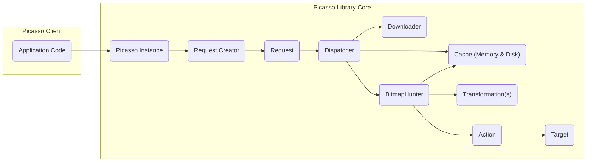
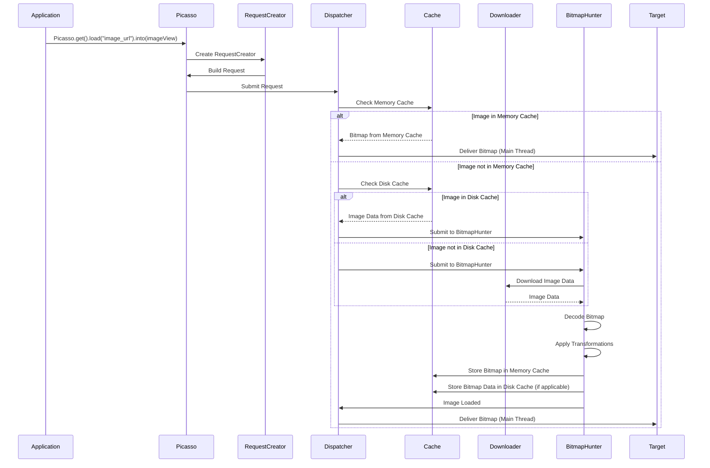

# Project Design Document: Picasso Image Loading Library

**Version:** 1.1
**Date:** October 26, 2023
**Author:** AI Software Architect

## 1. Introduction

This document provides a detailed architectural design of the Picasso image loading and caching library for Android. Picasso is engineered to streamline the process of displaying images fetched from diverse sources (network URLs, local file paths, and Android resources) within Android applications. This document delineates the key components, their interactions, and the overarching architecture of the library. This design will serve as the foundational blueprint for subsequent threat modeling exercises.

## 2. Goals

* To offer an intuitive and efficient API for loading and displaying images in Android applications.
* To support a wide array of image sources, encompassing network URIs, local file system paths, and Android resource identifiers.
* To implement robust in-memory and on-disk caching mechanisms, thereby optimizing performance and minimizing network bandwidth consumption.
* To facilitate image transformations (resizing, cropping, and more) to adapt images to various layout constraints.
* To handle image loading operations asynchronously, preventing blockage of the main user interface thread.
* To provide effective mechanisms for error management and debugging.

## 3. Non-Goals

* This design document does not delve into the specifics of the image encoding and decoding libraries utilized internally by Picasso.
* The detailed implementation of specific image transformation algorithms falls outside the scope of this document.
* The primary focus is on the core library architecture, rather than specific integrations with external libraries or frameworks.
* This design does not cover user interface rendering aspects beyond the fundamental integration with the `ImageView` component.

## 4. Architecture Overview

Picasso adopts a modular architecture centered on the management of image requests and their complete lifecycle. The interconnected core components are responsible for fetching, caching, transforming, and ultimately displaying images.

**Components:**

* **Application Code:** The segment of the Android application that leverages the Picasso library to load and present images to the user.
* **Picasso Instance:** The primary point of interaction with the library, responsible for managing the configuration and lifecycle of image loading processes.
* **Request Creator:** An implementation of the builder pattern used to construct image loading requests, specifying the image source, desired transformations, and the target for the loaded image.
* **Request:** An immutable data object encapsulating a single image loading request, containing all the necessary details for processing.
* **Dispatcher:** A central orchestrator responsible for managing the execution of image loading requests, including queuing, prioritization, and thread management.
* **Cache (Memory & Disk):** A hierarchical caching system. The memory cache (typically an `LruCache`) provides rapid access to recently accessed images. The disk cache offers persistent storage for images across application sessions.
* **Downloader:** An interface defining the contract for fetching image data from a specified source (e.g., `OkHttpDownloader` for network-based retrieval).
* **BitmapHunter:** A runnable task dedicated to executing a single image request, performing the actual downloading, decoding, and transformation of the image data.
* **Transformation(s):** Objects implementing image manipulations such as resizing, cropping, applying watermarks, or other custom effects.
* **Action:** Represents the binding between a specific `Request` and its corresponding `Target`, holding the necessary information to deliver the loaded image (or any encountered error) to the intended destination.
* **Target:** An interface defining the destination where the loaded image will be displayed or processed (e.g., `ImageView`, custom `Target` implementations).

## 5. Component Details

* **Picasso Instance:**
    * Implemented as a singleton to ensure a single, globally accessible point of control within the application.
    * Configurable with custom implementations of `Downloader` and `Cache`, as well as a custom thread pool executor for managing background tasks.
    * Provides the `get()` method, serving as the entry point to obtain a `RequestCreator` instance.

* **Request Creator:**
    * Offers a fluent API design, enabling a readable and concise way to construct image requests.
    * Allows specification of the image source via a network URL, a local file path, or an Android resource ID.
    * Provides methods for adding image transformations, placeholder images (displayed during loading), error images (displayed upon failure), and completion callbacks.

* **Request:**
    * Designed as an immutable data class, ensuring that the details of an image request cannot be modified after creation.
    * Contains comprehensive information about the request, including the image URI, a list of transformations to apply, target-related information, and optional request tags for identification or grouping.
    * Serves as the key for identifying cached images, ensuring efficient retrieval.

* **Dispatcher:**
    * Manages a thread pool dedicated to executing `BitmapHunter` tasks concurrently, optimizing resource utilization.
    * Maintains separate queues for pending (waiting to be processed) and active (currently being processed) image requests.
    * Handles lookups in both the memory and disk caches to avoid redundant downloads and processing.
    * Responsible for notifying the associated `Action` targets on the main thread upon successful image loading or when errors occur.

* **Cache (Memory & Disk):**
    * **Memory Cache:** Typically implemented using an `LruCache` (Least Recently Used cache), storing decoded `Bitmap` objects in memory for extremely fast retrieval of frequently accessed images.
    * **Disk Cache:** Stores encoded image data on the device's persistent storage, allowing images to be retrieved even after the application is restarted. Employs a strategy for managing disk space, such as size-based eviction, to prevent uncontrolled growth.

* **Downloader:**
    * Defines the interface for fetching raw image data from the specified source. Implementations handle the specifics of network communication or local file access.
    * Common implementations include `HttpURLConnectionDownloader` (using the built-in Android HTTP client) and `OkHttpDownloader` (leveraging the more feature-rich OkHttp library).
    * Responsible for handling network-related operations, including connection establishment, request execution, response processing, and data streaming.

* **BitmapHunter:**
    * Operates on a background thread, ensuring that image processing does not block the main UI thread.
    * Executes the core logic for loading an image request, performing the following steps:
        * First, it checks the memory cache for an existing `Bitmap`.
        * If not found in memory, it proceeds to check the disk cache.
        * If the image is not found in either cache, it utilizes the configured `Downloader` to fetch the image data from the source.
        * The downloaded image data is then decoded into a `Bitmap` object.
        * Any `Transformation`s specified in the `Request` are applied to the decoded `Bitmap`.
        * The resulting transformed `Bitmap` is stored in the memory cache and potentially also in the disk cache for future use.
        * Finally, it notifies the associated `Action` on the main thread, delivering the loaded image or any encountered errors.

* **Transformation(s):**
    * Implement the `Transformation` interface, defining a contract for image manipulation.
    * Receive the original source `Bitmap` as input and return the transformed `Bitmap` as output.
    * Crucially, transformations must provide a unique cache key. This key is used to ensure that different transformations of the same source image are cached separately and correctly.

* **Action:**
    * Holds a weak reference to the `Target` to prevent memory leaks if the `Target` (e.g., an `ImageView`) is destroyed while the image is still loading.
    * Contains callback methods that are invoked upon successful image loading (`onBitmapLoaded`) or when an error occurs (`onBitmapFailed`).
    * Can be implemented for various types of targets, such as `ImageViewAction` for standard `ImageView` components and custom `TargetAction` implementations for more specialized scenarios.

* **Target:**
    * An interface that consuming components implement to receive the loaded `Bitmap` or information about any errors encountered during the loading process.
    * Common implementations include using an `ImageView` directly as the target or creating custom `Target` implementations for scenarios requiring more complex handling of the loaded image.

## 6. Data Flow

The typical sequence of operations for loading an image using Picasso is detailed below:

**Step-by-Step Breakdown:**

1. The application code initiates an image loading request by calling `Picasso.get().load(url).into(target)`, specifying the image source and the destination `ImageView`.
2. The `Picasso` instance creates a `RequestCreator` object to facilitate the construction of the `Request`.
3. The `RequestCreator` builds the immutable `Request` object, encapsulating all the necessary details of the image loading operation, and returns it to the `Picasso` instance.
4. The `Picasso` instance submits the constructed `Request` to the `Dispatcher`.
5. The `Dispatcher` first checks the memory cache for a previously loaded and cached `Bitmap` corresponding to the `Request`.
6. **Scenario A (Cache Hit):** If the image is found in the memory cache, the `Cache` returns the `Bitmap` to the `Dispatcher`, which then delivers it to the `Target` on the main thread for display.
7. **Scenario B (Cache Miss):** If the image is not found in the memory cache, the `Dispatcher` proceeds to check the disk cache.
8. **Scenario B.1 (Disk Cache Hit):** If the image data is found in the disk cache, the `Cache` retrieves the encoded image data and returns it to the `Dispatcher`. The `Dispatcher` then submits the `Request` to a `BitmapHunter` for decoding and processing.
9. **Scenario B.2 (Disk Cache Miss):** If the image is not found in either cache, the `Dispatcher` submits the `Request` to a `BitmapHunter` for network retrieval.
10. The `BitmapHunter` uses the configured `Downloader` to download the image data from the specified network source.
11. The `Downloader` fetches the image data and returns it to the `BitmapHunter`.
12. The `BitmapHunter` decodes the downloaded image data into a `Bitmap`.
13. Any specified `Transformation`s are applied to the decoded `Bitmap`.
14. The transformed `Bitmap` is then stored in the memory cache for future quick access.
15. The encoded image data may also be stored in the disk cache, depending on the library's configuration and caching policies.
16. Once the image is loaded and processed, the `BitmapHunter` notifies the `Dispatcher` that the image loading is complete.
17. Finally, the `Dispatcher` delivers the loaded `Bitmap` to the associated `Target` on the main thread, enabling the application to display the image.

## 7. Key Interactions

* **Application -> Picasso:** Initiating image loading requests with specific configurations.
* **Picasso -> Dispatcher:** Submitting and orchestrating the execution of image requests.
* **Dispatcher -> Cache:** Querying and updating both the memory and disk caches to optimize image retrieval.
* **Dispatcher -> Downloader:** Requesting the download of image data from remote or local sources.
* **Dispatcher -> BitmapHunter:** Delegating the core tasks of downloading, decoding, transforming, and caching individual images.
* **BitmapHunter -> Downloader:** Performing the actual fetching of image data from the network or local storage.
* **BitmapHunter -> Cache:** Storing loaded and transformed images in the memory and disk caches.
* **Dispatcher -> Target:** Delivering the successfully loaded image or communicating error information back to the requesting component.

## 8. Security Considerations (Preliminary)

This section outlines initial security considerations that warrant further investigation during a dedicated threat modeling exercise.

* **Man-in-the-Middle (MITM) Attacks:** When loading images over non-secure HTTP connections, attackers could intercept network traffic and potentially replace legitimate images with malicious content. **Mitigation:** Enforce the use of HTTPS for all network image sources.
* **Data Integrity:** Ensuring that downloaded images have not been tampered with during transit is crucial. Picasso itself doesn't enforce integrity checks. **Mitigation:**  Leverage HTTPS, which provides some level of data integrity. Consider implementing checksum verification if higher assurance is needed.
* **Cache Poisoning:** An attacker who gains control over the image source or the caching mechanism could inject malicious images into the cache, which would then be served to users. **Mitigation:**  Use HTTPS to secure image sources. Implement robust cache validation mechanisms and consider using signed URLs.
* **Denial of Service (DoS):**  Loading an excessive number of very large images could exhaust device resources (memory, disk space), leading to application crashes or slowdowns. **Mitigation:** Implement request throttling, image size limits, and appropriate caching strategies to prevent excessive resource consumption.
* **Information Disclosure:**  Error messages or logging could inadvertently reveal sensitive information about internal paths, server configurations, or other potentially sensitive details. **Mitigation:**  Ensure that error messages and logging are sanitized and do not expose sensitive information in production builds.
* **Local File Access Vulnerabilities:** If Picasso is configured to load images from local storage, improper file permissions could allow malicious applications to access or modify these images. **Mitigation:**  Adhere to Android's security best practices for file permissions and ensure that Picasso only accesses intended files.
* **Image Transformation Vulnerabilities:**  Maliciously crafted images could exploit vulnerabilities in the underlying image decoding or transformation libraries, potentially leading to crashes, arbitrary code execution, or other unexpected behavior. **Mitigation:** Keep image decoding and transformation libraries up-to-date with the latest security patches. Consider using libraries with robust security records.

## 9. Future Considerations

* **Enhanced Caching Strategies:** Explore and implement more sophisticated caching policies, such as content-aware caching or time-based eviction strategies, to further optimize cache utilization.
* **Integration with Advanced Image Formats:**  Consider deeper integration with image loading libraries that offer superior support for animated image formats (e.g., GIFs, animated WebP) and modern image codecs.
* **Improved Error Handling and Reporting:** Provide more granular and informative error reporting to assist developers in diagnosing and resolving image loading issues.
* **Performance Monitoring and Metrics:** Integrate mechanisms for tracking key performance indicators (KPIs) related to image loading, such as load times and cache hit rates, to identify potential performance bottlenecks and areas for optimization.

This document provides an enhanced and more detailed architectural design of the Picasso image loading library. It serves as a strong foundation for conducting thorough threat modeling, enabling a deeper understanding of potential security risks and the development of effective mitigation strategies.